# Flow — o espelho por domínio

Os 195 datasets do espelho e as chaves com que cada um alcança os hubs de referência, um diagrama por domínio.

Gerado por `scripts/gera_flow.py` a partir de `schemas.json` em 2026-07-28 — não edite à mão, regenere.

- **caixa** = dataset; um diagrama por domínio;
- **cápsula** = hub de referência, agrupado por família num `subgraph` e
  repetido em cada diagrama para manter as arestas curtas;
- **seta cheia** (`-->`) = a chave está lá com o nome canônico, join direto;
- **seta pontilhada** (`-.->`) = a chave está com outro nome ou formato,
  normalize antes — receita em [`docs/context/join_keys.md`](docs/context/join_keys.md);
- a lista de tabelas de cada dataset ficou de fora de propósito; está no
  [`ERD.md`](ERD.md).

## Panorama

Quantos datasets de cada domínio chegam a cada hub (ligações de 3 datasets para cima).

```mermaid
flowchart LR
    subgraph doms["Domínios"]
        direction TB
        D_referencia["Diretórios e tabelas de referência<br/>10 datasets"]
        D_saude["Saúde<br/>20 datasets"]
        D_educacao["Educação e ciência<br/>20 datasets"]
        D_economia["Trabalho, empresas e economia<br/>40 datasets"]
        D_governo["Governo, orçamento e compras<br/>31 datasets"]
        D_politica["Política e eleições<br/>6 datasets"]
        D_justica["Justiça, segurança e sanções<br/>21 datasets"]
        D_territorio["Território, ambiente e infraestrutura<br/>21 datasets"]
        D_demografia["Demografia e indicadores sociais<br/>17 datasets"]
        D_internacional["Internacional, cultura e esporte<br/>9 datasets"]
    end
    subgraph g_territ_rio["Território"]
        direction TB
        MUNICIPIO(["MUNICIPIO"])
        UF(["UF"])
        SETOR_CENSITARIO(["SETOR_CENSITARIO"])
        CEP(["CEP"])
    end
    subgraph g_pessoas_e_empresas["Pessoas e empresas"]
        direction TB
        EMPRESA_CNPJ(["EMPRESA_CNPJ"])
        PESSOA_CPF(["PESSOA_CPF"])
        CNAE(["CNAE"])
        CBO(["CBO"])
    end
    subgraph g_equipamentos["Equipamentos"]
        direction TB
        ESCOLA(["ESCOLA"])
        IES(["IES"])
        CNES(["CNES"])
        CID10(["CID10"])
    end
    subgraph g_estado_e_economia["Estado e economia"]
        direction TB
        ORGAO(["ORGAO"])
        UNIDADE_GESTORA(["UNIDADE_GESTORA"])
        FUNCAO_PROGRAMA(["FUNCAO_PROGRAMA"])
        PARTIDO(["PARTIDO"])
        NCM_SH(["NCM_SH"])
        PAIS(["PAIS"])
    end
    D_demografia -->|"3"| CEP
    D_demografia -->|"10"| MUNICIPIO
    D_demografia -->|"9"| UF
    D_economia -->|"6"| CEP
    D_economia -->|"5"| CID10
    D_economia -->|"7"| CNAE
    D_economia -->|"12"| EMPRESA_CNPJ
    D_economia -->|"26"| MUNICIPIO
    D_economia -->|"3"| PAIS
    D_economia -->|"4"| PESSOA_CPF
    D_economia -->|"26"| UF
    D_educacao -->|"8"| ESCOLA
    D_educacao -->|"3"| IES
    D_educacao -->|"15"| MUNICIPIO
    D_educacao -->|"15"| UF
    D_governo -->|"6"| EMPRESA_CNPJ
    D_governo -->|"17"| MUNICIPIO
    D_governo -->|"6"| ORGAO
    D_governo -->|"9"| PESSOA_CPF
    D_governo -->|"17"| UF
    D_governo -->|"5"| UNIDADE_GESTORA
    D_justica -->|"4"| EMPRESA_CNPJ
    D_justica -->|"6"| MUNICIPIO
    D_justica -->|"3"| PESSOA_CPF
    D_justica -->|"9"| UF
    D_politica -->|"5"| MUNICIPIO
    D_politica -->|"4"| PARTIDO
    D_politica -->|"3"| PESSOA_CPF
    D_politica -->|"6"| UF
    D_referencia -->|"5"| MUNICIPIO
    D_referencia -->|"5"| UF
    D_saude -->|"7"| CNES
    D_saude -->|"6"| EMPRESA_CNPJ
    D_saude -->|"17"| MUNICIPIO
    D_saude -->|"16"| UF
    D_territorio -->|"3"| CID10
    D_territorio -->|"16"| MUNICIPIO
    D_territorio -->|"12"| UF
```

## Diretórios e tabelas de referência

10 datasets · 1 sem ligação documentada

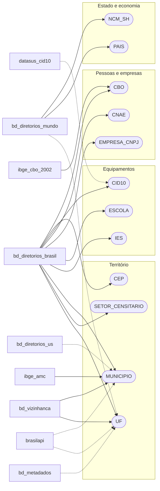

## Saúde

20 datasets · 1 sem ligação documentada

```mermaid
flowchart LR
    saude_br_ans_beneficiario["ans_beneficiario"]
    saude_br_anvisa_cmed["anvisa_cmed"]
    saude_br_anvisa_medicamentos_industrializados["anvisa_medicamentos_industrializados"]
    saude_br_ieps_saude["ieps_saude"]
    saude_br_ms_atencao_basica["ms_atencao_basica"]
    saude_br_ms_cnes["ms_cnes"]
    saude_br_ms_imunizacoes["ms_imunizacoes"]
    saude_br_ms_pns["ms_pns"]
    saude_br_ms_populacao["ms_populacao"]
    saude_br_ms_sia["ms_sia"]
    saude_br_ms_sih["ms_sih"]
    saude_br_ms_sim["ms_sim"]
    saude_br_ms_sinan["ms_sinan"]
    saude_br_ms_sinan_violencia["ms_sinan_violencia"]
    saude_br_ms_sinasc["ms_sinasc"]
    saude_br_ms_sisvan["ms_sisvan"]
    saude_br_ms_vacinacao_covid19["ms_vacinacao_covid19"]
    saude_br_saude_bps["saude_bps"]
    saude_br_saude_farmaciapopular["saude_farmaciapopular"]
    subgraph saude_g_territ_rio["Território"]
        direction TB
        saude_MUNICIPIO(["MUNICIPIO"])
        saude_UF(["UF"])
        saude_CEP(["CEP"])
    end
    subgraph saude_g_pessoas_e_empresas["Pessoas e empresas"]
        direction TB
        saude_EMPRESA_CNPJ(["EMPRESA_CNPJ"])
        saude_PESSOA_CPF(["PESSOA_CPF"])
        saude_CBO(["CBO"])
    end
    subgraph saude_g_equipamentos["Equipamentos"]
        direction TB
        saude_IES(["IES"])
        saude_CNES(["CNES"])
        saude_CID10(["CID10"])
    end
    saude_br_ans_beneficiario --> saude_EMPRESA_CNPJ
    saude_br_ans_beneficiario --> saude_MUNICIPIO
    saude_br_ans_beneficiario --> saude_UF
    saude_br_anvisa_cmed --> saude_EMPRESA_CNPJ
    saude_br_anvisa_medicamentos_industrializados --> saude_MUNICIPIO
    saude_br_anvisa_medicamentos_industrializados --> saude_UF
    saude_br_ieps_saude --> saude_MUNICIPIO
    saude_br_ieps_saude --> saude_UF
    saude_br_ms_atencao_basica --> saude_MUNICIPIO
    saude_br_ms_atencao_basica --> saude_UF
    saude_br_ms_cnes --> saude_CBO
    saude_br_ms_cnes --> saude_CEP
    saude_br_ms_cnes --> saude_CNES
    saude_br_ms_cnes --> saude_EMPRESA_CNPJ
    saude_br_ms_cnes -.-> saude_IES
    saude_br_ms_cnes --> saude_MUNICIPIO
    saude_br_ms_cnes -.-> saude_PESSOA_CPF
    saude_br_ms_cnes --> saude_UF
    saude_br_ms_imunizacoes --> saude_MUNICIPIO
    saude_br_ms_imunizacoes --> saude_UF
    saude_br_ms_pns --> saude_UF
    saude_br_ms_populacao --> saude_MUNICIPIO
    saude_br_ms_sia --> saude_CID10
    saude_br_ms_sia --> saude_CNES
    saude_br_ms_sia --> saude_MUNICIPIO
    saude_br_ms_sia --> saude_UF
    saude_br_ms_sih --> saude_CBO
    saude_br_ms_sih --> saude_CID10
    saude_br_ms_sih --> saude_CNES
    saude_br_ms_sih --> saude_EMPRESA_CNPJ
    saude_br_ms_sih -.-> saude_IES
    saude_br_ms_sih --> saude_MUNICIPIO
    saude_br_ms_sih --> saude_PESSOA_CPF
    saude_br_ms_sih --> saude_UF
    saude_br_ms_sim -.-> saude_CNES
    saude_br_ms_sim --> saude_MUNICIPIO
    saude_br_ms_sim --> saude_UF
    saude_br_ms_sinan --> saude_CNES
    saude_br_ms_sinan --> saude_MUNICIPIO
    saude_br_ms_sinan --> saude_UF
    saude_br_ms_sinan_violencia -.-> saude_MUNICIPIO
    saude_br_ms_sinan_violencia -.-> saude_UF
    saude_br_ms_sinasc -.-> saude_CNES
    saude_br_ms_sinasc --> saude_MUNICIPIO
    saude_br_ms_sinasc --> saude_UF
    saude_br_ms_sisvan --> saude_MUNICIPIO
    saude_br_ms_sisvan --> saude_UF
    saude_br_ms_vacinacao_covid19 -.-> saude_CNES
    saude_br_ms_vacinacao_covid19 --> saude_MUNICIPIO
    saude_br_ms_vacinacao_covid19 --> saude_UF
    saude_br_saude_bps --> saude_EMPRESA_CNPJ
    saude_br_saude_bps -.-> saude_MUNICIPIO
    saude_br_saude_farmaciapopular -.-> saude_EMPRESA_CNPJ
    saude_br_saude_farmaciapopular -.-> saude_MUNICIPIO
    saude_br_saude_farmaciapopular -.-> saude_UF
```

## Educação e ciência

20 datasets · 3 sem ligação documentada

```mermaid
flowchart LR
    educacao_br_capes_bolsas["capes_bolsas"]
    educacao_br_cnpq_bolsas["cnpq_bolsas"]
    educacao_br_inep_ana["inep_ana"]
    educacao_br_inep_avaliacao_alfabetizacao["inep_avaliacao_alfabetizacao"]
    educacao_br_inep_censo_educacao_superior["inep_censo_educacao_superior"]
    educacao_br_inep_censo_escolar["inep_censo_escolar"]
    educacao_br_inep_educacao_especial["inep_educacao_especial"]
    educacao_br_inep_enem["inep_enem"]
    educacao_br_inep_formacao_docente["inep_formacao_docente"]
    educacao_br_inep_ideb["inep_ideb"]
    educacao_br_inep_indicador_nivel_socioeconomico["inep_indicador_nivel_socioeconomico"]
    educacao_br_inep_indicadores_educacionais["inep_indicadores_educacionais"]
    educacao_br_inep_saeb["inep_saeb"]
    educacao_br_inep_sinopse_estatistica_educacao_basica["inep_sinopse_estatistica_educacao_basica"]
    educacao_br_mec_sisu["mec_sisu"]
    educacao_br_simet_educacao_conectada["simet_educacao_conectada"]
    educacao_world_oecd_pisa["world_oecd_pisa"]
    subgraph educacao_g_territ_rio["Território"]
        direction TB
        educacao_MUNICIPIO(["MUNICIPIO"])
        educacao_UF(["UF"])
        educacao_CEP(["CEP"])
    end
    subgraph educacao_g_pessoas_e_empresas["Pessoas e empresas"]
        direction TB
        educacao_EMPRESA_CNPJ(["EMPRESA_CNPJ"])
        educacao_PESSOA_CPF(["PESSOA_CPF"])
    end
    subgraph educacao_g_equipamentos["Equipamentos"]
        direction TB
        educacao_ESCOLA(["ESCOLA"])
        educacao_IES(["IES"])
    end
    educacao_br_capes_bolsas --> educacao_PESSOA_CPF
    educacao_br_cnpq_bolsas -.-> educacao_MUNICIPIO
    educacao_br_cnpq_bolsas --> educacao_UF
    educacao_br_inep_ana --> educacao_ESCOLA
    educacao_br_inep_ana --> educacao_MUNICIPIO
    educacao_br_inep_ana --> educacao_UF
    educacao_br_inep_avaliacao_alfabetizacao --> educacao_ESCOLA
    educacao_br_inep_avaliacao_alfabetizacao --> educacao_MUNICIPIO
    educacao_br_inep_avaliacao_alfabetizacao --> educacao_UF
    educacao_br_inep_censo_educacao_superior --> educacao_CEP
    educacao_br_inep_censo_educacao_superior --> educacao_IES
    educacao_br_inep_censo_educacao_superior --> educacao_MUNICIPIO
    educacao_br_inep_censo_educacao_superior --> educacao_UF
    educacao_br_inep_censo_escolar --> educacao_EMPRESA_CNPJ
    educacao_br_inep_censo_escolar --> educacao_ESCOLA
    educacao_br_inep_censo_escolar -.-> educacao_IES
    educacao_br_inep_censo_escolar --> educacao_MUNICIPIO
    educacao_br_inep_censo_escolar --> educacao_UF
    educacao_br_inep_educacao_especial --> educacao_MUNICIPIO
    educacao_br_inep_educacao_especial --> educacao_UF
    educacao_br_inep_enem --> educacao_MUNICIPIO
    educacao_br_inep_enem --> educacao_UF
    educacao_br_inep_formacao_docente --> educacao_UF
    educacao_br_inep_ideb --> educacao_ESCOLA
    educacao_br_inep_ideb --> educacao_MUNICIPIO
    educacao_br_inep_ideb --> educacao_UF
    educacao_br_inep_indicador_nivel_socioeconomico --> educacao_ESCOLA
    educacao_br_inep_indicador_nivel_socioeconomico --> educacao_MUNICIPIO
    educacao_br_inep_indicador_nivel_socioeconomico --> educacao_UF
    educacao_br_inep_indicadores_educacionais --> educacao_ESCOLA
    educacao_br_inep_indicadores_educacionais --> educacao_MUNICIPIO
    educacao_br_inep_indicadores_educacionais --> educacao_UF
    educacao_br_inep_saeb --> educacao_ESCOLA
    educacao_br_inep_saeb --> educacao_MUNICIPIO
    educacao_br_inep_saeb --> educacao_UF
    educacao_br_inep_sinopse_estatistica_educacao_basica --> educacao_MUNICIPIO
    educacao_br_inep_sinopse_estatistica_educacao_basica --> educacao_UF
    educacao_br_mec_sisu --> educacao_IES
    educacao_br_mec_sisu --> educacao_MUNICIPIO
    educacao_br_mec_sisu --> educacao_PESSOA_CPF
    educacao_br_mec_sisu --> educacao_UF
    educacao_br_simet_educacao_conectada --> educacao_ESCOLA
    educacao_br_simet_educacao_conectada --> educacao_MUNICIPIO
    educacao_br_simet_educacao_conectada --> educacao_UF
    educacao_world_oecd_pisa -.-> educacao_MUNICIPIO
```

## Trabalho, empresas e economia

40 datasets · 7 sem ligação documentada

```mermaid
flowchart LR
    economia_br_anp_combustiveis["anp_combustiveis"]
    economia_br_anp_precos_combustiveis["anp_precos_combustiveis"]
    economia_br_bcb_estban["bcb_estban"]
    economia_br_bcb_sicor["bcb_sicor"]
    economia_br_bndes_operacoes_contratadas["bndes_operacoes_contratadas"]
    economia_br_brasilio_holdings["brasilio_holdings"]
    economia_br_caixa_sinapi["caixa_sinapi"]
    economia_br_clp_ranking_competitividade["clp_ranking_competitividade"]
    economia_br_cvm_administradores_carteira["cvm_administradores_carteira"]
    economia_br_cvm_fundos["cvm_fundos"]
    economia_br_cvm_oferta_publica_distribuicao["cvm_oferta_publica_distribuicao"]
    economia_br_datahackers_state_data["datahackers_state_data"]
    economia_br_firjan_ifgf["firjan_ifgf"]
    economia_br_ibge_inpc["ibge_inpc"]
    economia_br_ibge_ipca["ibge_ipca"]
    economia_br_ibge_ipca15["ibge_ipca15"]
    economia_br_ibge_pam["ibge_pam"]
    economia_br_ibge_pevs["ibge_pevs"]
    economia_br_ibge_pib["ibge_pib"]
    economia_br_ibge_ppm["ibge_ppm"]
    economia_br_mc_indicadores["mc_indicadores"]
    economia_br_me_caged["me_caged"]
    economia_br_me_clima_organizacional["me_clima_organizacional"]
    economia_br_me_cno["me_cno"]
    economia_br_me_cnpj["me_cnpj"]
    economia_br_me_comex_stat["me_comex_stat"]
    economia_br_me_rais["me_rais"]
    economia_br_me_rais_identificada["me_rais_identificada"]
    economia_br_mme_consumo_energia_eletrica["mme_consumo_energia_eletrica"]
    economia_br_rf_arrecadacao["rf_arrecadacao"]
    economia_br_rf_cafir["rf_cafir"]
    economia_br_rf_cno["rf_cno"]
    economia_br_trase_supply_chain["trase_supply_chain"]
    subgraph economia_g_territ_rio["Território"]
        direction TB
        economia_MUNICIPIO(["MUNICIPIO"])
        economia_UF(["UF"])
        economia_CEP(["CEP"])
    end
    subgraph economia_g_pessoas_e_empresas["Pessoas e empresas"]
        direction TB
        economia_EMPRESA_CNPJ(["EMPRESA_CNPJ"])
        economia_PESSOA_CPF(["PESSOA_CPF"])
        economia_CNAE(["CNAE"])
        economia_CBO(["CBO"])
    end
    subgraph economia_g_equipamentos["Equipamentos"]
        direction TB
        economia_CID10(["CID10"])
    end
    subgraph economia_g_estado_e_economia["Estado e economia"]
        direction TB
        economia_FUNCAO_PROGRAMA(["FUNCAO_PROGRAMA"])
        economia_NCM_SH(["NCM_SH"])
        economia_PAIS(["PAIS"])
    end
    economia_br_anp_combustiveis --> economia_CEP
    economia_br_anp_combustiveis --> economia_EMPRESA_CNPJ
    economia_br_anp_combustiveis -.-> economia_MUNICIPIO
    economia_br_anp_combustiveis -.-> economia_UF
    economia_br_anp_precos_combustiveis --> economia_EMPRESA_CNPJ
    economia_br_anp_precos_combustiveis --> economia_MUNICIPIO
    economia_br_anp_precos_combustiveis --> economia_UF
    economia_br_bcb_estban --> economia_EMPRESA_CNPJ
    economia_br_bcb_estban --> economia_MUNICIPIO
    economia_br_bcb_estban --> economia_UF
    economia_br_bcb_sicor --> economia_EMPRESA_CNPJ
    economia_br_bcb_sicor --> economia_FUNCAO_PROGRAMA
    economia_br_bcb_sicor --> economia_MUNICIPIO
    economia_br_bcb_sicor --> economia_PESSOA_CPF
    economia_br_bcb_sicor --> economia_UF
    economia_br_bndes_operacoes_contratadas --> economia_EMPRESA_CNPJ
    economia_br_bndes_operacoes_contratadas --> economia_MUNICIPIO
    economia_br_bndes_operacoes_contratadas --> economia_UF
    economia_br_brasilio_holdings --> economia_EMPRESA_CNPJ
    economia_br_caixa_sinapi -.-> economia_UF
    economia_br_clp_ranking_competitividade --> economia_MUNICIPIO
    economia_br_clp_ranking_competitividade --> economia_UF
    economia_br_cvm_administradores_carteira --> economia_CEP
    economia_br_cvm_administradores_carteira --> economia_EMPRESA_CNPJ
    economia_br_cvm_administradores_carteira -.-> economia_MUNICIPIO
    economia_br_cvm_administradores_carteira --> economia_UF
    economia_br_cvm_fundos -.-> economia_EMPRESA_CNPJ
    economia_br_cvm_fundos -.-> economia_PESSOA_CPF
    economia_br_cvm_oferta_publica_distribuicao --> economia_EMPRESA_CNPJ
    economia_br_cvm_oferta_publica_distribuicao -.-> economia_MUNICIPIO
    economia_br_datahackers_state_data -.-> economia_UF
    economia_br_firjan_ifgf --> economia_MUNICIPIO
    economia_br_firjan_ifgf --> economia_UF
    economia_br_ibge_inpc -.-> economia_CID10
    economia_br_ibge_inpc --> economia_MUNICIPIO
    economia_br_ibge_inpc --> economia_UF
    economia_br_ibge_ipca -.-> economia_CID10
    economia_br_ibge_ipca --> economia_MUNICIPIO
    economia_br_ibge_ipca --> economia_UF
    economia_br_ibge_ipca15 -.-> economia_CID10
    economia_br_ibge_ipca15 --> economia_MUNICIPIO
    economia_br_ibge_ipca15 --> economia_UF
    economia_br_ibge_pam --> economia_MUNICIPIO
    economia_br_ibge_pam --> economia_UF
    economia_br_ibge_pevs --> economia_MUNICIPIO
    economia_br_ibge_pib --> economia_MUNICIPIO
    economia_br_ibge_pib --> economia_UF
    economia_br_ibge_ppm --> economia_MUNICIPIO
    economia_br_ibge_ppm --> economia_UF
    economia_br_mc_indicadores --> economia_MUNICIPIO
    economia_br_me_caged --> economia_CBO
    economia_br_me_caged -.-> economia_CID10
    economia_br_me_caged --> economia_CNAE
    economia_br_me_caged --> economia_MUNICIPIO
    economia_br_me_caged --> economia_UF
    economia_br_me_clima_organizacional -.-> economia_CNAE
    economia_br_me_cno --> economia_CNAE
    economia_br_me_cnpj --> economia_CEP
    economia_br_me_cnpj --> economia_CNAE
    economia_br_me_cnpj --> economia_EMPRESA_CNPJ
    economia_br_me_cnpj --> economia_MUNICIPIO
    economia_br_me_cnpj --> economia_PAIS
    economia_br_me_cnpj --> economia_PESSOA_CPF
    economia_br_me_cnpj --> economia_UF
    economia_br_me_comex_stat --> economia_MUNICIPIO
    economia_br_me_comex_stat --> economia_NCM_SH
    economia_br_me_comex_stat --> economia_PAIS
    economia_br_me_comex_stat --> economia_UF
    economia_br_me_rais --> economia_CBO
    economia_br_me_rais --> economia_CEP
    economia_br_me_rais --> economia_CNAE
    economia_br_me_rais --> economia_MUNICIPIO
    economia_br_me_rais --> economia_UF
    economia_br_me_rais_identificada --> economia_CNAE
    economia_br_me_rais_identificada --> economia_EMPRESA_CNPJ
    economia_br_me_rais_identificada --> economia_MUNICIPIO
    economia_br_me_rais_identificada --> economia_UF
    economia_br_mme_consumo_energia_eletrica --> economia_UF
    economia_br_rf_arrecadacao --> economia_MUNICIPIO
    economia_br_rf_arrecadacao --> economia_UF
    economia_br_rf_cafir --> economia_CEP
    economia_br_rf_cafir --> economia_MUNICIPIO
    economia_br_rf_cafir --> economia_UF
    economia_br_rf_cno --> economia_CEP
    economia_br_rf_cno -.-> economia_CID10
    economia_br_rf_cno --> economia_CNAE
    economia_br_rf_cno --> economia_MUNICIPIO
    economia_br_rf_cno --> economia_PAIS
    economia_br_rf_cno --> economia_UF
    economia_br_trase_supply_chain --> economia_EMPRESA_CNPJ
    economia_br_trase_supply_chain -.-> economia_MUNICIPIO
    economia_br_trase_supply_chain -.-> economia_PESSOA_CPF
    economia_br_trase_supply_chain -.-> economia_UF
```

## Governo, orçamento e compras

31 datasets · 5 sem ligação documentada

```mermaid
flowchart LR
    governo_br_ba_feiradesantana_camara_leis["ba_feiradesantana_camara_leis"]
    governo_br_cgu_beneficios_cidadao["cgu_beneficios_cidadao"]
    governo_br_cgu_cartao_pagamento["cgu_cartao_pagamento"]
    governo_br_cgu_dados_abertos["cgu_dados_abertos"]
    governo_br_cgu_ebt["cgu_ebt"]
    governo_br_cgu_fef["cgu_fef"]
    governo_br_cgu_garantia_safra["cgu_garantia_safra"]
    governo_br_cgu_licitacao_contrato["cgu_licitacao_contrato"]
    governo_br_cgu_orcamento_publico["cgu_orcamento_publico"]
    governo_br_cgu_pe_de_meia["cgu_pe_de_meia"]
    governo_br_cgu_receitas_publicas["cgu_receitas_publicas"]
    governo_br_cgu_seguro_defeso["cgu_seguro_defeso"]
    governo_br_cgu_servidores_executivo_federal["cgu_servidores_executivo_federal"]
    governo_br_cgu_viagens["cgu_viagens"]
    governo_br_comprasgov_catmatcatser["comprasgov_catmatcatser"]
    governo_br_comprasgov_sicaf["comprasgov_sicaf"]
    governo_br_me_siconfi["me_siconfi"]
    governo_br_mp_pep["mp_pep"]
    governo_br_ok_queridodiario["ok_queridodiario"]
    governo_br_siop_orcamento["siop_orcamento"]
    governo_br_tce_es["tce_es"]
    governo_br_tce_pi["tce_pi"]
    governo_br_tce_rj["tce_rj"]
    governo_br_tce_sp["tce_sp"]
    governo_br_tesouro_capag["tesouro_capag"]
    governo_br_transferegov["transferegov"]
    subgraph governo_g_territ_rio["Território"]
        direction TB
        governo_MUNICIPIO(["MUNICIPIO"])
        governo_UF(["UF"])
    end
    subgraph governo_g_pessoas_e_empresas["Pessoas e empresas"]
        direction TB
        governo_EMPRESA_CNPJ(["EMPRESA_CNPJ"])
        governo_PESSOA_CPF(["PESSOA_CPF"])
        governo_CNAE(["CNAE"])
    end
    subgraph governo_g_equipamentos["Equipamentos"]
        direction TB
        governo_CID10(["CID10"])
    end
    subgraph governo_g_estado_e_economia["Estado e economia"]
        direction TB
        governo_ORGAO(["ORGAO"])
        governo_UNIDADE_GESTORA(["UNIDADE_GESTORA"])
        governo_FUNCAO_PROGRAMA(["FUNCAO_PROGRAMA"])
        governo_NCM_SH(["NCM_SH"])
    end
    governo_br_ba_feiradesantana_camara_leis -.-> governo_CID10
    governo_br_cgu_beneficios_cidadao --> governo_MUNICIPIO
    governo_br_cgu_beneficios_cidadao --> governo_PESSOA_CPF
    governo_br_cgu_beneficios_cidadao --> governo_UF
    governo_br_cgu_cartao_pagamento --> governo_EMPRESA_CNPJ
    governo_br_cgu_cartao_pagamento --> governo_ORGAO
    governo_br_cgu_cartao_pagamento --> governo_PESSOA_CPF
    governo_br_cgu_cartao_pagamento --> governo_UNIDADE_GESTORA
    governo_br_cgu_dados_abertos --> governo_MUNICIPIO
    governo_br_cgu_dados_abertos --> governo_UF
    governo_br_cgu_ebt --> governo_MUNICIPIO
    governo_br_cgu_ebt --> governo_UF
    governo_br_cgu_fef --> governo_MUNICIPIO
    governo_br_cgu_fef --> governo_UF
    governo_br_cgu_garantia_safra -.-> governo_MUNICIPIO
    governo_br_cgu_garantia_safra -.-> governo_UF
    governo_br_cgu_licitacao_contrato -.-> governo_EMPRESA_CNPJ
    governo_br_cgu_licitacao_contrato --> governo_MUNICIPIO
    governo_br_cgu_licitacao_contrato --> governo_ORGAO
    governo_br_cgu_licitacao_contrato -.-> governo_PESSOA_CPF
    governo_br_cgu_licitacao_contrato --> governo_UF
    governo_br_cgu_licitacao_contrato --> governo_UNIDADE_GESTORA
    governo_br_cgu_orcamento_publico --> governo_FUNCAO_PROGRAMA
    governo_br_cgu_orcamento_publico --> governo_ORGAO
    governo_br_cgu_orcamento_publico --> governo_UNIDADE_GESTORA
    governo_br_cgu_pe_de_meia -.-> governo_MUNICIPIO
    governo_br_cgu_pe_de_meia --> governo_PESSOA_CPF
    governo_br_cgu_pe_de_meia -.-> governo_UF
    governo_br_cgu_receitas_publicas --> governo_ORGAO
    governo_br_cgu_receitas_publicas --> governo_UNIDADE_GESTORA
    governo_br_cgu_seguro_defeso -.-> governo_MUNICIPIO
    governo_br_cgu_seguro_defeso --> governo_PESSOA_CPF
    governo_br_cgu_seguro_defeso -.-> governo_UF
    governo_br_cgu_servidores_executivo_federal --> governo_PESSOA_CPF
    governo_br_cgu_servidores_executivo_federal --> governo_UF
    governo_br_cgu_viagens --> governo_ORGAO
    governo_br_cgu_viagens --> governo_PESSOA_CPF
    governo_br_cgu_viagens -.-> governo_UF
    governo_br_comprasgov_catmatcatser -.-> governo_NCM_SH
    governo_br_comprasgov_sicaf -.-> governo_CNAE
    governo_br_comprasgov_sicaf --> governo_EMPRESA_CNPJ
    governo_br_comprasgov_sicaf -.-> governo_MUNICIPIO
    governo_br_comprasgov_sicaf --> governo_PESSOA_CPF
    governo_br_comprasgov_sicaf -.-> governo_UF
    governo_br_me_siconfi --> governo_MUNICIPIO
    governo_br_me_siconfi --> governo_UF
    governo_br_mp_pep --> governo_UF
    governo_br_ok_queridodiario -.-> governo_MUNICIPIO
    governo_br_ok_queridodiario -.-> governo_UF
    governo_br_siop_orcamento -.-> governo_MUNICIPIO
    governo_br_siop_orcamento -.-> governo_UF
    governo_br_tce_es -.-> governo_CID10
    governo_br_tce_es -.-> governo_EMPRESA_CNPJ
    governo_br_tce_es -.-> governo_MUNICIPIO
    governo_br_tce_pi -.-> governo_MUNICIPIO
    governo_br_tce_pi -.-> governo_UF
    governo_br_tce_rj -.-> governo_EMPRESA_CNPJ
    governo_br_tce_rj -.-> governo_MUNICIPIO
    governo_br_tce_rj -.-> governo_PESSOA_CPF
    governo_br_tce_sp -.-> governo_MUNICIPIO
    governo_br_tesouro_capag -.-> governo_MUNICIPIO
    governo_br_tesouro_capag -.-> governo_UF
    governo_br_transferegov --> governo_EMPRESA_CNPJ
    governo_br_transferegov --> governo_FUNCAO_PROGRAMA
    governo_br_transferegov --> governo_ORGAO
    governo_br_transferegov --> governo_UNIDADE_GESTORA
```

## Política e eleições

6 datasets

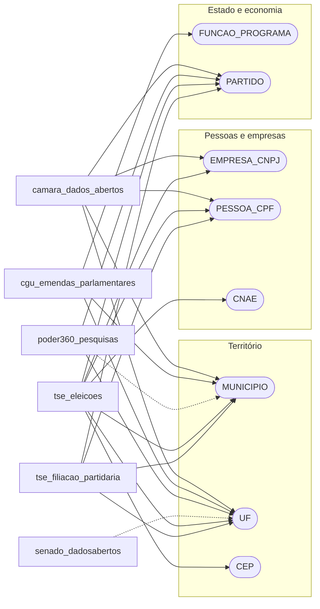

## Justiça, segurança e sanções

21 datasets · 9 sem ligação documentada

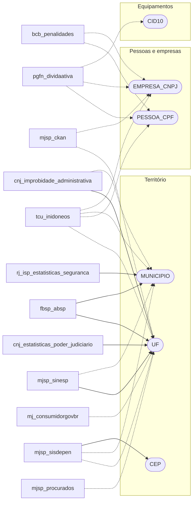

## Território, ambiente e infraestrutura

21 datasets · 3 sem ligação documentada

```mermaid
flowchart LR
    territorio_br_ana_atlas_esgotos["ana_atlas_esgotos"]
    territorio_br_ana_telemetria["ana_telemetria"]
    territorio_br_anatel_banda_larga_fixa["anatel_banda_larga_fixa"]
    territorio_br_anatel_indice_brasileiro_conectividade["anatel_indice_brasileiro_conectividade"]
    territorio_br_geobr_mapas["geobr_mapas"]
    territorio_br_ibama_embargos["ibama_embargos"]
    territorio_br_inmet_bdmep["inmet_bdmep"]
    territorio_br_inpe_prodes["inpe_prodes"]
    territorio_br_inpe_queimadas["inpe_queimadas"]
    territorio_br_inpe_sisam["inpe_sisam"]
    territorio_br_ipea_acesso_oportunidades["ipea_acesso_oportunidades"]
    territorio_br_mapbiomas_estatisticas["mapbiomas_estatisticas"]
    territorio_br_mdr_snis["mdr_snis"]
    territorio_br_mma_extincao["mma_extincao"]
    territorio_br_mobilidados_indicadores["mobilidados_indicadores"]
    territorio_br_seeg_emissoes["seeg_emissoes"]
    territorio_br_sfb_sicar["sfb_sicar"]
    territorio_world_wwf_hydrosheds["world_wwf_hydrosheds"]
    subgraph territorio_g_territ_rio["Território"]
        direction TB
        territorio_MUNICIPIO(["MUNICIPIO"])
        territorio_UF(["UF"])
        territorio_SETOR_CENSITARIO(["SETOR_CENSITARIO"])
    end
    subgraph territorio_g_pessoas_e_empresas["Pessoas e empresas"]
        direction TB
        territorio_EMPRESA_CNPJ(["EMPRESA_CNPJ"])
        territorio_PESSOA_CPF(["PESSOA_CPF"])
    end
    subgraph territorio_g_equipamentos["Equipamentos"]
        direction TB
        territorio_ESCOLA(["ESCOLA"])
        territorio_CID10(["CID10"])
    end
    subgraph territorio_g_estado_e_economia["Estado e economia"]
        direction TB
        territorio_PAIS(["PAIS"])
    end
    territorio_br_ana_atlas_esgotos --> territorio_MUNICIPIO
    territorio_br_ana_atlas_esgotos --> territorio_UF
    territorio_br_ana_telemetria -.-> territorio_MUNICIPIO
    territorio_br_ana_telemetria -.-> territorio_UF
    territorio_br_anatel_banda_larga_fixa --> territorio_EMPRESA_CNPJ
    territorio_br_anatel_banda_larga_fixa --> territorio_MUNICIPIO
    territorio_br_anatel_banda_larga_fixa --> territorio_UF
    territorio_br_anatel_indice_brasileiro_conectividade --> territorio_MUNICIPIO
    territorio_br_anatel_indice_brasileiro_conectividade --> territorio_UF
    territorio_br_geobr_mapas -.-> territorio_CID10
    territorio_br_geobr_mapas --> territorio_ESCOLA
    territorio_br_geobr_mapas --> territorio_MUNICIPIO
    territorio_br_geobr_mapas --> territorio_SETOR_CENSITARIO
    territorio_br_geobr_mapas --> territorio_UF
    territorio_br_ibama_embargos -.-> territorio_EMPRESA_CNPJ
    territorio_br_ibama_embargos -.-> territorio_MUNICIPIO
    territorio_br_ibama_embargos -.-> territorio_PESSOA_CPF
    territorio_br_inmet_bdmep --> territorio_MUNICIPIO
    territorio_br_inpe_prodes --> territorio_MUNICIPIO
    territorio_br_inpe_queimadas --> territorio_MUNICIPIO
    territorio_br_inpe_queimadas --> territorio_UF
    territorio_br_inpe_sisam --> territorio_MUNICIPIO
    territorio_br_inpe_sisam --> territorio_UF
    territorio_br_ipea_acesso_oportunidades --> territorio_MUNICIPIO
    territorio_br_mapbiomas_estatisticas --> territorio_MUNICIPIO
    territorio_br_mapbiomas_estatisticas --> territorio_UF
    territorio_br_mdr_snis --> territorio_MUNICIPIO
    territorio_br_mdr_snis --> territorio_UF
    territorio_br_mma_extincao -.-> territorio_CID10
    territorio_br_mobilidados_indicadores --> territorio_MUNICIPIO
    territorio_br_mobilidados_indicadores --> territorio_UF
    territorio_br_seeg_emissoes -.-> territorio_CID10
    territorio_br_seeg_emissoes --> territorio_MUNICIPIO
    territorio_br_seeg_emissoes --> territorio_UF
    territorio_br_sfb_sicar --> territorio_MUNICIPIO
    territorio_br_sfb_sicar --> territorio_UF
    territorio_world_wwf_hydrosheds -.-> territorio_PAIS
```

## Demografia e indicadores sociais

17 datasets · 2 sem ligação documentada

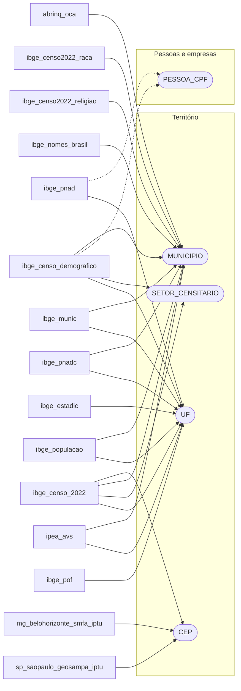

## Internacional, cultura e esporte

9 datasets · 6 sem ligação documentada

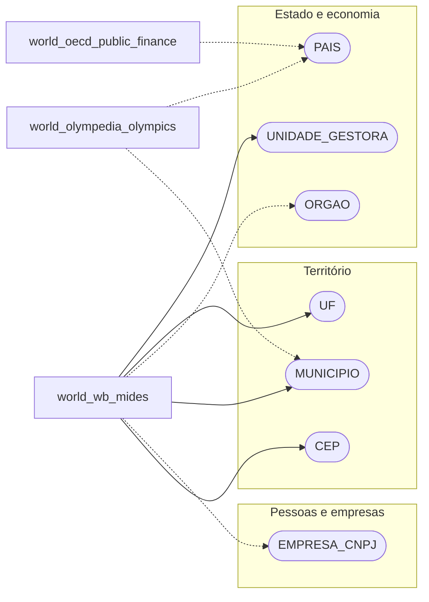

## Sem ligação documentada

37 datasets não têm nenhuma chave que chegue a um hub — estão no espelho, mas nada documentado os liga a mais nada:

- `br_ana_reservatorios`
- `br_anac_dadosabertos`
- `br_anvisa_consultas`
- `br_bcb_sgs`
- `br_bd_diretorios_data_tempo`
- `br_caixa_sorteios`
- `br_ce_fortaleza_sefin_iptu`
- `br_fgv_igp`
- `br_fipe_veiculos`
- `br_ggb_relatorio_lgbtqi`
- `br_ibge_ipp`
- `br_ibge_pnad_covid`
- `br_ipea_atlasviolencia`
- `br_me_estoque_divida_publica`
- `br_me_exportadoras_importadoras`
- `br_me_siape`
- `br_me_sic`
- `br_me_siorg`
- `br_mec_prouni`
- `br_stf_corte_aberta`
- `br_stj_dadosabertos`
- `br_tce_to`
- `br_tcu_dadosabertos`
- `eu_sanctions`
- `global_ibge_tabua_mares`
- `global_icij_offshoreleaks`
- `global_ofac_sanctions`
- `global_opensanctions`
- `mundo_transfermarkt_competicoes`
- `mundo_transfermarkt_competicoes_internacionais`
- `un_sanctions`
- `us_harvard_ned`
- `world_ampas_oscar`
- `world_iea_pirls`
- `world_iea_timss`
- `world_imdb_movies`
- `world_sofascore_competicoes_futebol`
