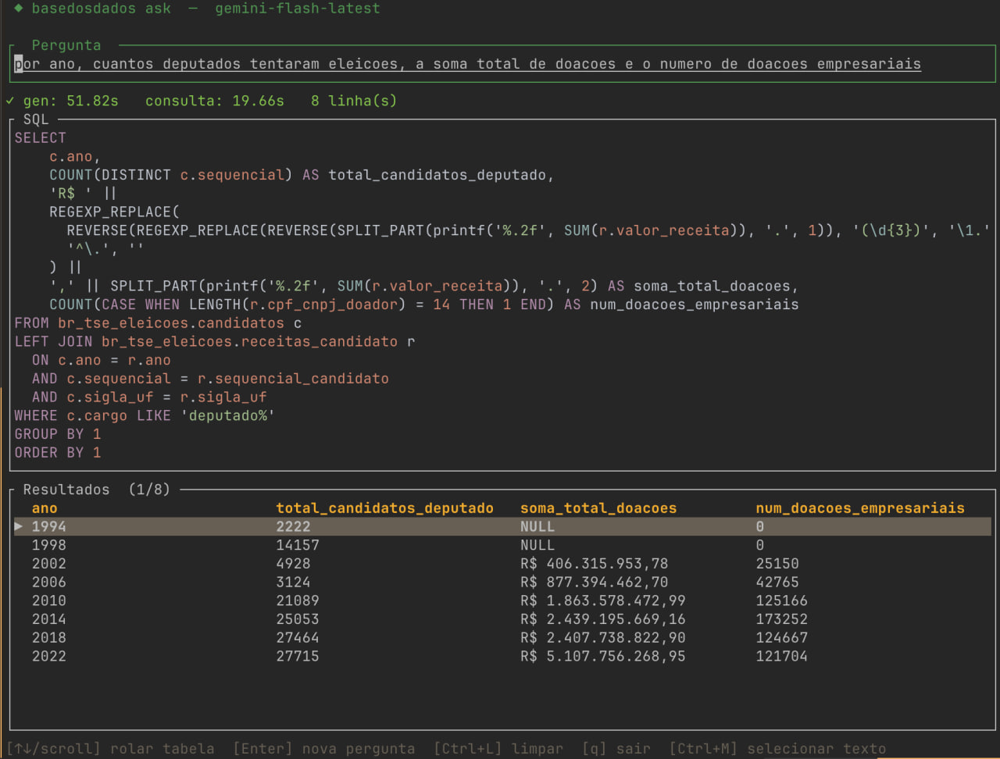

# ask — perguntas em português → SQL sobre a Base dos Dados

TUI em Rust que converte uma pergunta em linguagem natural para SQL DuckDB, executa a
consulta contra o banco local e mostra o resultado numa tabela navegável. Também funciona
em modo CLI, para uso em scripts.



## Uso

```bash
cargo build --release              # binário em target/release/ask

./target/release/ask                                    # modo TUI (interativo)
./target/release/ask "Quantos municípios tem SP?"       # modo CLI (uma pergunta, sai)
./target/release/ask --model qwen/qwen3-coder:free "…"  # sobrescreve o modelo
./target/release/ask --help
```

Um `.env` na raiz do projeto é carregado automaticamente (via `dotenvy`).

### Teclas do TUI

| Tecla | Ação |
|---|---|
| `Enter` | perguntar / voltar para uma nova pergunta |
| `↑` `↓` | histórico de perguntas (na entrada) · rolar a tabela (no resultado) |
| `Ctrl+L` | limpar |
| `Ctrl+C` | cancelar a consulta em andamento / sair |
| `Ctrl+M` | alterna captura de mouse — desligue para selecionar/copiar texto do terminal |
| `q` | sair |

## Como funciona

```
pergunta
   ↓  table_selector.rs   embeddings → cosseno → tabelas acima do limiar
   ↓  schema_filter.rs    recorta o schema JSON só nas tabelas selecionadas
   ↓  sql_generator.rs    LLM (Gemini | OpenRouter | Ollama/sqlcoder) + system_prompt.md
   ↓  main.rs             executa no DuckDB local, com até 3 tentativas de correção
tabela de resultados
```

- **Seleção de tabelas** (`table_selector.rs`) — embute a pergunta e compara por
  similaridade de cosseno contra `table_embeddings.json`, ficando com todas as tabelas
  acima de `SIMILARITY_THRESHOLD` (0.35). O embedding da pergunta é gerado chamando
  `python3` com `sentence-transformers` (`all-MiniLM-L6-v2`) — ou seja, **essa etapa
  depende de Python com o pacote instalado**. Se ela falhar, o `ask` avisa no stderr e cai
  para o schema completo, em vez de abortar. Pode ser desligada com
  `USE_TABLE_SELECTION=false`.
- **Filtro de schema** (`schema_filter.rs`) — serializa só as tabelas escolhidas num
  formato compacto (`dataset.tabela: coluna:TIPO descrição`, com tipos abreviados) para
  caber no prompt.
- **Geração de SQL** (`sql_generator.rs`) — o backend vem de `SQL_GENERATOR`
  (`gemini` por padrão, ou `openrouter`/`sqlcoder`); o prompt de sistema é
  [`system_prompt.md`](system_prompt.md), que ensina as convenções do acervo (hierarquia
  geográfica IBGE, colunas de partição, dialeto DuckDB). Cercas ` ```sql ` são removidas da
  resposta; se o modelo devolver texto que não é SQL, ele é embrulhado em
  `SELECT '<texto>' AS resposta` para ainda assim render uma linha de saída.
- **Execução e retry** (`main.rs`) — abre `data/basedosdados.duckdb` **em processo**, sem
  SSH. Se o DuckDB devolver erro, a mensagem é mandada de volta ao modelo junto do SQL que
  falhou, até 3 vezes (`MAX_RETRIES`).
- **Log** — cada pergunta vai para `logs/log.json` (pergunta, SQL, sucesso, erro),
  relativo ao diretório de onde o `ask` foi executado.

No retry, o backend é escolhido pelo *nome do modelo*, não por `SQL_GENERATOR`: nome com
`/` vai para OpenRouter, o resto vai para Gemini.

## Variáveis de ambiente

| Variável | Padrão | Para quê |
|---|---|---|
| `SQL_GENERATOR` | `gemini` | backend de geração: `gemini` · `openrouter` · `sqlcoder` |
| `GEMINI_API_KEY` | — | obrigatória para o backend Gemini |
| `GEMINI_MODEL` | `gemini-flash-latest` | modelo Gemini (sobrescrito por `--model`) |
| `OPENROUTER_API_KEY` | — | obrigatória para o backend OpenRouter |
| `OPENROUTER_MODEL` | `openai/gpt-4o-mini` | modelo OpenRouter |
| `OLLAMA_HOST` | `http://localhost:11434` | Ollama local (backend `sqlcoder`) |
| `OLLAMA_MODEL` | `sqlcoder` | modelo Ollama |
| `DB_FILE` | `data/basedosdados.duckdb` | banco DuckDB consultado |
| `PROMPT_FILE` | `ask/system_prompt.md` | prompt de sistema |
| `SCHEMA_FILE` | `context/schema_compact_inline.txt` | DDL compacto lido na inicialização |
| `SCHEMA_JSON` | `context/basedosdados-schema.json` | schema completo, usado pelo filtro |
| `EMBEDDINGS_FILE` | `context/table_embeddings.json` | vetores para seleção de tabelas |
| `SIMILARITY_THRESHOLD` | `0.35` | corte de similaridade na seleção de tabelas |
| `USE_TABLE_SELECTION` | `true` | `false`/`0` manda o schema inteiro para o modelo |

Os padrões de caminho são resolvidos a partir da raiz do repositório quando o binário roda
via `cargo` (usando `CARGO_MANIFEST_DIR/..`), e a partir do diretório atual quando o
binário roda solto. Como os arquivos de contexto do repositório vivem em `docs/context/`
e não em `context/`, aponte `SCHEMA_FILE`, `SCHEMA_JSON` e `EMBEDDINGS_FILE` explicitamente
(ou use um `.env`) se o `ask` reclamar que não conseguiu ler o schema.

`TOP_K_TABLES` aparece no `--help` mas não é lido pelo código atual — quem controla quantas
tabelas entram no prompt é `SIMILARITY_THRESHOLD`.

## Dados

O `ask` abre o arquivo DuckDB diretamente, então as *views* dentro dele precisam apontar
para arquivos que existem nesta máquina. Nesta configuração de desenvolvimento elas são
geradas por `scripts/sync/prepara_db_beelink.py` a partir do `~/rodado` da beelink montado
por SMB em `~/mnt/homelab`. Se as consultas voltarem vazias, confira a montagem
(`ls ~/mnt/homelab/rodado`) e rode o script de novo.

## Deploy

O `Dockerfile` da raiz do repositório é o usado em produção: compila o `ask` estaticamente
(musl) num estágio de build e copia o binário + `system_prompt.md` para a imagem final, onde
o `start.sh` o expõe via `ttyd` na porta 7682, atrás do Caddy em `ask.xn--2dk.xyz`. O
[`Dockerfile`](Dockerfile) deste diretório é a variante antiga, que espera um binário
`ask/ask` já compilado.
