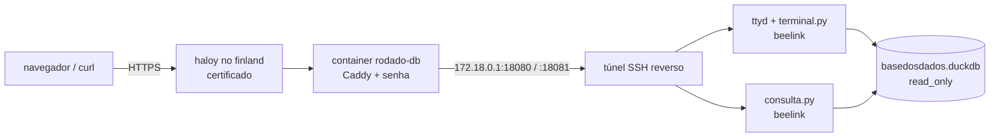

# db.rodado.xyz — terminal SQL e endpoint para curl

O espelho do beelink acessível pela web, com senha (HTTP basic auth), só leitura.

- `https://db.rodado.xyz/` — terminal SQL no navegador (ttyd em `/tty/`) com a árvore
  dos datasets à direita: busca, tabelas com nº de linhas, colunas ao abrir, ▶ ou duplo
  clique cola `FROM dataset.tabela LIMIT 10;` no terminal, clique na coluna cola o nome.
  Ao abrir a tabela: linhas exatas, data de atualização e fonte, atalhos para amostra,
  `DESCRIBE` e `SUMMARIZE`, aviso acima de 50 milhões de linhas e as colunas de partição
  ou de filtro recomendado (`ano`, `mes`, `sigla_uf`)
- `https://db.rodado.xyz/query` — SQL por HTTP:

```bash
curl -u rodado:SENHA --data-binary 'FROM br_bd_diretorios_brasil.uf' https://db.rodado.xyz/query
curl -u rodado:SENHA 'https://db.rodado.xyz/query?formato=csv&limite=100000' --data-binary @consulta.sql
curl -u rodado:SENHA -G https://db.rodado.xyz/query --data-urlencode 'q=DESCRIBE br_me_cnpj.empresas'
```

`formato` = `json` (padrão, lista de objetos), `csv`, `tsv` ou `parquet`; `limite` = linhas
devolvidas (padrão 10.000, máx. 1.000.000). Os cabeçalhos `X-Linhas`, `X-Truncado` e
`X-Segundos` trazem quantas linhas vieram, se o limite cortou e quanto levou. Um comando
por requisição, 300 s no máximo, 4 consultas simultâneas.

### Do DuckDB local

Não existe protocolo de servidor no DuckDB; o CLI local lê o resultado em parquet por
HTTP (colunas tipadas). Uma vez por sessão:

```sql
CREATE SECRET rodado (TYPE http, SCOPE 'https://db.rodado.xyz',
  EXTRA_HTTP_HEADERS MAP {'Authorization': 'Basic ' || to_base64('rodado:SENHA'::BLOB)});
SET force_download = true;  -- uma requisição só; sem isso, cada leitura por faixa reexecutaria a consulta
CREATE MACRO rodado(q) AS TABLE
  FROM read_parquet('https://db.rodado.xyz/query?formato=parquet&limite=1000000&q=' || url_encode(q));

FROM rodado('SELECT ano, count(*) FROM br_rodado_eleicoes.secao_setor GROUP BY 1');
CREATE TABLE uf AS FROM rodado('FROM br_bd_diretorios_brasil.uf');  -- e junta com dado local
```

A consulta roda no beelink; só o resultado atravessa (agregue lá, não traga tabela bruta).

## Como funciona



| Peça | Onde | Arquivo |
|---|---|---|
| Conexão travada (núcleo) | beelink `~/rodado_db/` | `rodado_sql.py` |
| Terminal (via ttyd): SQL colorido ao digitar, Enter envia no `;`, Tab completa dataset/tabela/coluna | beelink; `prompt_toolkit` 3.0.51 + `wcwidth` em `~/rodado_db/vendor/` (rodas Python puro, sem venv: o beelink não tem `ensurepip` nem sudo) | `terminal.py` |
| Página com a árvore, `/catalogo.json` (cache 10 min), `/colunas`, `/query`, `/ping` | beelink, `127.0.0.1:18081` | `consulta.py`, `index.html` |
| ttyd + endpoint + túnel, cada um reiniciando sozinho | beelink, tmux `rodado_db`, cron a cada 5 min | `servico.sh` |
| Senha e roteamento | finland, app haloy `rodado-db` | `proxy/` |

**Não é o CLI do DuckDB, de propósito.** O `-safe` do CLI trava a configuração antes de
qualquer `-cmd`, então não dá para liberar só `~/rodado`; sem ele, `.shell` é um shell no
beelink e `COPY ... TO '~/rodado/...'` sobrescreve parquet do espelho (que o sync do S3 e o
backup do COLD propagariam). O núcleo abre uma conexão `read_only` por consulta, libera só
`~/rodado` e `~/duckdb_tmp`, desliga o acesso externo, trava a configuração e só aceita o
que o parser do DuckDB classifica como SELECT (inclui DESCRIBE, SHOW, SUMMARIZE e FROM
primeiro). Conexão por consulta também evita que uma aba esquecida segure o arquivo ou
enxergue views velhas depois de um reparo. As 6 views do SIPNI (bucket `healthbr-data`)
não funcionam aqui: o segredo delas vive no `~/.duckdbrc`, que não é lido.

Recursos por consulta: 6 GB de memória, 4 threads, despejo em `~/duckdb_tmp/web` (até
30 GB). Terminal: até 12 abas, sessão fecha após 30 min parada.

**Túnel.** O beelink está atrás de NAT e abre `ssh -R` para o usuário `tunel` do finland
com a chave `~/.ssh/rodado_tunel`. No finland, a chave só pode abrir as duas portas, só na
interface da rede do haloy (`permitlisten` no `authorized_keys` e `GatewayPorts
clientspecified` num `Match User tunel` no fim do `sshd_config`), sem shell. Nunca em
`0.0.0.0`: o INPUT do finland é ACCEPT, e a porta pularia a senha.

## Operação

```bash
# beelink: logs e reinício
ssh beelink 'tail ~/logs/rodado_db/{consulta,terminal,tunel}.log'
ssh beelink 'tmux kill-session -t rodado_db'   # o cron sobe de novo em até 5 min

# atualizar o código no beelink (o laço reinicia o processo que cair)
scp db/rodado_sql.py db/terminal.py db/consulta.py db/servico.sh db/index.html beelink:rodado_db/

# finland: senha em /root/rodado-db/.senha, hash em .senha_hash; redeploy do proxy
ssh finland 'cd /root/rodado-db && set -a && . /etc/haloy/.env && set +a &&
  DB_USUARIO=rodado DB_SENHA_HASH="$(cat .senha_hash)" haloy deploy -c haloy.yml'
```

Trocar a senha: gravar a nova em `/root/rodado-db/.senha`, refazer o hash com
`docker run --rm -i caddy:2.10.2-alpine caddy hash-password < .senha > .senha_hash` e
redeploy.

## Latência ao digitar

Medido em 2026-10-10. O processamento de cada tecla no beelink leva ~5 ms; o resto é rede:
navegador → finland (Helsinque) → túnel → beelink e volta. `/ping` vai até o beelink e
`/health` o Caddy responde sozinho, então a diferença entre os dois, numa conexão
reaproveitada, é o custo do túnel: ~120 ms com o upload de casa livre (70 ms × 190 ms).
Com o sync do S3 saturando o upload, o RTT do túnel foi a 148 ms com retransmissões e a
tecla a ~240 ms.

- `PROMPT_TOOLKIT_NO_CPR=1`: sem isso cada prompt pede a posição do cursor e espera a
  resposta atravessar a rede.
- A completação nunca espera consulta: as colunas de uma tabela citada são lidas numa
  thread e entram na sugestão seguinte. `complete_in_thread=True` foi testado e descartado
  (um Tab que chega durante a completação anterior é ignorado).
- Túnel interativo (`ssh -tt` + `IPQoS lowdelay`, para ligar `TCP_NODELAY`) não deu ganho;
  ficou `-N` sem pty, que pede menos permissão.
- O que resolveria de vez, e não foi feito: editar o SQL no navegador (realce e
  autocompletar a partir do `/catalogo.json`) e mandar ao terminal só no Enter.

## Testes de UI e UX

`db/testes/` roda 42 testes contra o site no ar (Bun + `playwright-core` com o Chrome
instalado, nada é baixado), com a régua da auditoria de acessibilidade do swissviz:

- **API:** 401 sem senha em toda rota, formatos, limite, recusa de escrita e de arquivo
  fora de `~/rodado`, e um número conhecido (156.454.011 eleitores em 2022).
- **Desktop:** zero controles sem nome acessível, contraste WCAG AA em todo texto do
  painel, `:focus-visible`, `aria-live` na busca, árvore navegável por teclado (↓ da busca,
  ↑ ↓ → ← Esc, Shift+Enter cola), colunas, ▶ colando e executando, SQL colorido,
  autocompletar, recusa de escrita, divisor por mouse e teclado com largura lembrada,
  moldura, sem rolagem horizontal.
- **Celular (iPhone 14):** terminal em tela cheia, alvos de toque de 36 px ou mais, busca
  com 16 px, bottom sheet que fecha tocando fora, no ✕ e com Esc, ▶ visível sem hover,
  barra de teclas (`;`, ⏎, Ctrl-C) e contraste AA.

```bash
db/testes/roda.sh            # busca a senha no finland
db/testes/roda.sh -t celular # só um bloco
```
