# ERD — how the mirror fits together

🇧🇷 [Versão em português](ERD.md)

Entity/relationship map of the 896 tables (207 datasets) in the mirror. Generated by `scripts/gera_erd.py` from `schemas.json` on 2026-09-01 — do not edit by hand, regenerate.

The join expressions, the format of each key and the traps are in [`docs/context/join_keys.md`](docs/context/join_keys.md). This file is the map; that one is the manual.

## How to read it

One `erDiagram` with 896 tables would be unreadable, so the model sits one level up:

- **entity = dataset**; **attribute = one of its tables**;
- the attribute *type* lists the keys that table carries (`mun`, `uf`, `cnpj`, `cnes`, `escola`, `setor`, `cep`, `cpf`, `cnae`, `cbo`, `cid`, `ncm`, `pais`, `partido`, `orgao`, `ug`, `funcprog`, `ano`, `mes`), or `no_key` when it has none;
- the comment is the row count from `_rodado_metadata`;
- **edge = a join key** reaching a reference hub:

| edge | meaning |
|---|---|
| `HUB \|\|--o{ dataset` | (solid) the key is there under its canonical name — direct join |
| `HUB \|\|..o{ dataset` | (dashed) the key is there under another name or format — normalize first, recipe in [`docs/context/join_keys.md`](docs/context/join_keys.md) |

A dataset with no edge at all is drawn as a loose box in its domain diagram: it is in the mirror, but nothing documented links it to anything else.

## The hubs

| hub | reference table | key | note |
|---|---|---|---|
| `MUNICIPIO` | `br_bd_diretorios_brasil.municipio` | `id_municipio` (7) | 5.571 municipalities; also carries `id_municipio_6/_tse/_rf/_bcb` |
| `UF` | `br_bd_diretorios_brasil.uf` | `sigla_uf` / `id_uf` | 27 states |
| `SETOR_CENSITARIO` | `br_bd_diretorios_brasil.setor_censitario_2022` | `id_setor_censitario` (15) | the 2010 and 2022 meshes are not compatible |
| `CEP` | `br_bd_diretorios_brasil.cep` | `cep` (8) | 905k postal codes — the only directory table that is not duplicated |
| `EMPRESA_CNPJ` | `br_me_cnpj.estabelecimentos` / `.empresas` | `cnpj` (14) / `cnpj_basico` (8) | 43 monthly snapshots — pin `ano`/`mes` |
| `PESSOA_CPF` | — | `cpf` (11) | no directory; almost always masked |
| `ESCOLA` | `br_bd_diretorios_brasil.escola` | `id_escola` | 218k schools |
| `IES` | `br_bd_diretorios_brasil.instituicao_ensino_superior` | `id_ies` |  |
| `CNES` | `br_ms_cnes.estabelecimento` | `id_estabelecimento_cnes` | monthly snapshots; keyed on `id_municipio_6` |
| `CNAE` | `br_bd_diretorios_brasil.cnae_2` | `subclasse` (7) |  |
| `CBO` | `br_bd_diretorios_brasil.cbo_2002` | `cbo_2002` |  |
| `CID10` | `br_bd_diretorios_brasil.cid_10` | `categoria` / `subcategoria` |  |
| `NCM_SH` | `br_bd_diretorios_mundo.nomenclatura_comum_mercosul` | `id_ncm`, `id_sh4` |  |
| `PAIS` | `br_bd_diretorios_mundo.pais` | `sigla_pais_iso3`, `id_pais` |  |
| `ORGAO` | `br_cgu_licitacao_contrato.licitacao` | `id_orgao` | SIAFI organ; `id_orgao_superior` is the level above. The Câmara's `id_orgao` is a different numbering (committees) and is excluded |
| `UNIDADE_GESTORA` | `br_cgu_licitacao_contrato.licitacao` | `id_unidade_gestora` | the level spending is actually attributed to |
| `FUNCAO_PROGRAMA` | `br_cgu_orcamento_publico.orcamento` | `id_funcao`, `id_subfuncao`, `id_acao`, `id_programa` | functional/programmatic classification of the federal budget |
| `PARTIDO` | `br_tse_eleicoes.partidos` | `sigla_partido` | abbreviations change between elections |

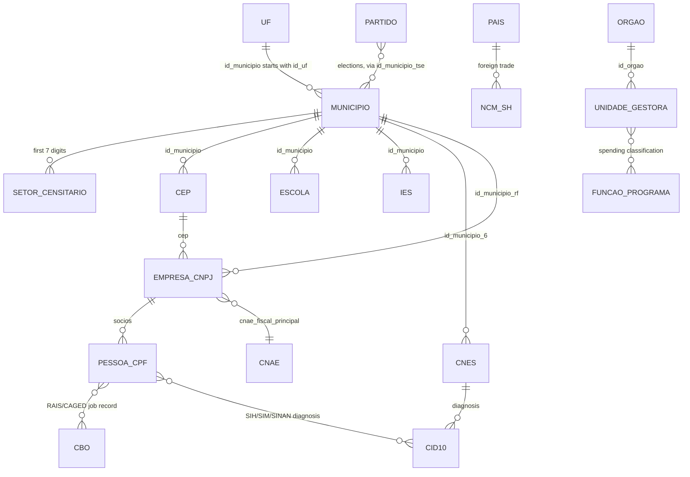

`ano`/`mes`/`data` are the temporal dimension of nearly every table — they stay attributes, never edges, or the diagram turns into a hairball.

---

## Coverage

| domain | datasets | tables | connected |
|---|---|---|---|
| Directories and reference tables | 10 | 71 | 9 |
| Health | 22 | 52 | 21 |
| Education and science | 20 | 140 | 17 |
| Labour, companies and the economy | 40 | 117 | 33 |
| Government, budget and procurement | 31 | 107 | 26 |
| Politics and elections | 7 | 62 | 7 |
| Justice, security and sanctions | 21 | 52 | 12 |
| Territory, environment and infrastructure | 26 | 112 | 22 |
| Demographics and social indicators | 17 | 123 | 15 |
| International, culture and sport | 9 | 25 | 3 |
| Other | 4 | 35 | 3 |
| **total** | **207** | **896** | **168** |

39 datasets have no documented key at all; 230 individual tables carry no key (both listed at the end).

---

## Directories and reference tables

10 datasets · 71 tables

**1/2**

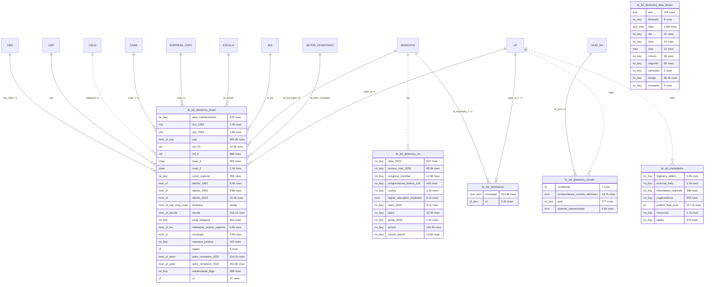

**2/2**

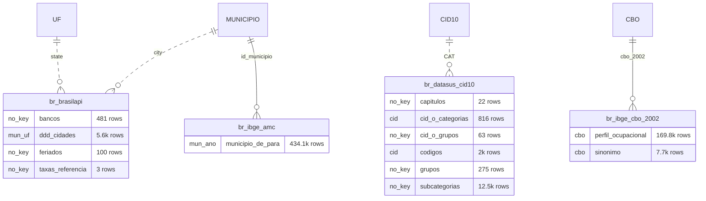

## Health

22 datasets · 52 tables

```mermaid
erDiagram
    EMPRESA_CNPJ ||--o{ br_ans_beneficiario : "cnpj"
    MUNICIPIO ||--o{ br_ans_beneficiario : "id_municipio"
    UF ||--o{ br_ans_beneficiario : "sigla_uf"
    EMPRESA_CNPJ ||--o{ br_anvisa_cmed : "cnpj"
    MUNICIPIO ||--o{ br_anvisa_medicamentos_industrializados : "id_municipio"
    UF ||--o{ br_anvisa_medicamentos_industrializados : "sigla_uf +1"
    MUNICIPIO ||--o{ br_ieps_saude : "id_municipio"
    UF ||--o{ br_ieps_saude : "sigla_uf"
    MUNICIPIO ||--o{ br_ms_atencao_basica : "id_municipio +1"
    UF ||--o{ br_ms_atencao_basica : "sigla_uf"
    CBO ||--o{ br_ms_cnes : "cbo_2002 +2"
    CEP ||--o{ br_ms_cnes : "cep"
    CNES ||--o{ br_ms_cnes : "id_estabelecimento_cnes"
    EMPRESA_CNPJ ||--o{ br_ms_cnes : "cnpj_mantenedora"
    IES ||..o{ br_ms_cnes : "cnpj_mantenedora"
    MUNICIPIO ||--o{ br_ms_cnes : "id_municipio +2"
    PESSOA_CPF ||..o{ br_ms_cnes : "cpf_cnpj"
    UF ||--o{ br_ms_cnes : "sigla_uf"
    MUNICIPIO ||--o{ br_ms_imunizacoes : "id_municipio"
    UF ||--o{ br_ms_imunizacoes : "sigla_uf"
    UF ||--o{ br_ms_pns : "sigla_uf"
    MUNICIPIO ||--o{ br_ms_populacao : "id_municipio"
    CID10 ||--o{ br_ms_sia : "cid_principal_categoria +5"
    CNES ||--o{ br_ms_sia : "id_estabelecimento_cnes +1"
    MUNICIPIO ||--o{ br_ms_sia : "id_municipio +1"
    UF ||--o{ br_ms_sia : "sigla_uf"
    CBO ||--o{ br_ms_sih : "cbo_2002_paciente +1"
    CID10 ||--o{ br_ms_sih : "cid_principal_categoria +27"
    CNES ||--o{ br_ms_sih : "id_estabelecimento_cnes"
    EMPRESA_CNPJ ||--o{ br_ms_sih : "cnpj_mantenedora +1"
    IES ||..o{ br_ms_sih : "cnpj_mantenedora"
    MUNICIPIO ||--o{ br_ms_sih : "id_municipio_gestor +3"
    PESSOA_CPF ||--o{ br_ms_sih : "cpf_gestor"
    UF ||--o{ br_ms_sih : "sigla_uf"
    CNES ||..o{ br_ms_sim : "codigo_estabelecimento"
    MUNICIPIO ||--o{ br_ms_sim : "id_municipio +4"
    UF ||--o{ br_ms_sim : "sigla_uf"
    CNES ||--o{ br_ms_sinan : "id_estabelecimento_cnes"
    MUNICIPIO ||--o{ br_ms_sinan : "id_municipio_infeccao +6"
    UF ||--o{ br_ms_sinan : "sigla_uf +4"
    MUNICIPIO ||..o{ br_ms_sinan_esquistossomose : "ID_MUNICIP"
    UF ||..o{ br_ms_sinan_esquistossomose : "SG_UF"
    MUNICIPIO ||..o{ br_ms_sinan_malaria : "ID_MUNICIP"
    UF ||..o{ br_ms_sinan_malaria : "SG_UF"
    MUNICIPIO ||..o{ br_ms_sinan_violencia : "ID_MUNICIP"
    UF ||..o{ br_ms_sinan_violencia : "SG_UF"
    CNES ||..o{ br_ms_sinasc : "codigo_estabelecimento"
    MUNICIPIO ||--o{ br_ms_sinasc : "id_municipio_mae +2"
    UF ||--o{ br_ms_sinasc : "sigla_uf"
    MUNICIPIO ||--o{ br_ms_sisvan : "id_municipio"
    UF ||--o{ br_ms_sisvan : "sigla_uf"
    CNES ||..o{ br_ms_vacinacao_covid19 : "id_estabelecimento"
    MUNICIPIO ||--o{ br_ms_vacinacao_covid19 : "id_municipio"
    UF ||--o{ br_ms_vacinacao_covid19 : "sigla_uf"
    EMPRESA_CNPJ ||--o{ br_saude_bps : "cnpj_do_fabricante +2"
    MUNICIPIO ||..o{ br_saude_bps : "nome_do_munica­pio_da_instituicao"
    EMPRESA_CNPJ ||..o{ br_saude_farmaciapopular : "numero_cnpj +1"
    MUNICIPIO ||..o{ br_saude_farmaciapopular : "codigo_municipio"
    UF ||..o{ br_saude_farmaciapopular : "codigo_uf"
    br_ans_beneficiario {
        mun_uf_cnpj_ano_mes informacao_consolidada "2.3B rows"
    }
    br_anvisa_cmed {
        cnpj precos "51.1k rows"
    }
    br_anvisa_consultas {
        no_key registros "43.3k rows"
    }
    br_anvisa_medicamentos_industrializados {
        mun_uf_ano_mes microdados "10M rows"
    }
    br_ieps_saude {
        ano brasil "12 rows"
        uf_ano macrorregiao "1.4k rows"
        mun_uf_ano municipio "66.8k rows"
        uf_ano regiao_saude "5.4k rows"
        uf_ano uf "324 rows"
    }
    br_ms_atencao_basica {
        mun_uf_ano_mes municipio "901.9k rows"
    }
    br_ms_cnes {
        mun_uf_cnes_ano_mes dados_complementares "2.7M rows"
        no_key dicionario "1.6k rows"
        mun_uf_cnes_ano_mes equipamento "153.8M rows"
        mun_uf_cnes_ano_mes equipe "13.8M rows"
        mun_uf_cep_cnpj_cpf_ies_cnes_ano_mes estabelecimento "68.2M rows"
        mun_uf_cnes_ano_mes estabelecimento_ensino "26.7k rows"
        mun_uf_cnes_ano_mes estabelecimento_filantropico "157.9k rows"
        mun_uf_cnes_ano_mes gestao_metas "152.3k rows"
        mun_uf_cnes_ano_mes habilitacao "4.6M rows"
        mun_uf_cnes_ano_mes incentivos "1.2M rows"
        mun_uf_cnes_ano_mes leito "11.7M rows"
        mun_uf_cnes_cbo_ano_mes profissional "868.9M rows"
        mun_uf_cnes_ano_mes regra_contratual "1.5M rows"
        mun_uf_cnes_ano_mes servico_especializado "146M rows"
    }
    br_ms_imunizacoes {
        mun_uf_ano municipio "149.1k rows"
    }
    br_ms_pns {
        no_key dicionario "4.9k rows"
        uf microdados_2013 "222.4k rows"
        uf microdados_2019 "293.7k rows"
    }
    br_ms_populacao {
        mun_ano municipio "4.9M rows"
    }
    br_ms_sia {
        no_key dicionario "5.9k rows"
        mun_uf_cnes_cid_ano_mes producao_ambulatorial "6.2B rows"
        mun_uf_cnes_cid_ano_mes psicossocial "138.1M rows"
    }
    br_ms_sih {
        mun_uf_cnpj_cpf_ies_cnes_cbo_cid_ano_mes aihs_reduzidas "200.1M rows"
        no_key dicionario "34.4k rows"
        mun_uf_cnes_cbo_ano_mes servicos_profissionais "2.4B rows"
    }
    br_ms_sim {
        no_key dicionario "569 rows"
        mun_uf_cnes_ano microdados "31.2M rows"
        mun_uf_ano municipio "132.9k rows"
    }
    br_ms_sinan {
        no_key dicionario "818 rows"
        mun_uf_cnes_ano microdados_dengue "34.7M rows"
        mun_uf_cnes_ano microdados_influenza_srag "3.7M rows"
    }
    br_ms_sinan_esquistossomose {
        mun_uf_ano microdados_esquistossomose "169.7k rows"
    }
    br_ms_sinan_malaria {
        mun_uf_ano microdados_malaria "68.3k rows"
    }
    br_ms_sinan_violencia {
        mun_uf_ano microdados_violencia "4.9M rows"
    }
    br_ms_sinasc {
        no_key dicionario "414 rows"
        mun_uf_cnes_ano microdados "85.6M rows"
    }
    br_ms_sisvan {
        no_key dicionario "55 rows"
        mun_uf_ano_mes microdados "406.3M rows"
    }
    br_ms_vacinacao_covid19 {
        no_key dicionario "114 rows"
        mun_uf_cnes microdados_estabelecimento "805.8k rows"
    }
    br_saude_bps {
        mun_cnpj_ano dados "342.7k rows"
    }
    br_saude_farmaciapopular {
        mun_uf_cnpj estabelecimentos "31k rows"
    }
```

## Education and science

20 datasets · 140 tables

**1/3**

```mermaid
erDiagram
    PESSOA_CPF ||--o{ br_capes_bolsas : "cpf"
    MUNICIPIO ||..o{ br_cnpq_bolsas : "municipio_destino"
    UF ||--o{ br_cnpq_bolsas : "sigla_uf_origem +1"
    ESCOLA ||--o{ br_inep_ana : "id_escola"
    MUNICIPIO ||--o{ br_inep_ana : "id_municipio"
    UF ||--o{ br_inep_ana : "id_uf"
    ESCOLA ||--o{ br_inep_avaliacao_alfabetizacao : "id_escola"
    MUNICIPIO ||--o{ br_inep_avaliacao_alfabetizacao : "id_municipio"
    UF ||--o{ br_inep_avaliacao_alfabetizacao : "sigla_uf"
    CEP ||--o{ br_inep_censo_educacao_superior : "cep"
    IES ||--o{ br_inep_censo_educacao_superior : "id_ies"
    MUNICIPIO ||--o{ br_inep_censo_educacao_superior : "id_municipio"
    UF ||--o{ br_inep_censo_educacao_superior : "sigla_uf"
    EMPRESA_CNPJ ||--o{ br_inep_censo_escolar : "cnpj_mantenedora +1"
    ESCOLA ||--o{ br_inep_censo_escolar : "id_escola +1"
    IES ||..o{ br_inep_censo_escolar : "cnpj_mantenedora"
    MUNICIPIO ||--o{ br_inep_censo_escolar : "id_municipio"
    UF ||--o{ br_inep_censo_escolar : "sigla_uf"
    MUNICIPIO ||--o{ br_inep_educacao_especial : "id_municipio"
    UF ||--o{ br_inep_educacao_especial : "sigla_uf"
    br_capes_bolsas {
        cpf_ano_mes mobilidade_internacional "146k rows"
    }
    br_cnpq_bolsas {
        no_key dicionario "99 rows"
        mun_uf_ano microdados "2.8M rows"
    }
    br_inep_ana {
        no_key dicionario "224 rows"
        mun_uf_escola_ano escola "98.1k rows"
        ano prova "480 rows"
    }
    br_inep_avaliacao_alfabetizacao {
        mun_escola_ano alunos "3.9M rows"
        no_key dicionario "27 rows"
        ano meta_alfabetizacao_brasil "3 rows"
        mun_ano meta_alfabetizacao_municipio "10.7k rows"
        uf_ano meta_alfabetizacao_uf "81 rows"
        mun_ano municipio "24k rows"
        uf_ano uf "145 rows"
    }
    br_inep_censo_educacao_superior {
        mun_uf_ies_ano curso "3.9M rows"
        no_key dicionario "43 rows"
        mun_uf_cep_ies_ano ies "39.4k rows"
    }
    br_inep_censo_escolar {
        no_key dicionario "375 rows"
        mun_uf_cnpj_escola_ies_ano escola "4.1M rows"
        mun_uf_escola_ano turma "39.1M rows"
    }
    br_inep_educacao_especial {
        ano brasil_distorcao_idade_serie "45 rows"
        ano brasil_taxa_rendimento "45 rows"
        uf_ano distorcao_idade_serie "1.2k rows"
        mun_uf_ano docente_aee "16.7k rows"
        mun_uf_ano docente_formacao "230.4k rows"
        mun_uf_ano etapa_ensino "2.8M rows"
        mun_uf_ano faixa_etaria "1.2M rows"
        mun_uf_ano localizacao "1.6M rows"
        uf_ano matricula_aee "216 rows"
        mun_uf_ano sexo_raca_cor "2.4M rows"
        uf_ano taxa_rendimento "1.2k rows"
        mun_uf_ano tempo_ensino "1.6M rows"
        mun_uf_ano tipo_deficiencia "2.4M rows"
        uf_ano uf_distorcao_idade_serie "1.2k rows"
        uf_ano uf_taxa_rendimento "1.2k rows"
    }
```

**2/3**

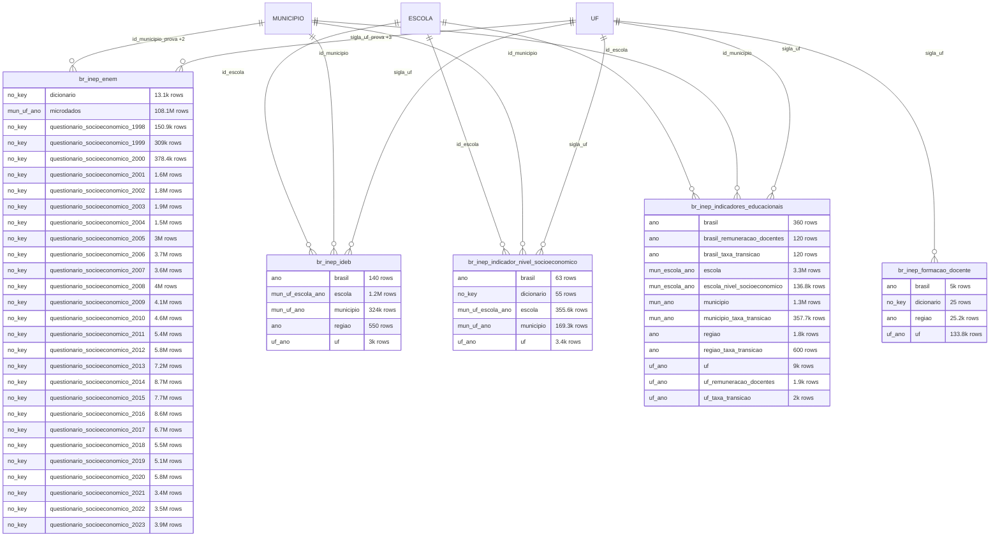

**3/3**

```mermaid
erDiagram
    ESCOLA ||--o{ br_inep_saeb : "id_escola"
    MUNICIPIO ||--o{ br_inep_saeb : "id_municipio"
    UF ||--o{ br_inep_saeb : "sigla_uf"
    MUNICIPIO ||--o{ br_inep_sinopse_estatistica_educacao_basica : "id_municipio"
    UF ||--o{ br_inep_sinopse_estatistica_educacao_basica : "sigla_uf"
    IES ||--o{ br_mec_sisu : "id_ies"
    MUNICIPIO ||--o{ br_mec_sisu : "id_municipio_campus +1"
    PESSOA_CPF ||--o{ br_mec_sisu : "cpf"
    UF ||--o{ br_mec_sisu : "sigla_uf_ies +2"
    ESCOLA ||--o{ br_simet_educacao_conectada : "id_escola"
    MUNICIPIO ||--o{ br_simet_educacao_conectada : "id_municipio"
    UF ||--o{ br_simet_educacao_conectada : "sigla_uf"
    MUNICIPIO ||..o{ world_oecd_pisa : "wle_intercultural_communication_awareness"
    br_inep_saeb {
        mun_uf_escola_ano aluno_ef_2ano "305.4k rows"
        mun_uf_escola_ano_mes aluno_ef_5ano "47.1M rows"
        mun_uf_escola_ano_mes aluno_ef_9ano "54.6M rows"
        mun_uf_escola_ano aluno_em_34ano "2.9M rows"
        ano brasil "856 rows"
        ano brasil_taxa_alfabetizacao "63 rows"
        no_key dicionario "6.6k rows"
        mun_uf_ano municipio "2M rows"
        mun_uf_escola_ano proficiencia "94M rows"
        uf_ano uf "20.1k rows"
        uf_ano uf_taxa_alfabetizacao "1.5k rows"
    }
    br_inep_sinopse_estatistica_educacao_basica {
        no_key dicionario "88 rows"
        mun_uf_ano docente_deficiencia "1.3M rows"
        mun_uf_ano docente_escolaridade "7.7M rows"
        mun_uf_ano docente_etapa_ensino "15M rows"
        mun_uf_ano docente_faixa_etaria_sexo "15.4M rows"
        mun_uf_ano docente_localizacao "17.8M rows"
        mun_uf_ano docente_regime_contrato "10M rows"
        mun_uf_ano educacao_especial_etapa_ensino "2.6M rows"
        mun_uf_ano educacao_especial_faixa_etaria "1.1M rows"
        mun_uf_ano educacao_especial_localizacao "1.5M rows"
        mun_uf_ano educacao_especial_sexo_raca_cor "2.2M rows"
        mun_uf_ano educacao_especial_tempo_ensino "1.5M rows"
        mun_uf_ano educacao_especial_tipo_deficiencia "2.3M rows"
        mun_uf_ano etapa_ensino_serie "9.2M rows"
        mun_uf_ano faixa_etaria "3.6M rows"
        mun_uf_ano localizacao "7.2M rows"
        mun_uf_ano sexo_raca_cor "10.6M rows"
        mun_uf_ano tempo_ensino "5.6M rows"
    }
    br_mec_prouni {
        no_key dicionario "20 rows"
    }
    br_mec_sisu {
        mun_uf_cpf_ies_ano microdados "34.7M rows"
    }
    br_simet_educacao_conectada {
        mun_uf_escola_ano escola "137.9k rows"
    }
    world_iea_pirls {
        no_key dictionary "7.7k rows"
        no_key home_context "413.4k rows"
        no_key school_context "14k rows"
        no_key student_achievement "413.4k rows"
        no_key student_context "413.4k rows"
        no_key student_teacher_link "414.7k rows"
        no_key teacher_context "21.6k rows"
        no_key within_country_scoring_reliability "243.7k rows"
    }
    world_iea_timss {
        no_key dictionary "4.4k rows"
        no_key home_context_grade_4 "396k rows"
        no_key school_context_grade_4 "13k rows"
        no_key school_context_grade_8 "9.4k rows"
        no_key student_achievement_grade_4 "396k rows"
        no_key student_achievement_grade_8 "323.9k rows"
        no_key student_context_grade_4 "396k rows"
        no_key student_context_grade_8 "323.9k rows"
        no_key teacher_context_grade_4 "27.1k rows"
        no_key teacher_mathematics_grade_8 "15.1k rows"
        no_key teacher_science_grade_8 "24.9k rows"
    }
    world_oecd_pisa {
        mun student "1.7M rows"
    }
```

## Labour, companies and the economy

40 datasets · 117 tables

**1/2**

```mermaid
erDiagram
    CEP ||--o{ br_anp_combustiveis : "cep"
    EMPRESA_CNPJ ||--o{ br_anp_combustiveis : "cnpj"
    MUNICIPIO ||..o{ br_anp_combustiveis : "municipio"
    UF ||..o{ br_anp_combustiveis : "estado"
    EMPRESA_CNPJ ||--o{ br_anp_precos_combustiveis : "cnpj_revenda"
    MUNICIPIO ||--o{ br_anp_precos_combustiveis : "id_municipio"
    UF ||--o{ br_anp_precos_combustiveis : "sigla_uf"
    EMPRESA_CNPJ ||--o{ br_bcb_estban : "cnpj_basico +1"
    MUNICIPIO ||--o{ br_bcb_estban : "id_municipio"
    UF ||--o{ br_bcb_estban : "sigla_uf"
    EMPRESA_CNPJ ||--o{ br_bcb_sicor : "cnpj +5"
    FUNCAO_PROGRAMA ||--o{ br_bcb_sicor : "id_programa"
    MUNICIPIO ||--o{ br_bcb_sicor : "id_municipio +1"
    PESSOA_CPF ||--o{ br_bcb_sicor : "cpf"
    UF ||--o{ br_bcb_sicor : "sigla_uf +1"
    EMPRESA_CNPJ ||--o{ br_bndes_operacoes_contratadas : "cnpj_cliente +1"
    MUNICIPIO ||--o{ br_bndes_operacoes_contratadas : "id_municipio"
    UF ||--o{ br_bndes_operacoes_contratadas : "sigla_uf"
    EMPRESA_CNPJ ||--o{ br_brasilio_holdings : "cnpj +1"
    UF ||..o{ br_caixa_sinapi : "uf"
    MUNICIPIO ||--o{ br_clp_ranking_competitividade : "id_municipio"
    UF ||--o{ br_clp_ranking_competitividade : "sigla_uf"
    CEP ||--o{ br_cvm_administradores_carteira : "cep"
    EMPRESA_CNPJ ||--o{ br_cvm_administradores_carteira : "cnpj"
    MUNICIPIO ||..o{ br_cvm_administradores_carteira : "municipio"
    UF ||--o{ br_cvm_administradores_carteira : "sigla_uf"
    EMPRESA_CNPJ ||..o{ br_cvm_fundos : "CNPJ_ADMIN +5"
    PESSOA_CPF ||..o{ br_cvm_fundos : "CPF_CNPJ_GESTOR"
    EMPRESA_CNPJ ||--o{ br_cvm_oferta_publica_distribuicao : "cnpj_lider +2"
    MUNICIPIO ||..o{ br_cvm_oferta_publica_distribuicao : "data_comunicado +1"
    UF ||..o{ br_datahackers_state_data : "p1_i_1"
    MUNICIPIO ||--o{ br_firjan_ifgf : "id_municipio"
    UF ||--o{ br_firjan_ifgf : "sigla_uf"
    CID10 ||..o{ br_ibge_inpc : "categoria"
    MUNICIPIO ||--o{ br_ibge_inpc : "id_municipio"
    UF ||--o{ br_ibge_inpc : "sigla_uf"
    CID10 ||..o{ br_ibge_ipca : "categoria"
    MUNICIPIO ||--o{ br_ibge_ipca : "id_municipio"
    UF ||--o{ br_ibge_ipca : "sigla_uf"
    CID10 ||..o{ br_ibge_ipca15 : "categoria"
    MUNICIPIO ||--o{ br_ibge_ipca15 : "id_municipio"
    UF ||--o{ br_ibge_ipca15 : "sigla_uf"
    MUNICIPIO ||--o{ br_ibge_pam : "id_municipio"
    UF ||--o{ br_ibge_pam : "sigla_uf"
    MUNICIPIO ||--o{ br_ibge_pevs : "id_municipio"
    br_anp_combustiveis {
        mun_uf_cep_cnpj precos "2M rows"
    }
    br_anp_precos_combustiveis {
        mun_uf_cnpj_ano microdados "16.4M rows"
    }
    br_bcb_estban {
        mun_uf_cnpj_ano_mes agencia "443.8M rows"
        no_key dicionario "114 rows"
        mun_uf_cnpj_ano_mes municipio "256.2M rows"
    }
    br_bcb_sgs {
        no_key series "25.1k rows"
    }
    br_bcb_sicor {
        no_key dicionario "408 rows"
        no_key empreendimento "3.3k rows"
        ano_mes liberacao "21M rows"
        uf_cnpj_funcprog_ano_mes operacao "27.2M rows"
        ano_mes operacoes_desclassificadas "12.7k rows"
        mun_uf_cnpj_ano_mes recurso_publico_complemento_operacao "22M rows"
        cnpj_cpf_funcprog_ano_mes recurso_publico_cooperado "151.7k rows"
        ano_mes recurso_publico_gleba "7.3M rows"
        cnpj_cpf_ano_mes recurso_publico_mutuario "17.1M rows"
        cnpj_cpf_ano_mes recurso_publico_propriedade "26.6M rows"
        ano_mes saldo "638.3M rows"
    }
    br_bndes_operacoes_contratadas {
        mun_uf_cnpj operacoes_nao_automaticas "23.5k rows"
    }
    br_brasilio_holdings {
        cnpj holdings "515.2k rows"
    }
    br_caixa_sinapi {
        uf_mes insumos "2M rows"
    }
    br_caixa_sorteios {
        no_key megasena "15.3k rows"
    }
    br_clp_ranking_competitividade {
        mun_uf_ano nota_geral_municipio "7.1k rows"
        uf_ano nota_geral_uf "2.4k rows"
    }
    br_cvm_administradores_carteira {
        no_key pessoa_fisica "6.6k rows"
        mun_uf_cep_cnpj pessoa_juridica "3k rows"
        cnpj responsavel "6.5k rows"
    }
    br_cvm_fundos {
        cnpj_cpf fundos "46.8k rows"
    }
    br_cvm_oferta_publica_distribuicao {
        mun_cnpj dia "27.5k rows"
    }
    br_datahackers_state_data {
        uf microdados "4.3k rows"
    }
    br_fgv_igp {
        ano_mes igp_10_mes "359 rows"
        ano igp_di_ano "78 rows"
        ano_mes igp_di_mes "954 rows"
        ano igp_m_ano "33 rows"
        ano_mes igp_m_mes "407 rows"
        ano igp_og_ano "53 rows"
        ano_mes igp_og_mes "652 rows"
    }
    br_fipe_veiculos {
        no_key precos "11.3k rows"
    }
    br_firjan_ifgf {
        mun_uf_ano ranking "55.7k rows"
    }
    br_ibge_inpc {
        ano_mes mes_brasil "558 rows"
        cid_ano_mes mes_categoria_brasil "30.4k rows"
        mun_uf_cid_ano_mes mes_categoria_municipio "273.6k rows"
        uf_cid_ano_mes mes_categoria_rm "304k rows"
    }
    br_ibge_ipca {
        ano_mes mes_brasil "549 rows"
        cid_ano_mes mes_categoria_brasil "31.1k rows"
        mun_uf_cid_ano_mes mes_categoria_municipio "279.7k rows"
        uf_cid_ano_mes mes_categoria_rm "310.8k rows"
    }
    br_ibge_ipca15 {
        ano_mes mes_brasil "302 rows"
        cid_ano_mes mes_categoria_brasil "29.9k rows"
        mun_uf_cid_ano_mes mes_categoria_municipio "59.9k rows"
        uf_cid_ano_mes mes_categoria_rm "269.5k rows"
    }
    br_ibge_ipp {
        ano_mes mes_categoria_economica "495 rows"
        ano_mes mes_grupo_industrial "897 rows"
        ano_mes mes_industria_atividade "3.4k rows"
        ano_mes mes_industria_extrativa "147 rows"
        ano_mes mes_industria_geral "99 rows"
        ano_mes mes_industria_transformacao "99 rows"
    }
    br_ibge_pam {
        mun_uf_ano lavoura_permanente "10.7M rows"
        mun_uf_ano lavoura_temporaria "9.4M rows"
    }
    br_ibge_pevs {
        mun_ano producao_extracao_vegetal "463.8k rows"
        mun_ano producao_silvicultura "94.6k rows"
    }
```

**2/2**

```mermaid
erDiagram
    MUNICIPIO ||--o{ br_ibge_pib : "id_municipio"
    UF ||--o{ br_ibge_pib : "sigla_uf +1"
    MUNICIPIO ||--o{ br_ibge_ppm : "id_municipio"
    UF ||--o{ br_ibge_ppm : "sigla_uf"
    MUNICIPIO ||--o{ br_mc_indicadores : "id_municipio"
    CBO ||--o{ br_me_caged : "cbo_2002"
    CID10 ||..o{ br_me_caged : "categoria"
    CNAE ||--o{ br_me_caged : "cnae_2_subclasse +1"
    MUNICIPIO ||--o{ br_me_caged : "id_municipio"
    UF ||--o{ br_me_caged : "sigla_uf"
    CNAE ||..o{ br_me_clima_organizacional : "subclasse"
    CNAE ||--o{ br_me_cno : "cnae_2"
    CEP ||--o{ br_me_cnpj : "cep"
    CNAE ||--o{ br_me_cnpj : "cnae_fiscal_principal +1"
    EMPRESA_CNPJ ||--o{ br_me_cnpj : "cnpj +3"
    MUNICIPIO ||--o{ br_me_cnpj : "id_municipio +1"
    PAIS ||--o{ br_me_cnpj : "id_pais"
    PESSOA_CPF ||--o{ br_me_cnpj : "cpf_representante_legal"
    UF ||--o{ br_me_cnpj : "sigla_uf"
    MUNICIPIO ||--o{ br_me_comex_stat : "id_municipio"
    NCM_SH ||--o{ br_me_comex_stat : "id_ncm +1"
    PAIS ||--o{ br_me_comex_stat : "sigla_pais_iso3 +1"
    UF ||--o{ br_me_comex_stat : "sigla_uf +1"
    CBO ||--o{ br_me_rais : "cbo_2002 +1"
    CEP ||--o{ br_me_rais : "cep"
    CNAE ||--o{ br_me_rais : "cnae_2_subclasse +2"
    MUNICIPIO ||--o{ br_me_rais : "id_municipio +1"
    UF ||--o{ br_me_rais : "sigla_uf"
    CNAE ||--o{ br_me_rais_identificada : "cnae_fiscal_principal"
    EMPRESA_CNPJ ||--o{ br_me_rais_identificada : "cnpj_basico +1"
    MUNICIPIO ||--o{ br_me_rais_identificada : "id_municipio"
    UF ||--o{ br_me_rais_identificada : "sigla_uf"
    UF ||--o{ br_mme_consumo_energia_eletrica : "sigla_uf"
    MUNICIPIO ||--o{ br_rf_arrecadacao : "id_municipio"
    UF ||--o{ br_rf_arrecadacao : "sigla_uf"
    CEP ||--o{ br_rf_cafir : "cep"
    MUNICIPIO ||--o{ br_rf_cafir : "id_municipio"
    UF ||--o{ br_rf_cafir : "sigla_uf"
    CEP ||--o{ br_rf_cno : "cep"
    CID10 ||..o{ br_rf_cno : "categoria"
    CNAE ||--o{ br_rf_cno : "cnae_2_subclasse"
    MUNICIPIO ||--o{ br_rf_cno : "id_municipio"
    PAIS ||--o{ br_rf_cno : "id_pais"
    UF ||--o{ br_rf_cno : "sigla_uf"
    EMPRESA_CNPJ ||--o{ br_trase_supply_chain : "cnpj +1"
    MUNICIPIO ||..o{ br_trase_supply_chain : "municipality_id +4"
    PESSOA_CPF ||..o{ br_trase_supply_chain : "cnpj_cpf"
    UF ||..o{ br_trase_supply_chain : "state"
    br_ibge_pib {
        ano brasil_antigo "14 rows"
        uf_ano gini "520 rows"
        mun_ano municipio "111.4k rows"
        mun_ano municipio_antigo "77.9k rows"
        ano regiao_antigo "70 rows"
        uf_ano uf "513 rows"
        uf_ano uf_antigo "378 rows"
    }
    br_ibge_ppm {
        mun_uf_ano efetivo_rebanhos "1.4M rows"
        mun_uf_ano producao_aquicultura "87.7k rows"
        mun_uf_ano producao_origem_animal "759k rows"
        mun_uf_ano producao_pecuaria "240.3k rows"
    }
    br_mc_indicadores {
        mun_ano_mes transferencias_municipio "1.1M rows"
    }
    br_me_caged {
        no_key dicionario "5.3k rows"
        mun_uf_cnae_cbo_cid_ano_mes microdados_movimentacao "232.2M rows"
        mun_uf_cnae_cbo_cid_ano_mes microdados_movimentacao_excluida "515k rows"
        mun_uf_cnae_cbo_cid_ano_mes microdados_movimentacao_fora_prazo "8M rows"
    }
    br_me_clima_organizacional {
        cnae microdados "16.4k rows"
    }
    br_me_cno {
        no_key dicionario "19 rows"
        cnae microdados_cnae "911.4k rows"
        no_key microdados_vinculo "109.4k rows"
    }
    br_me_cnpj {
        no_key dicionario "853 rows"
        cnpj_ano_mes empresas "2.4B rows"
        mun_uf_cep_cnpj_cnae_pais_ano_mes estabelecimentos "2.5B rows"
        cnpj simples "47.7M rows"
        cnpj_cpf_pais_ano_mes socios "1B rows"
    }
    br_me_comex_stat {
        no_key dicionario "1.7k rows"
        mun_uf_ncm_pais_ano_mes municipio_exportacao "21.5M rows"
        mun_uf_ncm_pais_ano_mes municipio_importacao "33.3M rows"
        uf_ncm_pais_ano_mes ncm_exportacao "30.3M rows"
        uf_ncm_pais_ano_mes ncm_importacao "44.4M rows"
    }
    br_me_exportadoras_importadoras {
        no_key dicionario "3 rows"
    }
    br_me_rais {
        no_key dicionario "6.9k rows"
        mun_uf_cep_cnae_ano microdados_estabelecimentos "245.3M rows"
        mun_uf_cnae_cbo_ano_mes microdados_vinculos "2.1B rows"
    }
    br_me_rais_identificada {
        mun_uf_cnpj_cnae_ano estabelecimentos "36.2M rows"
    }
    br_me_sic {
        no_key dicionario "647 rows"
        ano_mes transferencia "29.4k rows"
    }
    br_mme_consumo_energia_eletrica {
        uf_ano_mes uf "38.9k rows"
    }
    br_rf_arrecadacao {
        ano_mes cnae "2.5k rows"
        ano_mes ir_ipi "408 rows"
        mun_uf_ano_mes itr "516.4k rows"
        ano_mes natureza_juridica "8.2k rows"
        uf_ano_mes uf "7.9k rows"
    }
    br_rf_cafir {
        no_key dicionario "30 rows"
        mun_uf_cep imoveis_rurais "169.9M rows"
    }
    br_rf_cno {
        cid areas "679.1M rows"
        cnae cnaes "579.1M rows"
        no_key dicionario "40 rows"
        mun_uf_cep_pais microdados "534.1M rows"
        no_key vinculos "63.9M rows"
    }
    br_trase_supply_chain {
        mun beef "1.5M rows"
        mun_uf beef_slaughterhouses "7.7k rows"
        mun soy_beans "311.4k rows"
        mun_uf_cnpj soy_beans_crushing_facilities "973 rows"
        mun_uf soy_beans_refining_facilities "504 rows"
        mun_uf_cnpj_cpf soy_beans_storage_facilities "3.2k rows"
        mun_uf_cnpj_cpf soy_beans_storage_facilities_original "3.2k rows"
    }
```

## Government, budget and procurement

31 datasets · 107 tables

**1/2**

```mermaid
erDiagram
    CID10 ||..o{ br_ba_feiradesantana_camara_leis : "categoria"
    MUNICIPIO ||--o{ br_cgu_beneficios_cidadao : "id_municipio"
    PESSOA_CPF ||--o{ br_cgu_beneficios_cidadao : "cpf_favorecido +3"
    UF ||--o{ br_cgu_beneficios_cidadao : "sigla_uf"
    EMPRESA_CNPJ ||--o{ br_cgu_cartao_pagamento : "cnpj_cpf_favorecido"
    ORGAO ||--o{ br_cgu_cartao_pagamento : "codigo_orgao +1"
    PESSOA_CPF ||--o{ br_cgu_cartao_pagamento : "cpf_portador"
    UNIDADE_GESTORA ||--o{ br_cgu_cartao_pagamento : "codigo_unidade_gestora"
    MUNICIPIO ||--o{ br_cgu_dados_abertos : "id_municipio"
    UF ||--o{ br_cgu_dados_abertos : "sigla_uf"
    MUNICIPIO ||--o{ br_cgu_ebt : "id_municipio"
    UF ||--o{ br_cgu_ebt : "sigla_uf"
    MUNICIPIO ||--o{ br_cgu_fef : "id_municipio"
    UF ||--o{ br_cgu_fef : "sigla_uf"
    MUNICIPIO ||..o{ br_cgu_garantia_safra : "nome_municipio +1"
    UF ||..o{ br_cgu_garantia_safra : "uf"
    EMPRESA_CNPJ ||..o{ br_cgu_licitacao_contrato : "cpf_cnpj_vencedor +2"
    MUNICIPIO ||--o{ br_cgu_licitacao_contrato : "id_municipio"
    ORGAO ||--o{ br_cgu_licitacao_contrato : "id_orgao +1"
    PESSOA_CPF ||..o{ br_cgu_licitacao_contrato : "cpf_cnpj_vencedor +2"
    UF ||--o{ br_cgu_licitacao_contrato : "sigla_uf"
    UNIDADE_GESTORA ||--o{ br_cgu_licitacao_contrato : "id_unidade_gestora +1"
    FUNCAO_PROGRAMA ||--o{ br_cgu_orcamento_publico : "id_funcao +3"
    ORGAO ||--o{ br_cgu_orcamento_publico : "id_orgao_superior +1"
    UNIDADE_GESTORA ||--o{ br_cgu_orcamento_publico : "id_unidade_orcamentaria"
    MUNICIPIO ||..o{ br_cgu_pe_de_meia : "nome_municipio +1"
    PESSOA_CPF ||--o{ br_cgu_pe_de_meia : "cpf_responsavel +1"
    UF ||..o{ br_cgu_pe_de_meia : "uf"
    ORGAO ||--o{ br_cgu_receitas_publicas : "id_orgao +1"
    UNIDADE_GESTORA ||--o{ br_cgu_receitas_publicas : "codigo_unidade_gestora"
    MUNICIPIO ||..o{ br_cgu_seguro_defeso : "nome_municipio +1"
    PESSOA_CPF ||--o{ br_cgu_seguro_defeso : "cpf_favorecido"
    UF ||..o{ br_cgu_seguro_defeso : "uf"
    PESSOA_CPF ||--o{ br_cgu_servidores_executivo_federal : "cpf +2"
    UF ||--o{ br_cgu_servidores_executivo_federal : "sigla_uf"
    ORGAO ||--o{ br_cgu_viagens : "codigo_orgao_solicitante"
    PESSOA_CPF ||--o{ br_cgu_viagens : "cpf_viajante"
    UF ||..o{ br_cgu_viagens : "origem_uf +1"
    NCM_SH ||..o{ br_comprasgov_catmatcatser : "codigo_ncm +1"
    CNAE ||..o{ br_comprasgov_sicaf : "codigoCnae"
    EMPRESA_CNPJ ||--o{ br_comprasgov_sicaf : "cnpj"
    MUNICIPIO ||..o{ br_comprasgov_sicaf : "nomeMunicipio"
    PESSOA_CPF ||--o{ br_comprasgov_sicaf : "cpf"
    UF ||..o{ br_comprasgov_sicaf : "ufSigla"
    br_ba_feiradesantana_camara_leis {
        cid microdados "6k rows"
    }
    br_cgu_beneficios_cidadao {
        mun_uf_cpf_ano_mes auxilio_brasil "294M rows"
        mun_uf_cpf_ano_mes auxilio_brasil_original "294M rows"
        mun_uf_cpf_ano_mes auxilio_emergencial "491.1M rows"
        mun_uf_cpf_ano_mes auxilio_emergencial_original "491.1M rows"
        mun_uf_cpf_ano_mes bolsa_familia_pagamento "1.5B rows"
        mun_uf_cpf_ano_mes bolsa_familia_pagamento_original "1.5B rows"
        mun_uf_cpf_ano_mes bpc "419.9M rows"
        mun_uf_cpf_ano_mes bpc_original "419.9M rows"
        mun_uf_ano_mes garantia_safra "32.5M rows"
        mun_uf_cpf_ano_mes novo_bolsa_familia "588.5M rows"
        mun_uf_cpf_ano_mes novo_bolsa_familia_original "588.5M rows"
    }
    br_cgu_cartao_pagamento {
        no_key dicionario "43 rows"
        cnpj_cpf_orgao_ug_ano_mes microdados_compras_centralizadas "1.3M rows"
        cnpj_cpf_orgao_ug_ano_mes microdados_defesa_civil "126.1k rows"
        cnpj_cpf_orgao_ug_ano_mes microdados_governo_federal "1.7M rows"
    }
    br_cgu_dados_abertos {
        no_key conjunto "12.7k rows"
        mun_uf organizacao "254 rows"
        no_key recurso "76.8k rows"
    }
    br_cgu_ebt {
        mun_uf_ano municipio "1.3k rows"
        uf_ano uf "54 rows"
    }
    br_cgu_fef {
        mun_uf_ano microdados "82.7k rows"
        mun_uf municipios_sorteados "2.2k rows"
        no_key sorteio "40 rows"
    }
    br_cgu_garantia_safra {
        mun_uf_mes garantia_safra "33.5M rows"
    }
    br_cgu_licitacao_contrato {
        orgao_ug_ano_mes contrato_apostilamento "9.7k rows"
        cnpj_cpf_orgao_ug_ano_mes contrato_compra "472.6k rows"
        orgao_ano_mes contrato_item "1.5M rows"
        orgao_ano_mes contrato_termo_aditivo "423.9k rows"
        mun_uf_orgao_ug_ano_mes licitacao "1.7M rows"
        ug_ano_mes licitacao_empenho "7.4M rows"
        cnpj_cpf_orgao_ug_ano_mes licitacao_item "14.1M rows"
        cnpj_cpf_orgao_ug_ano_mes licitacao_participante "74.4M rows"
    }
    br_cgu_orcamento_publico {
        orgao_ug_funcprog_ano orcamento "289.4k rows"
    }
    br_cgu_pe_de_meia {
        mun_uf_cpf_mes pe_de_meia "64M rows"
    }
    br_cgu_receitas_publicas {
        orgao_ug_ano receitas "1.5M rows"
    }
    br_cgu_seguro_defeso {
        mun_uf_cpf_mes seguro_defeso "42.1M rows"
    }
    br_cgu_servidores_executivo_federal {
        cpf_ano_mes afastamentos "7.7M rows"
        cpf_ano_mes afastamentos_original "7.7M rows"
        cpf_ano_mes cadastro_aposentados "28.2M rows"
        cpf_ano_mes cadastro_aposentados_original "28.2M rows"
        cpf_ano_mes cadastro_pensionistas "32.8M rows"
        cpf_ano_mes cadastro_pensionistas_original "32.8M rows"
        cpf_ano_mes cadastro_reserva_reforma_militares "11M rows"
        cpf_ano_mes cadastro_reserva_reforma_militares_original "11M rows"
        uf_cpf_ano_mes cadastro_servidores "168.1M rows"
        uf_cpf_ano_mes cadastro_servidores_original "168.1M rows"
        cpf_ano_mes observacoes "23.3M rows"
        cpf_ano_mes observacoes_original "23.3M rows"
        cpf_ano_mes remuneracao "155.4M rows"
        cpf_ano_mes remuneracao_original "155.4M rows"
    }
    br_cgu_viagens {
        no_key pagamento "16.7M rows"
        no_key passagem "5.2M rows"
        uf trecho "20.9M rows"
        cpf_orgao viagem "9.9M rows"
    }
    br_comprasgov_catmatcatser {
        ncm materiais "247.9k rows"
        no_key servicos "3k rows"
    }
    br_comprasgov_sicaf {
        mun_uf_cnpj_cpf_cnae fornecedores "957.9k rows"
    }
    br_me_estoque_divida_publica {
        ano_mes microdados "124.4k rows"
    }
    br_me_siape {
        no_key servidores_executivo_federal "358.9k rows"
    }
```

**2/2**

```mermaid
erDiagram
    MUNICIPIO ||--o{ br_me_siconfi : "id_municipio"
    UF ||--o{ br_me_siconfi : "sigla_uf +1"
    UF ||--o{ br_mp_pep : "sigla_uf"
    MUNICIPIO ||..o{ br_ok_queridodiario : "territory_id +1"
    UF ||..o{ br_ok_queridodiario : "state_code"
    MUNICIPIO ||..o{ br_siop_orcamento : "Município"
    UF ||..o{ br_siop_orcamento : "UF"
    CID10 ||..o{ br_tce_es : "categoria"
    EMPRESA_CNPJ ||..o{ br_tce_es : "EmpresaCNPJ"
    MUNICIPIO ||..o{ br_tce_es : "Municipio"
    MUNICIPIO ||..o{ br_tce_pi : "codIBGE +1"
    UF ||..o{ br_tce_pi : "sigla"
    EMPRESA_CNPJ ||..o{ br_tce_rj : "CPFCNPJ +1"
    MUNICIPIO ||..o{ br_tce_rj : "Ente"
    PESSOA_CPF ||..o{ br_tce_rj : "CPFCNPJ +1"
    MUNICIPIO ||..o{ br_tce_sp : "municipio +1"
    MUNICIPIO ||..o{ br_tesouro_capag : "Nome_Município +1"
    UF ||..o{ br_tesouro_capag : "UF"
    EMPRESA_CNPJ ||--o{ br_transferegov : "cnpj_fundo_programa +7"
    FUNCAO_PROGRAMA ||--o{ br_transferegov : "id_programa"
    ORGAO ||--o{ br_transferegov : "id_orgao_superior_programa +1"
    UNIDADE_GESTORA ||--o{ br_transferegov : "id_unidade_gestora_programa"
    br_me_siconfi {
        ano brasil_despesas_funcao "9.5k rows"
        ano brasil_despesas_orcamentarias "8.2k rows"
        ano brasil_execucao_restos_pagar "10.2k rows"
        ano brasil_execucao_restos_pagar_funcao "13.7k rows"
        ano brasil_receitas_orcamentarias "6.5k rows"
        ano brasil_variacoes_patrimoniais "5.7k rows"
        mun_uf_ano municipio_balanco_patrimonial "14.7M rows"
        mun_uf_ano municipio_despesas_funcao "21.2M rows"
        mun_uf_ano municipio_despesas_orcamentarias "27M rows"
        mun_uf_ano municipio_receitas_orcamentarias "19.4M rows"
        uf_ano uf_despesas_funcao "175.9k rows"
        uf_ano uf_despesas_orcamentarias "134.4k rows"
        uf_ano uf_execucao_restos_pagar "124.9k rows"
        uf_ano uf_execucao_restos_pagar_funcao "184.7k rows"
        uf_ano uf_receitas_orcamentarias "88.1k rows"
        uf_ano uf_variacoes_patrimoniais "84.8k rows"
    }
    br_me_siorg {
        no_key remuneracao "258 rows"
    }
    br_mp_pep {
        uf_ano_mes cargos_funcoes "1.8M rows"
    }
    br_ok_queridodiario {
        mun_uf diarios "231.9k rows"
    }
    br_siop_orcamento {
        no_key alteracoes_orcamentarias "9.8k rows"
        no_key dados "5.6k rows"
        mun_uf localizadores "8.1k rows"
        no_key planos_orcamentarios "13.5k rows"
    }
    br_tce_es {
        ano_mes aquisicoes_mensais "130 rows"
        ano julgamento_contas "11.1k rows"
        cid_ano lista_responsaveis "778 rows"
        mun_cnpj obras_publicas "250 rows"
        ano resultados_fiscalizacoes "156 rows"
    }
    br_tce_pi {
        no_key despesas_total "17 rows"
        no_key licitacoes_estado "18 rows"
        uf orgaos "130 rows"
        mun prefeituras "224 rows"
        no_key receitas_total "17 rows"
    }
    br_tce_rj {
        cnpj_cpf_ano contratos_estado "36.6k rows"
        mun_cnpj_cpf_ano contratos_municipio "96.4k rows"
        mun_ano_mes convenios_estado "2.8k rows"
        mun gastos_com_pessoal "2.6k rows"
        mun_ano_mes licitacoes "40.1k rows"
        ano penalidades_ressarcimento_estado "948 rows"
    }
    br_tce_sp {
        mun municipios "644 rows"
    }
    br_tce_to {
        no_key pautas "50 rows"
    }
    br_tcu_dadosabertos {
        ano dados "36.5k rows"
    }
    br_tesouro_capag {
        uf estados "247 rows"
        mun_uf municipios "5.6k rows"
    }
    br_transferegov {
        cnpj_orgao_funcprog planos_acao "26k rows"
        cnpj_orgao_ug_funcprog_ano programas "129 rows"
        cnpj_ano transferencias "4.2k rows"
    }
```

## Politics and elections

7 datasets · 62 tables

**1/2**

```mermaid
erDiagram
    EMPRESA_CNPJ ||--o{ br_camara_dados_abertos : "cnpj_cpf_fornecedor"
    MUNICIPIO ||--o{ br_camara_dados_abertos : "id_municipio_nascimento"
    PARTIDO ||--o{ br_camara_dados_abertos : "sigla_partido"
    PESSOA_CPF ||--o{ br_camara_dados_abertos : "cpf"
    UF ||--o{ br_camara_dados_abertos : "sigla_uf +3"
    FUNCAO_PROGRAMA ||--o{ br_cgu_emendas_parlamentares : "id_funcao +3"
    MUNICIPIO ||--o{ br_cgu_emendas_parlamentares : "id_municipio_gasto"
    UF ||--o{ br_cgu_emendas_parlamentares : "sigla_uf_gasto"
    MUNICIPIO ||..o{ br_poder360_pesquisas : "nome_municipio"
    PARTIDO ||--o{ br_poder360_pesquisas : "sigla_partido"
    UF ||--o{ br_poder360_pesquisas : "sigla_uf"
    EMPRESA_CNPJ ||..o{ br_senado_ceaps : "documento +1"
    PESSOA_CPF ||..o{ br_senado_ceaps : "cpf_cnpj_fornecedor"
    UF ||..o{ br_senado_dadosabertos : "Sigla +1"
    CEP ||--o{ br_tse_eleicoes : "cep"
    CNAE ||--o{ br_tse_eleicoes : "cnae_2_doador +5"
    EMPRESA_CNPJ ||--o{ br_tse_eleicoes : "cnpj_candidato +1"
    MUNICIPIO ||--o{ br_tse_eleicoes : "id_municipio +4"
    PARTIDO ||--o{ br_tse_eleicoes : "sigla_partido"
    PESSOA_CPF ||--o{ br_tse_eleicoes : "cpf +2"
    UF ||--o{ br_tse_eleicoes : "sigla_uf +3"
    br_camara_dados_abertos {
        mun_uf deputado "7.9k rows"
        mun_uf_cpf_partido deputado_contato "7.6k rows"
        uf_ano deputado_ocupacao "37.4k rows"
        no_key deputado_profissao "12.6k rows"
        uf_cnpj_cpf_partido_ano_mes despesa "4.8M rows"
        no_key evento "61.2k rows"
        no_key evento_orgao "62.7k rows"
        no_key evento_presenca_deputado "2.7M rows"
        no_key evento_requerimento "21.5k rows"
        no_key frente "1.4k rows"
        no_key frente_deputado "262.3k rows"
        no_key funcionario "13.2k rows"
        ano legislatura "57 rows"
        uf_partido legislatura_mesa "155 rows"
        ano licitacao "4.7k rows"
        uf_cnpj_cpf_ano licitacao_contrato "2.7k rows"
        cnpj_cpf_ano licitacao_item "63.8k rows"
        ano licitacao_pedido "2.9k rows"
        cnpj_cpf_ano licitacao_proposta "41.8k rows"
        uf orgao "2.4k rows"
        uf_partido orgao_deputado "93.2k rows"
        uf_partido proposicao_autor "1.9M rows"
        uf_ano proposicao_microdados "910.6k rows"
        ano proposicao_tema "331.6k rows"
        no_key sigla_partido "143 rows"
        no_key votacao "186.7k rows"
        ano votacao_objeto "751.1k rows"
        no_key votacao_orientacao_bancada "100.1k rows"
        uf_partido votacao_parlamentar "1.8M rows"
        ano votacao_proposicao "135k rows"
    }
    br_cgu_emendas_parlamentares {
        mun_uf_funcprog_ano microdados "89k rows"
    }
    br_poder360_pesquisas {
        mun_uf_partido_ano microdados "162.1k rows"
    }
    br_senado_ceaps {
        cnpj_cpf_ano_mes despesas "393.5k rows"
    }
    br_senado_dadosabertos {
        uf comissoes "220 rows"
        no_key materias "162.1k rows"
        no_key senadores "81 rows"
        uf_ano votacoes "3.6k rows"
    }
    br_tse_eleicoes {
        uf_ano bens_candidato "5.1M rows"
        mun_uf_cpf_partido_ano candidatos "3.4M rows"
        no_key carga_2026 "40 rows"
        mun_uf_cnpj_cpf_cnae_partido_ano despesas_candidato "32.4M rows"
        mun_uf_ano detalhes_votacao_municipio "337.1k rows"
        mun_uf_ano detalhes_votacao_municipio_zona "375.7k rows"
        mun_uf_ano detalhes_votacao_secao "24M rows"
        no_key dicionario "92 rows"
        mun_uf_ano partidos "1.2M rows"
        mun_uf_cep_ano perfil_eleitorado_local_votacao "6M rows"
        mun_uf_ano perfil_eleitorado_municipio_zona "40.9M rows"
        mun_uf_ano perfil_eleitorado_secao "588.5M rows"
        mun_uf_cnpj_cpf_cnae_partido_ano receitas_candidato "15.3M rows"
        mun_uf_cnpj_cpf_cnae_partido_ano receitas_comite "341.7k rows"
        mun_uf_cnpj_cpf_cnae_partido_ano receitas_orgao_partidario "250.1k rows"
        mun_uf_partido_ano resultados_candidato "3.1M rows"
        mun_uf_partido_ano resultados_candidato_municipio "31.7M rows"
        mun_uf_partido_ano resultados_candidato_municipio_zona "40.1M rows"
        mun_uf_partido_ano resultados_candidato_secao "505.8M rows"
        mun_uf_partido_ano resultados_partido_municipio "3.7M rows"
        mun_uf_partido_ano resultados_partido_municipio_zona "4.2M rows"
        mun_uf_partido_ano resultados_partido_secao "207.7M rows"
        mun_uf_ano vagas "102.2k rows"
    }
```

**2/2**

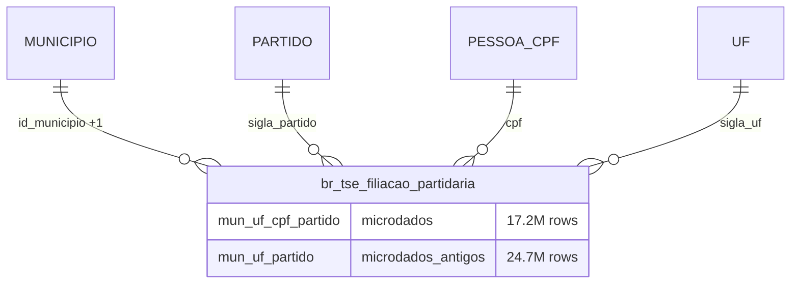

## Justice, security and sanctions

21 datasets · 52 tables

```mermaid
erDiagram
    EMPRESA_CNPJ ||..o{ br_bcb_penalidades : "CPF_CNPJ"
    PESSOA_CPF ||..o{ br_bcb_penalidades : "CPF_CNPJ"
    UF ||--o{ br_cnj_estatisticas_poder_judiciario : "sigla_uf"
    MUNICIPIO ||..o{ br_cnj_improbidade_administrativa : "comunicado_tse"
    UF ||--o{ br_cnj_improbidade_administrativa : "sigla_uf"
    MUNICIPIO ||--o{ br_fbsp_absp : "id_municipio"
    UF ||--o{ br_fbsp_absp : "sigla_uf"
    UF ||..o{ br_mj_consumidorgovbr : "UF"
    EMPRESA_CNPJ ||..o{ br_mjsp_ckan : "NumeroCNPJ +1"
    UF ||..o{ br_mjsp_ckan : "UF"
    UF ||..o{ br_mjsp_procurados : "estado"
    MUNICIPIO ||..o{ br_mjsp_sinesp : "cód_ibge +1"
    UF ||--o{ br_mjsp_sinesp : "sigla_uf"
    CEP ||--o{ br_mjsp_sisdepen : "cep"
    MUNICIPIO ||..o{ br_mjsp_sisdepen : "municipio +5"
    UF ||..o{ br_mjsp_sisdepen : "uf"
    CID10 ||..o{ br_pgfn_dividaativa : "categoria"
    EMPRESA_CNPJ ||..o{ br_pgfn_dividaativa : "CPF_CNPJ"
    PESSOA_CPF ||..o{ br_pgfn_dividaativa : "CPF_CNPJ"
    MUNICIPIO ||--o{ br_rj_isp_estatisticas_seguranca : "id_municipio"
    EMPRESA_CNPJ ||..o{ br_tcu_inidoneos : "CPF_CNPJ"
    MUNICIPIO ||..o{ br_tcu_inidoneos : "MUNICIPIO"
    PESSOA_CPF ||..o{ br_tcu_inidoneos : "CPF +1"
    UF ||..o{ br_tcu_inidoneos : "UF"
    br_bcb_penalidades {
        cnpj_cpf penalidades "16.8k rows"
    }
    br_cnj_estatisticas_poder_judiciario {
        uf_ano recursos_financeiros "1.2k rows"
    }
    br_cnj_improbidade_administrativa {
        mun_uf condenacao "53.3k rows"
    }
    br_fbsp_absp {
        mun_uf_ano municipio "162 rows"
        uf_ano uf "405 rows"
        uf_ano violencia_escola "1.9k rows"
    }
    br_ggb_relatorio_lgbtqi {
        ano brasil "20 rows"
        ano causa_obito "13 rows"
        ano grupo_lgbtqia "60 rows"
        ano local "16 rows"
        ano raca_cor "36 rows"
    }
    br_ipea_atlasviolencia {
        no_key series "152 rows"
        ano valores_nacional "2.9k rows"
    }
    br_mj_consumidorgovbr {
        uf_ano reclamacoes "10.2M rows"
    }
    br_mjsp_ckan {
        no_key infopen "empty"
        uf_cnpj_ano procon "13.8k rows"
    }
    br_mjsp_procurados {
        uf procurados "195 rows"
    }
    br_mjsp_sinesp {
        mun_uf_mes ocorrencias "823 rows"
        uf_ano_mes ocorrencias_uf "23k rows"
    }
    br_mjsp_sisdepen {
        mun_uf_cep_ano populacao_carceraria "38.4k rows"
    }
    br_pgfn_dividaativa {
        cnpj_cpf_cid divida "46.6M rows"
    }
    br_rj_isp_estatisticas_seguranca {
        ano_mes armas_apreendidas_mensal "31.4k rows"
        mun_ano_mes armas_fogo_apreendidas_mensal "6.2k rows"
        mun_ano_mes evolucao_mensal_cisp "37.5k rows"
        mun_ano_mes evolucao_mensal_municipio "13.4k rows"
        ano_mes evolucao_mensal_uf "422 rows"
        ano_mes evolucao_mensal_upp "8k rows"
        ano_mes evolucao_policial_morto_servico_mensal "37.5k rows"
        mun_ano_mes feminicidio_mensal_cisp "16.4k rows"
        mun relacao_cisp_aisp_risp "147 rows"
        mun_ano taxa_evolucao_anual_municipio "644 rows"
        ano taxa_evolucao_anual_uf "33 rows"
        mun_ano_mes taxa_evolucao_mensal_municipio "12.1k rows"
        ano_mes taxa_evolucao_mensal_uf "264 rows"
        ano taxa_letalidade "383 rows"
    }
    br_stf_corte_aberta {
        ano decisoes "2.7M rows"
        no_key dicionario "47 rows"
    }
    br_stj_dadosabertos {
        no_key documentos "549.2k rows"
    }
    br_tcu_inidoneos {
        mun_uf_cnpj_cpf empresas "93 rows"
        mun_uf_cpf inabilitados_funcao_publica "721 rows"
        mun_uf_cpf resp_contas_julgadas_irreg_implicacao_eleitoral "9.7k rows"
        mun_uf_cnpj_cpf resp_contas_julgadas_irregulares "34.9k rows"
    }
    eu_sanctions {
        no_key sanctions "42.3k rows"
    }
    global_icij_offshoreleaks {
        no_key addresses "402.2k rows"
        no_key entities "814.3k rows"
        no_key intermediaries "25.6k rows"
        no_key officers "771.3k rows"
        no_key other "3k rows"
        no_key relationships "3.3M rows"
    }
    global_ofac_sanctions {
        no_key sanctions "19.1k rows"
    }
    global_opensanctions {
        no_key entities "1.3M rows"
    }
    un_sanctions {
        no_key sanctions "1k rows"
    }
```

## Territory, environment and infrastructure

26 datasets · 112 tables

**1/2**

```mermaid
erDiagram
    MUNICIPIO ||--o{ br_ana_atlas_esgotos : "id_municipio"
    UF ||--o{ br_ana_atlas_esgotos : "sigla_uf"
    EMPRESA_CNPJ ||..o{ br_ana_outorgas : "emp_nu_cpfcnpj"
    MUNICIPIO ||..o{ br_ana_outorgas : "ing_nm_municipio +1"
    PESSOA_CPF ||..o{ br_ana_outorgas : "emp_nu_cpfcnpj"
    MUNICIPIO ||..o{ br_ana_telemetria : "nmMunicipio +4"
    UF ||..o{ br_ana_telemetria : "nmEstado +2"
    EMPRESA_CNPJ ||--o{ br_anatel_banda_larga_fixa : "cnpj"
    MUNICIPIO ||--o{ br_anatel_banda_larga_fixa : "id_municipio"
    UF ||--o{ br_anatel_banda_larga_fixa : "sigla_uf"
    MUNICIPIO ||--o{ br_anatel_indice_brasileiro_conectividade : "id_municipio"
    UF ||--o{ br_anatel_indice_brasileiro_conectividade : "sigla_uf"
    CID10 ||..o{ br_geobr_mapas : "categoria"
    ESCOLA ||--o{ br_geobr_mapas : "id_escola"
    MUNICIPIO ||--o{ br_geobr_mapas : "id_municipio"
    SETOR_CENSITARIO ||--o{ br_geobr_mapas : "id_setor_censitario"
    UF ||--o{ br_geobr_mapas : "sigla_uf +1"
    EMPRESA_CNPJ ||..o{ br_ibama_autos : "cpf_cnpj_infrator"
    MUNICIPIO ||..o{ br_ibama_autos : "municipio +1"
    PESSOA_CPF ||..o{ br_ibama_autos : "cpf_cnpj_infrator"
    UF ||..o{ br_ibama_autos : "uf"
    EMPRESA_CNPJ ||--o{ br_ibama_ctf : "cnpj"
    MUNICIPIO ||..o{ br_ibama_ctf : "municipio"
    UF ||..o{ br_ibama_ctf : "uf +1"
    br_ana_atlas_esgotos {
        mun_uf municipio "5.6k rows"
    }
    br_ana_bho {
        no_key topologia "462.5k rows"
    }
    br_ana_outorgas {
        mun_cnpj_cpf captacoes "181.9k rows"
        mun_cnpj_cpf lancamentos "10.9k rows"
    }
    br_ana_reservatorios {
        no_key sin "1.2M rows"
    }
    br_ana_telemetria {
        mun_uf estacoes "11.4k rows"
        mun_uf estacoes_inventario_2023 "37.8k rows"
        mun_uf inventario "37.8k rows"
        no_key series_chuva_diaria "69.8M rows"
        no_key series_chuva_mensal "2.5M rows"
        no_key series_cota_diaria "47.8M rows"
        no_key series_cota_mensal "1.7M rows"
        mes series_cotas_mensal "1.7M rows"
        no_key series_vazao_diaria "36.1M rows"
        no_key series_vazao_mensal "1.3M rows"
        no_key series_vazao_mensal_completa "1.4M rows"
        mes series_vazoes_mensal "1.3M rows"
    }
    br_anac_dadosabertos {
        no_key pontualidade "12.9k rows"
        no_key rab "34.6k rows"
        no_key voos "82.1k rows"
    }
    br_anatel_banda_larga_fixa {
        ano_mes densidade_brasil "193 rows"
        mun_uf_ano_mes densidade_municipio "1.1M rows"
        uf_ano_mes densidade_uf "5.2k rows"
        mun_uf_cnpj_ano_mes microdados "57.8M rows"
    }
    br_anatel_indice_brasileiro_conectividade {
        mun_uf_ano municipio "22.3k rows"
    }
    br_geobr_mapas {
        no_key amazonia_legal "1 rows"
        mun area_minima_comparavel_2010 "3.8k rows"
        mun_uf area_risco_desastre "8.3k rows"
        mun_uf arranjo_populacional "953 rows"
        ano bioma "17 rows"
        mun_uf concentracao_urbana "642 rows"
        uf_escola escola "222.9k rows"
        mun_uf_ano estabelecimentos_saude "360.2k rows"
        mun_uf limite_vizinhanca "14.8k rows"
        uf mesorregiao "137 rows"
        uf microrregiao "558 rows"
        mun_uf municipio "5.6k rows"
        no_key pais "1 rows"
        mun pegada_urbana "13.7k rows"
        no_key regiao "5 rows"
        uf regiao_imediata "510 rows"
        uf regiao_intermediaria "135 rows"
        mun_uf regiao_metropolitana_2017 "1.4k rows"
        uf saude "438 rows"
        mun_uf_ano sede_municipal "29.8k rows"
        mun_uf semiarido "1.3k rows"
        mun_uf_setor setor_censitario_2010 "316.5k rows"
        mun_uf terra_indigena "615 rows"
        uf uf "27 rows"
        cid_ano unidade_conservacao "1.9k rows"
    }
    br_ibama_autos {
        no_key aie_enquadramento "521k rows"
        no_key aie_enquadramentocomp "35.1k rows"
        ano anexo "703.7k rows"
        mun_uf_cnpj_cpf_ano auto_infracao "704k rows"
        no_key bioma "292.2k rows"
        no_key coordenada "73k rows"
        ano enquadramento "653.8k rows"
        no_key especime "38.2k rows"
    }
    br_ibama_ctf {
        mun_uf_cnpj aida "25.5k rows"
        mun_uf_cnpj app "1.4M rows"
    }
```

**2/2**

```mermaid
erDiagram
    EMPRESA_CNPJ ||..o{ br_ibama_embargos : "seq_tad;seq_decisao_judicial;dat_decisao_embargo;tipo_decisao;des_observacao;num_pessoa_interessado;interessado;cpf_cnpj_interessado;tipo_acao;dat_inclusao_acao;sit_cancelado;ultima_atualizacao_relatorio +1"
    MUNICIPIO ||..o{ br_ibama_embargos : "seq_tad;seq_hist_tad;dt_alteracao;des_status_formulario;sit_cancelado;num_tad;ser_tad;dat_embargo;dat_impressao;forma_entrega;num_processo;des_tad;cod_municipio;municipio;uf;des_localizacao;num_longitude_tad;num_latitude_tad;deter_prodes;id_poligono;embarga_poligono;qtd_area_embargada;nome_imovel;tipo_area;wkt;unid_apresentacao;unid_controle;sit_desembargo;dat_desembargo;des_desembargo;seq_auto_infracao;seq_notificacao;seq_acao_fiscalizatoria;operacao;seq_ordem_fiscalizacao;ordem_fiscalizacao;unid_ordenadora;seq_solicitacao_recurso;solicitacao_recurso;operacao_sol_recurso;dat_ult_alteracao;tipo_alteracao;justificativa_alteracao;ultima_atualizacao_relatorio +1"
    PESSOA_CPF ||..o{ br_ibama_embargos : "seq_tad;seq_decisao_judicial;dat_decisao_embargo;tipo_decisao;des_observacao;num_pessoa_interessado;interessado;cpf_cnpj_interessado;tipo_acao;dat_inclusao_acao;sit_cancelado;ultima_atualizacao_relatorio +1"
    EMPRESA_CNPJ ||..o{ br_ibama_embargos_novo : "cpf_cnpj_embargado +1"
    MUNICIPIO ||..o{ br_ibama_embargos_novo : "municipio +1"
    PESSOA_CPF ||..o{ br_ibama_embargos_novo : "cpf_cnpj_embargado +1"
    UF ||..o{ br_ibama_embargos_novo : "uf"
    MUNICIPIO ||--o{ br_inmet_bdmep : "id_municipio"
    MUNICIPIO ||--o{ br_inpe_prodes : "id_municipio"
    MUNICIPIO ||--o{ br_inpe_queimadas : "id_municipio"
    UF ||--o{ br_inpe_queimadas : "sigla_uf"
    MUNICIPIO ||--o{ br_inpe_sisam : "id_municipio"
    UF ||--o{ br_inpe_sisam : "sigla_uf"
    MUNICIPIO ||--o{ br_ipea_acesso_oportunidades : "id_municipio"
    MUNICIPIO ||--o{ br_mapbiomas_estatisticas : "id_municipio"
    UF ||--o{ br_mapbiomas_estatisticas : "sigla_uf"
    MUNICIPIO ||--o{ br_mdr_snis : "id_municipio"
    UF ||--o{ br_mdr_snis : "sigla_uf"
    CID10 ||..o{ br_mma_extincao : "categoria"
    MUNICIPIO ||--o{ br_mobilidados_indicadores : "id_municipio"
    UF ||--o{ br_mobilidados_indicadores : "sigla_uf"
    CID10 ||..o{ br_seeg_emissoes : "categoria +1"
    MUNICIPIO ||--o{ br_seeg_emissoes : "id_municipio"
    UF ||--o{ br_seeg_emissoes : "sigla_uf"
    MUNICIPIO ||--o{ br_sfb_sicar : "id_municipio"
    UF ||--o{ br_sfb_sicar : "sigla_uf"
    PAIS ||..o{ world_wwf_hydrosheds : "country"
    br_ibama_embargos {
        no_key anexo "15.8k rows"
        no_key coordenadas "64.6k rows"
        cnpj_cpf decisao "439 rows"
        no_key enquadramento "138k rows"
        no_key enquadramento_complementar "13.5k rows"
        no_key itens "48.8k rows"
        mun_cnpj_cpf termo_embargo "113.9k rows"
        mun termo_embargo_historico "497.1k rows"
    }
    br_ibama_embargos_novo {
        no_key coordenadas "64.6k rows"
        cnpj_cpf decisao "439 rows"
        no_key enquadramento "138k rows"
        no_key enquadramento_complementar "13.7k rows"
        no_key itens "48.8k rows"
        no_key termo_de_embargo_anexo "15.9k rows"
        mun_uf_cnpj_cpf termo_embargo "113.9k rows"
        mun_uf termo_embargo_historico "497.1k rows"
    }
    br_inmet_bdmep {
        mun estacao "633 rows"
        ano_mes microdados "84.5M rows"
    }
    br_inpe_prodes {
        mun_ano municipio_bioma "156.9k rows"
    }
    br_inpe_queimadas {
        mun_uf_ano_mes microdados "17.8M rows"
    }
    br_inpe_sisam {
        mun_uf_ano microdados "158.7M rows"
    }
    br_ipea_acesso_oportunidades {
        mun estatisticas_2019 "336.4k rows"
    }
    br_mapbiomas_estatisticas {
        no_key classe "36 rows"
        uf_ano cobertura_uf_classe "19k rows"
        mun_uf_ano transicao_municipio_de_para_decenal "975.1k rows"
        uf_ano transicao_uf_de_para_anual "169.1k rows"
        uf_ano transicao_uf_de_para_decenal "17.4k rows"
        uf_ano transicao_uf_de_para_quinquenal "38.7k rows"
    }
    br_mdr_snis {
        mun_uf_ano municipio_agua_esgoto "119.3k rows"
        mun_uf_ano prestador_agua_esgoto "125.8k rows"
    }
    br_mma_extincao {
        cid fauna_ameacada "1.3k rows"
        cid flora_ameacada "6.4k rows"
    }
    br_mobilidados_indicadores {
        mun_uf_ano comprometimento_renda_tarifa_transp_publico "351 rows"
        uf_ano divisao_modal "320 rows"
        mun_uf_ano emissao_co2_material_particulado "324 rows"
        mun_uf_ano proporcao_domicilios_infra_urbana "217 rows"
        mun_uf_ano proporcao_mortes_negras_acidente_transporte "668.4k rows"
        mun_uf_ano proporcao_pessoas_prox_infra_cicloviaria "378 rows"
        mun_uf_ano proporcao_pessoas_proximas_pnt "630 rows"
        mun_uf_ano taxa_motorizacao "486 rows"
        mun_uf_ano tempo_deslocamento_casa_trabalho "229 rows"
        mun_uf_ano transporte_media_alta_capacidade "27 rows"
    }
    br_seeg_emissoes {
        no_key dicionario "1.6k rows"
        mun_uf_cid_ano municipio "165.7M rows"
        uf_cid_ano uf "17.9M rows"
    }
    br_sfb_sicar {
        mun_uf area_imovel "79.3M rows"
        no_key dicionario "7 rows"
    }
    global_ibge_tabua_mares {
        no_key estacoes "6 rows"
        no_key previsao "1.3M rows"
    }
    world_wwf_hydrosheds {
        no_key basins_atlas "3.8M rows"
        pais lakes_atlas "2.9M rows"
        no_key rivers_atlas "8.5M rows"
    }
```

## Demographics and social indicators

17 datasets · 123 tables

**1/3**

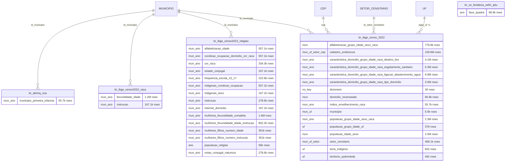

**2/3**

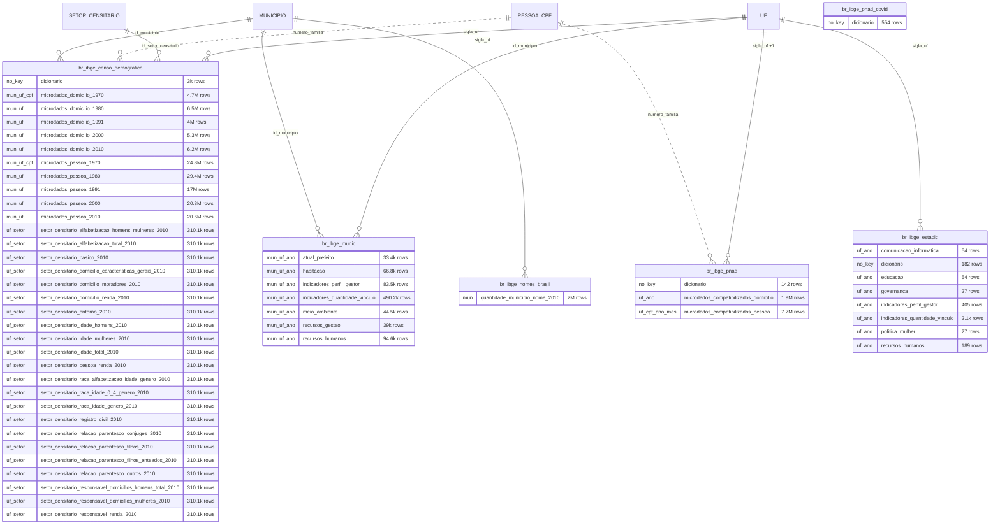

**3/3**

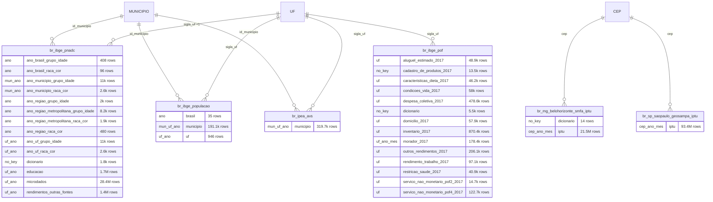

## International, culture and sport

9 datasets · 25 tables

```mermaid
erDiagram
    PAIS ||..o{ world_oecd_public_finance : "country"
    MUNICIPIO ||..o{ world_olympedia_olympics : "city"
    PAIS ||..o{ world_olympedia_olympics : "country"
    CEP ||--o{ world_wb_mides : "cep"
    EMPRESA_CNPJ ||..o{ world_wb_mides : "documento"
    MUNICIPIO ||--o{ world_wb_mides : "id_municipio"
    ORGAO ||..o{ world_wb_mides : "nome_orgao"
    UF ||--o{ world_wb_mides : "sigla_uf"
    UNIDADE_GESTORA ||--o{ world_wb_mides : "id_unidade_gestora"
    mundo_transfermarkt_competicoes {
        ano brasileirao_serie_a "8.5k rows"
        ano copa_brasil "598 rows"
    }
    mundo_transfermarkt_competicoes_internacionais {
        no_key champions_league "2.6k rows"
    }
    us_harvard_ned {
        no_key parliamentary_elections "4.9k rows"
        no_key presidential_elections "1.4k rows"
    }
    world_ampas_oscar {
        no_key winner_demographics "415 rows"
    }
    world_imdb_movies {
        no_key top_movies_per_year "33.6k rows"
    }
    world_oecd_public_finance {
        pais country "2.6k rows"
    }
    world_olympedia_olympics {
        pais athlete_bio "155.9k rows"
        no_key athlete_event_result "316.8k rows"
        no_key country "235 rows"
        mun game "64 rows"
        pais game_medal_tally "1.8k rows"
        no_key result "7.4k rows"
    }
    world_sofascore_competicoes_futebol {
        ano brasileirao_serie_a "6.8k rows"
        ano uefa_champions_league "4.5k rows"
    }
    world_wb_mides {
        no_key dicionario "961 rows"
        mun_uf_ug_ano_mes empenho "303.3M rows"
        mun_uf_ug_ano_mes licitacao "2.4M rows"
        mun_uf_cnpj_ug_ano licitacao_item "50.3M rows"
        mun_uf_cep_cnpj_ug_ano licitacao_participante "5.3M rows"
        mun_uf_ug_ano_mes liquidacao "357.3M rows"
        mun_uf_orgao_ug_ano orgao_unidade_gestora "341.6k rows"
        mun_uf_ug_ano_mes pagamento "392.7M rows"
        mun_uf_ano relacionamentos "20.6M rows"
    }
```

## Other

4 datasets · 35 tables

```mermaid
erDiagram
    EMPRESA_CNPJ ||..o{ br_anm : "cpf_cnpj +1"
    MUNICIPIO ||..o{ br_anm : "municipio +2"
    PESSOA_CPF ||..o{ br_anm : "cpf_cnpj +1"
    UF ||..o{ br_anm : "UF +1"
    CEP ||--o{ br_minc_salic : "cep"
    EMPRESA_CNPJ ||--o{ br_minc_salic : "cnpjcpf"
    PESSOA_CPF ||..o{ br_minc_salic : "cnpjcpf"
    UF ||..o{ br_minc_salic : "uf +1"
    CID10 ||..o{ br_seeg : "categoria"
    MUNICIPIO ||--o{ br_seeg : "id_municipio"
    br_anm {
        mun_uf_cnpj_cpf_ano_mes cfem_cfem_arrecadacao "2.4M rows"
        mun_uf_cnpj_cpf_ano_mes cfem_cfem_arrecadacao_2002_2006 "198.9k rows"
        mun_uf_cnpj_cpf_ano_mes cfem_cfem_arrecadacao_2007_2011 "364.8k rows"
        mun_uf_cnpj_cpf_ano_mes cfem_cfem_arrecadacao_2012_2016 "500.4k rows"
        mun_uf_cnpj_cpf_ano_mes cfem_cfem_arrecadacao_2017_2021 "625.5k rows"
        mun_uf_cnpj_cpf_ano_mes cfem_cfem_arrecadacao_2022_2026 "717.5k rows"
        mun_uf_cnpj_cpf_ano_mes cfem_cfem_autuacao "21k rows"
        ano_mes cfem_cfem_distribuicao "2.2M rows"
        mun_cnpj_cpf scm_alvara_de_pesquisa "111.3k rows"
        mun_cnpj_cpf scm_cessoes_de_direitos "55.1k rows"
        no_key scm_guia_de_utilizacao_autorizada "12.3k rows"
        mun_cnpj_cpf scm_licenciamento "21.5k rows"
        mun_cnpj_cpf scm_plg "3.2k rows"
        mun_cnpj_cpf scm_portaria_de_lavra "15.5k rows"
        mun_cnpj_cpf scm_registro_de_extracao_publicado "4k rows"
        mun_cnpj_cpf scm_relatorio_de_pesquisa_aprovado "15.7k rows"
        mun_cnpj_cpf scm_requerimento_de_lavra "21.4k rows"
        mun_cnpj_cpf scm_requerimento_de_licenciamento "9.1k rows"
        mun_cnpj_cpf scm_requerimento_de_pesquisa "19.1k rows"
        mun_cnpj_cpf scm_requerimento_de_plg "19.3k rows"
        mun_cnpj_cpf scm_requerimento_de_registro_de_extracao_protocolizado "2.3k rows"
        uf_ano sigmine_processos_minerarios "940.6k rows"
    }
    br_inea_boletim {
        ano boletins "1.1k rows"
        no_key empresas "6.9k rows"
        no_key processos "7.2k rows"
        no_key tipos_documento "2.6k rows"
    }
    br_minc_salic {
        no_key areas "7 rows"
        no_key cidades "5.6k rows"
        uf_cep_cnpj_cpf entidades "217.6k rows"
        uf estados "28 rows"
        no_key incentivos "173.8k rows"
        uf projetos "196.5k rows"
        no_key recibos "245.6k rows"
        no_key segmentos "106 rows"
    }
    br_seeg {
        mun_cid_ano emissoes_municipais "12.1M rows"
    }
```

---

## No documented link

### Datasets (39)

Not one column recognized as a key to any hub. Some are national series with no geographic or entity breakdown (price indices, exchange rates, national aggregates); the rest are scraped sources whose identifier has not been mapped yet — those are the candidates for the next bridges in `join_keys.md`.

- `br_ana_bho` — `topologia`
- `br_ana_reservatorios` — `sin`
- `br_anac_dadosabertos` — `pontualidade`, `rab`, `voos`
- `br_anvisa_consultas` — `registros`
- `br_bcb_sgs` — `series`
- `br_bd_diretorios_data_tempo` — `ano`, `bimestre`, `data`, `dia`, `hora`, `mes`, `minuto`, `segundo`, `semestre`, `tempo`, `trimestre`
- `br_caixa_sorteios` — `megasena`
- `br_ce_fortaleza_sefin_iptu` — `face_quadra`
- `br_fgv_igp` — `igp_10_mes`, `igp_di_ano`, `igp_di_mes`, `igp_m_ano`, `igp_m_mes`, `igp_og_ano`, `igp_og_mes`
- `br_fipe_veiculos` — `precos`
- `br_ggb_relatorio_lgbtqi` — `brasil`, `causa_obito`, `grupo_lgbtqia`, `local`, `raca_cor`
- `br_ibge_ipp` — `mes_categoria_economica`, `mes_grupo_industrial`, `mes_industria_atividade`, `mes_industria_extrativa`, `mes_industria_geral`, `mes_industria_transformacao`
- `br_ibge_pnad_covid` — `dicionario`
- `br_inea_boletim` — `boletins`, `empresas`, `processos`, `tipos_documento`
- `br_ipea_atlasviolencia` — `series`, `valores_nacional`
- `br_me_estoque_divida_publica` — `microdados`
- `br_me_exportadoras_importadoras` — `dicionario`
- `br_me_siape` — `servidores_executivo_federal`
- `br_me_sic` — `dicionario`, `transferencia`
- `br_me_siorg` — `remuneracao`
- `br_mec_prouni` — `dicionario`
- `br_stf_corte_aberta` — `decisoes`, `dicionario`
- `br_stj_dadosabertos` — `documentos`
- `br_tce_to` — `pautas`
- `br_tcu_dadosabertos` — `dados`
- `eu_sanctions` — `sanctions`
- `global_ibge_tabua_mares` — `estacoes`, `previsao`
- `global_icij_offshoreleaks` — `addresses`, `entities`, `intermediaries`, `officers`, `other`, `relationships`
- `global_ofac_sanctions` — `sanctions`
- `global_opensanctions` — `entities`
- `mundo_transfermarkt_competicoes` — `brasileirao_serie_a`, `copa_brasil`
- `mundo_transfermarkt_competicoes_internacionais` — `champions_league`
- `un_sanctions` — `sanctions`
- `us_harvard_ned` — `parliamentary_elections`, `presidential_elections`
- `world_ampas_oscar` — `winner_demographics`
- `world_iea_pirls` — `dictionary`, `home_context`, `school_context`, `student_achievement`, `student_context`, `student_teacher_link`, `teacher_context`, `within_country_scoring_reliability`
- `world_iea_timss` — `dictionary`, `home_context_grade_4`, `school_context_grade_4`, `school_context_grade_8`, `student_achievement_grade_4`, `student_achievement_grade_8`, `student_context_grade_4`, `student_context_grade_8`, `teacher_context_grade_4`, `teacher_mathematics_grade_8`, `teacher_science_grade_8`
- `world_imdb_movies` — `top_movies_per_year`
- `world_sofascore_competicoes_futebol` — `brasileirao_serie_a`, `uefa_champions_league`

### Tables (230)

Tables carrying no key at all, including ones inside datasets that do connect through their other tables (dictionaries, national aggregates, metadata):

`br_ana_bho.topologia`, `br_ana_reservatorios.sin`, `br_ana_telemetria.series_chuva_diaria`, `br_ana_telemetria.series_chuva_mensal`, `br_ana_telemetria.series_cota_diaria`, `br_ana_telemetria.series_cota_mensal`, `br_ana_telemetria.series_vazao_diaria`, `br_ana_telemetria.series_vazao_mensal`, `br_ana_telemetria.series_vazao_mensal_completa`, `br_anac_dadosabertos.pontualidade`, `br_anac_dadosabertos.rab`, `br_anac_dadosabertos.voos`, `br_anm.scm_guia_de_utilizacao_autorizada`, `br_anvisa_consultas.registros`, `br_bcb_estban.dicionario`, `br_bcb_sgs.series`, `br_bcb_sicor.dicionario`, `br_bcb_sicor.empreendimento`, `br_bd_diretorios_brasil.area_conhecimento`, `br_bd_diretorios_brasil.curso_superior`, `br_bd_diretorios_brasil.etnia_indigena`, `br_bd_diretorios_brasil.natureza_juridica`, `br_bd_diretorios_brasil.subatividade_ibge`, `br_bd_diretorios_data_tempo.bimestre`, `br_bd_diretorios_data_tempo.dia`, `br_bd_diretorios_data_tempo.hora`, `br_bd_diretorios_data_tempo.minuto`, `br_bd_diretorios_data_tempo.segundo`, `br_bd_diretorios_data_tempo.semestre`, `br_bd_diretorios_data_tempo.tempo`, `br_bd_diretorios_data_tempo.trimestre`, `br_bd_diretorios_mundo.pais`, `br_bd_diretorios_us.cbsa_2023`, `br_bd_diretorios_us.census_tract_2020`, `br_bd_diretorios_us.congress_member`, `br_bd_diretorios_us.congressional_district_119`, `br_bd_diretorios_us.county`, `br_bd_diretorios_us.naics_2022`, `br_bd_diretorios_us.place`, `br_bd_diretorios_us.puma_2020`, `br_bd_diretorios_us.school`, `br_bd_diretorios_us.school_district`, `br_bd_metadados.bigquery_tables`, `br_bd_metadados.external_links`, `br_bd_metadados.information_requests`, `br_bd_metadados.organizations`, `br_bd_metadados.resources`, `br_bd_metadados.tables`, `br_brasilapi.bancos`, `br_brasilapi.feriados`, `br_brasilapi.taxas_referencia`, `br_caixa_sorteios.megasena`, `br_camara_dados_abertos.deputado_profissao`, `br_camara_dados_abertos.evento`, `br_camara_dados_abertos.evento_orgao`, `br_camara_dados_abertos.evento_presenca_deputado`, `br_camara_dados_abertos.evento_requerimento`, `br_camara_dados_abertos.frente`, `br_camara_dados_abertos.frente_deputado`, `br_camara_dados_abertos.funcionario`, `br_camara_dados_abertos.sigla_partido`, `br_camara_dados_abertos.votacao`, `br_camara_dados_abertos.votacao_orientacao_bancada`, `br_cgu_cartao_pagamento.dicionario`, `br_cgu_dados_abertos.conjunto`, `br_cgu_dados_abertos.recurso`, `br_cgu_fef.sorteio`, `br_cgu_viagens.pagamento`, `br_cgu_viagens.passagem`, `br_cnpq_bolsas.dicionario`, `br_comprasgov_catmatcatser.servicos`, `br_cvm_administradores_carteira.pessoa_fisica`, `br_datasus_cid10.capitulos`, `br_datasus_cid10.cid_o_grupos`, `br_datasus_cid10.grupos`, `br_datasus_cid10.subcategorias`, `br_fipe_veiculos.precos`, `br_geobr_mapas.amazonia_legal`, `br_geobr_mapas.pais`, `br_geobr_mapas.regiao`, `br_ibama_autos.aie_enquadramento`, `br_ibama_autos.aie_enquadramentocomp`, `br_ibama_autos.bioma`, `br_ibama_autos.coordenada`, `br_ibama_autos.especime`, `br_ibama_embargos.anexo`, `br_ibama_embargos.coordenadas`, `br_ibama_embargos.enquadramento`, `br_ibama_embargos.enquadramento_complementar`, `br_ibama_embargos.itens`, `br_ibama_embargos_novo.coordenadas`, `br_ibama_embargos_novo.enquadramento`, `br_ibama_embargos_novo.enquadramento_complementar`, `br_ibama_embargos_novo.itens`, `br_ibama_embargos_novo.termo_de_embargo_anexo`, `br_ibge_censo_2022.dicionario`, `br_ibge_censo_demografico.dicionario`, `br_ibge_estadic.dicionario`, `br_ibge_pnad.dicionario`, `br_ibge_pnad_covid.dicionario`, `br_ibge_pnadc.dicionario`, `br_ibge_pof.cadastro_de_produtos_2017`, `br_ibge_pof.dicionario`, `br_inea_boletim.empresas`, `br_inea_boletim.processos`, `br_inea_boletim.tipos_documento`, `br_inep_ana.dicionario`, `br_inep_avaliacao_alfabetizacao.dicionario`, `br_inep_censo_educacao_superior.dicionario`, `br_inep_censo_escolar.dicionario`, `br_inep_enem.dicionario`, `br_inep_enem.questionario_socioeconomico_1998`, `br_inep_enem.questionario_socioeconomico_1999`, `br_inep_enem.questionario_socioeconomico_2000`, `br_inep_enem.questionario_socioeconomico_2001`, `br_inep_enem.questionario_socioeconomico_2002`, `br_inep_enem.questionario_socioeconomico_2003`, `br_inep_enem.questionario_socioeconomico_2004`, `br_inep_enem.questionario_socioeconomico_2005`, `br_inep_enem.questionario_socioeconomico_2006`, `br_inep_enem.questionario_socioeconomico_2007`, `br_inep_enem.questionario_socioeconomico_2008`, `br_inep_enem.questionario_socioeconomico_2009`, `br_inep_enem.questionario_socioeconomico_2010`, `br_inep_enem.questionario_socioeconomico_2011`, `br_inep_enem.questionario_socioeconomico_2012`, `br_inep_enem.questionario_socioeconomico_2013`, `br_inep_enem.questionario_socioeconomico_2014`, `br_inep_enem.questionario_socioeconomico_2015`, `br_inep_enem.questionario_socioeconomico_2016`, `br_inep_enem.questionario_socioeconomico_2017`, `br_inep_enem.questionario_socioeconomico_2018`, `br_inep_enem.questionario_socioeconomico_2019`, `br_inep_enem.questionario_socioeconomico_2020`, `br_inep_enem.questionario_socioeconomico_2021`, `br_inep_enem.questionario_socioeconomico_2022`, `br_inep_enem.questionario_socioeconomico_2023`, `br_inep_formacao_docente.dicionario`, `br_inep_indicador_nivel_socioeconomico.dicionario`, `br_inep_saeb.dicionario`, `br_inep_sinopse_estatistica_educacao_basica.dicionario`, `br_ipea_atlasviolencia.series`, `br_mapbiomas_estatisticas.classe`, `br_me_caged.dicionario`, `br_me_cno.dicionario`, `br_me_cno.microdados_vinculo`, `br_me_cnpj.dicionario`, `br_me_comex_stat.dicionario`, `br_me_exportadoras_importadoras.dicionario`, `br_me_rais.dicionario`, `br_me_siape.servidores_executivo_federal`, `br_me_sic.dicionario`, `br_me_siorg.remuneracao`, `br_mec_prouni.dicionario`, `br_mg_belohorizonte_smfa_iptu.dicionario`, `br_minc_salic.areas`, `br_minc_salic.cidades`, `br_minc_salic.incentivos`, `br_minc_salic.recibos`, `br_minc_salic.segmentos`, `br_mjsp_ckan.infopen`, `br_ms_cnes.dicionario`, `br_ms_pns.dicionario`, `br_ms_sia.dicionario`, `br_ms_sih.dicionario`, `br_ms_sim.dicionario`, `br_ms_sinan.dicionario`, `br_ms_sinasc.dicionario`, `br_ms_sisvan.dicionario`, `br_ms_vacinacao_covid19.dicionario`, `br_rf_cafir.dicionario`, `br_rf_cno.dicionario`, `br_rf_cno.vinculos`, `br_seeg_emissoes.dicionario`, `br_senado_dadosabertos.materias`, `br_senado_dadosabertos.senadores`, `br_sfb_sicar.dicionario`, `br_siop_orcamento.alteracoes_orcamentarias`, `br_siop_orcamento.dados`, `br_siop_orcamento.planos_orcamentarios`, `br_stf_corte_aberta.dicionario`, `br_stj_dadosabertos.documentos`, `br_tce_pi.despesas_total`, `br_tce_pi.licitacoes_estado`, `br_tce_pi.receitas_total`, `br_tce_to.pautas`, `br_tse_eleicoes.carga_2026`, `br_tse_eleicoes.dicionario`, `eu_sanctions.sanctions`, `global_ibge_tabua_mares.estacoes`, `global_ibge_tabua_mares.previsao`, `global_icij_offshoreleaks.addresses`, `global_icij_offshoreleaks.entities`, `global_icij_offshoreleaks.intermediaries`, `global_icij_offshoreleaks.officers`, `global_icij_offshoreleaks.other`, `global_icij_offshoreleaks.relationships`, `global_ofac_sanctions.sanctions`, `global_opensanctions.entities`, `mundo_transfermarkt_competicoes_internacionais.champions_league`, `un_sanctions.sanctions`, `us_harvard_ned.parliamentary_elections`, `us_harvard_ned.presidential_elections`, `world_ampas_oscar.winner_demographics`, `world_iea_pirls.dictionary`, `world_iea_pirls.home_context`, `world_iea_pirls.school_context`, `world_iea_pirls.student_achievement`, `world_iea_pirls.student_context`, `world_iea_pirls.student_teacher_link`, `world_iea_pirls.teacher_context`, `world_iea_pirls.within_country_scoring_reliability`, `world_iea_timss.dictionary`, `world_iea_timss.home_context_grade_4`, `world_iea_timss.school_context_grade_4`, `world_iea_timss.school_context_grade_8`, `world_iea_timss.student_achievement_grade_4`, `world_iea_timss.student_achievement_grade_8`, `world_iea_timss.student_context_grade_4`, `world_iea_timss.student_context_grade_8`, `world_iea_timss.teacher_context_grade_4`, `world_iea_timss.teacher_mathematics_grade_8`, `world_iea_timss.teacher_science_grade_8`, `world_imdb_movies.top_movies_per_year`, `world_olympedia_olympics.athlete_event_result`, `world_olympedia_olympics.country`, `world_olympedia_olympics.result`, `world_wb_mides.dicionario`, `world_wwf_hydrosheds.basins_atlas`, `world_wwf_hydrosheds.rivers_atlas`
