# Temas — que dados cada investigação usa

Os 43 temas do site e os datasets que cada um cita, 103 dos 207 do espelho. Os temas não se ligam
entre si diretamente: o que os conecta é chegarem às mesmas
referências — a aresta leva quantos datasets do tema carregam a chave.

> A origem é o markdown de `docs/overview/`: os datasets que o próprio
> texto de cada tema nomeia. Não é a lista completa do que a investigação
> tocou — é o que está registrado. Dataset sem citação não aparece.

Gerado por `scripts/gera_flow.py` a partir de `schemas.json` em 2026-09-01 — não edite à mão, regenere.

- **caixa** = dataset; cada `subgraph` é um tema, e a aresta sai do tema inteiro;
- **cápsula** = hub de referência, agrupado por família num `subgraph` e
  repetido em cada diagrama para manter as arestas curtas;
- **seta cheia** (`-->`) = a chave está lá com o nome canônico, join direto;
- **seta pontilhada** (`-.->`) = a chave está com outro nome ou formato,
  normalize antes — receita em [`docs/context/join_keys.md`](docs/context/join_keys.md);
- a lista de tabelas de cada dataset ficou de fora de propósito; está no
  [`ERD.md`](ERD.md).

```mermaid
flowchart LR
    subgraph tema_01["01 · Desigualdade Racial"]
        direction TB
        t01_br_me_rais["me_rais"]
        t01_br_ms_sim["ms_sim"]
    end
    subgraph tema_02["02 · Educação"]
        direction TB
        t02_br_inep_enem["inep_enem"]
        t02_br_inep_ideb["inep_ideb"]
        t02_br_inep_indicador_nivel_socioeconomico["inep_indicador_nivel_socioeconomico"]
    end
    subgraph tema_03["03 · Saúde"]
        direction TB
        t03_br_cgu_beneficios_cidadao["cgu_beneficios_cidadao"]
        t03_br_ms_sim["ms_sim"]
        t03_br_ms_sinasc["ms_sinasc"]
    end
    subgraph tema_04["04 · Mercado de Trabalho"]
        direction TB
        t04_br_me_caged["me_caged"]
        t04_br_me_rais["me_rais"]
    end
    subgraph tema_05["05 · Política"]
        direction TB
        t05_br_camara_dados_abertos["camara_dados_abertos"]
        t05_br_senado_dadosabertos["senado_dadosabertos"]
        t05_br_tse_eleicoes["tse_eleicoes"]
    end
    subgraph tema_06["06 · Crime"]
        direction TB
        t06_br_mjsp_sisdepen["mjsp_sisdepen"]
        t06_br_ms_sim["ms_sim"]
        t06_br_rj_isp_estatisticas_seguranca["rj_isp_estatisticas_seguranca"]
    end
    subgraph tema_07["07 · Economia"]
        direction TB
        t07_br_bcb_estban["bcb_estban"]
        t07_br_bcb_sicor["bcb_sicor"]
        t07_br_ibge_pib["ibge_pib"]
    end
    subgraph tema_08["08 · Políticas Públicas"]
        direction TB
        t08_br_cgu_beneficios_cidadao["cgu_beneficios_cidadao"]
        t08_br_ibge_munic["ibge_munic"]
        t08_br_me_siconfi["me_siconfi"]
    end
    subgraph tema_09["09 · Gênero"]
        direction TB
        t09_br_me_caged["me_caged"]
        t09_br_ms_sinasc["ms_sinasc"]
    end
    subgraph tema_10["10 · Meio Ambiente"]
        direction TB
        t10_br_inpe_prodes["inpe_prodes"]
        t10_br_seeg_emissoes["seeg_emissoes"]
        t10_br_sfb_sicar["sfb_sicar"]
    end
    subgraph tema_11["11 · Infraestrutura"]
        direction TB
        t11_br_anatel_indice_brasileiro_conectividade["anatel_indice_brasileiro_conectividade"]
        t11_br_mdr_snis["mdr_snis"]
    end
    subgraph tema_12["12 · Interseccionalidade"]
        direction TB
        t12_br_me_rais["me_rais"]
        t12_br_ms_sinasc["ms_sinasc"]
    end
    subgraph tema_13["13 · Migração"]
        direction TB
        t13_br_me_caged["me_caged"]
    end
    subgraph tema_14["14 · Consumo"]
        direction TB
        t14_br_anp_combustiveis["anp_combustiveis"]
        t14_br_anp_precos_combustiveis["anp_precos_combustiveis"]
        t14_br_ibge_ipca["ibge_ipca"]
    end
    subgraph tema_15["15 · Poder"]
        direction TB
        t15_br_camara_dados_abertos["camara_dados_abertos"]
        t15_br_tse_eleicoes["tse_eleicoes"]
    end
    subgraph tema_16["16 · Economia Política"]
        direction TB
        t16_br_rf_arrecadacao["rf_arrecadacao"]
    end
    subgraph tema_17["17 · Agropecuária"]
        direction TB
        t17_br_bcb_sicor["bcb_sicor"]
        t17_br_ibge_ppm["ibge_ppm"]
        t17_br_sfb_sicar["sfb_sicar"]
        t17_br_trase_supply_chain["trase_supply_chain"]
    end
    subgraph tema_18["18 · Comércio Exterior"]
        direction TB
        t18_br_me_comex_stat["me_comex_stat"]
    end
    subgraph tema_19["19 · Mercado Financeiro"]
        direction TB
        t19_br_anatel_indice_brasileiro_conectividade["anatel_indice_brasileiro_conectividade"]
        t19_br_cnpq_bolsas["cnpq_bolsas"]
    end
    subgraph tema_20["20 · Ciência"]
        direction TB
        t20_br_cnpq_bolsas["cnpq_bolsas"]
        t20_br_inep_enem["inep_enem"]
    end
    subgraph tema_21["21 · Corrupção"]
        direction TB
        t21_br_cgu_cartao_pagamento["cgu_cartao_pagamento"]
        t21_br_cgu_emendas_parlamentares["cgu_emendas_parlamentares"]
        t21_br_cgu_licitacao_contrato["cgu_licitacao_contrato"]
        t21_br_rf_arrecadacao["rf_arrecadacao"]
    end
    subgraph tema_22["22 · Clima"]
        direction TB
        t22_br_inpe_prodes["inpe_prodes"]
        t22_br_seeg_emissoes["seeg_emissoes"]
        t22_br_sfb_sicar["sfb_sicar"]
    end
    subgraph tema_23["23 · Epidemiologia"]
        direction TB
        t23_br_ms_cnes["ms_cnes"]
        t23_br_ms_sim["ms_sim"]
        t23_br_ms_sinasc["ms_sinasc"]
    end
    subgraph tema_24["24 · Assistência Ambulatorial"]
        direction TB
        t24_br_ieps_saude["ieps_saude"]
        t24_br_ms_cnes["ms_cnes"]
        t24_br_ms_sia["ms_sia"]
        t24_br_ms_sih["ms_sih"]
    end
    subgraph tema_25["25 · Orçamento Federal"]
        direction TB
        t25_br_bcb_sicor["bcb_sicor"]
        t25_br_cgu_emendas_parlamentares["cgu_emendas_parlamentares"]
        t25_br_rf_arrecadacao["rf_arrecadacao"]
    end
    subgraph tema_26["26 · Servidores Públicos"]
        direction TB
        t26_br_cgu_servidores_executivo_federal["cgu_servidores_executivo_federal"]
        t26_br_me_rais["me_rais"]
    end
    subgraph tema_27["27 · Pesquisas de Opinião"]
        direction TB
        t27_br_ibge_pnadc["ibge_pnadc"]
        t27_br_ms_pns["ms_pns"]
        t27_br_poder360_pesquisas["poder360_pesquisas"]
        t27_br_tse_eleicoes["tse_eleicoes"]
    end
    subgraph tema_28["28 · Violência Escolar"]
        direction TB
        t28_br_fbsp_absp["fbsp_absp"]
        t28_br_inep_censo_escolar["inep_censo_escolar"]
        t28_br_inep_enem["inep_enem"]
        t28_br_inep_saeb["inep_saeb"]
        t28_br_ms_sinan["ms_sinan"]
        t28_br_rj_isp_estatisticas_seguranca["rj_isp_estatisticas_seguranca"]
    end
    subgraph tema_29["29 · Dados Eleitorais Detalhados"]
        direction TB
        t29_br_tse_eleicoes["tse_eleicoes"]
    end
    subgraph tema_30["30 · Estrutura Produtiva"]
        direction TB
        t30_br_me_cnpj["me_cnpj"]
    end
    subgraph tema_31["31 · Desenvolvimento Humano"]
        direction TB
        t31_br_cgu_beneficios_cidadao["cgu_beneficios_cidadao"]
        t31_br_ibge_censo_2022["ibge_censo_2022"]
        t31_br_ipea_avs["ipea_avs"]
    end
    subgraph tema_32["32 · Conectividade"]
        direction TB
        t32_br_anatel_banda_larga_fixa["anatel_banda_larga_fixa"]
        t32_br_anatel_indice_brasileiro_conectividade["anatel_indice_brasileiro_conectividade"]
        t32_br_inep_enem["inep_enem"]
        t32_br_simet_educacao_conectada["simet_educacao_conectada"]
    end
    subgraph tema_33["33 · Dados Internacionais Compara"]
        direction TB
        t33_br_fbsp_absp["fbsp_absp"]
    end
    subgraph tema_34["34 · Atlas"]
        direction TB
        t34_br_geobr_mapas["geobr_mapas"]
        t34_br_ibge_censo_2022["ibge_censo_2022"]
    end
    subgraph tema_35["35 · Transporte"]
        direction TB
        t35_br_mobilidados_indicadores["mobilidados_indicadores"]
    end
    subgraph tema_36["36 · Religiosidade"]
        direction TB
        t36_br_ibge_censo2022_religiao["ibge_censo2022_religiao"]
        t36_br_ibge_censo_2022["ibge_censo_2022"]
        t36_br_me_cnpj["me_cnpj"]
        t36_br_me_rais["me_rais"]
    end
    subgraph tema_37["37 · Sanções"]
        direction TB
        t37_br_pgfn_dividaativa["pgfn_dividaativa"]
        t37_br_tcu_inidoneos["tcu_inidoneos"]
    end
    subgraph tema_38["38 · Educação Básica"]
        direction TB
        t38_br_inep_avaliacao_alfabetizacao["inep_avaliacao_alfabetizacao"]
        t38_br_inep_educacao_especial["inep_educacao_especial"]
        t38_br_inep_formacao_docente["inep_formacao_docente"]
        t38_br_inep_sinopse_estatistica_educacao_basica["inep_sinopse_estatistica_educacao_basica"]
        t38_world_oecd_pisa["world_oecd_pisa"]
    end
    subgraph tema_39["39 · Justiça"]
        direction TB
        t39_br_cnj_estatisticas_poder_judiciario["cnj_estatisticas_poder_judiciario"]
        t39_br_cnj_improbidade_administrativa["cnj_improbidade_administrativa"]
        t39_br_tce_es["tce_es"]
        t39_br_tce_pi["tce_pi"]
        t39_br_tce_rj["tce_rj"]
        t39_br_tce_sp["tce_sp"]
    end
    subgraph tema_40["40 · Federalismo Fiscal"]
        direction TB
        t40_br_firjan_ifgf["firjan_ifgf"]
        t40_br_siop_orcamento["siop_orcamento"]
        t40_br_tesouro_capag["tesouro_capag"]
        t40_br_transferegov["transferegov"]
    end
    subgraph tema_41["41 · Nutrição"]
        direction TB
        t41_br_anvisa_cmed["anvisa_cmed"]
        t41_br_ibge_pof["ibge_pof"]
        t41_br_ms_sisvan["ms_sisvan"]
        t41_br_saude_bps["saude_bps"]
        t41_br_saude_farmaciapopular["saude_farmaciapopular"]
    end
    subgraph tema_42["42 · Água"]
        direction TB
        t42_br_ana_telemetria["ana_telemetria"]
        t42_br_inmet_bdmep["inmet_bdmep"]
        t42_br_inpe_queimadas["inpe_queimadas"]
        t42_br_inpe_sisam["inpe_sisam"]
        t42_br_mapbiomas_estatisticas["mapbiomas_estatisticas"]
        t42_br_mma_extincao["mma_extincao"]
        t42_world_wwf_hydrosheds["world_wwf_hydrosheds"]
    end
    subgraph tema_43["43 · Cultura"]
        direction TB
        t43_world_olympedia_olympics["world_olympedia_olympics"]
    end
    subgraph g_territ_rio["Território"]
        direction TB
        MUNICIPIO(["MUNICIPIO"])
        UF(["UF"])
        SETOR_CENSITARIO(["SETOR_CENSITARIO"])
        CEP(["CEP"])
    end
    subgraph g_pessoas_e_empresas["Pessoas e empresas"]
        direction TB
        EMPRESA_CNPJ(["EMPRESA_CNPJ"])
        PESSOA_CPF(["PESSOA_CPF"])
        CNAE(["CNAE"])
        CBO(["CBO"])
    end
    subgraph g_equipamentos["Equipamentos"]
        direction TB
        ESCOLA(["ESCOLA"])
        IES(["IES"])
        CNES(["CNES"])
        CID10(["CID10"])
    end
    subgraph g_estado_e_economia["Estado e economia"]
        direction TB
        ORGAO(["ORGAO"])
        UNIDADE_GESTORA(["UNIDADE_GESTORA"])
        FUNCAO_PROGRAMA(["FUNCAO_PROGRAMA"])
        PARTIDO(["PARTIDO"])
        NCM_SH(["NCM_SH"])
        PAIS(["PAIS"])
    end
    tema_01 -->|"1"| CBO
    tema_01 -->|"1"| CEP
    tema_01 -->|"1"| CNAE
    tema_01 -.->|"1"| CNES
    tema_01 -->|"2"| MUNICIPIO
    tema_01 -->|"2"| UF
    tema_02 -->|"2"| ESCOLA
    tema_02 -->|"3"| MUNICIPIO
    tema_02 -->|"3"| UF
    tema_03 -.->|"2"| CNES
    tema_03 -->|"3"| MUNICIPIO
    tema_03 -->|"1"| PESSOA_CPF
    tema_03 -->|"3"| UF
    tema_04 -->|"2"| CBO
    tema_04 -->|"1"| CEP
    tema_04 -.->|"1"| CID10
    tema_04 -->|"2"| CNAE
    tema_04 -->|"2"| MUNICIPIO
    tema_04 -->|"2"| UF
    tema_05 -->|"1"| CEP
    tema_05 -->|"1"| CNAE
    tema_05 -->|"2"| EMPRESA_CNPJ
    tema_05 -->|"2"| MUNICIPIO
    tema_05 -->|"2"| PARTIDO
    tema_05 -->|"2"| PESSOA_CPF
    tema_05 -->|"3"| UF
    tema_06 -->|"1"| CEP
    tema_06 -.->|"1"| CNES
    tema_06 -->|"3"| MUNICIPIO
    tema_06 -->|"2"| UF
    tema_07 -->|"2"| EMPRESA_CNPJ
    tema_07 -->|"1"| FUNCAO_PROGRAMA
    tema_07 -->|"3"| MUNICIPIO
    tema_07 -->|"1"| PESSOA_CPF
    tema_07 -->|"3"| UF
    tema_08 -->|"3"| MUNICIPIO
    tema_08 -->|"1"| PESSOA_CPF
    tema_08 -->|"3"| UF
    tema_09 -->|"1"| CBO
    tema_09 -.->|"1"| CID10
    tema_09 -->|"1"| CNAE
    tema_09 -.->|"1"| CNES
    tema_09 -->|"2"| MUNICIPIO
    tema_09 -->|"2"| UF
    tema_10 -.->|"1"| CID10
    tema_10 -->|"3"| MUNICIPIO
    tema_10 -->|"2"| UF
    tema_11 -->|"2"| MUNICIPIO
    tema_11 -->|"2"| UF
    tema_12 -->|"1"| CBO
    tema_12 -->|"1"| CEP
    tema_12 -->|"1"| CNAE
    tema_12 -.->|"1"| CNES
    tema_12 -->|"2"| MUNICIPIO
    tema_12 -->|"2"| UF
    tema_13 -->|"1"| CBO
    tema_13 -.->|"1"| CID10
    tema_13 -->|"1"| CNAE
    tema_13 -->|"1"| MUNICIPIO
    tema_13 -->|"1"| UF
    tema_14 -->|"1"| CEP
    tema_14 -.->|"1"| CID10
    tema_14 -->|"2"| EMPRESA_CNPJ
    tema_14 -->|"3"| MUNICIPIO
    tema_14 -->|"3"| UF
    tema_15 -->|"1"| CEP
    tema_15 -->|"1"| CNAE
    tema_15 -->|"2"| EMPRESA_CNPJ
    tema_15 -->|"2"| MUNICIPIO
    tema_15 -->|"2"| PARTIDO
    tema_15 -->|"2"| PESSOA_CPF
    tema_15 -->|"2"| UF
    tema_16 -->|"1"| MUNICIPIO
    tema_16 -->|"1"| UF
    tema_17 -->|"2"| EMPRESA_CNPJ
    tema_17 -->|"1"| FUNCAO_PROGRAMA
    tema_17 -->|"4"| MUNICIPIO
    tema_17 -->|"2"| PESSOA_CPF
    tema_17 -->|"4"| UF
    tema_18 -->|"1"| MUNICIPIO
    tema_18 -->|"1"| NCM_SH
    tema_18 -->|"1"| PAIS
    tema_18 -->|"1"| UF
    tema_19 -->|"2"| MUNICIPIO
    tema_19 -->|"2"| UF
    tema_20 -->|"2"| MUNICIPIO
    tema_20 -->|"2"| UF
    tema_21 -->|"2"| EMPRESA_CNPJ
    tema_21 -->|"1"| FUNCAO_PROGRAMA
    tema_21 -->|"3"| MUNICIPIO
    tema_21 -->|"2"| ORGAO
    tema_21 -->|"2"| PESSOA_CPF
    tema_21 -->|"3"| UF
    tema_21 -->|"2"| UNIDADE_GESTORA
    tema_22 -.->|"1"| CID10
    tema_22 -->|"3"| MUNICIPIO
    tema_22 -->|"2"| UF
    tema_23 -->|"1"| CBO
    tema_23 -->|"1"| CEP
    tema_23 -->|"3"| CNES
    tema_23 -->|"1"| EMPRESA_CNPJ
    tema_23 -.->|"1"| IES
    tema_23 -->|"3"| MUNICIPIO
    tema_23 -.->|"1"| PESSOA_CPF
    tema_23 -->|"3"| UF
    tema_24 -->|"2"| CBO
    tema_24 -->|"1"| CEP
    tema_24 -->|"2"| CID10
    tema_24 -->|"3"| CNES
    tema_24 -->|"2"| EMPRESA_CNPJ
    tema_24 -.->|"2"| IES
    tema_24 -->|"4"| MUNICIPIO
    tema_24 -->|"2"| PESSOA_CPF
    tema_24 -->|"4"| UF
    tema_25 -->|"1"| EMPRESA_CNPJ
    tema_25 -->|"2"| FUNCAO_PROGRAMA
    tema_25 -->|"3"| MUNICIPIO
    tema_25 -->|"1"| PESSOA_CPF
    tema_25 -->|"3"| UF
    tema_26 -->|"1"| CBO
    tema_26 -->|"1"| CEP
    tema_26 -->|"1"| CNAE
    tema_26 -->|"1"| MUNICIPIO
    tema_26 -->|"1"| PESSOA_CPF
    tema_26 -->|"2"| UF
    tema_27 -->|"1"| CEP
    tema_27 -->|"1"| CNAE
    tema_27 -->|"1"| EMPRESA_CNPJ
    tema_27 -->|"3"| MUNICIPIO
    tema_27 -->|"2"| PARTIDO
    tema_27 -->|"1"| PESSOA_CPF
    tema_27 -->|"4"| UF
    tema_28 -->|"1"| CNES
    tema_28 -->|"1"| EMPRESA_CNPJ
    tema_28 -->|"2"| ESCOLA
    tema_28 -.->|"1"| IES
    tema_28 -->|"6"| MUNICIPIO
    tema_28 -->|"5"| UF
    tema_29 -->|"1"| CEP
    tema_29 -->|"1"| CNAE
    tema_29 -->|"1"| EMPRESA_CNPJ
    tema_29 -->|"1"| MUNICIPIO
    tema_29 -->|"1"| PARTIDO
    tema_29 -->|"1"| PESSOA_CPF
    tema_29 -->|"1"| UF
    tema_30 -->|"1"| CEP
    tema_30 -->|"1"| CNAE
    tema_30 -->|"1"| EMPRESA_CNPJ
    tema_30 -->|"1"| MUNICIPIO
    tema_30 -->|"1"| PAIS
    tema_30 -->|"1"| PESSOA_CPF
    tema_30 -->|"1"| UF
    tema_31 -->|"1"| CEP
    tema_31 -->|"3"| MUNICIPIO
    tema_31 -->|"1"| PESSOA_CPF
    tema_31 -->|"1"| SETOR_CENSITARIO
    tema_31 -->|"3"| UF
    tema_32 -->|"1"| EMPRESA_CNPJ
    tema_32 -->|"1"| ESCOLA
    tema_32 -->|"4"| MUNICIPIO
    tema_32 -->|"4"| UF
    tema_33 -->|"1"| MUNICIPIO
    tema_33 -->|"1"| UF
    tema_34 -->|"1"| CEP
    tema_34 -.->|"1"| CID10
    tema_34 -->|"1"| ESCOLA
    tema_34 -->|"2"| MUNICIPIO
    tema_34 -->|"2"| SETOR_CENSITARIO
    tema_34 -->|"2"| UF
    tema_35 -->|"1"| MUNICIPIO
    tema_35 -->|"1"| UF
    tema_36 -->|"1"| CBO
    tema_36 -->|"3"| CEP
    tema_36 -->|"2"| CNAE
    tema_36 -->|"1"| EMPRESA_CNPJ
    tema_36 -->|"4"| MUNICIPIO
    tema_36 -->|"1"| PAIS
    tema_36 -->|"1"| PESSOA_CPF
    tema_36 -->|"1"| SETOR_CENSITARIO
    tema_36 -->|"3"| UF
    tema_37 -.->|"1"| CID10
    tema_37 -.->|"2"| EMPRESA_CNPJ
    tema_37 -.->|"1"| MUNICIPIO
    tema_37 -.->|"2"| PESSOA_CPF
    tema_37 -.->|"1"| UF
    tema_38 -->|"1"| ESCOLA
    tema_38 -->|"4"| MUNICIPIO
    tema_38 -->|"4"| UF
    tema_39 -.->|"1"| CID10
    tema_39 -.->|"2"| EMPRESA_CNPJ
    tema_39 -.->|"5"| MUNICIPIO
    tema_39 -.->|"1"| PESSOA_CPF
    tema_39 -->|"3"| UF
    tema_40 -->|"1"| EMPRESA_CNPJ
    tema_40 -->|"1"| FUNCAO_PROGRAMA
    tema_40 -->|"3"| MUNICIPIO
    tema_40 -->|"1"| ORGAO
    tema_40 -->|"3"| UF
    tema_40 -->|"1"| UNIDADE_GESTORA
    tema_41 -->|"3"| EMPRESA_CNPJ
    tema_41 -->|"3"| MUNICIPIO
    tema_41 -->|"3"| UF
    tema_42 -.->|"1"| CID10
    tema_42 -->|"5"| MUNICIPIO
    tema_42 -.->|"1"| PAIS
    tema_42 -->|"4"| UF
    tema_43 -.->|"1"| MUNICIPIO
    tema_43 -.->|"1"| PAIS
```

