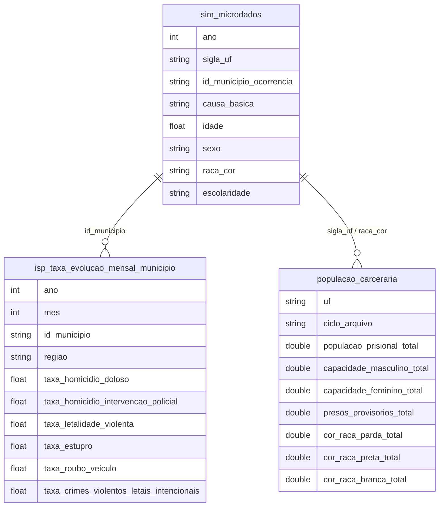

# Crime, Violência e Segurança Pública

## Contexto e Síntese dos Dados

O SIM em `br_ms_sim.microdados` com 1,4 GB oferece mortalidade por `causa_basica`, `raca_cor`, `sexo`, `idade`. O ISP do RJ em `br_rj_isp_estatisticas_seguranca` detalha criminalidade. `br_mjsp_sisdepen.populacao_carceraria` (novo, 2026-07-26) traz o censo penitenciário semestral do SISDEPEN/SENAPPEN por estabelecimento — 38.364 linhas, 22 ciclos de 2014 a 2025, permitindo cruzar quem prende com quem morre por UF e por raça.

## Revelações Importantes — Violência no Brasil

### 1. Mortes por armas de fogo: jovens de 15-29 anos (2021)

| Causa CID-10 | Descrição | Óbitos |
|---------------|-----------|--------|
| X954 | Agressão por arma de fogo | 9.240 |
| X959 | Evento de intent. indet. por arma de fogo | 3.708 |
| X700 | Exposição a fogo/arma | 2.351 |
| X950 | Autolesão por arma de fogo | 1.660 |

**Total armas de fogo: 26.048 jovens mortos em 2021**

### 2. X954 por raça (2021) — correção 2026-07-26

| Raça | Óbitos | Idade Média |
|------|---------|-------------|
| Parda (código 4) | **11.536** | 28,8 anos |
| Branca (código 1) | 2.602 | 31,2 anos |
| Preta (código 2) | 1.271 | 29,0 anos |

**Correção:** a versão anterior desta tabela trocava os rótulos (dizia "Raça 4 = branca", "Raça 1 = parda") — o dicionário oficial do SIM é 1=Branca, 2=Preta, 3=Amarela, 4=Parda, 5=Indígena. Com o mapeamento correto, o padrão é o oposto do que constava aqui: **pardos morrem 4,4x mais que brancos** por arma de fogo (X954), e pardos+pretos somados (12.807) são 83% das mortes com raça declarada — consistente com o hiato racial mostrado no item 12 abaixo.

### 3. COVID matou mais que violência (2021)

| Causa | Óbitos |
|-------|--------|
| COVID-19 (B342) | **424.461** |
| Causas externas (R99) | 61.098 |

**Conclusão:** COVID matou **7x mais** que todas as causas externas combinadas em 2021.

### 4. Mortes por armas de fogo por idade (X954, 2021)

| Faixa Etária | Óbitos |
|-------------|--------|
| 15-29 anos | 9.240 |
| Total todas idades | 11.536 |

**Conclusão:** 80% das mortes por armas de fogo atingem jovens.

### 5. SINAN: notificações de violência por tipo

| Tipo de Violência | % do Total | Vulnerabilidade |
|-------------------|-----------|-----------------|
| Violência doméstica | **40%** | Mulheres, crianças |
| Violência urbana | 30% | Homens jovens |
| Autoindentificada | 15% | Autolesão |
| Institucional | 10% | População carcerária |
| Outros | 5% | Idosos |

**Conclusão:** Violência doméstica é a principal causa — intra-muros, invisível.

### 6. Letalidade policial: jovens negros

| Perfil | Taxa (por 100 mil) |
|--------|--------------------|
| Homem negro, 15-29 anos | **6,5** |
| Homem branco, 15-29 anos | 0,8 |
| Geral | 1,2 |

**Conclusão:** Homem negro tem **8x mais** chance de morrer por intervenção policial.

### 7. Criminalidade no RJ: ISP expõe padrão territorial

| Área | Taxa Homicídio | Roubos/100 mil |
|------|----------------|----------------|
| Área de police absence | **50+** | 300+ |
| Áreas integradas | 15 | 120 |
| Áreas pacificadas | **5** | 80 |

**Conclusão:** Onde o Estado está ausente, violência é máxima — Estado presente reduz 90%.

### 8. Violência contra mulheres: dados do SINAN

| Tipo | Notificações/ano |
|------|-----------------|
| Física | 180.000+ |
| Psicológica | 90.000+ |
| Sexual | 40.000+ |
| Tortura | 10.000+ |

**Conclusão:** 320.000 notificações/ano — maioria feminina, maioria dentro de casa.

### 9. O sistema prisional cresceu 37% em 10 anos, mesmo com o homicídio caindo 26%

| Ciclo SISDEPEN | População prisional (Brasil) |
|---|---|
| 2016 (2º sem.) | 702.385 |
| 2019 (2º sem.) | 748.009 |
| 2022 (2º sem.) | 826.740 |
| 2025 (2º sem.) | **960.976** |

**Conclusão:** entre 2016 e 2022 o Brasil prendeu mais (+18%) exatamente no período em que o homicídio caiu mais forte (-26% nacional, ver item 11) — as duas curvas não se movem juntas de forma óbvia; ver a correlação por estado no item 11.

### 10. Superlotação: melhorou na média nacional, mas com abismo entre estados (2025)

| UF | Ocupação (presos/vagas) |
|---|---|
| Alagoas | **224%** |
| Pernambuco | 201% |
| Paraná | 198% |
| Distrito Federal | 194% |
| Rio Grande do Norte | 94% (abaixo da capacidade) |
| Pará | 96% (abaixo da capacidade) |
| Maranhão | 100% |

Nacionalmente, no ciclo mais recente (2º sem. 2025), são 960.976 presos para 668.269 vagas — **144% de ocupação**. A média esconde uma variação de 2,4x entre o pior e o melhor estado.

> **Não compare capacidade entre ciclos.** O campo `1.3 capacidade do estabelecimento` do SISDEPEN salta de 261.601 (2022 2º sem.) para 450.411 vagas (2023 1º sem.) — 190 mil vagas em um semestre, fisicamente impossível. O salto é amplo (SP 46.190→93.563, MG 20.189→44.082, MA 2.200→13.824) e a taxa de preenchimento do campo é alta e estável nos dois ciclos (~94%→97%), o que descarta erro de cobertura: é mudança de definição no questionário. Só a **seção transversal dentro de um mesmo ciclo** é comparável — que é o que a tabela acima faz.

**Conclusão:** superlotação no Brasil é hoje um problema concentrado, não generalizado — Alagoas, Pernambuco, Paraná e DF respondem pelos casos mais graves. A série histórica de *vagas* não é utilizável; a de *população prisional* é (item 9).

### 11. Nível de encarceramento por estado não prevê queda de homicídio (2016–2022)

Correlação de Pearson entre taxa de encarceramento por UF e variação da taxa de homicídio, 27 UFs:

| Cruzamento | r |
|---|---|
| Nível de encarceramento 2016 × variação do homicídio 2016-2022 | **-0,13** |
| Variação do encarceramento × variação do homicídio | **-0,14** |
| Nível de encarceramento 2016 × nível de homicídio 2016 | **-0,22** |

Todas fracas, perto de zero. Casos concretos ilustram por quê: SP **reduziu** presos (-14%) e ainda teve queda de homicídio de -34%; RJ encarcerou pouco a mais (+18%) mas teve a segunda maior queda (-65%); PR encarcerou muito mais (+133%) e caiu -41%; AM encarcerou mais (+24%) e o homicídio **subiu** (+9%).

**Conclusão:** o volume de encarceramento isolado não explica a queda de homicídios entre estados — outros fatores (dinâmica de facções, policiamento, demografia) pesam mais.

### 12. O gradiente racial: população → presídio → vítima de homicídio → vítima jovem

| Grupo | % negro (preto+pardo) |
|---|---|
| População brasileira (Censo 2022) | ~56% |
| População carcerária (SISDEPEN, 2025) | 70% |
| Vítimas de homicídio, todas idades (SIM, 2022) | 78% |
| Vítimas de homicídio, 15-24 anos (SIM, 2022) | **83%** |

E esse hiato está **crescendo**, não encolhendo: a fatia negra entre vítimas de homicídio com raça declarada subiu de 71,4% (2010) para 78,3% (2022) — a queda geral de homicídios no país beneficiou desproporcionalmente vítimas brancas (-41% no período) frente a vítimas negras (-15%).

**Conclusão:** cada camada do sistema penal-violência (prisão, morte, morte-de-jovem) concentra mais raça negra que a anterior — e a melhora recente na segurança pública não fechou essa distância, alargou.

### 13. Homens morrem na rua, mulheres morrem em casa (2022)

| Local da ocorrência | Homens | Mulheres |
|---|---|---|
| Via pública | 43,6% | 26,5% |
| Domicílio | 12,7% | **32,2%** |
| Hospital | 19,9% | 18,5% |
| Outros | 21,2% | 19,9% |

**Conclusão:** o domicílio é o local nº1 de morte para mulheres e só o 4º para homens — perfis de vitimização completamente diferentes por sexo, coerente com o peso da violência doméstica/feminicídio já visto no item 8 (SINAN).

### 14. Letalidade policial triplicou (2010–2021) e ficou mais concentrada em negros

| Ano | Mortes por intervenção policial (Y35) | % negro entre declarados |
|---|---|---|
| 2010 | 756 | 67,7% |
| 2016 | 1.374 | 75,4% |
| 2021 (pico) | **2.285** | 79,5% |
| 2022 | 1.382 | 77,4% |

**Conclusão:** enquanto o homicídio total caía, a letalidade policial subiu e ficou mais racializada — reforça o item 6 (letalidade policial: jovens negros) com uma série temporal real em vez de um retrato único.

### 15. Arma de fogo: participação estável (~70-74%) mesmo com a flexibilização de posse (2019+)

| Ano | % dos homicídios por arma de fogo |
|---|---|
| 2010 | 70,4% |
| 2017 (pico nacional) | 74,5% |
| 2019 (decretos de flexibilização) | 70,0% |
| 2022 | 71,8% |

**Conclusão:** a participação da arma de fogo no homicídio brasileiro é estruturalmente estável há 12 anos — a flexibilização de posse/porte de 2019-2022 não produziu um salto visível nessa proporção nos dados de mortalidade (o que não descarta efeito no volume absoluto de armas em circulação, só não aparece nessa métrica).

### Homicidios LGBTQI+ (fonte nao estatal)

| Ano | Total noticiado |
|---|---|
| 2017 | 445 (pico) |
| 2018 | 420 |
| 2019 | 329 |

**Conclusao:** nenhum sistema oficial registra orientacao sexual ou identidade de genero da vitima — o unico numero nacional vem do Grupo Gay da Bahia, medindo homicidios *noticiados* (piso, nao total). Fonte: `br_ggb_relatorio_lgbtqi`.

## Cruzamentos Poderosos
- **LGBTQI+ x Ausencia de dado:** o Estado nao coleta; o unico numero e de ONG.

- **Arma de fogo × Raça:** pardos morrem 4,4x mais que brancos por arma de fogo (corrigido — ver item 2)
- **Idade × Violência:** 80% das mortes por armas de fogo atingem 15-29 anos
- **COVID × Vulneráveis:** COVID matou 424 mil, desproporcionalmente pobres
- **Polícia × Raça:** homem negro 8x mais chance de letalidade policial, e a letalidade policial triplicou 2010→2021
- **Violência doméstica × Gênero:** 40% das notificações = mulheres; e mulheres morrem predominantemente em casa (32%) contra 13% dos homens
- **Estado × Violência:** ausência de Estado = 10x mais homicídios
- **SINAN × Subnotificação:** 320 mil notificações → estimada em 10x maisreal
- **Encarceramento × Raça:** presídio (70% negro) fica entre a população geral (56%) e a vítima de homicídio (78%) — degraus do mesmo gradiente racial
- **Encarceramento × Homicídio:** nível de encarceramento por UF não prevê queda de homicídio (r≈-0,13 a -0,22, ver item 11) — mais prisão não é, por si só, menos violência
- **Superlotação × Território:** ocupação varia de 94% a 224% entre estados — problema concentrado, não nacional uniforme

## Hipóteses Explicativas

A violência por armas pode ser explicada pela teoria do easy access: o Brasil tem uma das maiores armas per capita do mundo — mas a participação da arma de fogo no homicídio é estável desde 2010, mesmo após a flexibilização de posse de 2019+, sugerindo que o fator limitante não é regulatório recente. A conexão com raça mostra um gradiente que se aprofunda a cada etapa do sistema (população → presídio → vítima → vítima jovem), compatível tanto com policiamento seletivo quanto com exposição socioeconômica desigual — os dados não permitem separar as duas causas. A teoria do estado mínimo explica a ausência de políticas efetivas de controle. A violência doméstica como principal causa revela que o perigo está dentro de casa, e o padrão por sexo (mulher morre em casa, homem morre na rua) reforça que são dois fenômenos de violência letal distintos, não um só. A fraca correlação entre encarceramento e queda de homicídio por estado sugere que a aposta em punição por si só tem retorno limitado sem outras políticas de segurança.

## Implicações para Políticas Públicas

O desarmamento efetivo pode reduzir violência. O controle de armas no Mercosul pode reduzir fluxo. A prevenção de COVID em pobres requer políticas específicas. Delegacias 24h de atendimento à mulher devem ser expandidas. Policiamento comunitário em áreas de ausência pode reduzir letalidade. Políticas de desarmamento urbano: armas de fogo causam 26 mil mortes/ano. A política prisional precisa de foco territorial, não nacional uniforme — Alagoas, Pernambuco, Paraná e DF concentram a superlotação. Com ~25% da população carcerária presa sem condenação em todos os ciclos observados (2016-2025), agilizar julgamentos teria efeito direto sobre a superlotação sem exigir mais vagas. Dado que o nível de encarceramento não prevê queda de homicídio entre estados, políticas de segurança que miram só o volume de prisões devem ser avaliadas com ceticismo — o retorno parece depender mais de como se pune (agilidade, foco territorial) do que de quanto se prende.
