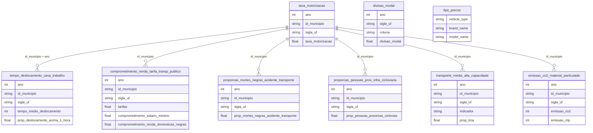

# Transportation and Urban Mobility

## Context and Data Synthesis

`br_mobilidados_indicadores` (10 tables, from the Mobilidados/ITDP Brasil project) provides municipal-level urban mobility indicators: `taxa_motorizacao`, `tempo_deslocamento_casa_trabalho`, `comprometimento_renda_tarifa_transp_publico`, `proporcao_mortes_negras_acidente_transporte`, `proporcao_pessoas_prox_infra_cicloviaria`, `transporte_media_alta_capacidade`, `divisao_modal`, `emissao_co2_material_particulado`, `proporcao_pessoas_proximas_pnt` and `proporcao_domicilios_infra_urbana` — all keyed by `id_municipio`, `sigla_uf`, `ano`. `br_fipe_veiculos.precos` provides the brand/model catalog behind Brazil's FIPE vehicle price table.

This theme had no dedicated overview in the original 34-theme catalog — regulated ground transport data (ANTT, the land-transport regulator) remains blocked by a WAF (see `tasks/datasets_to_scrap.md`), so coverage here is urban mobility + vehicle catalog. Civil aviation (`br_anac_dadosabertos`) is its own domain and is not part of this theme.

## Questions and Answers — Transportation and Mobility

### 1. Which state has the highest motorization rate?

Motorization index by state, most recent available year (2018):

| State | Motorization index (2018) |
|-------|------------------------------|
| MG | 797.2 |
| PR | 754.3 |
| GO | 711.0 |
| SC | 685.0 |
| SP | 653.0 |
| MT | 632.7 |
| MS | 617.0 |
| DF | 583.4 |
| TO | 579.5 |
| RS | 561.0 |

**Answer:** Minas Gerais leads the motorization index among states with 2018 data, ahead of Paraná and Goiás — none of the three is the country's richest or most urbanized state, suggesting high motorization isn't exclusive to metro areas.

### 2. Which municipalities have the worst commute times?

Source: 2010 Census (the only year available in this table).

| Municipality | State | Avg. commute (min) | % over 1h |
|--------------|-------|----------------------|-----------|
| Japeri | RJ | 67 | 53% |
| Francisco Morato | SP | 66 | 54% |
| Queimados | RJ | 60 | 46% |
| Ferraz de Vasconcelos | SP | 60 | 47% |

**Answer:** the worst commute times aren't in the capitals (São Paulo, Rio de Janeiro) — they're in dormitory towns on the metro periphery: Japeri and Queimados in the Baixada Fluminense, Francisco Morato and Ferraz de Vasconcelos in Greater São Paulo. Over half the residents of these municipalities spend more than 1 hour just getting to work.

### 3. Is there racial inequality in transport-accident deaths?

National average share of Black victims in transport accidents, by year:

| Year | % Black victims |
|------|-------------------|
| 2000 | 9.8% |
| 2005 | 13.9% |
| 2010 | 18.8% |
| 2015 | 21.1% |
| 2019 | 21.2% |

**Answer:** yes — the share of Black victims in transport accidents more than doubled between 2000 and 2019 (9.8% → 21.2%), with most of the growth concentrated between 2000 and 2012. The indicator doesn't measure relative risk (it isn't normalized by local Black population), but the two-decade trend is unambiguous.

### 4. How much of the minimum wage goes to public transit fares?

Average income share spent on transit fares (2017, % of minimum wage):

| State | % of minimum wage |
|-------|----------------------|
| AM | 21.6% |
| SC | 20.3% |
| ES | 20.0% |
| RS / TO | 19.2% |
| PA | 18.7% |

**Answer:** in states like Amazonas and Santa Catarina, public transit fares eat up more than 1/5 of the minimum wage for regular commuting — the column that would break this down for Black households (`comprometimento_renda_domesticas_negras`) exists in the schema but is empty in 81 of 351 rows and null in every state queried, so that specific racial breakdown can't be answered with current data.

### 5. Which state has the most bike-lane infrastructure near its population?

Structured-transit stations within bike-lane coverage area, % (2021):

| State | % |
|-------|---|
| CE | 48.7% |
| PA / ES | 32.1% |
| DF | 27.9% |
| PE | 27.3% |
| SP | 19.9% |

**Answer:** Ceará leads with nearly half of its structured-transit stations inside bike-lane coverage — ahead of São Paulo (19.9%), which has the largest bike-lane network in absolute terms but lower proportional coverage.

### 6. Where is medium/high-capacity transit (metro, BRT, light rail) concentrated?

Medium/high-capacity transit (TMA) station index by state:

| State | Index |
|-------|-------|
| RJ | 107.5 |
| SP | 92.9 |
| PR | 59.8 |
| MG | 26.4 |
| DF | 18.9 |

**Answer:** Rio de Janeiro and São Paulo hold the country's largest structured-transit infrastructure — together, more than double Paraná, Minas Gerais and the Federal District combined. Expected (RJ/SP have the country's largest metro systems), but it underscores that quality TMA remains confined to two metro regions.

### 7. Is fleet pollution declining?

Summed annual emissions (municipalities with available data):

| Year | CO₂ (thousand tons) | Particulate matter (thousand tons) |
|------|------------------------|---------------------------------------|
| 2007 | 20 | 5.0 |
| 2012 | 30 | 4.3 |
| 2018 | 20 | 2.5 |

**Answer:** particulate matter emissions were cut in half between 2007 and 2018 (5.0k → 2.5k tons), consistent with fleet renewal and tighter emission standards (Proconve). CO₂ shows no comparable decline — it oscillates with no clear trend, expected since the (and per-capita motorized) fleet only grew over the period.

### 8. How many vehicles does the FIPE table catalog cover?

| Type | Brands | Models |
|------|--------|--------|
| Cars | 107 | 7,322 |
| Motorcycles | 102 | 1,993 |
| Trucks | 29 | 1,974 |

**Answer:** the catalog covers 11,289 brand+model combinations — cars have by far the widest variety (7,322 models), reflecting decades of releases in the Brazilian market. Per-model-year prices aren't part of this catalog (see the scope note in `tasks/datasets_to_scrap.md`).

## Powerful Cross-Cuts

- **Motorization × TMA:** high-motorization states (MG, PR, GO) aren't the same states with the most structured transit (RJ, SP) — high motorization may reflect a lack of alternatives, not choice.
- **Commute time × Metro periphery:** the worst commute times hit dormitory towns, not capitals — a regional planning problem, not just a municipal one.
- **Race × Traffic deaths:** the share of Black victims doubled in 20 years, a trend worth cross-referencing against `br_ipea_atlasviolencia` and neighborhood-level road infrastructure data.
- **Fare × Income:** Northern/Southern states carry the highest fare-to-income burden — a very different geography from the one that concentrates TMA.

## Explanatory Hypotheses

The lack of quality structured transit across most of the country pushes individual motorization as the fallback — hence states without a meaningful metro/BRT leading the motorization index. Dormitory towns concentrate the worst commute times because a history of urban occupation (low-income housing on the periphery, jobs concentrated downtown) was never matched by equivalent medium/high-capacity transit. The rising share of Black victims in transport accidents is consistent with already-documented patterns of road segregation: peripheral neighborhoods with larger Black populations tend to have weaker road-safety infrastructure (fewer crosswalks, traffic lights, lighting).

## Public Policy Implications

Expanding TMA beyond the Rio–São Paulo axis could reduce reliance on individual motorization. Income-differentiated fare policy could ease the fare burden observed in the North/South. Road-safety investment targeted at high-Black-population peripheries could reverse the two-decade trend in accident deaths. Filling the regulated ground-transport data gap (ANTT still blocked) would allow monitoring of highways and intercity transport — currently a blind spot in this theme.
