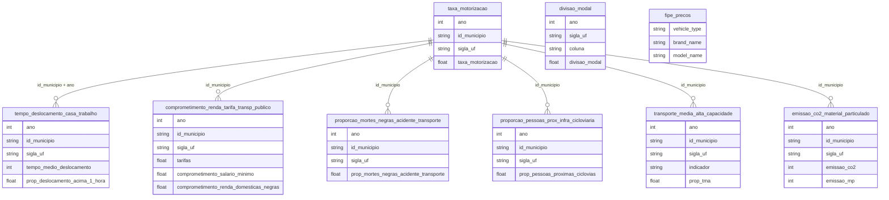

# Transporte e Mobilidade Urbana

## Contexto e Síntese dos Dados

`br_mobilidados_indicadores` (10 tabelas, projeto Mobilidados/ITDP Brasil) traz indicadores municipais de mobilidade urbana: `taxa_motorizacao`, `tempo_deslocamento_casa_trabalho`, `comprometimento_renda_tarifa_transp_publico`, `proporcao_mortes_negras_acidente_transporte`, `proporcao_pessoas_prox_infra_cicloviaria`, `transporte_media_alta_capacidade`, `divisao_modal`, `emissao_co2_material_particulado`, `proporcao_pessoas_proximas_pnt` e `proporcao_domicilios_infra_urbana` — todos com `id_municipio`, `sigla_uf`, `ano`. `br_fipe_veiculos.precos` traz o catálogo de marcas e modelos usados na tabela FIPE.

Este tema não tinha overview próprio no catálogo original de 34 temas — os dados de transporte terrestre regulado (ANTT) seguem bloqueados por WAF (ver `tasks/datasets_to_scrap.md`), então a cobertura aqui é mobilidade urbana municipal + catálogo veicular. Aviação civil (`br_anac_dadosabertos`) é um domínio próprio e não entra neste tema.

## Perguntas e Respostas — Transporte e Mobilidade

### 1. Qual UF tem a maior taxa de motorização?

Índice de motorização por UF, ano mais recente disponível (2018):

| UF | Índice de motorização (2018) |
|----|-------------------------------|
| MG | 797,2 |
| PR | 754,3 |
| GO | 711,0 |
| SC | 685,0 |
| SP | 653,0 |
| MT | 632,7 |
| MS | 617,0 |
| DF | 583,4 |
| TO | 579,5 |
| RS | 561,0 |

**Resposta:** Minas Gerais lidera o índice de motorização entre as UFs com dado disponível em 2018, à frente de Paraná e Goiás — nenhuma das três é a UF mais rica ou mais urbanizada do país, sugerindo que motorização alta não é exclusividade de metrópoles.

### 2. Quais municípios têm o pior tempo de deslocamento casa-trabalho?

Fonte: Censo 2010 (único ano disponível na tabela).

| Município | UF | Tempo médio (min) | % acima de 1h |
|-----------|----|--------------------|----------------|
| Japeri | RJ | 67 | 53% |
| Francisco Morato | SP | 66 | 54% |
| Queimados | RJ | 60 | 46% |
| Ferraz de Vasconcelos | SP | 60 | 47% |

**Resposta:** os piores tempos de deslocamento não estão nas capitais (São Paulo, Rio de Janeiro), e sim em municípios-dormitório da periferia metropolitana — Japeri e Queimados na Baixada Fluminense, Francisco Morato e Ferraz de Vasconcelos na Grande São Paulo. Mais da metade dos moradores desses municípios gastam mais de 1 hora só na ida ao trabalho.

### 3. Existe desigualdade racial nas mortes por acidente de transporte?

Proporção média (nacional) de vítimas negras em acidentes de transporte, por ano:

| Ano | % vítimas negras |
|-----|-------------------|
| 2000 | 9,8% |
| 2005 | 13,9% |
| 2010 | 18,8% |
| 2015 | 21,1% |
| 2019 | 21,2% |

**Resposta:** sim — a proporção de vítimas negras em acidentes de transporte mais que dobrou entre 2000 e 2019 (9,8% → 21,2%), com maior parte do crescimento concentrada entre 2000 e 2012. O indicador não mede risco relativo (não é normalizado pela população negra local), mas a tendência de duas décadas é inequívoca.

### 4. Quanto do salário mínimo é consumido pela tarifa de transporte público?

Comprometimento médio de renda com tarifa (2017, % do salário mínimo):

| UF | % do salário mínimo |
|----|----------------------|
| AM | 21,6% |
| SC | 20,3% |
| ES | 20,0% |
| RS / TO | 19,2% |
| PA | 18,7% |

**Resposta:** em UFs como Amazonas e Santa Catarina, a tarifa de transporte público consome mais de 1/5 do salário mínimo em deslocamentos regulares — a coluna que discriminaria esse gasto por famílias negras (`comprometimento_renda_domesticas_negras`) existe no schema mas está vazia em 81 das 351 linhas e nula nas UFs consultadas, então essa quebra racial específica não pode ser respondida com os dados atuais.

### 5. Qual UF tem mais infraestrutura cicloviária perto da população?

Estações de transporte de média/alta capacidade na área de cobertura cicloviária, % (2021):

| UF | % |
|----|---|
| CE | 48,7% |
| PA / ES | 32,1% |
| DF | 27,9% |
| PE | 27,3% |
| SP | 19,9% |

**Resposta:** Ceará lidera com quase metade das estações de transporte estruturado dentro da área de cobertura de ciclovias — à frente de São Paulo (19,9%), que tem a maior malha cicloviária em termos absolutos mas cobertura proporcional menor.

### 6. Onde está concentrado o transporte de média/alta capacidade (metrô, BRT, VLT)?

Índice de estações de TMA por UF (soma de indicadores disponíveis):

| UF | Índice |
|----|--------|
| RJ | 107,5 |
| SP | 92,9 |
| PR | 59,8 |
| MG | 26,4 |
| DF | 18,9 |

**Resposta:** Rio de Janeiro e São Paulo concentram a maior infraestrutura de transporte estruturado do país — juntos, mais que o dobro de Paraná, Minas Gerais e DF somados. Isso é esperado (metrôs de RJ/SP são os maiores do país), mas reforça que TMA de qualidade continua restrito a duas regiões metropolitanas.

### 7. A emissão de poluentes da frota está caindo?

Emissões anuais somadas (municípios com dado disponível):

| Ano | CO₂ (mil ton) | Material particulado (mil ton) |
|-----|---------------|----------------------------------|
| 2007 | 20 | 5,0 |
| 2012 | 30 | 4,3 |
| 2018 | 20 | 2,5 |

**Resposta:** material particulado caiu pela metade entre 2007 e 2018 (5,0 mil → 2,5 mil toneladas), consistente com a renovação da frota e normas de emissão mais rígidas (Proconve). CO₂ não mostra a mesma queda — oscila sem tendência clara, o que é esperado já que a frota (e a frota motorizada per capita) só cresceu no período.

### 8. Quantos veículos a tabela FIPE cobre no catálogo?

| Tipo | Marcas | Modelos |
|------|--------|---------|
| Carros | 107 | 7.322 |
| Motos | 102 | 1.993 |
| Caminhões | 29 | 1.974 |

**Resposta:** o catálogo cobre 11.289 combinações marca+modelo — carros têm de longe a maior variedade (7.322 modelos), refletindo décadas de lançamentos no mercado brasileiro. Preços por ano/modelo não fazem parte deste catálogo (ver nota de escopo em `tasks/datasets_to_scrap.md`).

## Cruzamentos Poderosos

- **Motorização × TMA:** UFs com alta motorização (MG, PR, GO) não são as mesmas com mais transporte estruturado (RJ, SP) — motorização alta pode refletir ausência de alternativa, não escolha.
- **Tempo de deslocamento × Periferia metropolitana:** os piores tempos batem em municípios-dormitório, não nas capitais — problema de planejamento regional, não só municipal.
- **Raça × Mortes no trânsito:** proporção de vítimas negras dobrou em 20 anos, tendência que merece cruzamento com `br_ipea_atlasviolencia` e dados de infraestrutura viária por bairro.
- **Tarifa × Renda:** UFs do Norte/Sul concentram o maior comprometimento de renda com tarifa — geografia bem diferente da que concentra TMA.

## Hipóteses Explicativas

A ausência de transporte estruturado de qualidade em boa parte do país empurra motorização individual como alternativa — daí UFs sem metrô/BRT relevante liderarem o índice de motorização. Municípios-dormitório concentram os piores tempos de deslocamento porque história de ocupação urbana (habitação popular na periferia, empregos concentrados no centro) não foi acompanhada por transporte de média/alta capacidade equivalente. A tendência de alta na proporção de vítimas negras em acidentes de transporte é compatível com padrões já documentados de segregação viária: bairros periféricos, com maior população negra, tendem a ter infraestrutura de segurança viária mais precária (menos faixas, semáforos, iluminação).

## Implicações para Políticas Públicas

Expansão de TMA fora do eixo Rio-São Paulo pode reduzir dependência de motorização individual. Política tarifária diferenciada por renda pode aliviar o comprometimento de renda observado no Norte/Sul. Investimento em segurança viária focado em periferias de alta concentração negra pode reverter a tendência de duas décadas nas mortes por acidente. Preencher a lacuna de dados de transporte terrestre regulado (ANTT ainda bloqueado) permitiria monitorar rodovias e transporte intermunicipal, hoje um ponto cego neste tema.
