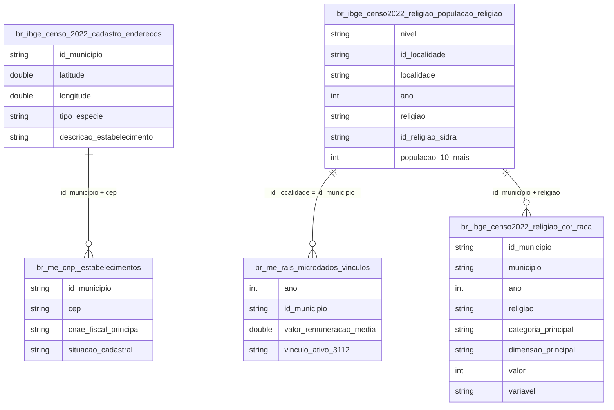

# Religiosidade, Infraestrutura de Fé e Desigualdade de Renda

## Contexto e Síntese dos Dados

Duas famílias de fonte, cruzadas: **autodeclaração** (`br_ibge_censo2022_religiao.populacao_religiao`, religião declarada por localidade em `populacao_10_mais`, com `br_ibge_censo2022_religiao.cor_raca` cruzando religião × raça por município) e **presença física** (`br_ibge_censo_2022.cadastro_enderecos`, o CNEFE, com 765.591 templos geolocalizados a partir de `tipo_especie` e `descricao_estabelecimento`). A presença física é cruzada com `br_me_cnpj.estabelecimentos` (CNAE 9491-0/00, formalização jurídica) e com `br_me_rais.microdados_vinculos` (`valor_remuneracao_media`, salário formal médio por município). A série 2010 vem da tabela Sidra 137, coletada via API — o espelho parquet cobre 2022.

## Revelações Importantes

### 1. Transição religiosa 2010→2022

| Religião | 2010 | 2022 | Variação |
|---|---|---|---|
| Católica | 64,6% | 56,8% | -7,9 p.p. |
| Evangélica | 22,2% | 26,9% | +4,7 p.p. |
| Espírita | 2,0% | 1,8% | -0,2 p.p. |
| Umbanda/Candomblé | 0,3% | 1,1% | +0,7 p.p. |
| Sem religião | 8,0% | 9,3% | +1,2 p.p. |

**Conclusão:** municípios de maioria evangélica saltaram de 73 para 245 (3,4x) entre os dois Censos.

### 2. Infraestrutura física dos templos (CNEFE)

| Vertente | Templos | % |
|---|---|---|
| Evangélica de origem pentecostal | 245.669 | 32,1% |
| Não classificado | 282.505 | 36,9% |
| Católica Apostólica Romana | 99.680 | 13,0% |
| Evangélica de Missão | 60.405 | 7,9% |

**Conclusão:** 195.163 templos (25%) só entram na contagem por casamento de texto no nome anotado em campo — o Censo os classifica oficialmente como "outras finalidades".

### 3. Formalização jurídica (CNPJ)

| Situação | Templos | % |
|---|---|---|
| Com CNPJ ativo | 154.792 | 20,2% |
| Sem CNPJ confirmado | 610.799 | 79,8% |

**Conclusão:** informalidade jurídica é o padrão, não a exceção, na infraestrutura religiosa brasileira.

### 4. Religião × salário formal (RAIS)

| Religião | Quartil menor % | Quartil maior % |
|---|---|---|
| Católica | R$ 4.043 | R$ 2.556 |
| Espírita | R$ 2.559 | R$ 4.091 |
| Evangélica | R$ 3.000 | R$ 3.355 |

**Conclusão:** o gradiente espírita (+60%) é o cruzamento de renda mais forte do tema.

### 5. Densidade institucional: fiéis por templo

| Religião | Fiéis | Templos | Fiéis/templo |
|---|---|---|---|
| Católica | 100.216.153 | 99.680 | 1.005 |
| Umbanda/Candomblé | 1.849.824 | 9.868 | 187 |
| Espírita | 3.257.455 | 21.521 | 151 |
| Evangélicas | 47.418.024 | 343.393 | 138 |

**Conclusão:** católicos são 56,7% dos fiéis e 13,0% dos templos; evangélicos são 26,9% dos fiéis e 44,9% dos templos — 7,3x de diferença em densidade institucional.

### 6. Religião × cor ou raça (individual, Censo 2022)

| Cor/raça | Católica | Evangélicas | Sem religião | Espírita | Umbanda/Candomblé |
|---|---|---|---|---|---|
| Branca | 60,15% | 23,55% | 8,40% | 2,72% | 1,04% |
| Preta | 49,04% | 30,01% | 12,26% | 1,54% | 2,26% |
| Parda | 55,56% | 29,35% | 9,32% | 1,08% | 0,77% |
| Amarela | 51,76% | 14,26% | 16,16% | 3,17% | 0,80% |
| Indígena | 42,73% | 32,23% | 10,95% | — | 0,64% |

**Conclusão:** por UF o RS lidera em umbanda (3,19%) apesar de 21,2% de população negra, mas por pessoa pretos declaram 2,9x mais que pardos — falácia ecológica. Só 7,65% dos indígenas declaram tradições indígenas contra 75% de religiões cristãs.

## Cruzamentos Poderosos

- **Religião × Renda:** municípios menos católicos pagam 58% mais em salário formal.
- **Espiritismo × Renda:** gradiente mais forte do tema — 60% entre extremos.
- **Fiéis × Templos:** uma igreja católica por 1.005 fiéis contra um templo evangélico por 138 — 7,3x.
- **Umbanda × Raça × Escala:** por UF o RS lidera; por pessoa pretos declaram 2,9x mais que pardos (falácia ecológica).
- **Indígena × Cristianismo:** 75% dos indígenas declaram religião cristã, só 7,65% tradições indígenas.
- **Raça × Secularização:** pretos lideram "sem religião" (12,26%) entre os grandes grupos.
- **Templo × CNPJ:** 80% dos templos operam sem registro empresarial formal.
- **Templo × Censo:** 1 em 4 templos só é identificado pelo nome, não pelo campo oficial.

## Hipóteses Explicativas

O gradiente de renda por composição religiosa reflete sobretudo urbanização e secularização andando juntas, não um efeito causal direto da fé sobre a renda — municípios grandes e ricos tendem a ter menor proporção católica e maior presença espírita, historicamente associada a público urbano escolarizado desde a chegada do kardecismo ao Brasil no século XIX. O crescimento evangélico segue menos lógica racial e mais lógica de arquitetura institucional: um templo por 138 fiéis contra um por 1.005 do catolicismo significa barreira de entrada baixa, que preenche vazios territoriais numa velocidade que a estrutura paroquial não acompanha. A baixa formalização jurídica dos templos reflete um padrão associativo brasileiro mais amplo, não uma peculiaridade religiosa.

## Implicações para Políticas Públicas

Políticas de assistência ou parceria pública que exigem CNPJ como porta de entrada excluem 80% da infraestrutura religiosa real do país. A concentração territorial de vertentes específicas exige desenho regionalizado de políticas de liberdade religiosa e combate à intolerância. O forte gradiente de renda por composição religiosa é um lembrete de que a distribuição religiosa carrega sinal socioeconômico substancial — não é uma variável neutra em pesquisas sobre desigualdade.
