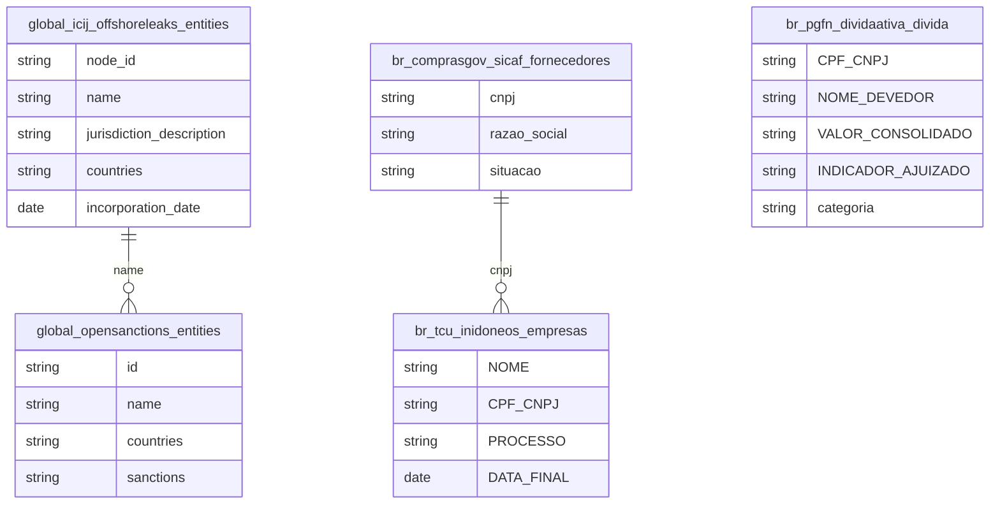

# Sanções, Offshore e Arquitetura da Impunidade Empresarial

## Contexto e Síntese dos Dados

Quatro registros de má conduta empresarial que raramente sao lidos juntos: `global_icij_offshoreleaks` (814.344 entidades vazadas, 1.532 com vinculo brasileiro), `global_opensanctions`/`eu_sanctions`/`un_sanctions`/`global_ofac_sanctions` (listas internacionais de sancao), `br_tcu_inidoneos` (banidos de contratar com o poder publico) e `br_pgfn_dividaativa` (46,6 milhoes de inscricoes de divida ativa da Uniao, 3 categorias: FGTS, previdenciario e nao-previdenciario).

## Revelacoes Importantes

### 1. Offshore brasileira por jurisdicao

| Jurisdicao | Entidades |
|---|---|
| Panama | 589 |
| Ilhas Virgens Britanicas | 492 |
| Nevada (EUA) | 132 |
| Niue | 91 |
| Seicheles | 79 |

**Conclusao:** 70% das estruturas brasileiras em Panama e BVI; Nevada supera Seicheles e Bahamas.

### 2. Funil de responsabilizacao

| Registro | Quantidade |
|---|---|
| Fornecedores habilitados (SICAF) | 957.885 |
| Empresas inidoneas (TCU) | 93 |
| Taxa de exclusao | 0,01% |

**Conclusao:** uma exclusao para cada 10.300 fornecedores — o gargalo esta na sancao, nao na informacao.

### 3. Divida Ativa da Uniao (46,6 milhoes de inscricoes)

| Categoria | Inscricoes | Exemplo de devedor |
|---|---|---|
| FGTS | 532.707 | Empresas com FGTS nao recolhido |
| Previdenciario | 3.742.859 | Contribuicoes devidas ao INSS |
| Nao-previdenciario | 42.331.519 | Tributos federais (IRPJ, COFINS, CPMF, etc) |

Maiores devedores pessoa juridica: Vale S.A. (R$ 44 bi), Banco Santander Brasil (R$ 11,7 bi), Petrobras (R$ 29 bi em multiplas inscricoes), Carital Brasil/Zirconia Participacoes (R$ 10 bi cada, falidas).

**Conclusao:** a divida nao-previdenciario domina (91% das inscricoes). Tres empresas concentram dezenas de bilhoes. A PGFN cobre so a esfera federal — divida ativa estadual e municipal nao esta incluida.

## Cruzamentos Poderosos

- **Offshore x Jurisdicao:** 70% em Panama e Ilhas Virgens Britanicas.
- **SICAF x TCU:** 957.885 fornecedores contra 93 banidos.
- **FGTS x Concentracao:** 1% dos devedores responde por 45,8% do valor.
- **Divida x Judicializacao:** 35,9% do FGTS nunca virou acao judicial.
- **PGFN x SICAF:** cruzar 46,6M inscricoes de divida ativa com fornecedores habilitados revela empresas que devem a Uniao enquanto contratam com ela.
- **Nevada x Caribe:** um estado dos EUA recebe mais offshore brasileira que Seicheles.

## Hipoteses Explicativas

Detectar irregularidade e barato e automatizavel; puni-la exige devido processo, com custo humano e prazo proprios. O resultado e um funil onde a deteccao cresce com a tecnologia e a punicao permanece limitada pelo numero de servidores.

## Implicacoes para Politicas Publicas

Priorizar cobranca pelos maiores devedores recuperaria metade do valor com fracao do esforco. Integrar o cadastro de inidoneos ao SICAF na habilitacao fecharia a janela em que empresa punida segue cadastrada.
