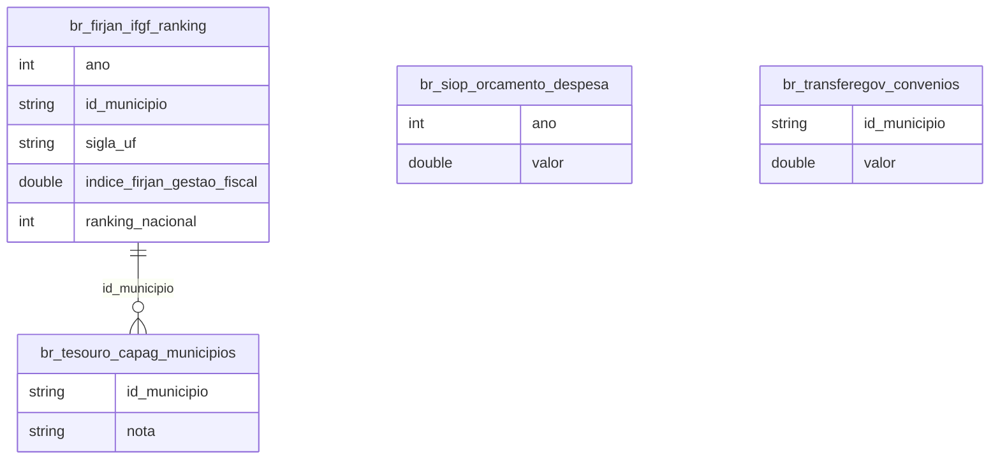

# Federalismo Fiscal e Capacidade Financeira dos Municípios

## Contexto e Sintese dos Dados

`br_firjan_ifgf.ranking` mede gestao fiscal nos 5.568 municipios com `indice_firjan_gestao_fiscal` e ranking nacional/estadual. `br_tesouro_capag` classifica capacidade de pagamento; `br_siop_orcamento` e `br_transferegov` detalham orcamento e convenios; IPTU municipal em BH, Fortaleza e Sao Paulo completa a base de arrecadacao propria.

## Revelacoes Importantes

### 1. Evolucao nacional

| Ano | Indice medio |
|---|---|
| 2020 | 0,546 |
| 2021 | 0,588 |
| 2022 | 0,625 |

**Conclusao:** melhora durante a pandemia, puxada por transferencia extraordinaria.

### 2. Extremos estaduais

| UF | Indice |
|---|---|
| Santa Catarina | 0,853 |
| Mato Grosso | 0,810 |
| Maranhao | 0,379 |
| Sergipe | 0,359 |

**Conclusao:** 2,4x de diferenca; os oito ultimos sao todos do Norte e Nordeste.

### 3. Escala municipal

| UF | Municipios | Indice |
|---|---|---|
| Minas Gerais | 853 | 0,700 |
| Bahia | 417 | 0,451 |
| Roraima | 15 | 0,544 |

**Conclusao:** 5.570 municipios replicam estrutura administrativa minima.

## Cruzamentos Poderosos

- **SC x SE:** 2,4 vezes de diferenca.
- **Ranking x Regiao:** os oito ultimos sao do Norte e Nordeste.
- **Gestao fiscal x Pandemia:** indice subiu de 0,546 para 0,625.
- **Escala x Custo fixo:** 5.570 estruturas administrativas minimas.
- **Transferencia x Autonomia:** a melhora acompanha o repasse federal.

## Hipoteses Explicativas

O indice mede menos competencia administrativa e mais base economica disponivel: onde ha atividade, ha ISS, IPTU e cota-parte de ICMS.

## Implicacoes para Politicas Publicas

Consorcios intermunicipais reduziriam custo fixo replicado sem mudanca constitucional. Condicionar transferencias voluntarias a indicadores de gestao criaria incentivo a eficiencia.
