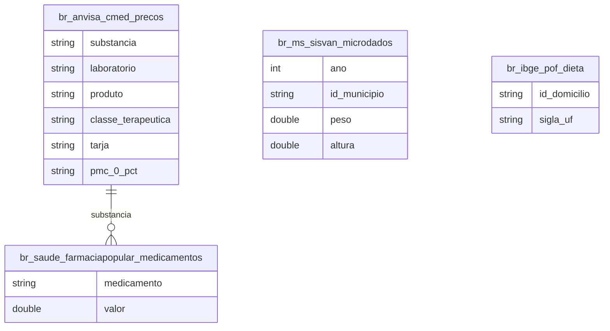

# Nutrição, Preço de Medicamentos e Acesso à Saúde

## Contexto e Sintese dos Dados

`br_anvisa_cmed.precos` fixa o teto de preco de 51.140 apresentacoes com `tarja`, `substancia`, `classe_terapeutica` e preco maximo por faixa de ICMS. Somado a `br_ms_sisvan` (vigilancia nutricional), `br_saude_farmaciapopular`, `br_saude_bps` e `br_ibge_pof` (orcamento e dieta domiciliar).

## Revelacoes Importantes

### 1. Preco por tarja

| Tarja | Registros | Preco mediano |
|---|---|---|
| Sem tarja | 3.644 | R$ 36,35 |
| Tarja preta | 1.426 | R$ 81,88 |
| Tarja vermelha | 26.296 | R$ 103,76 |
| Vermelha sob restricao | 10.450 | R$ 143,24 |

**Conclusao:** exigir receita quase triplica o preco mediano.

### 2. Composicao do mercado

| Tarja | % do total |
|---|---|
| Tarja vermelha | 51,4% |
| Vermelha sob restricao | 20,4% |
| Sem tarja | 7,1% |

**Conclusao:** 71,8% das apresentacoes exigem prescricao.

### 3. Controle x preco

**Conclusao:** a tarja preta (controle maximo) custa menos que a vermelha comum — o preco segue a patente, nao o risco sanitario.

## Cruzamentos Poderosos

- **Receita x Preco:** prescricao quase triplica o preco mediano.
- **Restricao x Preco:** vermelha restrita custa 3,9x o de venda livre.
- **Tarja preta x Patente:** controle maximo mais barato que prescricao comum.
- **Mercado x Prescricao:** 71,8% exigem receita.
- **Acesso x Consulta:** a primeira barreira e a receita, nao o preco.

## Hipoteses Explicativas

O gradiente mede estrutura de concorrencia: venda livre compete em gondola com demanda elastica; prescricao compete pela caneta do medico, com demanda inelastica.

## Implicacoes para Politicas Publicas

Ampliar a lista de isentos de prescricao para moleculas antigas reduziria a barreira dupla de consulta mais preco.
