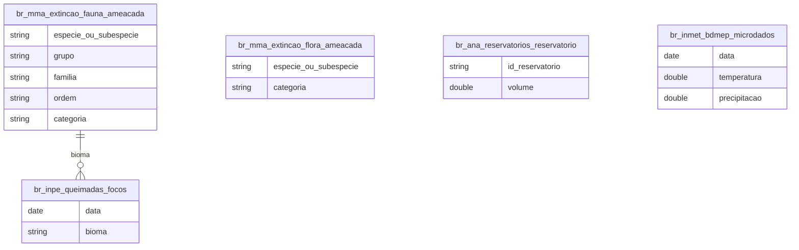

# Água, Clima e Biodiversidade Ameaçada

## Contexto e Sintese dos Dados

`br_mma_extincao` reune a lista oficial de especies ameacadas com `grupo`, `familia` e `categoria` de risco (VU, EN, CR, EX). Somado a `br_ana_reservatorios` e `br_ana_telemetria` (agua), `br_inmet_bdmep` (meteorologia), `br_inpe_queimadas` e `br_inpe_sisam` (fogo e qualidade do ar), `world_wwf_hydrosheds` (bacias) e `br_mapbiomas_estatisticas` (uso do solo).

## Revelacoes Importantes

### 1. Flora x fauna

| Reino | Especies | % |
|---|---|---|
| Flora | 6.418 | 83,6% |
| Fauna | 1.258 | 16,4% |

**Conclusao:** cinco plantas ameacadas para cada animal.

### 2. Fauna por grupo

| Grupo | Especies |
|---|---|
| Peixes | 388 |
| Invertebrados terrestres | 275 |
| Aves | 263 |
| Mamiferos | 103 |

**Conclusao:** peixes e invertebrados sao 60% da fauna ameacada.

### 3. Categoria de risco

| Categoria | Especies |
|---|---|
| Vulneravel | 465 |
| Em perigo | 425 |
| Em perigo critico | 322 |
| Extinta / possivelmente extinta | 46 |

**Conclusao:** 46 especies ja perdidas ou possivelmente perdidas.

## Cruzamentos Poderosos

- **Flora x Fauna:** 84% das ameacadas sao plantas.
- **Peixe x Mamifero:** 388 contra 103 especies.
- **Visibilidade x Risco:** os grupos mais ameacados tem menor cobertura.
- **Critico x Extinto:** 322 em perigo critico, 46 perdidas.
- **Taxonomia x Subestimacao:** nao se declara ameacada a especie nao descrita.

## Hipoteses Explicativas

Plantas nao migram diante da supressao de habitat: qualquer conversao de area elimina populacoes inteiras. Peixes sofrem com barramento, assoreamento e poluicao de bacias.

## Implicacoes para Politicas Publicas

Priorizar areas por endemismo botanico protege melhor o grosso da biodiversidade em risco que unidades centradas em fauna carismatica.
