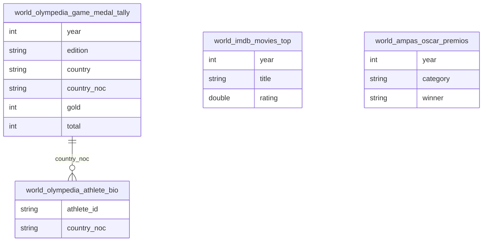

# Cultura, Esporte e Desempenho Internacional

## Contexto e Sintese dos Dados

`world_olympedia_olympics` traz o historico completo de medalhas desde 1896 com `gold`, `total` e `country_noc`, alem de biografia de atleta e resultado por prova. Somado a `world_sofascore_competicoes_futebol`, `mundo_transfermarkt_competicoes`, `world_imdb_movies` e `world_ampas_oscar`.

## Revelacoes Importantes

### 1. Quadro historico

| Pais | Ouros | Total |
|---|---|---|
| Estados Unidos | 1.195 | 3.009 |
| Uniao Sovietica | 473 | 1.204 |
| Alemanha | 355 | 1.098 |
| Brasil | 37 | 150 |

**Conclusao:** os EUA tem vinte vezes o acervo brasileiro.

### 2. Taxa de conversao em ouro

| Pais | % de ouro |
|---|---|
| Estados Unidos | 39,7% |
| Uniao Sovietica | 39,3% |
| Brasil | 24,7% |

**Conclusao:** o Brasil chega ao podio mas raramente ao topo.

### 3. Escala x resultado

**Conclusao:** Franca e Italia tem um terco da populacao brasileira e seis vezes mais medalhas.

## Cruzamentos Poderosos

- **Brasil x EUA:** 3.009 contra 150 medalhas.
- **Conversao x Ouro:** 24,7% contra 39,7%.
- **Populacao x Podio:** um terco da populacao, seis vezes mais medalhas.
- **Talento x Estrutura:** o podio depende do atleta; o ouro, do sistema.
- **PIB x Resultado:** estar entre as dez maiores economias nao produz podio.

## Hipoteses Explicativas

Acervo pequeno com baixa conversao sugere sistema que funciona por excecao individual, nao por processo institucional de deteccao e formacao continuada.

## Implicacoes para Politicas Publicas

Financiamento plurianual imune ao ciclo eleitoral e olimpico teria mais efeito que investimento concentrado as vesperas de competicao.
