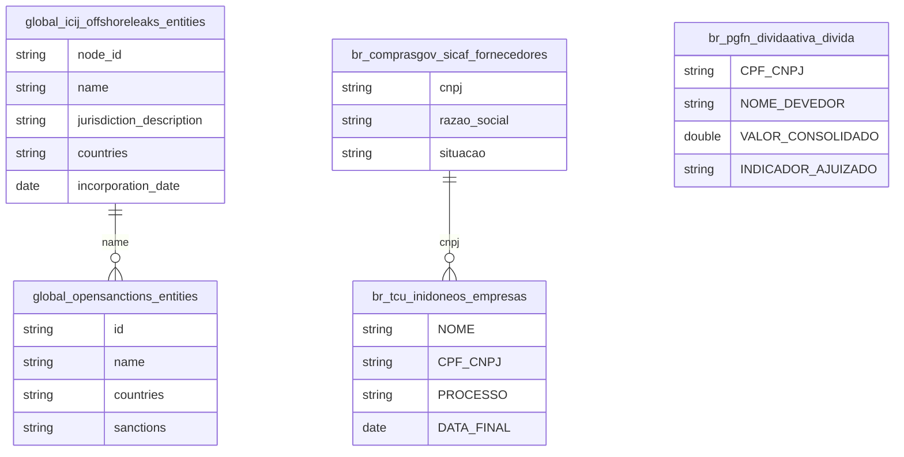

# Sanções, Offshore e Arquitetura da Impunidade Empresarial

## Contexto e Síntese dos Dados

Quatro registros de má conduta empresarial que raramente sao lidos juntos: `global_icij_offshoreleaks` (814.344 entidades vazadas, 1.532 com vinculo brasileiro), `global_opensanctions`/`eu_sanctions`/`un_sanctions`/`global_ofac_sanctions` (listas internacionais de sancao), `br_tcu_inidoneos` (banidos de contratar com o poder publico) e `br_pgfn_dividaativa` (divida ativa reconhecida e nao recebida).

## Revelacoes Importantes

### 1. Offshore brasileira por jurisdicao

| Jurisdicao | Entidades |
|---|---|
| Panama | 589 |
| Ilhas Virgens Britanicas | 492 |
| Nevada (EUA) | 132 |
| Niue | 91 |
| Seicheles | 79 |

**Conclusao:** 70% das estruturas brasileiras em Panama e BVI; Nevada supera Seicheles e Bahamas.

### 2. Funil de responsabilizacao

| Registro | Quantidade |
|---|---|
| Fornecedores habilitados (SICAF) | 957.885 |
| Empresas inidoneas (TCU) | 93 |
| Taxa de exclusao | 0,01% |

**Conclusao:** uma exclusao para cada 10.300 fornecedores — o gargalo esta na sancao, nao na informacao.

### 3. Divida ativa de FGTS

| Indicador | Valor |
|---|---|
| Valor consolidado | R$ 67,7 bilhoes |
| Inscricoes | 532.707 |
| Concentracao no 1% maior | 45,8% |
| Sem acao judicial | 35,9% |

**Conclusao:** metade da divida esta em 1% dos devedores.

## Cruzamentos Poderosos

- **Offshore x Jurisdicao:** 70% em Panama e Ilhas Virgens Britanicas.
- **SICAF x TCU:** 957.885 fornecedores contra 93 banidos.
- **FGTS x Concentracao:** 1% dos devedores responde por 45,8% do valor.
- **Divida x Judicializacao:** 35,9% nunca viraram acao judicial.
- **Nevada x Caribe:** um estado dos EUA recebe mais offshore brasileira que Seicheles.

## Hipoteses Explicativas

Detectar irregularidade e barato e automatizavel; puni-la exige devido processo, com custo humano e prazo proprios. O resultado e um funil onde a deteccao cresce com a tecnologia e a punicao permanece limitada pelo numero de servidores.

## Implicacoes para Politicas Publicas

Priorizar cobranca pelos maiores devedores recuperaria metade do valor com fracao do esforco. Integrar o cadastro de inidoneos ao SICAF na habilitacao fecharia a janela em que empresa punida segue cadastrada.
