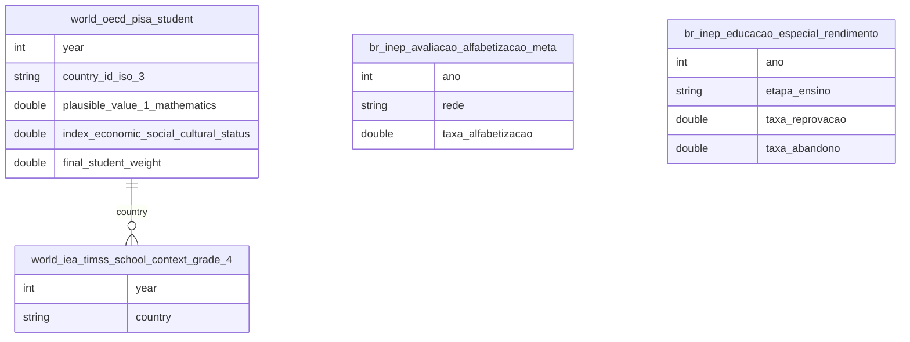

# Educação Básica, Alfabetização e Comparação Internacional

## Contexto e Sintese dos Dados

`world_oecd_pisa.student` traz microdados de estudante com valores plausiveis por dominio e indice socioeconomico, permitindo recortar desempenho por quartil. `br_inep_avaliacao_alfabetizacao` mede alfabetizacao ao fim do 2o ano desde 2023 e `br_inep_educacao_especial` traz rendimento por etapa. TIMSS e PIRLS completam a comparacao internacional.

## Revelacoes Importantes

### 1. PISA por quartil socioeconomico

| Grupo | Matematica |
|---|---|
| Brasil — quartil mais pobre | 347 |
| Brasil — quartil mais rico | 425 |
| Media OCDE | 465 |

**Conclusao:** nem o topo brasileiro alcanca a media da OCDE.

### 2. Alfabetizacao na rede publica

| Ano | Alfabetizados |
|---|---|
| 2023 | 55,9% |
| 2024 | 59,2% |
| 2025 | 66,0% |

**Conclusao:** +10,1 p.p. em dois anos, mas 34% ainda saem do 2o ano sem ler.

### 3. Educacao especial por etapa

| Etapa | Reprovacao | Abandono |
|---|---|---|
| Anos iniciais | 10,7% | 1,4% |
| Anos finais | 3,4% | 2,5% |
| Ensino medio | 3,8% | 4,5% |

**Conclusao:** a reprovacao e maxima na alfabetizacao, nao na complexidade do conteudo.

### Formacao docente adequada por rede

| Etapa | Publica | Municipal | Privada |
|---|---|---|---|
| Fundamental — anos iniciais | 73,5% | 71,2% | 57,9% |
| Fundamental — anos finais | 55,7% | 46,7% | 61,4% |
| Educacao infantil | 64,0% | 64,0% | 46,9% |
| EJA — fundamental | 32,2% | 27,0% | 22,3% |

**Conclusao:** so 46,7% dos professores municipais dos anos finais tem licenciatura na disciplina — sustenta a hipotese de qualidade media do sistema. Fonte: `br_inep_formacao_docente`.

## Cruzamentos Poderosos
- **Formacao docente x Rede:** 46,7% dos professores municipais dos anos finais.

- **PISA x Classe:** o quartil mais rico do Brasil (425) fica abaixo da media da OCDE (465).
- **Brasil x OCDE:** 87 pontos de defasagem, cerca de tres anos de escolaridade.
- **Alfabetizacao x Ritmo:** +10,1 p.p. em dois anos.
- **Educacao especial x Etapa:** 10,7% de reprovacao na alfabetizacao.
- **Desigualdade interna x externa:** a distancia Brasil-OCDE supera a distancia rico-pobre no Brasil.

## Hipoteses Explicativas

Se o topo tambem esta baixo, ha componente de qualidade media do sistema — formacao docente, tempo de instrucao, curriculo — que afeta todos os estratos, e nao apenas desigualdade distributiva.

## Implicacoes para Politicas Publicas

Politicas focadas so em equidade nao fecham a lacuna: e preciso elevar piso e teto simultaneamente. Metas anuais com medicao censitaria funcionaram na alfabetizacao e devem ser estendidas.
