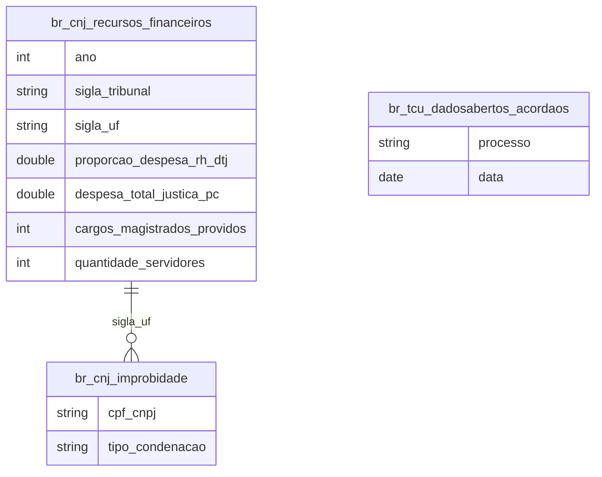

# Justiça, Tribunais de Contas e Custo do Judiciário

## Contexto e Sintese dos Dados

`br_cnj_estatisticas_poder_judiciario.recursos_financeiros` detalha, tribunal a tribunal, a estrutura de gasto do Judiciario: `proporcao_despesa_rh_dtj`, `despesa_total_justica_pc`, contagem de magistrados, servidores e terceirizados. Somado a `br_cnj_improbidade_administrativa`, `br_stj_dadosabertos` e aos tribunais de contas estaduais (`br_tce_rj`, `br_tce_pi`, `br_tce_es`, `br_tce_sp`, `br_tce_to`).

## Revelacoes Importantes

### 1. Estrutura de despesa

| Indicador | Valor |
|---|---|
| Proporcao media de RH | 92,0% |
| Magistrados | 41.664 |
| Servidores | 526.770 |
| Terceirizados | 128.498 |

**Conclusao:** sobram ~8% para custeio e investimento.

### 2. Custo por habitante

| UF | R$ por habitante |
|---|---|
| Distrito Federal | 989 |
| Rondonia | 572 |
| Ceara | 143 |

**Conclusao:** variacao de 6,9x entre extremos.

### 3. Margem fora da folha

| UF | Gasto per capita | Sobra fora da folha |
|---|---|---|
| Distrito Federal | R$ 989 | 3,0% |
| Rondonia | R$ 572 | 14,1% |

**Conclusao:** quem mais gasta por habitante e quem menos investe.

## Cruzamentos Poderosos

- **Justica x Pessoal:** 92% da despesa e folha.
- **Custo x Territorio:** 6,9x de variacao entre DF e Ceara.
- **Magistrado x Servidor:** ~13 servidores por magistrado.
- **Gasto alto x Folha alta:** o DF deixa 3% fora da folha.
- **Densidade x Custo unitario:** a comarca minima nao encolhe com a populacao.

## Hipoteses Explicativas

Garantias constitucionais tornam a folha incompressivel no curto prazo, fazendo do investimento a unica variavel de ajuste. A variacao per capita reflete economia de escala em servico territorializado.

## Implicacoes para Politicas Publicas

Ganhos de eficiencia dependem de redesenho de processo — digitalizacao, unificacao de comarcas — mais que de aumento orcamentario.
