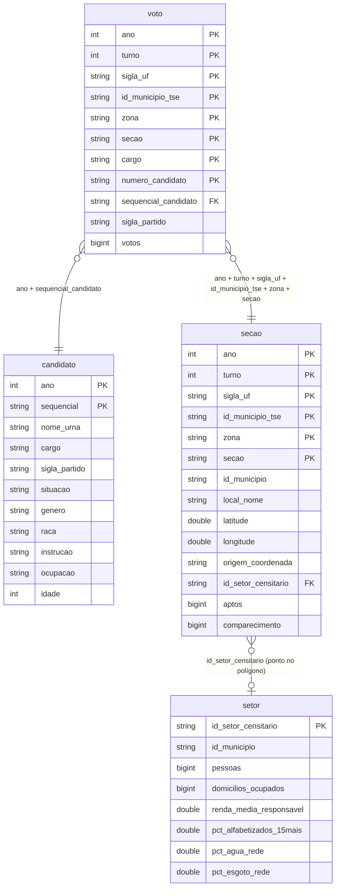

# `eleicoes_setor` — votos por seção (2022 e 2026) ligados ao setor censitário de 2022

Desenho de uma view que junta três coisas que o espelho já tem em separado: o voto de cada
candidato em cada seção eleitoral nas eleições gerais de 2022 e 2026, o cadastro dos
candidatos, e os atributos do setor censitário (Censo 2022, a malha mais recente) onde fica
o local de votação da seção.

Estado: desenho. Só as duas tabelas da ponte seção ↔ setor existem, em `br_rodado_eleicoes`. Números medidos no beelink em 2026-10-09.

## Tamanho

| Peça | Linhas | Tamanho (parquet+zstd) | Como foi obtido |
|---|---:|---:|---|
| `voto` 2022 (1º e 2º turno) | 61.261.334 | 0,72 GB | medido (`parquet_metadata`) |
| `voto` 2026 (1º turno) | 57.729.665 | 0,62 GB | medido |
| `candidato` 2022 + 2026 | 49.961 | 0,003 GB | medido |
| `secao` 2022 + 2026 (local, coordenada, comparecimento) | ~1,44 milhão | ~0,2 GB | estimado pela proporção das tabelas de origem |
| `setor` — 45 atributos, sem geometria | 468.099 | ~0,02 GB | estimado: as 1.411 colunas `v*` somam 0,29 GB |
| **Total normalizado** | | **~1,6 GB** | |
| `setor.geometria` (opcional) | 468.099 | +1,09 GB | medido |
| **Total com geometria** | | **~2,7 GB** | |

O 2º turno de 2026 (25/10/2026) ainda não aconteceu; pelo de 2022 (1,44 milhão de linhas),
acrescenta menos de 0,05 GB.

A versão **plana** (uma linha por voto já com as colunas do candidato e do setor repetidas)
não foi medida. A estimativa é de 4 a 6 GB, porque 119 milhões de linhas passam a carregar
~60 colunas a mais; comprime bem por repetição, mas não some. A recomendação é guardar
normalizado e expor a plana como view.

## Modelo



## `voto` — fato

Origem: `br_tse_eleicoes.resultados_candidato_secao`, `ano IN (2022, 2026)`.
Grão: um candidato, numa seção, num turno.

| Coluna | Tipo | Nota |
|---|---|---|
| `ano` | BIGINT | 2022, 2026 |
| `turno` | BIGINT | 1 ou 2 |
| `sigla_uf` | VARCHAR | 28 valores: as 27 UFs mais o voto no exterior (só presidente) |
| `id_municipio` | VARCHAR | código IBGE de 7 dígitos |
| `id_municipio_tse` | VARCHAR | código do TSE, parte da chave da seção |
| `zona`, `secao` | VARCHAR | número da seção só é único dentro de município + zona |
| `cargo` | VARCHAR | presidente, governador, senador, deputado federal, deputado estadual, deputado distrital |
| `numero_candidato` | VARCHAR | |
| `sequencial_candidato` | VARCHAR | chave para `candidato` |
| `numero_partido`, `sigla_partido` | VARCHAR | |
| `votos` | BIGINT | só votos nominais; brancos, nulos e legenda ficam em `secao` |

Fora da view: `id_eleicao`, `tipo_eleicao`, `data_eleicao`, `titulo_eleitoral_candidato`.

Linhas e votos por cargo, 1º turno:

| Cargo | Linhas 2022 | Votos 2022 | Linhas 2026 | Votos 2026 |
|---|---:|---:|---:|---:|
| deputado estadual | 26.406.943 | 100.747.526 | 24.872.474 | 104.458.295 |
| deputado federal | 24.802.179 | 106.142.316 | 23.086.841 | 110.670.045 |
| senador | 2.851.548 | 102.164.263 | 4.215.820 | 207.632.159 |
| presidente | 2.624.018 | 118.229.719 | 2.835.340 | 119.306.034 |
| governador | 2.479.321 | 108.965.064 | 2.167.021 | 112.197.244 |
| deputado distrital | 655.141 | 1.602.117 | 551.961 | 1.628.400 |

Senador dobra de votos em 2026 porque cada eleitor vota em dois nomes (renovação de 2/3).
O 2º turno de 2022 tem 943.907 linhas de presidente e 498.065 de governador (12 UFs).

## `candidato` — dimensão

Origem: `br_tse_eleicoes.candidatos`, `ano IN (2022, 2026)`: 28.972 e 20.989 linhas.
Chave: `ano` + `sequencial`. Conferido no Acre: de 836 candidatos com voto, 1 não tem par
no cadastro.

| Coluna | Tipo |
|---|---|
| `ano`, `sequencial` | BIGINT, VARCHAR |
| `sigla_uf`, `cargo`, `numero` | VARCHAR |
| `nome`, `nome_urna` | VARCHAR |
| `numero_partido`, `sigla_partido` | VARCHAR |
| `situacao` | VARCHAR |
| `genero`, `raca`, `instrucao`, `ocupacao`, `estado_civil` | VARCHAR |
| `idade`, `data_nascimento` | BIGINT, DATE |

Fora da view: `cpf`, `titulo_eleitoral`, `email` (dado pessoal sem uso na análise territorial).

## `secao` — dimensão, e a ponte para o Censo

Grão: uma seção num turno. Junta duas origens:

- `br_tse_eleicoes.perfil_eleitorado_local_votacao`: local de votação, endereço, coordenada, eleitores.
- `br_tse_eleicoes.detalhes_votacao_secao` com `cargo = 'presidente'`: aptos, comparecimento,
  abstenções, brancos e nulos (472.075 seções por turno em 2022, 499.248 em 2026).

| Coluna | Tipo | Nota |
|---|---|---|
| `ano`, `turno`, `sigla_uf`, `id_municipio_tse`, `zona`, `secao` | | chave |
| `id_municipio` | VARCHAR | IBGE 7 dígitos |
| `id_municipio_malha` | VARCHAR | o município como existe na malha de 2022; só difere de `id_municipio` em município criado depois do Censo (Boa Esperança do Norte, MT) |
| `local_numero`, `local_nome`, `endereco`, `bairro`, `cep` | VARCHAR | |
| `latitude`, `longitude` | DOUBLE | |
| `origem_coordenada` | VARCHAR | `tse_<ano>`, `mesma_secao_<ano>`, `mesmo_local_<ano>`, `sem_coordenada` |
| `id_setor_censitario` | VARCHAR | setor de 2022 que contém o ponto |
| `metodo_setor` | VARCHAR | `ponto_no_setor`, `sem_coordenada`, `fora_do_municipio` |
| `eleitores_secao`, `aptos`, `comparecimento`, `abstencoes` | BIGINT | |
| `votos_brancos`, `votos_nulos` | BIGINT | da disputa de presidente |

**Não existe chave entre seção e setor censitário: a ponte é construída aqui**, pela
localização do local de votação. São duas tabelas, porque há duas perguntas diferentes.

### Coordenada da seção

A fonte é o arquivo oficial de locais de votação do TSE
(`cdn.tse.jus.br/estatistica/sead/odsele/eleitorado_locais_votacao/eleitorado_local_votacao_<ano>.zip`),
não a tabela `perfil_eleitorado_local_votacao` do espelho: no espelho, 2026 vem sem latitude
e longitude e 2022 tem coordenada em 79% das seções; no arquivo do TSE são 99,1% e 94,1%.
O que falta é completado, nesta ordem (`origem_coordenada`):

1. `tse_<ano>`: a do próprio ano no arquivo do TSE.
2. `mesma_secao_<ano>`: a mesma UF + município + zona + seção em outro ano (2020 a 2026), o mais recente.
3. `mesmo_local_<ano>`: o mesmo local de votação (UF + município + zona + número do local) em outro ano.
4. `sem_coordenada`.

### `secao_setor` — o setor onde fica o local de votação

Uma linha por seção e ano. O setor é o polígono de 2022 que contém o ponto, procurado só
dentro do mesmo município. Responde "em que setor fica esta seção"; serve para levar
atributos do Censo até a seção.

| Ano | Seções | Com setor | Sem coordenada | Ponto fora do município | Eleitores com setor | Votos de presidente (1º turno) com setor |
|---|---:|---:|---:|---:|---:|---:|
| 2022 | 496.856 | 491.283 (98,9%) | 2.725 | 2.848 | 99,0% | 99,2% |
| 2026 | 517.179 | 511.518 (98,9%) | 3.289 | 2.372 | 99,0% | 99,3% |

Em 2026 a pior UF é o Amapá (92,8%); as demais passam de 98%. O voto no exterior (2.715
seções) não tem setor. Os pontos fora do município são coordenada errada na origem.

### `setor_local` — os locais de votação que representam cada setor

Uma linha por setor, local e ano. É o método do Colmeia (`colmeiabrasil.github.io/colmeia`),
adaptado de `github.com/deltafolha/eleicoes-por-setores-censitarios`, e responde a pergunta
inversa: "como votou este setor". Para cada setor:

1. mede-se a distância de cada local de votação do município até o **polígono** do setor;
2. os locais são agrupados em faixas de 100 m (`faixa_100m` = 1 para dentro ou até 100 m, 2 para 100–200 m, e assim por diante);
3. ficam só os locais da faixa mais próxima;
4. o voto de cada local entra com `peso` = 1 ÷ distância ao **centroide** do setor.

| Coluna | Tipo | Nota |
|---|---|---|
| `ano`, `id_municipio`, `id_setor_censitario` | | |
| `latitude`, `longitude` | DOUBLE | o ponto do local; liga em `secao_setor` por `ano` + `id_municipio` = `id_municipio_malha` + ponto |
| `distancia_poligono_m` | DOUBLE | 0 quando o local está dentro do setor |
| `faixa_100m` | INT | |
| `distancia_centroide_m` | DOUBLE | |
| `peso` | DOUBLE | 1 ÷ `distancia_centroide_m`, com piso de 1 m |

| Ano | Pares setor × local | Setores cobertos | Locais por setor | Setores com local a até 100 m | Setores com o local mais próximo a mais de 2 km | Distância mediana |
|---|---:|---:|---:|---:|---:|---:|
| 2022 | 594.780 | 468.085 de 468.099 | 1,27 | 34,6% | 8,5% | 192 m |
| 2026 | 596.919 | 468.085 de 468.099 | 1,28 | 35,6% | 8,1% | 184 m |

O Colmeia marca como "estimativa fraca" o setor cujo local mais próximo fica a mais de 2 km;
aqui isso é `distancia_poligono_m > 2000`. Como um local serve vários setores, os votos por
setor obtidos assim **não são somáveis**: servem para percentual, não para total.

As distâncias são medidas numa projeção local por município (x = longitude × cos(latitude
média do município) × 111.320, y = latitude × 110.574), não em graus. A projeção policônica
nacional (EPSG:5880) foi descartada: erra 5% no Recife.

A comparação setor a setor com o que o Colmeia publica está em
[`docs/colmeia/comparacao.md`](../../colmeia/comparacao.md).

Conferência: os 183.032 pares (ponto, setor que o contém) de `secao_setor` estão todos em
`setor_local` na faixa 1.

Construídas em 2026-10-09 e publicadas como `br_rodado_eleicoes.secao_setor` (1.014.035 linhas,
21 MB) e `br_rodado_eleicoes.setor_local` (1.191.699 linhas, 24 MB), com view. Reconstruir com
`scripts/eleicoes_setor/constroi_ponte.sh`. As chaves `id_municipio_tse`, `zona` e `secao`
estão sem zeros à esquerda.

## `setor` — dimensão

Origem: `br_ibge_censo_2022.setor_censitario` (468.099 setores, 1.423 colunas, 203.080.756
pessoas — bate com o total do Censo) e `br_ibge_censo_2022.setor_censitario_renda_responsavel`
(458.772 setores, 449.531 com renda). Os códigos `v*` vêm de
`br_ibge_censo_2022.setor_censitario_dicionario_variaveis`.

| Coluna | Origem | Descrição |
|---|---|---|
| `id_setor_censitario` | | 15 dígitos; os 7 primeiros são o município |
| `id_uf`, `id_municipio` | | |
| `area` | `area` | |
| `pessoas` | `pessoas` | total de pessoas |
| `domicilios` | `domicilios` | total de domicílios |
| `domicilios_ocupados` | `domicilios_particulares_ocupados` | |
| `media_moradores` | `media_moradores_domicilios` | |
| `homens`, `mulheres` | `v01007`, `v01008` | |
| `idade_0_4` … `idade_70_mais` | `v01031` a `v01041` | 11 faixas |
| `raca_branca`, `raca_preta`, `raca_amarela`, `raca_parda`, `raca_indigena` | `v01317` a `v01321` | |
| `pessoas_15_mais` | soma de `v00644` a `v00656` | denominador da alfabetização |
| `alfabetizados_15_mais` | soma de `v00748` a `v00760` | |
| `dppo` | `v00001` | domicílios particulares permanentes ocupados, denominador dos itens abaixo |
| `dom_casa`, `dom_casa_condominio`, `dom_apartamento`, `dom_cortico` | `v00047` a `v00050` | tipo do domicílio |
| `dom_agua_rede_geral` | `v00111` | |
| `dom_esgoto_rede`, `dom_esgoto_fossa_ligada` | `v00309`, `v00310` | |
| `dom_lixo_coletado`, `dom_lixo_cacamba` | `v00397`, `v00398` | |
| `responsaveis` | `v06001` | pessoas responsáveis por domicílio |
| `renda_media_responsavel` | `v06004` | rendimento nominal médio mensal, em reais |
| `renda_mediana_responsavel` | `v06006` | |
| `geometria` | `geometria` | opcional; 1,09 GB dos 1,4 GB da tabela de origem |

O IBGE omite células pequenas, e elas chegam como NULL: somar faixas com `+` anula o setor
inteiro quando uma faixa falta (a alfabetização nacional sai 83% em vez de 93%). Somar com
`list_sum([...])` ou `coalesce`.

Guardar as contagens, não os percentuais: quem agrega seções de vários setores precisa
somar numerador e denominador antes de dividir.

## `votos_setor` — a view plana

```sql
CREATE VIEW eleicoes_setor.votos_setor AS
SELECT v.*,
       c.nome_urna, c.situacao, c.genero, c.raca, c.instrucao, c.ocupacao, c.idade,
       s.local_nome, s.latitude, s.longitude, s.aptos, s.comparecimento,
       s.id_setor_censitario,
       t.* EXCLUDE (id_setor_censitario, id_uf, id_municipio)
FROM eleicoes_setor.voto v
LEFT JOIN eleicoes_setor.candidato c
       ON c.ano = v.ano AND c.sequencial = v.sequencial_candidato
LEFT JOIN eleicoes_setor.secao s
       USING (ano, turno, sigla_uf, id_municipio_tse, zona, secao)
LEFT JOIN eleicoes_setor.setor t
       USING (id_setor_censitario);
```

Toda consulta filtra `ano`, e de preferência `cargo` e `sigla_uf`: são 119 milhões de linhas.

## Armadilhas

1. **O setor é o do local de votação, não o da casa do eleitor.** O eleitor vota perto de
   onde mora, mas a escola pode ficar no setor vizinho, e uma escola recebe eleitores de
   vários setores. Para análise, vale mais agregar os setores num raio do local (ou por
   bairro) do que tratar o setor do ponto como o perfil do eleitorado.
2. **Depois de uma carga do TSE, conferir as views.** Em 2026-10-09 a view de votos por
   seção devolvia 8,5 milhões de linhas de 2026 com 57,7 milhões no disco, porque listava os
   arquivos de antes da carga; 18 views de `br_tse_*` foram recriadas nesse dia. A soma de
   presidente no 1º turno fecha entre votos por seção e comparecimento por seção
   (118.229.719 em 2022, 119.306.034 em 2026).
   `resultados_candidato_municipio_zona` não tinha 2026 e recebeu a partição nesse dia
   (6.737.414 linhas). As tabelas por município e por município e zona somam 5.246 votos de
   presidente a menos que a tabela por seção em 2026, espalhados por todas as UFs: vem assim da fonte.
3. **Seção de 2022 e de 2026 com o mesmo número não é garantia de mesmo lugar**: seções são
   criadas, extintas e agregadas entre eleições. A herança de coordenada vale para a
   localização, não para comparar o resultado seção a seção.
4. **O voto no exterior não tem setor censitário**, e 9.327 setores têm zero pessoas.
5. **Senador em 2026 soma dois votos por eleitor**; não comparar o total com 2022 sem dividir.
