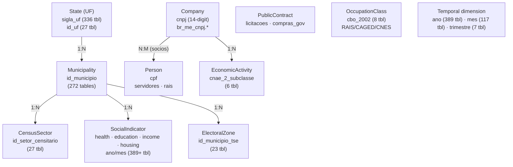
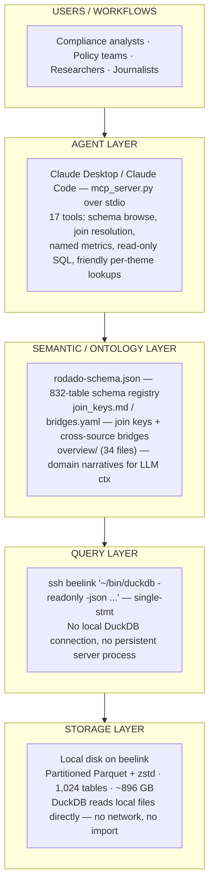
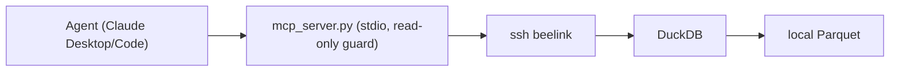

# rodado — Technical Reference

> This is the engineering documentation for **rodado**. For the public-facing project — a sociological reading of Brazilian public data, in Portuguese — see [README.md](../../README.md) and [rafapolo.github.io/rodado](https://rafapolo.github.io/rodado).

**1,024 tables · ~896 GB Parquet+zstd · DuckDB · LLM NL→SQL · Single-engineer end-to-end**

---

## Engineering competencies demonstrated

| Competency | How this project demonstrates it |
|-----------|----------------------------------|
| End-to-end delivery, prototype → production | Ingestion pipeline + semantic layer + 18-tool MCP interface, in daily use |
| Data engineering & modeling | 1,024 tables normalized to a typed ontology with join-key graph |
| Ontology design | 8 business object types with explicit relationships and canonical keys |
| Application development | `mcp/mcp_server.py` — 17 MCP tools over stdio (see `mcp/MCP.md`); an earlier browser SQL shell + HTTP API is retired |
| AI/ML enablement | Table discovery by dataset catalog in the prompt (88% dataset hit rate in the local harness) |
| Read-only enforcement | Query type/keyword guard client-side before any SSH call reaches beelink |
| Operational durability | Resumable scraping pipelines, checkpointed ingestion |
| Sensitive data handling | CPF/CNPJ personal identifiers — read-only, no PII export |

---

## User Workflows

Three concrete analyst scenarios showing the full data → insight → decision arc.

### Workflow 1 — Compliance: company integrity check

**Situation:** A compliance team needs to verify whether companies awarded public contracts have directors appearing in other sanctioned or flagged entities.

```sql
SELECT
    e.razao_social,
    e.cnpj,
    s.nome_socio,
    s.cnpj_cpf_socio AS cpf_director,
    COUNT(DISTINCT e2.cnpj) AS other_entities,
    SUM(c.valor_contrato)   AS total_contracts_brl
FROM br_me_cnpj.estabelecimentos e
JOIN br_me_cnpj.socios s
    ON e.cnpj_basico = s.cnpj_basico
JOIN br_me_cnpj.socios s2
    ON s.cnpj_cpf_socio = s2.cnpj_cpf_socio
    AND s2.cnpj_basico <> s.cnpj_basico
JOIN br_me_cnpj.estabelecimentos e2
    ON s2.cnpj_basico = e2.cnpj_basico
JOIN br_cgu_compras_governamentais.contratos c
    ON e.cnpj = c.cnpj_contratado
WHERE e.sigla_uf = 'SP'
  AND c.ano = 2023
GROUP BY 1,2,3,4
HAVING other_entities > 2
ORDER BY total_contracts_brl DESC
LIMIT 20
```

**Decision:** Flag companies for manual review; route to procurement governance team.

### Workflow 2 — Policy: infrastructure gap prioritization

**Situation:** A state health secretariat needs to identify municipalities with critically low hospital bed coverage to prioritize federal budget allocation.

```sql
SELECT
    m.nome                          AS municipio,
    m.sigla_uf,
    pop.populacao,
    ROUND(cnes.leitos_sus * 1000.0
          / NULLIF(pop.populacao, 0), 2) AS leitos_sus_por_mil,
    ideb.nota_media                 AS ideb_fundamental,
    pib.pib_per_capita_real         AS pib_per_capita
FROM br_bd_diretorios_brasil.municipio m
JOIN br_ibge_populacao.municipio pop
    ON m.id_municipio = pop.id_municipio AND pop.ano = 2022
JOIN (
    SELECT id_municipio, SUM(leitos) AS leitos_sus
    FROM br_ms_cnes.estabelecimento
    WHERE ano = 2023 AND tipo_gestao = 'M'
    GROUP BY id_municipio
) cnes ON m.id_municipio = cnes.id_municipio
JOIN br_inep_ideb.municipio ideb
    ON m.id_municipio = ideb.id_municipio AND ideb.ano = 2021
JOIN br_ibge_pib.municipio pib
    ON m.id_municipio = pib.id_municipio AND pib.ano = 2021
WHERE pop.populacao > 10000
ORDER BY leitos_sus_por_mil ASC, ideb_fundamental ASC
LIMIT 50
```

**Decision:** Ranked shortlist delivered to budget committee; top 10 municipalities flagged for emergency transfer.

### Workflow 3 — Journalism: electoral spending anomalies

**Situation:** An investigative journalist tracks whether campaign spending patterns correlate with post-election public contract awards in a given state.

```sql
SELECT
    cand.nome_candidato,
    cand.sigla_partido,
    cand.sigla_uf,
    SUM(desp.valor_despesa)    AS total_campaign_spend,
    SUM(cont.valor_contrato)   AS post_election_contracts,
    COUNT(DISTINCT cont.cnpj_contratado) AS linked_companies
FROM br_tse_eleicoes.candidatos cand
JOIN br_tse_eleicoes.despesas_candidato desp
    ON cand.id_candidato = desp.id_candidato
    AND cand.ano = desp.ano
JOIN br_me_cnpj.socios s
    ON cand.cpf_candidato = s.cnpj_cpf_socio
JOIN br_cgu_compras_governamentais.contratos cont
    ON s.cnpj_basico = SUBSTR(cont.cnpj_contratado, 1, 8)
    AND cont.ano > cand.ano
WHERE cand.ano = 2022
  AND cand.sigla_uf = 'SP'
  AND cand.descricao_cargo = 'DEPUTADO ESTADUAL'
GROUP BY 1,2,3
HAVING post_election_contracts > 1000000
ORDER BY post_election_contracts DESC
```

**Decision:** Shortlist of 12 candidates forwarded to editorial team with source data for verification.

---

## Domain Ontology

The platform models Brazilian public data as typed business objects with explicit relationships.



Full map in [`docs/mapa/ERD.md`](../mapa/ERD.md) — pt-BR, English in [`docs/mapa/ERD_EN.md`](../mapa/ERD_EN.md) — one mermaid diagram per domain covering all 1,018 tables; join recipes in [`docs/context/join_keys.md`](../context/join_keys.md).

**Canonical join keys**:

| Key | Tables | Object |
|-----|--------|--------|
| `id_municipio` | 260 | Municipality |
| `sigla_uf` | 322 | State |
| `cnpj` / `cnpj_basico` | 23 | Company |
| `id_setor_censitario` | 27 | CensusSector |
| `id_municipio_tse` | 23 | ElectoralZone |
| `cbo_2002` | 8 | OccupationClass |
| `cnae_2_subclasse` | 6 | EconomicActivity |
| `cpf` | varies | Person |
| `ano` | 389 | Temporal partition |

---

## Architecture

Everything is local: partitioned Parquet+zstd on beelink, queried on-demand
by DuckDB over SSH. No live web service, no cloud object storage — an
earlier iteration (`db.xn--2dk.xyz`, a BigQuery → GCS → Hetzner Object
Storage pipeline behind `auth.py`/Caddy) has been retired; see "Previous
architecture" below for what it demonstrated while it ran.



---

## Table Selection

Finding the right table is `list_datasets` → `list_tables` → `describe_table`,
or — in the local harness — the whole dataset catalog placed in the prompt
(~2k tokens, cached by llama-server after the first question), which picks the
right dataset 88% of the time. An embedding index over synthetic questions
(doc2query, `search_tables`) scored ~53% on the same measure, covered 832 of
1,029 tables, and was removed on 2026-09-24.

---

## Data Quality & Governance

### Partition requirements

Large tables (100M+ rows) require partition filters to avoid scan timeouts. Always include at least one of:

| Partition key | Tables | Example |
|--------------|--------|---------|
| `ano` | 261 | `WHERE ano = 2023` |
| `sigla_uf` | 245 | `WHERE sigla_uf = 'SP'` |
| `mes` | 94 | `WHERE ano = 2023 AND mes = 6` |

### Sensitive identifiers

| Identifier | Description | Handling |
|-----------|-------------|----------|
| `cpf` | Brazilian individual tax ID (personal) | Read-only; present in public servant and electoral datasets |
| `cnpj` | Brazilian company tax ID | Read-only; 14-digit canonical identifier |
| `cnpj_basico` | Company base (8-digit, groups branches) | Use for company-level joins |

All access is read-only, enforced client-side in `mcp_server.py` before any SSH call reaches beelink. No PII export endpoints.

### Known limitations & assumptions

- **Data freshness varies**: CNPJ register updates monthly; census data is 2010/2022; some health datasets lag 12–18 months.
- **Join cardinality**: CPF-based joins across datasets can produce unexpectedly high cardinality — validate row counts before aggregating.
- **Null density**: Some survey microdata tables (PNAD, PNADC) have high null rates in optional columns; filter explicitly.
- **Monetary values**: Always verify order of magnitude before reporting contract/budget values — trillion-real totals indicate a missing GROUP BY or partition filter.
- **Sanity protocol**: Before reporting any number, (1) state expected order of magnitude, (2) flag any row exceeding it, (3) verify via two independent query paths.

### Access model



No public endpoint, no auth layer to manage — access is scoped to whoever
has SSH access to beelink and runs `mcp_server.py` locally.

---

## MCP server

`mcp_server.py` exposes the catalog and query layer as 18 [MCP](https://modelcontextprotocol.io)
tools for Claude Desktop/Claude Code, over stdio. Full tool inventory,
architecture diagrams and the retrieval/iteration mechanism: **[`mcp/MCP.md`](../../mcp/MCP.md)**.

```bash
pip install -r mcp/requirements.txt
claude mcp add rodado -- python3 mcp/mcp_server.py
```

Tests: `pytest mcp/` (the ssh subprocess and the embedding model are mocked — no network, no model download).

---

## Palantir Foundry mapping

Not a Foundry deployment. rodado is an open-source system built around the same idea as Foundry: raw datasets are not enough. You also need a typed semantic layer that says what the data *means*, plus tools that act on that meaning instead of on table names. This section translates each layer for readers who know Foundry. It also shows where rodado had to solve problems Foundry solves by construction, and what a real Foundry port would add.

### Layer by layer

| Foundry layer | Foundry primitive | rodado counterpart | Notes |
|---|---|---|---|
| Data integration | Data Connection sources and syncs | Base dos Dados mirror sync + independent scrapers (309 tables), resumable and checkpointed | Each scraped source records its URL and scrape date |
| | Datasets (versioned Parquet) | One Parquet+zstd directory per table on beelink, 1,050 tables | No transactions or dataset versions; the COLD backup is add-only, not a history |
| | Data Lineage, dataset metadata | `_rodado_metadata` catalog: rows, files, bytes, `source_url`, `scrape_date`, `status`, provenance | Rebuilt after every sync by `build_metadata_catalog.py` |
| | Pipeline schedules | The ordered regeneration chain (`gera_schemas.py` → `sync_mcp_schema.py` → … → `build_atlas.py`) | Run by hand. Foundry would schedule it and track staleness |
| Ontology | Object types + properties | Hub concepts in `bridges.yaml` (61): municipality, state, company, person, station, country… | Objects stay virtual: rows in tables, not an indexed object store |
| | Link types | `bridges.yaml` + `resolve_join(a, b)`, which returns a ready-made `ON` clause | Foundry links need clean, equal keys. rodado's bridges carry the *normalization expression* (e.g. un-padded CNPJ), which a Foundry port would move into a transform |
| | Interfaces (polymorphism) | A concept shared by hundreds of tables, e.g. anything carrying `id_municipio` can roll up to state and region | Maps naturally to an interface like `HasMunicipality` |
| | Shared property types / value types | `coded_differently` (13 concepts, e.g. `sexo`, `raca_cor`, whose codes change by dataset and year) + `column_codes.yaml` + per-dataset `dicionario` decode | Foundry enforces one type per shared property; rodado documents the divergence and warns at query time |
| | (no native primitive) | `false_friends` (21): same column name, different meaning (`valor` in 91 tables) | A guard against links that *look* valid. In Foundry this would mean deliberately separate property types |
| | Functions on objects | `metrics.yaml` (15 named metrics, all with a `verified` measurement) and `hierarchies.yaml` (CNAE, CID-10, municipality → state → region rollups) | `get_metric`, `rollup` |
| | Object Views | `describe_table`: columns, decodable codes, gotchas and coded-value warnings in one call | Built for an agent reader, not a human |
| Data quality | Data Expectations + Health Checks | `docs/context/gotchas/*.yml` (26 datasets), each entry with a `verificado` measurement on real data; `valida_metrics.py` | Documented and returned to the agent, **not enforced at build time** |
| AIP | Ontology MCP / AIP Agent tools | `mcp/mcp_server.py`: 17 read-only MCP tools (schema, joins, metrics, rollups, SQL, per-domain lookups) | Same idea as Palantir's Ontology MCP: an external agent reads through the semantic layer |
| | AIP Evals | The local evaluation harness (Gemma 4 on beelink): dataset hit rate 88% with the catalog in the prompt vs ~53% for the embedding search it replaced; blind MCP tests | Each failure becomes a bridge, gotcha or note, not a prompt rule |
| Governance | Markings, restricted views, read-only scopes | `-readonly` sessions, statement guard, `allowed_directories`, `enable_external_access=false`, `lock_configuration=true` | Access control for the whole session, not per row. CPF/CNPJ are read-only, with no export endpoint |
| Applications | Vertex / graph exploration | [Atlas](https://rodado.xyz/atlas): bipartite table↔key graph (2,151 edges instead of 89,598 table pairs) | |
| | Workshop / Notepad / Contour | Published analyses (`pages/analises/`) and the municipal-panel research runs (FDR-corrected triples) | Reports, not operational apps |

### What rodado solves that Foundry solves by construction

- **Key normalization at query time.** Foundry pushes key cleaning into pipelines, so link types join on equal keys. rodado mirrors sources as they come, so it keeps the conversion in the bridge (`resolve_join` *replaces* the naive `a.cnpj = b.cnpj`).
- **Semantic drift across years.** The same code means different things in different datasets or years. Foundry would fix this once, in a transform. rodado fixes it at query time and warns about it.
- **Every claim is measured.** Every bridge, metric, hierarchy parent and gotcha carries what matched when it was run on the real data, with a date. This plays the role of Data Expectations. The difference: a failed check in rodado shows up as a warning, not a failed build.

### What a Foundry deployment would add

- **Action types / write-back.** rodado is read-only by design. A compliance workflow ("flag this supplier for review") needs actions, an inbox and an audit trail.
- **Materialized objects.** Indexed object storage, so a single company or municipality can be fetched without scanning tables.
- **Orchestration.** Scheduled, incremental builds with staleness tracking, instead of a manual regeneration chain.
- **Granular security.** Markings and row-level policies for CPF-bearing data, instead of one lock for the whole session.
- **Branching.** Change the ontology and pipelines on a branch, without touching production.

### Porting sketch

1. Sync the Parquet tables as Foundry datasets through Data Connection.
2. Write transforms that apply each `bridges.yaml` normalization and emit clean keys. Turn each `gotchas/*.yml` entry into a Data Expectation on the output.
3. Build the ontology: object types for the hub concepts (Municipality, Company, Person [marked], Establishment, PublicContract, HealthEvent); link types from the bridges; an interface for anything located in a municipality.
4. Turn `metrics.yaml` into functions, each with a unit test built from its `verified` measurement. Move the harness cases into AIP Evals.
5. Build one Workshop application around Workflow 1 (supplier integrity check), with an action type that routes a flagged company to review.

---

## Stack

| Layer | Technology |
|-------|-----------|
| Query engine | DuckDB, local, over SSH — no persistent server process |
| Storage | Local disk on beelink, Parquet+zstd |
| Interface | `mcp_server.py`, stdio MCP tools for Claude Desktop/Code |

## Environment

```bash
BEELINK_HOST   # SSH hostname for beelink (default: beelink)
```

## Previous architecture

An earlier iteration of this project ran a public live-query service
(`db.xn--2dk.xyz`): BigQuery → GCS → Hetzner Object Storage, served by a
persistent `auth.py` DuckDB connection behind Caddy, with a browser SQL
shell and a `/query` HTTP API. That service is retired, and its deployment
files (`auth.py`, `start.sh`, `Caddyfile`, `haloy.yml`, `Dockerfile`) were
removed on 2026-09-24 — `git log --all -- Caddyfile` finds them. Everything today goes through beelink and `mcp_server.py`,
described above.
