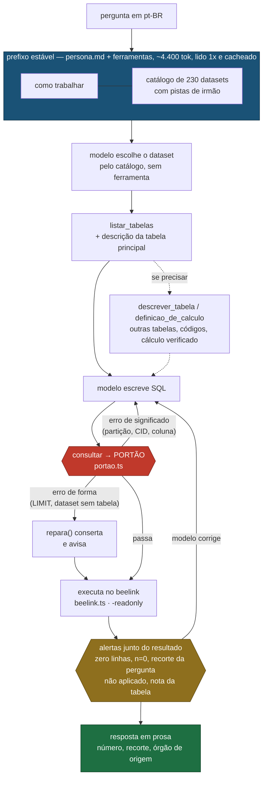
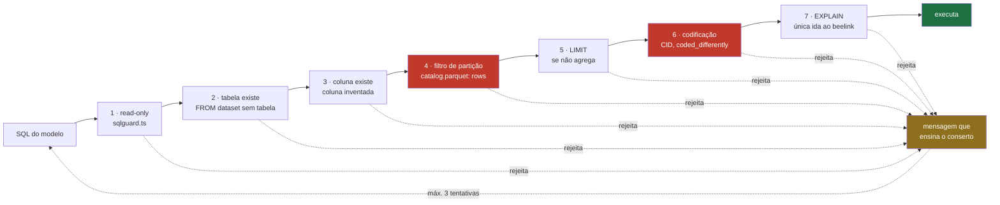
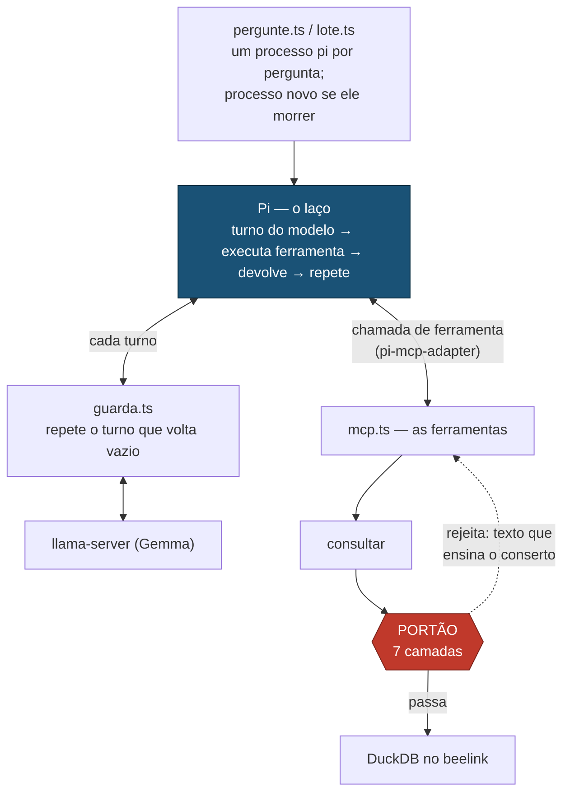

# `harness/` — apuração local com Gemma 4, sem API

Pergunta em pt-BR → datasets → schema → SQL → **portão** → número conferido → prosa.
Tudo no beelink, sem chamada de API paga.

Bun + TypeScript. As medições que sustentam cada escolha estão em
[`docs/tecnico/gemma_stats.md`](../docs/tecnico/gemma_stats.md); o plano completo e o catálogo de
refino em [`tasks/harness/`](../tasks/README.md#harness--ativos-tasksharness).

## O fluxo

Uma pergunta, do jeito que roda hoje (`pergunte.ts` → Pi → as ferramentas de
`mcp.ts`). Quem decide a ordem é o modelo, dentro do laço do Pi — ver "O laço:
o Pi"; as setas abaixo são o caminho típico, não uma sequência fixa.



Recuperação, validação e execução são determinísticas — código, não julgamento
do modelo. O modelo escolhe o dataset, escreve a SQL, lê o que voltou e redige;
tudo que ele recebe de volta (rejeição, conserto, alerta) chega como resultado
de ferramenta, e é isso que o faz corrigir sem retry escrito à mão. Pergunta
direta: ~4 turnos, mediana de 49 s.

## O portão

`checkReadOnly` sozinho valida tipo de statement e palavra proibida. Isso basta
enquanto quem dirige é uma pessoa, porque a disciplina de partição e de
codificação está em prosa no docstring do `run_sql`. **Prosa em docstring não é
enforcement para um modelo autônomo.**

As camadas rodam em ordem de custo — as locais primeiro, para que as tentativas
de reparo sejam gastas em erro real e não em ida à rede:



As duas camadas em vermelho existem por causa de erros **que o Gemma cometeu de
verdade**, medidos no beelink em 2026-09-01:

| Camada | O que o modelo escreveu | Por que é caro |
|---|---|---|
| **4 · partição** | `SELECT COUNT(*) FROM br_ms_sim.microdados` — sua primeira tool call | Varredura completa segura o lock do DuckDB por horas. O incidente de 2h do `AGENTS.md` tem exatamente esta forma. |
| **6 · codificação** | `causa_basica BETWEEN 'X60' AND 'X84'` | CID é guardado **sem ponto** (`X840`), e `'X840' > 'X84'` — o grupo X84 some inteiro. **726 contra 789 reais: 8% a menos, com número plausível.** |

O segundo é o modo de falha que importa: não dá erro, dá um número que passa
despercebido. `harness/portao.test.ts` trava os dois casos.

**Erro de forma o portão conserta sozinho** (2026-09-23). Falta de `LIMIT`,
amostra sem `COUNT(*) AS n` e `FROM dataset` sem tabela custavam um turno do
modelo cada (~15 s) para um conserto mecânico. `repara()` corrige antes de
rodar e avisa no resultado ("Ajustei a consulta antes de rodar: ..."). O que
muda o significado da SQL — partição, codificação, coluna inventada — continua
voltando ao modelo.

## Por que catálogo no prefixo, e não busca por embedding

Medido contra o conjunto dourado do projeto:

| Estratégia de recuperação de dataset | Recall | Casos perfeitos |
|---|---|---|
| `search_tables` — embedding doc2query (removido em 2026-09-24) | 52,9% | — |
| catálogo de 212 nomes no prefixo | 91,3% | 85,7% |
| **+ 43 exemplos resolvidos no prefixo** | **97,8%** | **96,4%** |

Medido em 28 casos de teste, com `bun harness/avalia_datasets.ts [--fewshot]`.
Os exemplos vêm de `respostas.md` — ele não é só gabarito, ensina qual dataset
serve qual tipo de pergunta. Divisão treino/teste **por tema**, não por caso:
dentro de um tema as 5 perguntas são variações do mesmo cruzamento, então
dividir por caso deixaria o vizinho quase-idêntico no prefixo e mediria memória.

O few-shot é grátis **por pergunta**: o prefixo cresce para ~11k tokens e o
`prefill` medido continua em ~45 — só a pergunta é prefilada.


Os nomes já são semânticos — `br_ms_sim` é Ministério da Saúde / Sistema de
Informação sobre Mortalidade. O embedding comprime isso num vetor e perde; ler a
lista literal não perde. E como o cache de prefixo do `llama-server` reaproveita
o KV do prefixo comum, os 212 nomes custam **uma vez**:

| chamada | tokens prefilados | tempo |
|---|---|---|
| 1ª (frio) | 1.165 | 19,5 s |
| 2ª | 5 | **0,44 s** |

Estabilidade do prefixo é, por isso, **restrição de arquitetura e não
otimização**: qualquer coisa variável no prefixo (timestamp, ordem não
determinística) evapora o 44x sem ninguém perceber.

## Por que laço agêntico, e não pipeline fixo

A comparação que decide o desenho — mesmas 5 perguntas, mesmo modelo, mesmo
portão, mesmo beelink; muda só quem decide a sequência de passos:

| | laço agêntico + MCP (medido com o dsh) | pipeline fixo (`laco.ts`, removido) |
|---|---|---|
| **Correto** | **3/3 = 100%** | **0/3 = 0%** |
| Tempo | ~400 s | 61 s |

O pipeline fixo é 14x mais rápido e não serve. As três falhas dele nomeiam o que
o laço faz de essencial, e **nenhuma é erro de SQL**: respondeu 573 em vez de 789
(agrupou por sexo e reportou um grupo só); devolveu o código `3550308` em vez de
"São Paulo", por não ir ao diretório; e bateu 4x no portão sem recuperar. São
erros de não iterar.

`laco.ts` e `compara.ts`, que rodava os dois lado a lado, saíram do repositório
em 2026-09-24 — a comparação está decidida e o código fica no histórico do git
(`git show 6ef2921:harness/laco.ts`).

## O laço: o Pi

O laço agêntico é o **Pi** (`@earendil-works/pi-coding-agent`, montado por
`pi.ts`) — e ele **não sabe que o portão existe**. Não valida nada, não conhece
SQL, CID nem partição. O trabalho dele é só repassar mensagens entre o modelo e
as ferramentas até sair uma resposta final: manda o turno ao modelo, executa a
chamada de ferramenta que vier, devolve o resultado, repete. Guarda cada sessão
em `~/.rodado-harness/sessoes/`, que é o que `sessao.ts` lê.

Onde cada peça fica, de fora para dentro:



O portão mora **dentro da ferramenta `consultar`**, e quem o roda é o `mcp.ts`.
Na pergunta dos óbitos por suicídio no RJ em 2020:

1. O Pi manda a pergunta ao Gemma.
2. O Gemma responde "chame `consultar` com `causa_basica BETWEEN 'X60' AND 'X84'`".
3. O Pi repassa ao `mcp.ts`; o portão reprova e devolve um texto: "CID é
   guardado sem ponto, use `substr(...)`".
4. O Pi **não sabe que aquilo é uma rejeição** — para ele é só o resultado da
   ferramenta, e ele entrega ao Gemma como entregaria qualquer resultado.
5. O Gemma lê, reescreve a SQL e chama `consultar` de novo. Passa, roda, volta 789.
6. O Gemma redige a resposta; o Pi termina.

É por isso que o portão não precisa de retry escrito à mão: a rejeição chega ao
modelo como resultado de ferramenta, o laço continua girando e o conserto
acontece sozinho. O `laco.ts` (removido) era a versão sem laço, com a sequência
fixa — 0/3 contra 3/3 (ver "Por que laço agêntico" acima).

**Divisão de trabalho: o Pi decide a sequência dos passos; o harness — portão,
guarda, persona — decide o que é permitido e o que vale.**

Tudo que é do rodado entra pela configuração que `pi.ts` monta num diretório
temporário a cada pergunta (nada do `~/.pi` do usuário entra):

| A configuração | Para quê |
|---|---|
| provider `beelink-local` (`models.json`) | aponta o Pi para o Gemma local pela `guarda.ts`, com `reasoning: false` |
| `pi-mcp-adapter` com `directTools: true` | o Pi não tem MCP nativo; o adapter monta `harness/mcp.ts` e expõe as 4 ferramentas uma a uma, com o proxy `mcp` escondido |
| `--no-builtin-tools` | tira `bash`, `read`, `edit`, `write`. O Gemma já usou shell para chamar o DuckDB direto por SSH, **por fora do portão**; sem ele, o único caminho até o dado é o `consultar` |
| `--no-context-files`, `--no-skills`, `--no-extensions` | nenhum `CLAUDE.md`/`AGENTS.md` injetado — o erro que custava 89% do prompt no dsh |
| `compaction` e `cacheWarming` desligados | com contexto de 32k, a reserva padrão compactaria na metade; o aquecimento de cache manda requisição extra ao slot único |
| `--system-prompt harness/persona.md` | papel, como trabalhar e o catálogo, gerados por `persona.ts` |

Conferido contra um servidor falso: a requisição leva as 4 ferramentas e nada
mais, e system prompt e ferramentas saem **iguais byte a byte** entre perguntas
diferentes — o cache de prefixo vive.

As duas camadas em volta existem porque o laço falha em dois lugares:

- **`guarda.ts`** — às vezes o Gemma devolve um turno vazio e o laço encerra a
  sessão como se tivesse terminado. A guarda fica no meio, vê o turno vazio e
  repete a requisição antes que o laço perceba (ver "A guarda").
- **`lote.ts`** — se mesmo assim a sessão morrer, abre outro processo do zero.
  Última linha.

**Por que o Pi, e não o dsh (2026-09-24).** Até aqui o laço era o dsh (DeepSeek
Harness), que já usava a camada de LLM do Pi por baixo. Nas 28 primeiras
perguntas diretas, mesmo servidor e mesmas camadas:

| | Certas | Média | Mediana | Turnos |
|---|---|---|---|---|
| **Pi** | 27/28 | **55 s** | **49 s** | 4,3 |
| dsh (rodada 7) | 28/28 | 64 s | 54 s | 4,2 |
| omp (fork do Pi, MCP nativo) | 26/28 | 82 s | 57 s | 4,4 |

O erro do Pi foi de cópia: a consulta devolveu 115879 e o modelo escreveu
115.798. Fora a velocidade, sumiu o que só existia para domar o dsh — o patch
de 19 plugins desligados (`dsh/rodado.patch.yml`) e o teste que o travava. O
omp puro, com a configuração de uso diário (prompt de engenharia, bash,
`CLAUDE.md`), manda ~29 mil tokens no 1º turno e levou 12 min para responder
"ok". A comparação inteira, com a lição da cidade mais fria, ficou no histórico:
`git log --all -- harness/tasks/pi_no_lugar_do_dsh.md`.

## O contexto é o gargalo

| | 2k de contexto | ~18k (dentro do laço) |
|---|---|---|
| Prefill | 50,5 t/s | 15 t/s |
| Geração | 13,3 t/s | 9 t/s |

Cai ~3x, e o system prompt do dsh (o laço até 2026-09-24) eram **14.213 tokens**. Desligar as ferramentas
que este harness não usa levou a **6.849** — corte de 52%, com a correção intacta
e ~30% menos tempo por pergunta.

Duas dessas ferramentas eram um buraco, não só peso: o modelo descobriu a `bash`
e escreveu `ssh beelink '~/bin/duckdb ...'` direto, **passando por cima do portão
inteiro**. Todo o trabalho de validação vira decoração se o modelo tem shell.

**2026-09-22, o que o prompt tinha virado.** Medido com o `/tokenize` do próprio
servidor no 1º turno real: 9.475 tokens, dos quais **8.424 (89%) eram o
`CLAUDE.md` da raiz**, injetado pelo plugin `agent-instructions` do dsh —
instruções para o Claude Code, com ferramentas que este servidor MCP nem tem.
Desligado (`maxBytes: 0` no patch), junto com o título de sessão por LLM e o
`plan-mode`. No lugar entrou o que o modelo usa: `persona.md` (papel, como
trabalhar e o catálogo com as pistas de irmão, 3,5 mil tokens, no prefixo
cacheado). O contexto máximo por pergunta caiu de ~19k para ~5–9k, e os turnos
que degeneravam estavam todos acima de 17k. Com o Pi, o 1º turno leva ~4.400
tokens (persona + as 4 ferramentas) e nada mais.

As saídas das ferramentas também encolheram (`formato.ts`): a descrição de uma
tabela larga resume as colunas por prefixo e lista por inteiro só as que decidem
a SQL (partição, chave, codificadas) — `escola` caiu de 5.660 para 1.841 tokens,
com `filtro` para abrir um grupo —, e o resultado de `consultar` vai como tabela
de texto em vez de JSON com a chave repetida em cada linha.

**2026-09-23, menos turnos.** Cada turno custa ~14,5 s e as ferramentas ~1 s
por pergunta inteira: o que pesa é o número de turnos e os tokens novos em cada
um, não a consulta. O plano com as medições saiu de `harness/tasks/` (hoje `tasks/harness/`) quando fechou
(`git log -- harness/tasks/velocidade.md`):

- `listar_tabelas` já traz a descrição da tabela principal do dataset, e o
  `descrever_tabela` que vinha logo depois sumiu.
- `revisar_resposta` saiu (151 chamadas, **nenhuma** rejeição). O recorte da
  pergunta (ano, estado, bioma) passou a ser conferido no resultado de
  `consultar`, na hora.
- `listar_datasets` saiu: o catálogo já está no system prompt.
- Em tabela com mais de 8 colunas codificadas, a lista de códigos vai inteira
  só nas colunas ligadas à pergunta (raiz do nome ou de um rótulo: "rurais" ↔
  "Rural"); as outras mostram a marca `(códigos)` e abrem com `filtro`. **Nenhuma
  coluna some** — o `filtro` que escondia `tipo_localizacao` fez o modelo
  concluir que o Censo Escolar não classifica escola rural. SIM 3.506 → 1.580
  tokens, RAIS 3.601 → 1.369.

## A guarda

O item 10 de `tasks/harness/backlog.md` — o turno que "volta vazio" e mata a sessão
inteira — foi visto no byte bruto em 2026-09-22 (log verboso do llama-server).
Não é um parser engolindo a chamada: o Gemma decodifica **3 tokens**,
`<|channel>` `thought` `<tool_call|>` (a tag de fechamento, sem abertura), e
para em EOS. Não há chamada nenhuma a resgatar. O upstream `f072b10`
(PR #29115, conserto da gramática de tool call do Gemma 4) foi aplicado no
beelink e **não muda isso** — reproduziu igual depois do rebuild.

`guarda.ts` fica entre o Pi e o llama-server (`pi.ts` põe a URL dela no
`baseUrl` do provider a cada pergunta):

- segura os pedaços do turno até aparecer `content` não vazio ou `tool_calls` —
  com o raciocínio desligado, um turno saudável sempre produz um dos dois;
- se o turno termina sem nenhum, **repete a mesma requisição**. O prefixo já está
  no cache do servidor, então repetir custa segundos, não os 5–7 min de uma
  sessão nova (o workaround anterior, em `lote.ts`, que continua como última linha);
- se o pensamento contém uma chamada inteira (`<|tool_call>call:nome{...}<tool_call|>`,
  os casos 4/6 do item 10), extrai e devolve como `tool_calls`.

- da 2ª tentativa em diante, **proíbe `<|channel>`** (token 100, `logit_bias`):
  todo turno degenerado começa por ele e, com o raciocínio desligado, o modelo
  nunca precisa gerá-lo. Repetir a requisição idêntica às vezes caía no mesmo
  caminho 4 vezes seguidas.

Em 144 perguntas medidas (1.024 turnos): 47 turnos repetidos (4,6%), 4
resgatados, 4 perdidos — todos antes da proibição do `<|channel>` entrar, e as
duas perguntas afetadas terminaram certas na sessão nova. Nenhuma ficou sem
resposta. Detalhe em [`tasks/harness/avaliacao_diretas.md`](../tasks/harness/avaliacao_diretas.md).

## Módulos

| Arquivo | Papel |
|---|---|
| `catalogo.ts` | `catalog.parquet` (linhas por tabela → camada 4) + schema local (colunas). Cache em `dados/catalogo.json`; `bun harness/catalogo.ts --atualiza` |
| `portao.ts` | as 7 camadas, e `repara()` para o erro de forma |
| `sqlguard.ts` | `checkReadOnly` + `capRows` — porte fiel de `mcp_server.py`, trazido de `ask-web` |
| `beelink.ts` | executor SSH+DuckDB, **com `-readonly`** e com acesso a arquivo travado em `~/rodado` (`enable_external_access=false` + `lock_configuration`: um `read_text('~/.ssh/...')` escrito pelo modelo passava por `checkReadOnly`); despejo no NVMe, não no `/tmp` (tmpfs) do beelink |
| `metricas.ts` | os 12 cálculos verificados de `metrics.yaml` — busca exata por nome ou sinônimo, nunca por similaridade |
| `anos.ts` | faixa de anos por tabela (377 cacheadas) |
| `pontes.ts` | dicas de join das pontes conferidas de `bridges.yaml` |
| `mcp.ts` | servidor MCP: 4 ferramentas (`listar_tabelas`, `descrever_tabela`, `definicao_de_calculo`, `consultar`), o portão entre elas |
| `pi.ts` | monta o Pi para uma pergunta: modelo, ajustes e o `mcp.ts` pelo `pi-mcp-adapter`, num diretório temporário; sessões em `~/.rodado-harness/sessoes/` |
| `guarda.ts` | proxy entre o Pi e o llama-server: repete o turno degenerado e resgata a chamada presa no pensamento (ver "A guarda") |
| `persona.ts` | gera `persona.md`, o system prompt do laço; `--confere` acusa quando está velho |
| `dicionarios.ts` | o significado dos códigos (`'2'=Rural`) ao lado da coluna, de `{dataset}.dicionario`. Cache em `dados/dicionarios.json`; `--atualiza` |
| `valores.ts` | os valores reais das colunas de texto sem dicionário (`'estadual'`, `'prefeito'`), calculados na 1ª descrição e guardados em `dados/valores.json` |
| `semantica.ts` | notas curadas (`dados/notas.json`), o cálculo verificado da tabela (`metrics.yaml`) e as tabelas reais mais parecidas com um nome inventado |
| `recortes.ts` | ano, estado e bioma que a pergunta nomeia — o resultado de `consultar` avisa quando a SQL não os aplicou |
| `formato.ts` | como as ferramentas escrevem para o modelo: descrição compacta (códigos só nas colunas ligadas à pergunta), resultado em tabela de texto |
| `sessao.ts` | lê uma sessão do Pi como transcrição (cada chamada, a SQL inteira, o resultado) |
| `lote.ts` | benchmark de perguntas abertas; grava o resultado a cada caso |

## Procedência e uma correção

`sqlguard.ts` e `beelink.ts` vêm do branch `ask-web`, onde já eram porte fiel do
`mcp_server.py`. As camadas 2 e 3 do portão são porte de
`validarTabelas`/`validarColunas` de `web/static/ask.js` do mesmo branch — lá
elas apanharam desses erros em produção primeiro.

**Uma correção aplicada na cópia:** `web/src/beelink.ts` do `ask-web` invoca o
DuckDB **sem `-readonly`**. A CLI pega lock exclusivo do arquivo mesmo num
`SELECT` puro, e uma conexão read-write bloqueia toda outra sessão no mesmo
`.duckdb` — inclusive as read-only. O `mcp_server.py:310` tem a flag com
comentário explicando; o porte a perdeu. Aqui está corrigida — **vale levar de
volta ao `ask-web`**.

## Rodar uma pergunta

```bash
bun harness/pergunte.ts "Quantos óbitos por suicídio houve no RJ em 2020, por sexo?"
```

Sai a resposta em prosa, com os números que o modelo apurou. Pergunta direta
leva **~1 min** — nas 28 primeiras diretas pelo Pi, em 2026-09-24
(`benchmarks/lote_2026-09-240928.json`): 27/28 certas, média 55 s, **mediana
49 s** (a última rodada inteira pelo dsh, as 43, foi 42/43 com mediana 66 s —
[`tasks/harness/avaliacao_diretas.md`](../tasks/harness/avaliacao_diretas.md)). Pergunta de pesquisa, cruzando três ou quatro fontes,
~10 min. Se o `llama-server` não estiver de pé, o comando diz exatamente o que
subir. Para ver o que o modelo fez: `bun harness/sessao.ts`.

Passa pelo caminho agêntico de propósito — ver a comparação acima.

## Rodar

```bash
bun test harness/                    # 159 testes
bun harness/catalogo.ts              # 230 datasets, 1024 tabelas
bun harness/catalogo.ts --atualiza   # rebusca no beelink após um sync
bun harness/anos.ts --atualiza       # faixa de anos por tabela

bun harness/avalia_datasets.ts       # escolha de dataset nas 274 perguntas
bun harness/lote.ts <arquivo>        # perguntas abertas pelo Pi, com gabarito
```

O arquivo de perguntas do `lote.ts` é uma por linha, com o
valor esperado depois de um TAB quando houver:

```
Quantos óbitos por suicídio houve no RJ em 2020?	789
Qual foi o PIB per capita médio dos municípios de MG em 2020?	32066
Quantos CAPS existem por estado no CNES?
```

Sem o valor esperado o caso ainda roda, mas só mede se **respondeu** — nunca se
acertou. Foi assim que uma resposta "não foram encontrados óbitos" entrou como
sucesso quando o certo era 789.

O modelo é servido pelo `llama-server` no beelink. `./harness/servidor.sh` sobe
(ou reinicia) com a config abaixo, abre o túnel e aquece o prefixo do laço com
uma pergunta trivial — sem isso a 1ª pergunta depois de subir paga ~75 s a mais.
Depois de mudar `persona.md`, `./harness/servidor.sh aquece-laco` refaz só o
aquecimento (`SEM_LACO=1` pula). A linha que ele roda:

```bash
llama-server -m ~/llm/gemma-4-26B_q4_0-it.gguf \
  -t 8 -c 32768 -np 1 --cache-ram 1024 \
  --chat-template-kwargs '{"enable_thinking":false}' \
  --host 127.0.0.1 --port 8099
```

Cada flag aí é uma medição, não gosto:

- **`-t 8`**, nunca 16: os 8 núcleos físicos já saturam a banda; com 16 o prefill
  cai 32%, a geração 31%, e o desvio-padrão cresce 10x.
- **`-np 1`**: o `-c` é **por slot**. Com os 4 slots padrão, `-c 65536` aloca 4x
  o KV sem avisar.
- **`--chat-template-kwargs`**: é o jeito medido de desligar o raciocínio do Gemma.
  `reasoning: false` no cliente (`pi.ts`) declara o modelo como não-raciocinante
  *para o laço* e não manda nada ao llama.cpp; `--reasoning off` não resolvia no llama.cpp de 2026-09-01 (no `f072b10` resolve, medido 2026-09-24).
  Medido: 20,9 s → 4,7 s por turno de tool calling, com o tool call intacto.
- **sem `-ctk/-ctv q8_0`**: KV quantizado sai caro em CPU — desquantizar a cada
  operação de atenção domina o que economiza em banda. Prefill 15,8 → 50,5 t/s.
- **`--cache-ram 1024`**: o padrão (8 GiB de conversas guardadas na RAM do host)
  levou o servidor ao OOM killer em 2026-09-22 — ver `tasks/harness/operacao.md`,
  "Memória do beelink". O binário é o do llama.cpp `f072b10`.

Do mac, abra o túnel antes (o servidor escuta só em loopback, de propósito):

```bash
ssh -f -N -L 8099:127.0.0.1:8099 beelink
```

As checagens de operação — o que quebra calado e o detector de cada coisa — estão
em [`tasks/harness/operacao.md`](../tasks/harness/operacao.md).
