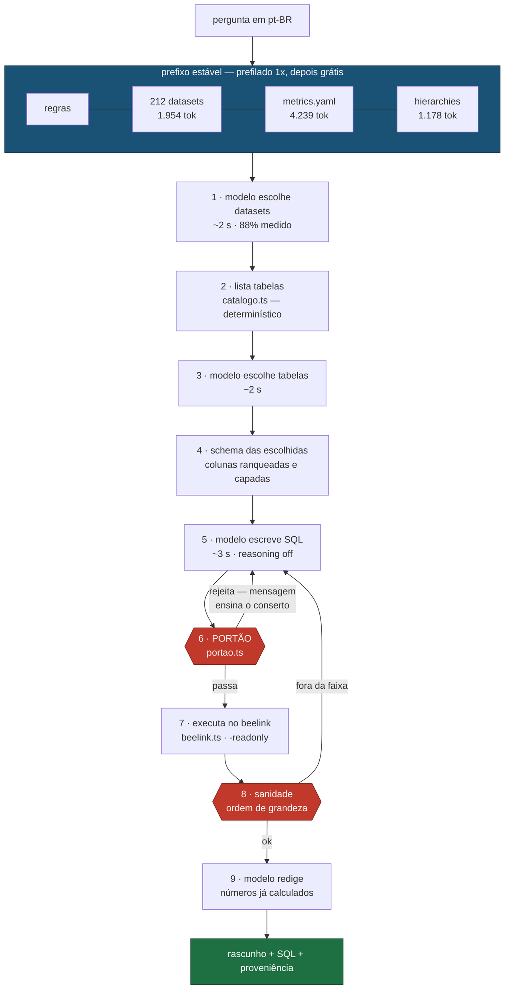
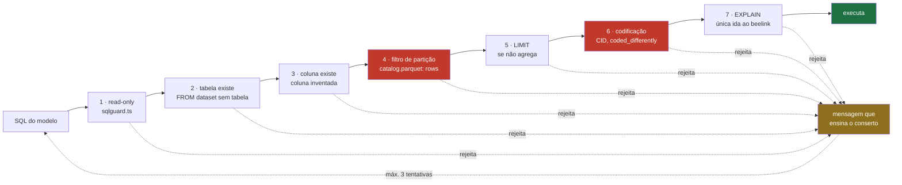

# `harness/` — apuração local com Gemma 4, sem API

Pergunta em pt-BR → datasets → schema → SQL → **portão** → número conferido → prosa.
Tudo no beelink, sem chamada de API paga.

Bun + TypeScript. As medições que sustentam cada escolha estão em
[`../gemma_stats.md`](../gemma_stats.md); o plano completo em
[`../tasks/harness_gemma_dsh.md`](../tasks/harness_gemma_dsh.md).

## O fluxo



O modelo é chamado em **quatro pontos curtos** (1, 3, 5, 9). Recuperação,
validação e execução são determinísticas — código, não julgamento do modelo.

## O portão

`checkReadOnly` sozinho valida tipo de statement e palavra proibida. Isso basta
enquanto quem dirige é uma pessoa, porque a disciplina de partição e de
codificação está em prosa no docstring do `run_sql`. **Prosa em docstring não é
enforcement para um modelo autônomo.**

As camadas rodam em ordem de custo — as locais primeiro, para que as tentativas
de reparo sejam gastas em erro real e não em ida à rede:



As duas camadas em vermelho existem por causa de erros **que o Gemma cometeu de
verdade**, medidos no beelink em 2026-09-01:

| Camada | O que o modelo escreveu | Por que é caro |
|---|---|---|
| **4 · partição** | `SELECT COUNT(*) FROM br_ms_sim.microdados` — sua primeira tool call | Varredura completa segura o lock do DuckDB por horas. O incidente de 2h do `CLAUDE.md` tem exatamente esta forma. |
| **6 · codificação** | `causa_basica BETWEEN 'X60' AND 'X84'` | CID é guardado **sem ponto** (`X840`), e `'X840' > 'X84'` — o grupo X84 some inteiro. **726 contra 789 reais: 8% a menos, com número plausível.** |

O segundo é o modo de falha que importa: não dá erro, dá um número que passa
despercebido. `harness/portao.test.ts` trava os dois casos.

## Por que catálogo no prefixo, e não busca por embedding

Medido contra o conjunto dourado do projeto:

| Estratégia de recuperação de dataset | Recall |
|---|---|
| `search_tables` — embedding doc2query | 52,9% |
| **catálogo de 212 nomes no prefixo** | **88%** |


Os nomes já são semânticos — `br_ms_sim` é Ministério da Saúde / Sistema de
Informação sobre Mortalidade. O embedding comprime isso num vetor e perde; ler a
lista literal não perde. E como o cache de prefixo do `llama-server` reaproveita
o KV do prefixo comum, os 212 nomes custam **uma vez**:

| chamada | tokens prefilados | tempo |
|---|---|---|
| 1ª (frio) | 1.165 | 19,5 s |
| 2ª | 5 | **0,44 s** |

Estabilidade do prefixo é, por isso, **restrição de arquitetura e não
otimização**: qualquer coisa variável no prefixo (timestamp, ordem não
determinística) evapora o 44x sem ninguém perceber.

## Módulos

| Arquivo | Papel |
|---|---|
| `catalogo.ts` | `catalog.parquet` (linhas por tabela → camada 4) + schema local (colunas). Cache em `dados/catalogo.json`; `bun harness/catalogo.ts --atualiza` |
| `portao.ts` | as 7 camadas |
| `sqlguard.ts` | `checkReadOnly` + `capRows` — porte fiel de `mcp_server.py`, trazido de `ask-web` |
| `beelink.ts` | executor SSH+DuckDB, **com `-readonly`** |

## Procedência e uma correção

`sqlguard.ts` e `beelink.ts` vêm do branch `ask-web`, onde já eram porte fiel do
`mcp_server.py`. As camadas 2 e 3 do portão são porte de
`validarTabelas`/`validarColunas` de `web/static/ask.js` do mesmo branch — lá
elas apanharam desses erros em produção primeiro.

**Uma correção aplicada na cópia:** `web/src/beelink.ts` do `ask-web` invoca o
DuckDB **sem `-readonly`**. A CLI pega lock exclusivo do arquivo mesmo num
`SELECT` puro, e uma conexão read-write bloqueia toda outra sessão no mesmo
`.duckdb` — inclusive as read-only. O `mcp_server.py:310` tem a flag com
comentário explicando; o porte a perdeu. Aqui está corrigida — **vale levar de
volta ao `ask-web`**.

## Rodar

```bash
bun test harness/                    # 40 testes
bun harness/catalogo.ts              # 212 datasets, 904 tabelas
bun harness/catalogo.ts --atualiza   # rebusca no beelink após um sync
```

O modelo é servido pelo `llama-server` no beelink — sempre **`-t 8`** (16 threads
é 31% pior e instável) e **`reasoning: off`** (ligado, o Gemma gastou 1.200
tokens e 94,8 s sem produzir SQL nenhuma; desligado, 3,4 s).
