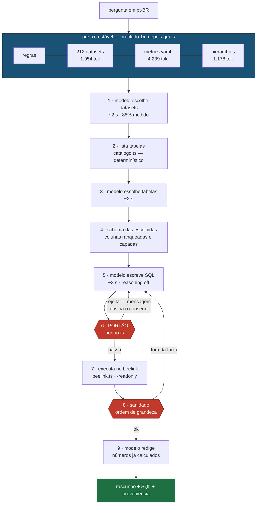
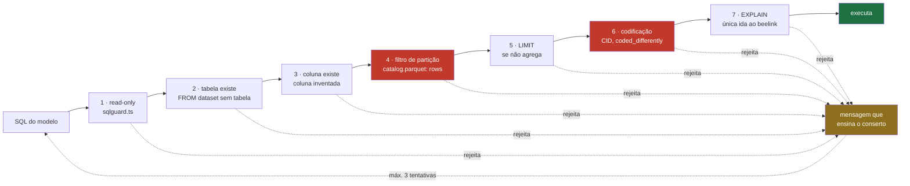

# `harness/` — apuração local com Gemma 4, sem API

Pergunta em pt-BR → datasets → schema → SQL → **portão** → número conferido → prosa.
Tudo no beelink, sem chamada de API paga.

Bun + TypeScript. As medições que sustentam cada escolha estão em
[`../gemma_stats.md`](../gemma_stats.md); o plano completo e o catálogo de
refino em [`tasks/`](tasks/README.md).

## O fluxo



O modelo é chamado em **quatro pontos curtos** (1, 3, 5, 9). Recuperação,
validação e execução são determinísticas — código, não julgamento do modelo.

## O portão

`checkReadOnly` sozinho valida tipo de statement e palavra proibida. Isso basta
enquanto quem dirige é uma pessoa, porque a disciplina de partição e de
codificação está em prosa no docstring do `run_sql`. **Prosa em docstring não é
enforcement para um modelo autônomo.**

As camadas rodam em ordem de custo — as locais primeiro, para que as tentativas
de reparo sejam gastas em erro real e não em ida à rede:



As duas camadas em vermelho existem por causa de erros **que o Gemma cometeu de
verdade**, medidos no beelink em 2026-09-01:

| Camada | O que o modelo escreveu | Por que é caro |
|---|---|---|
| **4 · partição** | `SELECT COUNT(*) FROM br_ms_sim.microdados` — sua primeira tool call | Varredura completa segura o lock do DuckDB por horas. O incidente de 2h do `CLAUDE.md` tem exatamente esta forma. |
| **6 · codificação** | `causa_basica BETWEEN 'X60' AND 'X84'` | CID é guardado **sem ponto** (`X840`), e `'X840' > 'X84'` — o grupo X84 some inteiro. **726 contra 789 reais: 8% a menos, com número plausível.** |

O segundo é o modo de falha que importa: não dá erro, dá um número que passa
despercebido. `harness/portao.test.ts` trava os dois casos.

## Por que catálogo no prefixo, e não busca por embedding

Medido contra o conjunto dourado do projeto:

| Estratégia de recuperação de dataset | Recall | Casos perfeitos |
|---|---|---|
| `search_tables` — embedding doc2query | 52,9% | — |
| catálogo de 212 nomes no prefixo | 91,3% | 85,7% |
| **+ 43 exemplos resolvidos no prefixo** | **97,8%** | **96,4%** |

Medido em 28 casos de teste, com `bun harness/avalia_datasets.ts [--fewshot]`.
Os exemplos vêm de `respostas.md` — ele não é só gabarito, ensina qual dataset
serve qual tipo de pergunta. Divisão treino/teste **por tema**, não por caso:
dentro de um tema as 5 perguntas são variações do mesmo cruzamento, então
dividir por caso deixaria o vizinho quase-idêntico no prefixo e mediria memória.

O few-shot é grátis **por pergunta**: o prefixo cresce para ~11k tokens e o
`prefill` medido continua em ~45 — só a pergunta é prefilada.


Os nomes já são semânticos — `br_ms_sim` é Ministério da Saúde / Sistema de
Informação sobre Mortalidade. O embedding comprime isso num vetor e perde; ler a
lista literal não perde. E como o cache de prefixo do `llama-server` reaproveita
o KV do prefixo comum, os 212 nomes custam **uma vez**:

| chamada | tokens prefilados | tempo |
|---|---|---|
| 1ª (frio) | 1.165 | 19,5 s |
| 2ª | 5 | **0,44 s** |

Estabilidade do prefixo é, por isso, **restrição de arquitetura e não
otimização**: qualquer coisa variável no prefixo (timestamp, ordem não
determinística) evapora o 44x sem ninguém perceber.

## Por que laço agêntico, e não pipeline fixo

A comparação que decide o desenho — mesmas 5 perguntas, mesmo modelo, mesmo
portão, mesmo beelink; muda só quem decide a sequência de passos:

| | harness + MCP (agêntico) | pipeline fixo (`laco.ts`) |
|---|---|---|
| **Correto** | **3/3 = 100%** | **0/3 = 0%** |
| Tempo | ~400 s | 61 s |

O pipeline fixo é 14x mais rápido e não serve. As três falhas dele nomeiam o que
o laço faz de essencial, e **nenhuma é erro de SQL**: respondeu 573 em vez de 789
(agrupou por sexo e reportou um grupo só); devolveu o código `3550308` em vez de
"São Paulo", por não ir ao diretório; e bateu 4x no portão sem recuperar. São
erros de não iterar.

Rode você mesmo com `bun harness/compara.ts <arquivo>` — em sequência, nunca em
paralelo, senão os dois disputam o mesmo `llama-server` e o tempo sai errado.

## O contexto é o gargalo

| | 2k de contexto | ~18k (dentro do laço) |
|---|---|---|
| Prefill | 50,5 t/s | 15 t/s |
| Geração | 13,3 t/s | 9 t/s |

Cai ~3x. Medido com o CLI agêntico usado antes de `agente.ts` (removido — ver
"Módulos" abaixo): o system prompt dele era **14.213 tokens**; desligar as
ferramentas que este harness não usa levou a **6.849** — corte de 52%, com a
correção intacta e ~30% menos tempo por pergunta. O laço atual (`agente.ts`)
nunca inclui essas ferramentas — a persona sozinha fica bem abaixo disso.

Duas dessas ferramentas eram um buraco, não só peso: o modelo descobriu a `bash`
e escreveu `ssh beelink '~/bin/duckdb ...'` direto, **passando por cima do portão
inteiro**. Todo o trabalho de validação vira decoração se o modelo tem shell.

## Módulos

| Arquivo | Papel |
|---|---|
| `catalogo.ts` | `catalog.parquet` (linhas por tabela → camada 4) + schema local (colunas). Cache em `dados/catalogo.json`; `bun harness/catalogo.ts --atualiza` |
| `portao.ts` | as 7 camadas |
| `sqlguard.ts` | `checkReadOnly` + `capRows` — porte fiel de `mcp_server.py`, trazido de `ask-web` |
| `beelink.ts` | executor SSH+DuckDB, **com `-readonly`** |
| `metricas.ts` | os 12 cálculos verificados de `metrics.yaml` — busca exata por nome ou sinônimo, nunca por similaridade |
| `anos.ts` | faixa de anos por tabela (377 cacheadas) |
| `pontes.ts` | dicas de join das pontes conferidas de `bridges.yaml` |
| `mcp.ts` | servidor MCP: 5 ferramentas, o portão entre elas |
| `agente.ts` | o laço agêntico — persona, modelo/provider (`pi-ai`), cliente MCP falando com `mcp.ts` por stdio. Substitui o CLI agêntico usado antes (removido) |
| `laco.ts` | o pipeline fixo — **não é caminho de produção** (0/3 contra 3/3 do agêntico). Sobrevive por um motivo nomeado: é o esqueleto do experimento DuckDB-NSQL-7B de `tasks/check-qwencoder-vs-duckdbnsql.md`, que precisa de um apurador sem agente e sem MCP. Se aquele experimento fechar sem usá-lo, remover — a comparação que ele provou já está registrada aqui e em `tasks/regras.md`, e o código sai por `git show` |
| `lote.ts` / `compara.ts` | benchmark de perguntas abertas |

## Procedência e uma correção

`sqlguard.ts` e `beelink.ts` vêm do branch `ask-web`, onde já eram porte fiel do
`mcp_server.py`. As camadas 2 e 3 do portão são porte de
`validarTabelas`/`validarColunas` de `web/static/ask.js` do mesmo branch — lá
elas apanharam desses erros em produção primeiro.

**Uma correção aplicada na cópia:** `web/src/beelink.ts` do `ask-web` invoca o
DuckDB **sem `-readonly`**. A CLI pega lock exclusivo do arquivo mesmo num
`SELECT` puro, e uma conexão read-write bloqueia toda outra sessão no mesmo
`.duckdb` — inclusive as read-only. O `mcp_server.py:310` tem a flag com
comentário explicando; o porte a perdeu. Aqui está corrigida — **vale levar de
volta ao `ask-web`**.

## Rodar uma pergunta

```bash
bun harness/pergunte.ts "Quantos óbitos por suicídio houve no RJ em 2020, por sexo?"
```

Sai a resposta em prosa, com os números que o modelo apurou. Espere **~5 a 10
min**: o tempo está no laço agêntico (uns 8 turnos de modelo a ~9 t/s), não numa
consulta lenta. Se o `llama-server` não estiver de pé, o comando diz exatamente o
que subir.

Passa pelo caminho agêntico de propósito — ver a comparação acima.

## Rodar

```bash
bun test harness/                    # 56 testes
bun harness/catalogo.ts              # 212 datasets, 904 tabelas
bun harness/catalogo.ts --atualiza   # rebusca no beelink após um sync
bun harness/anos.ts --atualiza       # faixa de anos por tabela

bun harness/avalia_datasets.ts       # escolha de dataset nas 274 perguntas
bun harness/lote.ts <arquivo>        # perguntas abertas pelo laço agêntico, com gabarito
bun harness/compara.ts <arquivo>     # agêntico contra pipeline fixo
```

O arquivo de perguntas do `lote.ts` e do `compara.ts` é uma por linha, com o
valor esperado depois de um TAB quando houver:

```
Quantos óbitos por suicídio houve no RJ em 2020?	789
Qual foi o PIB per capita médio dos municípios de MG em 2020?	32066
Quantos CAPS existem por estado no CNES?
```

Sem o valor esperado o caso ainda roda, mas só mede se **respondeu** — nunca se
acertou. Foi assim que uma resposta "não foram encontrados óbitos" entrou como
sucesso quando o certo era 789.

O modelo é servido pelo `llama-server` no beelink:

```bash
llama-server -m ~/llm/gemma-4-26B_q4_0-it.gguf \
  -t 8 -c 32768 -np 1 \
  --chat-template-kwargs '{"enable_thinking":false}' \
  --host 127.0.0.1 --port 8099
```

Cada flag aí é uma medição, não gosto:

- **`-t 8`**, nunca 16: os 8 núcleos físicos já saturam a banda; com 16 o prefill
  cai 32%, a geração 31%, e o desvio-padrão cresce 10x.
- **`-np 1`**: o `-c` é **por slot**. Com os 4 slots padrão, `-c 65536` aloca 4x
  o KV sem avisar.
- **`--chat-template-kwargs`**: é o único jeito de desligar o raciocínio do Gemma.
  `reasoning: false` no modelo (`agente.ts`, `pi-ai`) declara o modelo como
  não-raciocinante *para o cliente* e não manda nada ao llama.cpp; `--reasoning
  off` também não resolve. Medido: 20,9 s → 4,7 s por turno de tool calling,
  com o tool call intacto.
- **sem `-ctk/-ctv q8_0`**: KV quantizado sai caro em CPU — desquantizar a cada
  operação de atenção domina o que economiza em banda. Prefill 15,8 → 50,5 t/s.

Do mac, abra o túnel antes (o servidor escuta só em loopback, de propósito):

```bash
ssh -f -N -L 8099:127.0.0.1:8099 beelink
```

As checagens de operação — o que quebra calado e o detector de cada coisa — estão
em [`tasks/operacao.md`](tasks/operacao.md).
