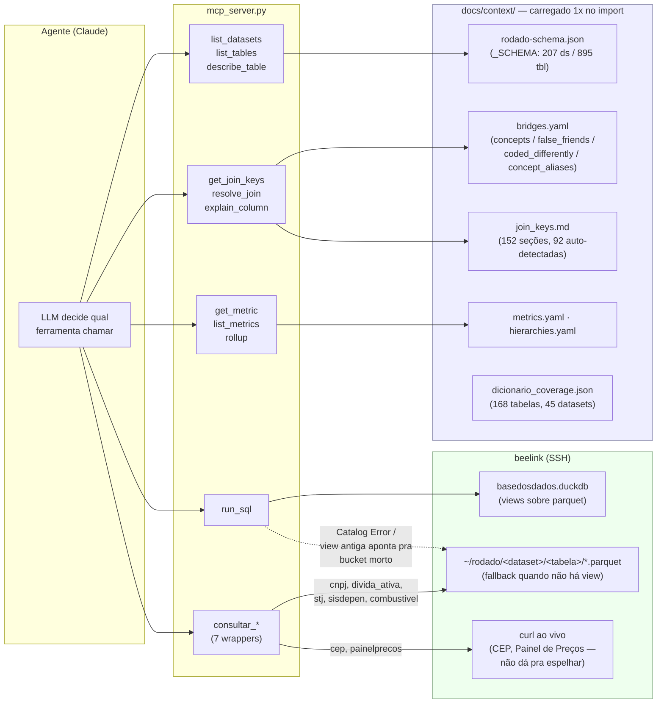
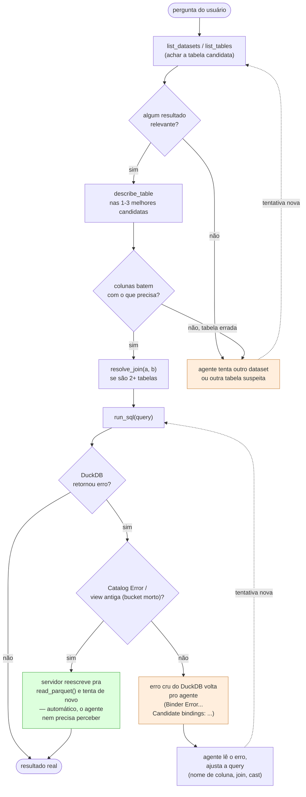

# MCP — o servidor de ferramentas sobre o espelho

`mcp/mcp_server.py`. Expõe o catálogo (`docs/context/`) e o
espelho DuckDB do beelink como ferramentas MCP para um agente (Claude
Desktop/Claude Code) — não é uma API REST, é uma lista de funções que um
modelo de linguagem chama em sequência, decidindo a cada passo qual chamar a
seguir a partir do resultado da anterior.

Números de hoje (2026-09-25): 236 datasets, 1.048 tabelas, 60 conceitos de join
documentados, 20 false friends, 7 métricas nomeadas, 3 hierarquias de rollup,
17 ferramentas ao todo. Nunca abre conexão DuckDB local — toda query roda no
`~/bin/duckdb` do beelink via SSH (ver `_run_sql_ssh`). Tudo local: parquet
em disco no beelink, sem storage em nuvem — é lá que dado recém-raspado
aparece primeiro.

## Como ler este documento

Dois diagramas, cada um respondendo uma pergunta diferente:

1. **Arquitetura** — de onde cada ferramenta puxa dado (arquivo local vs SSH).
2. **O loop de iteração** — o que faz uma tentativa falha virar uma tentativa
   nova, e a diferença entre o que o *servidor* corrige sozinho e o que só o
   *agente* corrige.

---

## 1 · Arquitetura

Duas fontes de dado completamente separadas: arquivos estáticos carregados
uma vez na inicialização (`docs/context/*`, pequenos, cabem em memória) e o
SSH para beelink (a única forma de tocar dado real — parquet ou o catálogo
DuckDB de views).

**Por que dois caminhos para `run_sql`** — nem toda tabela do catálogo tem
view dentro de `basedosdados.duckdb` (dataset raspado independente do
espelho oficial da Base dos Dados cai primeiro em parquet puro). Quando o
DuckDB devolve `Catalog Error` ou uma view é um resquício de antes da
migração pra parquet local e aponta pra um bucket que não existe mais,
`run_sql` reescreve as referências `dataset.tabela` da própria query pra
`read_parquet(...)` e tenta de novo uma vez — automático, sem o agente
precisar perceber a distinção.

**Por que `-readonly` na conexão** — DuckDB toma um lock exclusivo no
arquivo `.duckdb` mesmo para um `SELECT` puro, a menos que a conexão seja
aberta com `-readonly`; qualquer conexão read-write bloqueia TODAS as
outras, inclusive tentativas read-only, até desconectar (várias sessões
deste projeto — humanas e de agente — costumam consultar o mesmo beelink ao
mesmo tempo). `_run_sql_ssh` já garante no nível SQL que nada escreve
(`_check_read_only`), então abrir a conexão em `-readonly` não perde nada e
elimina o lock exclusivo — corrigido em 2026-08-24 depois de um lock real de
outra sessão travar um teste cego por >1h (ver `tasks/done/mcp_search_refino.md`).
Um erro de lock depois desse fix significa que OUTRO processo abriu a
conexão sem `-readonly` — esperar, nunca `kill`: é quase sempre trabalho
real de outra sessão, não uma query travada.

---

## 2 · O loop de iteração

Uma primeira escolha de tabela errada não é o fim da história para um agente
real. Há dois tipos de
correção bem diferentes — uma automática dentro do próprio servidor, outra
que só existe porque o agente decide tentar de novo.

Verde = o servidor resolve sozinho (`_rewrite_to_read_parquet`, automático,
sem envolver o modelo). Laranja = correção que só acontece porque o agente
tem raciocínio e paciência para tentar de novo — nada no código força essa
volta, ela existe só quando quem está do outro lado é um agente e não um
único call-and-forget. É por isso que `run_sql` devolve o erro **cru** do
DuckDB (`tasks/done/mcp_search_refino.md` item 4): resumir a mensagem pra "mais
amigável" quebraria exatamente esse laço de correção laranja.

---

## 3 · O que já foi medido, e o que isso realmente prova

| Métrica | O que mede | Resultado | O que NÃO prova |
|---|---|---|---|
| `docs/pesquisa/hipoteses/respostas.md` (106 perguntas ✅/◐ de `docs/pesquisa/hipoteses/perguntas.md`) | Se o **dado** existe e junta corretamente, dado que quem escreveu a query já sabia o nome das tabelas (schema lido, não descoberto) | ~106/220 respondidas com query real no beelink | Nada sobre a descoberta de tabela — ela nunca passou pelas ferramentas do MCP |

A busca semântica que existia (`search_tables`, sobre um índice doc2query de
6.464 perguntas sintéticas) saiu em 2026-09-24: acertava o dataset em ~53%
das perguntas, contra 88% do catálogo de datasets posto direto no prompt pelo
harness (`harness/catalogo.ts`), cobria só 832 das 1.029 tabelas e era ~4% das
chamadas. Achar a tabela hoje é `list_datasets` → `list_tables` →
`describe_table`.

---

## 4 · Inventário de ferramentas

| Ferramenta | Fonte | Propósito |
|---|---|---|
| `list_datasets` | `_SCHEMA` (schema.json) | Catálogo completo, contagem de tabelas por dataset |
| `list_tables` | `_SCHEMA` | Tabelas de um dataset, com sugestão por proximidade em caso de erro de nome |
| `describe_table` | `_SCHEMA` + `_duplicated()` + `_DICIONARIO_COVERAGE` + `_CODED_DIFFERENTLY` | Colunas de uma tabela, mais três avisos que a lista nua esconderia (linha duplicada, coluna decodificável, código que diverge entre datasets) |
| `get_join_keys` | `join_keys.md` (152 seções) | Índice de colunas de join documentadas, ou seção completa por coluna |
| `resolve_join` | `bridges.yaml` + `join_keys.md` | Cláusula `ON` pronta entre duas tabelas — bridges primeiro, depois match direto, com `rejected` explícito pra false friends |
| `explain_column` | `bridges.yaml` (`false_friends`/`coded_differently`/`concepts`) | Por que uma coluna comum (`valor`, `id`, `numero`) NÃO é chave de join; ou, pra `sexo`/`raca_cor`/etc., por que o CÓDIGO não atravessa datasets mesmo o conceito sendo o mesmo |
| `get_metric` | `metrics.yaml` (7 métricas) | Cálculo nomeado — SQL, grão, filtros obrigatórios — por nome ou sinônimo pt-BR |
| `list_metrics` | `metrics.yaml` | Todas as métricas nomeadas |
| `rollup` | `hierarchies.yaml` (3 hierarquias) | Expressão pra subir um código de classificação um nível (CNAE, CID-10) |
| `run_sql` | beelink via SSH | Execução real — só SELECT/WITH, fallback automático pra `read_parquet()` |
| `consultar_cnpj` | `br_me_cnpj/*` (parquet) | Empresa + estabelecimentos + sócios por CNPJ |
| `consultar_cep` | ViaCEP (live, via SSH) | Endereço por CEP — não há base bulk pra espelhar |
| `consultar_divida_ativa` | `br_pgfn_dividaativa/divida` | Dívida ativa federal por CPF/CNPJ |
| `consultar_precos_combustivel` | `br_anp_combustiveis/precos` | Preço de combustível por posto/produto/data |
| `consultar_jurisprudencia_stj` | `br_stj_dadosabertos/documentos` | Decisões do STJ por processo/ministro/assunto |
| `consultar_populacao_carceraria` | `br_mjsp_sisdepen/populacao_carceraria` | Censo prisional por UF/ciclo |
| `consultar_painelprecos` | ComprasGov (live, via SSH) | Preço de compra pública por código CATMAT/CATSER — API por item, sem "tabela completa" pra espelhar |

## 5 · Onde isso já quebrou, e o que foi corrigido

Achados confirmados em código (não por analogia) em `tasks/done/mcp_search_refino.md`,
todos fechados em 2026-08-24:

1. **Índice quebrado** (item 1) — trocado por um índice doc2query, que por
   sua vez saiu em 2026-09-24 junto com o `search_tables` (ver seção 3).
2. **`describe_table` mudo sobre tabela duplicada** (item 2) — hoje carrega
   `warning` mesmo fora de `resolve_join`.
3. **Colunas cruas do censo histórico** (item 3) — `dicionario_coverage`
   apontava só pras 10 tabelas do censo IBGE onde `v0502` etc. têm
   decodificação disponível.
4. **Código que diverge por dataset para o mesmo conceito** — achado ao vivo
   num teste cego do MCP em 2026-08-24: uma query reusou `sexo='2'`
   (feminino no RAIS) contra o CAGED, onde `'2'` não existe (feminino é
   `'3'`) — devolveu 0 linhas em silêncio, quase virando um "achado"
   fabricado. Investigação sistemática sobre os 44 datasets com tabela
   `dicionario` própria confirmou 7 conceitos com o mesmo problema (`sexo`,
   `raca_cor`, `estado_civil`, `faixa_etaria`, `nacionalidade`, `rede`,
   `tipo_estabelecimento`) — inclusive um caso pior: `br_inep_enem` usa DUAS
   convenções diferentes pra `sexo` em anos diferentes da MESMA tabela
   (`0`/`1` numérico invertido, depois `M`/`F` literal). Duas correções:
   `gera_dicionario_coverage.py` generalizado de 1 dataset (censo IBGE) pra
   45 (168 tabelas, 6.256 colunas decodificáveis — item 3 virou um caso
   particular deste); e `bridges.yaml` ganhou uma seção nova,
   `coded_differently`, servida por `explain_column` e por um bloco novo
   `coded_value_warning` em `describe_table` — para essas 7 colunas, avisa
   *antes* da query, não só quando perguntado.

O que ficou documentado como *não* mexer: `run_sql` devolve erro cru (seção
2), `get_metric` é lookup direto sem parser de frase, `resolve_join` rejeita
explicitamente em vez de silenciar false friends.
