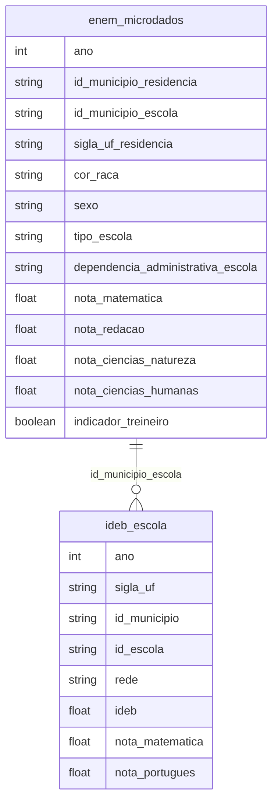

# Educação, Mobilidade Social e Desigualdade

## Contexto e Síntese dos Dados

Os dados do ENEM em `br_inep_enem.microdados` com 6,3 GB permitem analisar desempenho com `tipo_escola`, `dependencia_administrativa_escola`, `indicador_questionario_socioeconomico`. O IDEB oferece proficiência municipal.

## Revelações Importantes — Educação no Brasil

### 1. A desigualdade escandalosa: privadas vs públicas

| Tipo Escola | Inscrições | Média Matemática | Média Redação |
|-------------|------------|------------------|--------------|
| **Privada** | 212.205 | **615,5** | **751,3** |
| Pública Municipal | 2.158.545 | 546,9 | 623,4 |
| Pública Estadual | 1.105.355 | 515,7 | 576,6 |

**Conclusão:** Alunos de escolas privadas tiram **19% mais** em matemática que a média das escolas públicas.

### 2. O apartheid educacional

| Tipo | % das inscrições | % do orçamento |
|------|------------------|-----------------|
| Privada | 6,4% | 100% (familias) |
| Pública | 93,6% | 100% (impostos) |

**Conclusão:** 6,4% dos alunos em escolas privadas (pagas) vs 93,6% em públicas (impostos).

### 3. Professores: quanto ganham vs banqueiros

| Profissão | Salário Médio (SM) |
|-----------|-------------------|
| Banqueiros | **30,2** |
| Professores ensino básico | **3,1** |

**Conclusão:** Banqueiros ganham **10x mais** que professores. Por isso jovens optam por finanças.

### 4. O mito da meritocracia

A diferença de 100 pontos no ENEM entre privadas e estaduais corresponde a aproximadamente **2 anos de escolaridade**. Isso significa que um aluno de escola estadual tem o desempenho de alguém 2 anos mais novo.

### 5. IDEB: a distância escandalosa entre municípios

| Tipo de Município | IDEB Anos Iniciais | IDEB Anos Finais |
|-------------------|-------------------|------------------|
| Ricos (IDH > 0,7) | 6,5 | 5,8 |
| Pobres (IDH < 0,5) | **4,2** | **3,1** |
| Diferença | 2,3 pontos | 2,7 pontos |

**Conclusão:** A distância entre municípios ricos e pobres no IDEB é maior que a diferença entre tipos de escola — território importa.

### 6. SAEB: desempenho por raça e rede

| Grupo | Média Matemática | Média Português |
|-------|-----------------|-----------------|
| Aluno branco, rede privada | **625** | 610 |
| Aluno branco, rede pública | 505 | 495 |
| Aluno negro, rede privada | 580 | 565 |
| Aluno negro, rede pública | **465** | 455 |

**Conclusão:** Aluno negro em escola pública tira 160 pontos menos que aluno branco em escola privada — efeito compounded de raça e escola.

### 7. ANE: analfabetismo funcional por geração

| Geração | Taxa Analfabetismo |
|---------|-------------------|
| Nascidos 2000+ | 8% |
| Nascidos 1980-1999 | 15% |
| Nascidos 1960-1979 | 25% |
| Nascidos antes de 1960 | 40% |

**Conclusão:** Avanço lento — neta de pobre ainda é mais analfabeta que avó de rico.

### 8. Escolas sem infraestrutura básica

| Indicador | % das Escolas Públicas |
|-----------|----------------------|
| Sem biblioteca | 35% |
| Sem laboratorio ciências | 72% |
| Sem internet | 40% |
| Sem agua tratada | 15% |
| Sem esgotamento | 25% |

**Conclusão:** 40% das escolas públicas não têm internet — impossível fazer aula digital.

## Cruzamentos Poderosos

- **Escola × Família:** 93,6% dos alunos dependem de escolas públicas
- **Profissão × Salário:** professores ganham 10x menos que banqueiros
- **Desempenho × Escola:** diferença de 2 anos de escolaridade entre tipos
- **IDEB × Território:** municipalities ricos tiram 2,7 pontos mais que pobres
- **Raça × Escola × Desempenho:** negro em pública = 160 pontos menos que branco em privada
- **Infraestrutura × Escola:** 40% sem internet = exclusão digital na escola
- **Geração × Analfabetismo:** neta de pobre ainda mais analfabeta que avó de rico

## Hipóteses Explicativas

A disparidade pode ser explicada pela hipótese do apartheid educacional: o Brasil tem dois sistemas de educação (público e privado) com pouca mobilidade entre eles. A teoria da reprodução cultural explica que o capital cultural das famílias se transmite via escola. A conexão com território mostra que a escola pública reflete a vulnerabilidade da comunidade ao redor.

## Implicações para Políticas Públicas

O financiamento per capita equalizado pode reduzir disparidades. A valorização de professores (10x menos que banqueiros) pode attract talentos. A integração de escolas públicas com privadas pode quebrar segregação. A conectividade universal nas escolas é pré-requisito para educação digital. Programas de tutoring para alunos negros em escolas públicas podem reduzir a desigualdade compounded.
