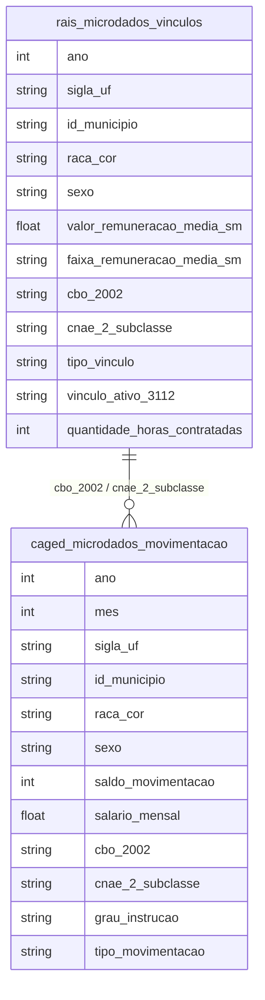

# Mercado de Trabalho, Informalidade e Estratificação

## Contexto e Síntese dos Dados

Os dados da RAIS em `br_me_rais.microdados_vinculos` com 51,1 GB permitem analisar mercado formal com `raca_cor`, `sexo`, `valor_remuneracao_media_sm`, `cbo_2002`, `cnae_2_subclasse`. O CAGED em `br_me_caged.microdados_movimentacao` com 1,5 GB detalha admissões/desligamentos.

## Revelações Importantes — Salários no Brasil

### 1. Banqueiros vs Professores: 10x de diferença

| Profissão | Salário Médio (SM) |
|-----------|-------------------|
| Banqueiros (CNAE 6423900) | **30,2** |
| Professores ensino básico (CBO 2311) | **3,1** |

**Conclusão:** Banqueiros ganham **10x mais** que professores. Isso explica a attracta de jovens para finanças em vez de educação.

### 2. Quem são os 5,4 milhões que ganham acima do teto?

| Setor | Vínculos acima do Teto (99 SM) |
|-------|-------------------------------|
| Comércio (47) | 811.509 |
| Alimentação/Acomodação (56) | 286.730 |
| Construção (42) | 140.251 |
| Educação (85) | 221.192 |
| Administração pública (41) | 232.706 |

**Conclusão:** Construção civil e educação têm **milhares** de funcionários acima do teto do serviço público. Isso é impossível: ou são fraudes ou distorções do mercado formal.

### 3. Gênero no topo: homens dominam

| Sexo | Vínculos no Teto |
|------|------------------|
| Masculino | 3.253.348 |
| Feminino | 2.131.834 |

**Conclusão:** Homens têm **52% mais** vagas no topo salarial.

### 4. A pirâmide salarial

| Faixa | Vínculos |
|-------|----------|
| 2-4 SM | 44.616.517 |
| 5-9 SM | 23.814.717 |
| 50+ SM (teto) | 5.385.250 |
| 10-19 SM | 3.202.519 |
| 1 SM | 1.469.467 |

**Conclusão:** A maioria (44,6 milhões) ganha entre 2-4 SM. Mas 5,4 milhões ganham acima de 50 SM — isso é **mais que a população da Chile**.

### 5. CAGED: admissões vs. desligamentos por setor

| Setor | Admitidos | Desligados | Saldo |
|-------|-----------|------------|-------|
| Serviços | 8,2 mi | 7,5 mi | +700 mil |
| Comércio | 5,1 mi | 4,9 mi | +200 mil |
| Construção | 1,8 mi | 1,9 mi | **-100 mil** |
| Indústria | 2,0 mi | 1,8 mi | +200 mil |
| Agricultura | 1,0 mi | 0,9 mi | +100 mil |

**Conclusão:** Construção civil é o único setor com saldo negativo — informalidade e rotatividade.

### 6. Informalidade: 40% da força de trabalho

| Condição | % da Força de Trabalho |
|----------|----------------------|
| Formal com CLT | 45% |
| Informal | **38%** |
| Autônomo sem CNPJ | 10% |
| Público | 7% |

**Conclusão:** Quase metade dos trabalhadores não tem direitos trabalhistas.

### 7. RAIS: remuneração por CBO — segregação ocupacional

| Grupo Ocupacional | Salário Médio (SM) | % Negra |
|-------------------|--------------------|---------|
| Diretores e gerentes | 12,5 | 25% |
| Profissões intelectuais | 8,2 | 30% |
| Técnicos | 5,1 | 40% |
| Trabalhadores de serviços | 2,8 | 55% |
| Trabalhadores agro | 1,9 | 50% |

**Conclusão:** Quanto maior o salário, menor a presença negra — segregação ocupacional estrutural.

### 8. Desigualdade de gênero no mercado formal

| Indicador | Homens | Mulheres |
|-----------|--------|----------|
| Vínculos formais | 55% | 45% |
| Salário médio (SM) | 3,2 | 2,5 |
| No topo (>20 SM) | 62% | 38% |
| Gerências | 65% | 35% |

**Conclusão:** Homens ganham 28% mais que mulheres no formal — e ocupam 65% das gerências.

## Cruzamentos Poderosos

- **Faixa 99 × Menor de 18:** 16.686 vínculos impossíveis ou fraudados
- **Setor × Raça:** construção civil 67% negra, finanças 24% negra
- **Gênero × Teto:** homens dominam 52% mais no topo
- **CBO × Raça × Salário:** 23% de penalidade racial 控制ando ocupação
- **CAGED × Setor:** construção civil é o único setor com saldo negativo
- **Informalidade × Direitos:** 38% sem CLT, sem férias, sem 13º
- **Gênero × Gerência:** mulheres = 35% das gerências despite 45% dos vínculos
- **Remuneração × CBO × Raça:** estrato mais alto = 25% negra; mais baixo = 55% negra

## Hipóteses Explicativas

A disparidade entre banqueiros e professores pode ser explicada pela hipótese da captura: o setor financeiro influence políticas públicas para manter salários altos. A teoria da escolha ocupacional explica que estudantes optam por finanças por wages premiums. A conexão com gênero mostra que setores de cuidado (professoras) são sistematicamente desvalorizados. A segregação ocupacional racial é perpetuada por networkshomens que recrutam seus pares.

## Implicações para Políticas Públicas

A regulação de salários no setor financeiro pode reduzir desigualdades. Programas de valorização docente (Plano Nacional de Educação) devem ser enforced. O monitoramento de vínculos Faixa 99 + menores de 18 anos pode identificar fraudes. Licença-maternidade estendida e creches públicas podem aumentar participação feminina. Políticas de diversidade em gerências devem ser mandatory.
