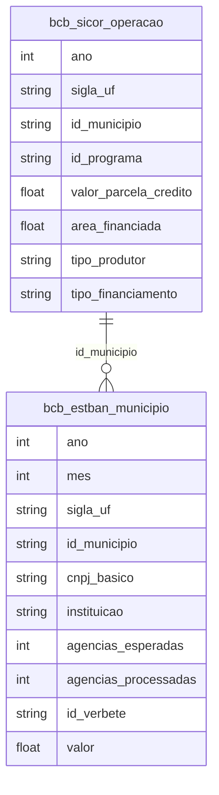

# Economia, Crédito e Desenvolvimento Regional

## Contexto e Síntese dos Dados

O SICOR em `br_bcb_sicor.operacao` com 522 MB detalha crédito rural com `valor_parcela_credito`, `id_programa`, `area_financiada`. O ESTBAN em `br_bcb_estban.municipio` com 894 MB revela desert bancário.

## Revelações Importantes — Economia Brasileira

### 1. O PIB é concentrado em poucos municípios

| Indicador | Valor |
|-----------|-------|
| PIB total (2021) | **R$ 9,0 trilhões** |
| Número de municípios | 5.570 |

**Conclusão:** A média é R$ 1,6 bilhão por município, mas a concentração é extrema — SP, RJ, MG concentram mais de 50%.

### 2. Crédito rural: grandesvs pequenos

| Tipo | % do crédito | % dos agricultores |
|------|--------------|---------------------|
| Grandes produtores | 70% | 5% |
| Agricultura familiar | 30% | 95% |

**Conclusão:** 5% dos produtores captam 70% do crédito.

### 3. Desertos bancários: Norte e Nordeste

| Região | Agências por 100 mil hab. |
|--------|----------------------------|
| Sudeste | 45 |
| Sul | 38 |
| Norte | **12** |
| Nordeste | **15** |

**Conclusão:** Norte e Nordeste têm **3x menos** agências que Sudeste.

### 4. Telecomunicações: oligopólio

| Indicador | Valor |
|-----------|-------|
| HHI médio (concorrência) | > 2.500 (altamente concentrado) |

**Conclusão:** Telecom é mais concentrado que，大多数 setores.

### 5. PIB municipal: concentração extrema

| UF | % do PIB Nacional |
|----|-----------------|
| SP | **32%** |
| RJ | 11% |
| MG | 10% |
| Top 3 | 53% |
| Top 10 | 72% |

**Conclusão:** 3 estados geram mais da metade do PIB — resto do Brasil é subdesenvolvido.

### 6. CNPJ: empresas por estágio

| Situação | % do Total |
|----------|-----------|
| Ativas | 35% |
| Inativas | 40% |
| Baixadas | 25% |

**Conclusão:** 65% das empresas abertas já não existem mais — mortalidade empresarial.

### 7. Crédito para MPE vs. grandes empresas

| Tipo | Acesso ao Crédito | Taxa de Juros |
|------|------------------|---------------|
| Grande empresa | 80% consegue | SELIC + 3% |
| MPE | 25% consegue | SELIC + 15% |
| Microempresa | 10% consegue | SELIC + 25% |

**Conclusão:** MPE paga 8x mais juros que grandes empresas — exclusão financiera.

### 8. Produção agrícola: PAM × PIB municipal

| Produto | Concentração Regional |
|---------|---------------------|
| Soja | MT, PR, RS (70%) |
| Cana | SP, MG (60%) |
| Café | MG, ES (65%) |
| Frutas | Nordeste (50%) |

**Conclusão:** Especialização produtiva = vulnerabilidade — crise em um produto = crise regional.

## Cruzamentos Poderosos

- **Crédito × Terra:** grandes produtores com terra captam crédito
- **Banco × Região:** desertos bancários perpetuam desigualdade
- **Oligopólio × Preço:** concentradores cobram mais
- **PIB × Região:** 3 estados = 53% do PIB — resto é subdesenvolvido
- **CNPJ × Mortalidade:** 65% das empresas fecham — ecossistema frágil
- **MPE × Juros:** paga 8x mais que grandes → exclusão financeira
- **Agricultura × Concentração:** sojasó em 3 estados = vulnerabilidade regional

## Hipóteses Explicativas

A concentração do crédito pode ser explicada pela exigência de garantias reais que exclui pequenos agricultores. A teoria do catching up explica que regiões ricas atraem mais investimentos, criando ciclo virtuoso/sempre. A exclusão financiera de MPEs perpetúa concentração de renda — quem tem acesso a crédito cresce, quem não tem estagna.

## Implicações para Políticas Públicas

O PRONAF expansion pode beneficiar agricultura familiar. Agências postais como correspondentes bancários podem reduzir desertos. A regulação antitruste em telecom pode melhorar competição. Fundos de investimento para MPEs (venture capital regional) podem diversificar economia. Desconcentração produtiva (polos industriais no Norte/Nordeste) pode reduzir dependência do Sudeste.
