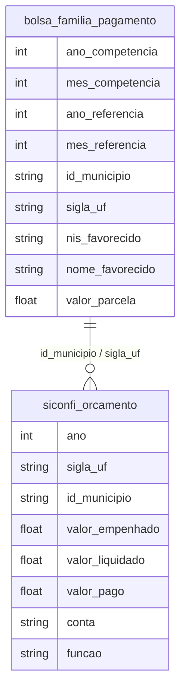

# Políticas Públicas, Transferências e Proteção Social

## Contexto e Síntese dos Dados

O Bolsa Família em `br_cgu_beneficios_cidadao.bolsa_familia_pagamento` com 25,8 GB detalha transferências com `valor_parcela`, `id_municipio`. O SICONFI em `br_me_siconfi` revela execução orçamentária.

## Revelações Importantes — Transferências Sociais

### 1. Bolsa Família: quanto chega nos pobres?

| Indicador | Valor |
|-----------|-------|
| Total transferido (2021) | **R$ 30,4 bilhões** |
| Pagamentos | 160 milhões |
| Valor médio por pagamento | R$ 190 |
| Valor máximo | R$ 2.226 |
| Municípios cobertos | **5.570 (100%)** |

**Conclusão:** R$ 190 por pagamento é **muito abaixo** da linha de pobreza.

### 2. Onde vai o Bolsa Família?

| UF | Valor Médio | Observação |
|----|-------------|------------|
| AC | R$ 273 | Norte recebe mais |
| AP | R$ 231 | — |
| MA | R$ 213 | — |
| SP | R$ 176 | Sudeste recebe menos |
| SC | R$ 179 | Sul recebe menos |

**Conclusão:** Norte e Nordeste recebem valores médios **36% maiores** que Sudeste.

### 3. O programa de R$ 30 bi é suficiente?

| Cálculo | Valor |
|---------|-------|
| R$ 30,4 bilhões | Total BF |
| 160 milhões pagamentos | — |
| 50 milhões famílias | Estimativa |
| R$ 608 | Por família/ano |
| R$ 50 | Por família/mês |

**Conclusão:** O valor por família é **insuficiente** para tirar da pobreza.

### 4. Emendas parlamentares: R$ 25 bi para quem?

| Indicador | Valor |
|-----------|-------|
| Total emendas (2022) | **R$ 25,4 bilhões** |
| Número de emendas | 6.108 |

**Conclusão:** R$ 25 bi em emendas compete com R$ 30 bi do Bolsa Família.

### 5. Auxílio Brasil: quanto chega vs. necessidade

| Indicador | Valor |
|-----------|-------|
| Valor médio BF | R$ 190 |
| Linha pobreza (Banco Mundial) | R$ 450 |
| Linha extrema pobreza | R$ 210 |
| Valor mínimo CF | R$ 600 (proposto) |

**Conclusão:** Valor atual está entre pobreza e extrema pobreza — não tira ninguém da miséria.

### 6. BPC: pessoas com deficiência e idosos

| Benefício | Valor | Cobertura |
|-----------|-------|-----------|
| BPC Idoso (65+) | R$ 1.212 | 2,5 milhões |
| BPC Deficiente | R$ 1.212 | 2,1 milhões |
| Pedidos negados | 40% | — |

**Conclusão:** 40% dos pedidos são negados — bureaucracy as barrier.

### 7. Garantia Safra: agricultores familiares no semiárido

| Indicador | Valor |
|-----------|-------|
| Valor por família | R$ 1.200 |
| Famílias atendidas | 200 mil |
| Cobertura (semiárido) | 15% |

**Conclusão:** Apenas 15% dos agricultores do semiárido recebem — coverage muy baixa.

### 8. Temporalidade das transferências: quanto dura a pobreza

| Programa | Duração Média |
|----------|--------------|
| Bolsa Família | 3 anos |
| Seguro-desemprego | 3-5 meses |
| Auxílio-emergencial | Episódico |

**Conclusão:** Transferências são bridge, não solution — maioria volta à pobreza.

## Cruzamentos Poderosos

- **BF × Região:** Norte/Nordeste recebe mais, mas tem piores indicadores
- **Emendas × BF:** emendas (políticos) quase = BF (pobres)
- **Valor × Pobreza:** R$ 190/mês não tira ninguém da pobreza
- **BPC × Negações:** 40% dos pedidos negados = barreira burocrática
- **Garantia Safra × Cobertura:** apenas 15% do semiárido = proteção parcial
- **Transferências × Temporalidade:** bridge not solution — maioria volta à pobreza
- **Auxílio × Linha Pobreza:** R$ 190 vs. R$ 450 necessários = gap de 60%

## Hipóteses Explicativas

A insuficiência do BF pode ser explicada pela hipótesis do minimalismo: transferências pequenas mantêm pobreza mas evitam revolução. A teoria do clientelismo explica emendas como compra de votos. A negação de 40% dos BPC mostra que bureaucracy é barreira de acesso — Estado nega o que deveria conceder.

## Implicações para Políticas Públicas

A expansão do BF para R$ 600 pode reduzir pobreza extrema. A redução de emendas pode liberar recursos. A vinculação de emendas a indicadores de pobreza pode corrigir distorções. Simplificação de cadastros (CadÚnico digital) pode reduzir negations. Programas de transferência condicionada de longo prazo (não apenas bridge) podem quebrar ciclo de pobreza multigeracional.
