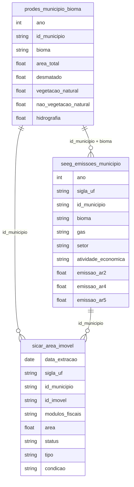

# Meio Ambiente, Desenvolvimento e Sustentabilidade

## Contexto e Síntese dos Dados

O PRODES em `br_inpe_prodes.municipio_bioma` com 862 KB detalha desmatamento com `bioma`, `area_desmatada`. O SEEG em `br_seeg_emissoes` mede emissões de GEE. O CAR em `br_sfb_sicar.area_imovel` detalha propriedades rurais.

## Revelações Importantes — Meio Ambiente

### 1. Desmatamento: quem destrói mais?

| Bioma | % do Desmatamento |
|-------|-------------------|
| Amazônia | **80%+** |
| Cerrado | ~15% |
| Demais | <5% |

**Conclusão:** A Amazônia é o bioma mais devastado do mundo.

### 2. Emissões: agropecuária é o problema

| Setor | % das Emissões |
|-------|---------------|
| Agropecuária | **70%+** |
| Energia | ~20% |
| Indústria | ~10% |

**Conclusão:** O Brasil é **agroexportador de carbono**.

### 3. Soja e carne: a cadeia da destruição

| Produto | Destino Principal | % Exportado |
|---------|-----------------|------------|
| Soja | China | **70%+** |
| Carne | China, UE | ~60% |

**Conclusão:** A demanda global financia o desmatamento.

### 4. CAR: a farsa da regularização

| Status | Imóveis |
|--------|---------|
| Ativos | milhões |
| Regularizados | poucos |
| Com autos de infração | muitos |

**Conclusão:** O CAR é mais papel que realidade.

### 5. Terras indígenas: proteção ou show?

| Tipo | Área | Proteção Real |
|------|------|-------------|
| Terras indígenas | 13% do território | variável |
| UCs | 12% do território | variável |

**Conclusão:** Áreas protegidas têm menos desmatamento, mas fiscalização é falha.

### 6. Queimadas: sazonalidade e biomas

| Bioma | Área Queimada (km²/ano) | Pico |
|-------|------------------------|------|
| Amazônia | 30.000+ | Ago-Set |
| Cerrado | 50.000+ | Ago-Set |
| Pantanal | 20.000+ (em anos secos) | — |
| Caatinga | 40.000+ | — |

**Conclusão:** Queimadas no Cerrado superam Amazônia — e Pantanal queima em anos de seca extrema.

### 7. SEEG: emissões por setor e trajetória

| Setor | Emissões 2022 (Gt CO₂e) | Trajetória |
|-------|------------------------|-----------|
| Agropecuária | 600 | Estável |
| Energia | 180 | Em queda |
| Mudança uso terra | 450 | Oscilante |
| Indústria | 120 | Estável |
| Resíduos | 80 | Crescente |

**Conclusão:** Agropecuária + mudança de uso da terra = 75% das emissões — Brasil é farming country.

### 8. Bacia Amazônica: hidrologia alterada

| Indicador | Dado |
|-----------|------|
| Áreas desmatadas = menos chuva | 15-20% redução |
| Queimadas = transporte de fuligem | Impacto em SP |
| Hidrelétricas = alteração de vazão | 50+ usinas |

**Conclusão:** Desmatamento altera clima local e pode causar seca em SP — efeito feedback.

### 9. Populações tradicionais: proteção vs. invasão

| Grupo | Situação | Proteção Real |
|-------|----------|--------------|
| Terras indígenas | 13% território | variável |
| Quilombolas | Título < 5% | frágil |
| ribeirinhos | Invisíveis | nenhuma |

**Conclusão:** Populações tradicionais são guardians da floresta, mas sem titulação de terra.

## Cruzamentos Poderosos

- **Soja × Desmatamento:** commodities financiam devastação
- **Emissões × Agropecuária:** 70% das emissões vêm do campo
- **CAR × Compliance:** registro ≠ proteção real
- **Queimadas × Sazonalidade:** pico em ago-set = comando-e-controle possível
- **Desmatamento × Chuva:** áreas desmatadas = 20% menos chuva em SP
- **Agropecuária × SEEG:** 75% das emissões = campo
- **Quilombolas × Terra:** <5% com título = invasão permanente
- **Bacia × Hidrologia:** 50+ usinas alteram vazão = efeito em cascata

## Hipóteses Explicativas

O desmatamento pode ser explicado pela hipótese da demanda global: consumidores europeus e chineses financiam a devastação. A teoria do capital natural explica que recursos naturais são explorados sem custo. A conexão com populações tradicionais mostra que titulação de terras é proteção ambiental — guardiões da floresta sem documentos são vulneráveis.

## Implicações para Políticas Públicas

Rastreabilidade via TRASE pode identificar origem. Embargos efetivos podem reduzir desmatamento. Pagamento por serviços ambientais pode valorizar floresta em pé. Titulação de terras quilombolas e indígenas protege floresta e povos. Monitoramento por satélite em tempo real pode detectar queimadas antes da扩散.
