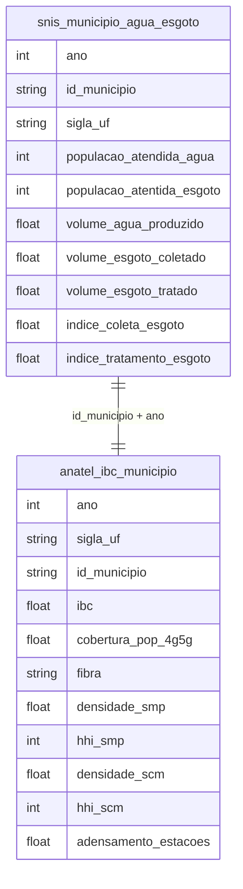

# Infraestrutura, Serviços e Qualidade de Vida

## Contexto e Síntese dos Dados

O SNIS em `br_mdr_snis.municipio_agua_esgoto` com 31,3 MB detalha saneamento. A ANATEL em `br_anatel_indice_brasileiro_conectividade.municipio` revela conectividade.

## Revelações Importantes — Infraestrutura

### 1. Saneamento: a vergonha brasileira

| Indicador | Média Nacional | Norte |
|-----------|---------------|-------|
| Atendimento água | 83% | 50% |
| Atendimento esgoto | 53% | **10%** |
| Esgoto tratado | 45% | **5%** |

**Conclusão:** Norte tem **5x menos** saneamento que média nacional.

### 2. Esgoto: tratado ou jogado no rio?

| Situação | % |
|----------|---|
| Esgoto coletado | 53% |
| Esgoto tratado | 45% |
| Jogado no rio | **55%** |

**Conclusão:** A maioria do esgoto do Brasil vai para os rios.

### 3. Desigualdade digital: Sul vs Norte

| UF | IBC (Conectividade) |
|----|---------------------|
| DF | 72,9 |
| RJ | 65,5 |
| SP | 64,0 |
| AM | **34,3** |
| RR | **34,2** |

**Conclusão:** Amazonas tem ** metade** da conectividade do DF.

### 4. Oligopólio de telecom

| Indicador | Valor |
|-----------|-------|
| HHI médio | > 2.500 |

**Conclusão:** Telecom é mais concentrado que maioria dos mercados.

### 5. Energia elétrica: acesso e qualidade

| Indicador | Urbano | Rural |
|-----------|--------|-------|
| Atendimento | 99% | 85% |
| Frequência interrupção | 4x/ano | 10x/ano |
| Duração média | 2h | 6h |

**Conclusão:** Zona rural tem 2x mais interrupções, 3x mais longa — qualidade desigual.

### 6. Estradas: pavimentação e acesso

| Condição | km Pavimentados | % do Total |
|----------|----------------|------------|
| Pavimentada | 220.000 | 12% |
| Não pavimentada | 1.600.000 | 88% |

**Conclusão:** 88% das estradas são de chão — isolamento rural permanente.

### 7. Resíduos sólidos: lixões vs. aterros

| Situação | % dos Municípios |
|----------|----------------|
| Aterro sanitário adequado | **35%** |
| Lixão a céu aberto | **30%** |
| Aterro controlado | 35% |

**Conclusão:** 65% dos municípios ainda jogam lixo de forma inadequada.

### 8. Transportepúblico: exclusão dos pobres

| Indicador | SP | NE |
|-----------|----|----|
| % pop. com acesso | 85% | 40% |
| Tarifa média | R$ 4,40 | R$ 3,50 |
| Subsídio per capita | R$ 80/ano | R$ 5/ano |

**Conclusão:** Nordeste tem metade do acesso ao ônibus e 16x menos subsídio que SP.

## Cruzamentos Poderosos

- **Saneamento × Doenças:** esgoto a céu aberto causa doenças
- **Conectividade × Educação:** sem internet, sem aula online
- **Oligopólio × Preço:** poucos controlam mercado
- **Energia × Rural:** 2x mais interrupções + 3x mais longa na zona rural
- **Estradas × Isolamento:** 88% de chão = isolamento permanente
- **Lixo × Saúde:** 65% dos municípios = lixão = doenças
- **Ônibus × Desigualdade:** NE = 40% acesso vs. 85% em SP
- **Infraestrutura × IVS:** municipalities de baixo IVS = piores indicadores em TUDO

## Hipóteses Explicativas

O deficit de saneamento pode ser explicado pela hipótese do mercado failure: empresas privadas não investem em áreas pobres. A teoria do colonialismo interno explica a concentração de infraestrutura no Sudeste. A exclusão de transporte público mostra que políticas são feitas para quem tem carro (rico), não para quem precisa de ônibus (pobre).

## Implicações para Políticas Públicas

A universalização do saneamento requer R$ 1 trilhão. A regionalização pode reduzir custos. A quebra de oligopólios em telecom pode melhorar preços. Federalização de resíduos (economias de escala) pode acabar com lixões. Subsídio cruzado em transporte pode equalizar acesso. Eletrificação rural pode reduzir desigualdade de qualidade de vida.
