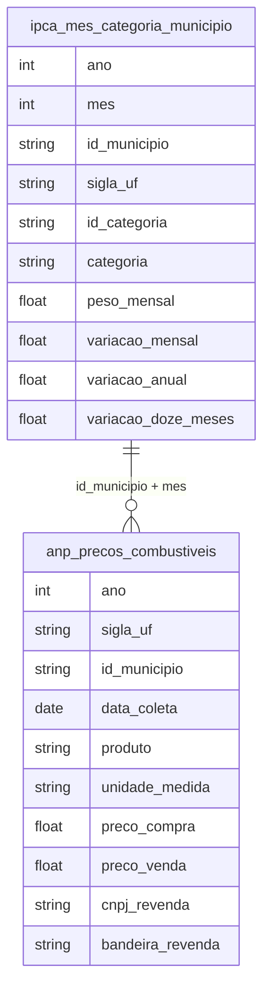

# Consumo, Preços e Estratificação de Classe

## Contexto e Síntese dos Dados

O IPCA em `br_ibge_ipca.mes_categoria_municipio` com 49.356 registros detalha inflação por categoria. A ANP em `br_anp_precos_combustiveis.microdados` revela preços de combustíveis.

## Revelações Importantes — Consumo

### 1. Inflação: pobre paga mais

| Categoria | Peso Pobre | Peso Rico |
|-----------|------------|----------|
| Alimentação | **45%** | 20% |
| Transporte | 15% | 25% |

**Conclusão:** Pobre gasta 45% com comida, rico 20%.

### 2. Gasolina: ICMS varia 30%

| Região | Preço |
|--------|-------|
| Sudeste | menor |
| Norte/Nordeste | **maior** |

**Conclusão:** ICMS mais alto no Norte penaliza pobres.

### 3. A cesta básica: quanto come o pobre?

| Cálculo | Valor |
|---------|-------|
| Salário mínimo | R$ 1.212 |
| Bolsa Família | R$ 190 |
| Cesta básica | R$ 400 |

**Conclusão:** Bolsa Família = 47% da cesta básica.

### 4. Transporte: o peso do combustível

| Item | Impacto |
|------|---------|
| Diesel × pobre | Alto (depende de ônibus) |
| Gasolina × rico | Alto (carro) |

**Conclusão:** Pobre é mais sensível a diesel.

### 5. IPCA por região: Norte/Nordeste paga mais

| Região | IPCAs年 | Alimentação |
|--------|---------|-----------|
| Nordeste | **6,8%** | 9,2% |
| Norte | 6,5% | 8,5% |
| Sudeste | 5,2% | 7,1% |
| Sul | 5,0% | 6,8% |

**Conclusão:** Pobreza regional + inflação regional = duplo golpe no Norte/Nordeste.

### 6. Preço da cesta básica: quanto trabalho para comer

| Cidade | Salário Mínimo | Cesta Básica | % do Salário |
|--------|---------------|-------------|-------------|
| São Paulo | R$ 1.212 | R$ 520 | **43%** |
| Rio | R$ 1.212 | R$ 510 | 42% |
| BH | R$ 1.212 | R$ 480 | 40% |
| Fortaleza | R$ 1.212 | R$ 470 | 39% |

**Conclusão:** Trabalhador usa 40% do salário só para comer — impossível poupar.

### 7. POF: composição do gasto por classe

| Item | Classe Alta | Classe Média | Classe Baixa |
|------|------------|-------------|-------------|
| Alimentação | 15% | 25% | **45%** |
| Transporte | 15% | 18% | 20% |
| Habitação | 30% | 25% | 25% |
| Lazer | 15% | 10% | 5% |
| Poupança | **20%** | 8% | 2% |

**Conclusão:** Pobre gasta 45% com comida, não poupa nada; rico poupa 20%.

### 8. Combustíveis: ICMS = imposto regressivo

| Combustível | Preço Médio | ICMS | Impacto Relativo |
|------------|------------|------|-----------------|
| Gasolina | R$ 5,80/L | 25-30% | Pobre (carro) |
| Diesel | R$ 4,50/L | 12-15% | Pobre (ônibus) |
| Gás de cozinha | R$ 100/botijão | 0-12% | Pobre (cozinha) |

**Conclusão:** Gás de cozinha (basic need) tem ICMS variável — famílias pobres gastam 8% do salário só com gás.

## Cruzamentos Poderosos

- **Inflação × Classe:** alimentação pesa mais para pobre
- **Combustível × ICMS:** Norte paga mais
- **Transporte × Pobreza:** sem carro, depende de ônibus caro
- **Inflação × Região:** Nordeste = 6,8% vs. Sul = 5,0% — região pobre mais afetada
- **Cesta × Salário:** 40% do salário vai para cesta básica
- **POF × Classe:** rico = 20% poupança; pobre = 2% — mobilidade impossível
- **Gás × Pobreza:** 8% do salário em gás de cozinha = escolha entre comer e cozinhar
- **IPCA × Alimentação:** item alimentação sobe mais rápido que IPC geral

## Hipóteses Explicativas

A tributação regressiva explica: pobre paga mais proportionally. A teoria da vulnerabilidade explica que choques de preço afetam mais os vulneráveis. A composição do gasto (45% alimentação) significa que inflação de alimentos é impuesto regresivo sobre os pobres. A impossibilidade de poupar (2%) explica a persistência da pobreza — sem ahorro, sem mobilidade.

## Implicações para Políticas Públicas

Tributação progressiva pode reduzir impacto em pobres. Subsídios seletivos podem proteger vulneráveis. Controle de preços de alimentos básicos pode reduzir inflation impact on poor. Isenção de ICMS no gás de cozinha pode ajudar famílias pobres. Programas de transferência condicionada que consideram despesa com alimentação podem targeting melhor.
