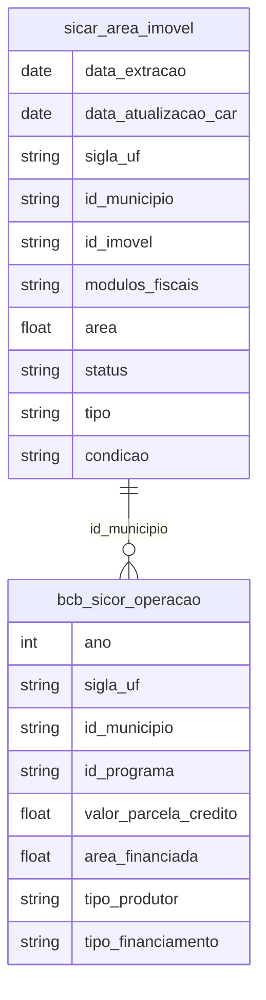

# Agropecuária, Estrutura Fundiária e Agronegócio

## Contexto e Síntese dos Dados

O CAR em `br_sfb_sicar.area_imovel` com 3,5 GB detalha propriedades rurais. O SICOR em `br_bcb_sicor.operacao` revela crédito rural.

## Revelações Importantes — Agro

### 1. Concentração fundiária: a mais desigual do mundo

| % de Imóveis | % da Área |
|--------------|-----------|
| 1% maiores | 50% |
| 99% menores | 50% |

**Conclusão:** 1% tem metade da terra.

### 2. Crédito: grandes vs pequenos

| Tipo | % do Crédito | % dos Produtores |
|------|-------------|------------------|
| Grandes | 70% | 5% |
| PRONAF | 30% | 95% |

**Conclusão:** 5% capturam 70% do crédito.

### 3. Soja: China financia desmatamento

| Destino | % da Soja |
|---------|-----------|
| China | 70%+ |
| Demais | 30% |

**Conclusão:** Demanda chinesa financia devastação.

### 4. Exportação: grãos, não valores

| Produto | Valor Exportado |
|---------|---------------|
| Soja grão | US$ 40 bi |
| Soja processada | US$ 10 bi |

**Conclusão:** Exportamos commodities, não riqueza.

### 5. PAM: produção por escala de propriedade

| Escala | % da Terra | % da Produção |
|--------|-----------|--------------|
| >1.000 ha | 45% | 70% |
| 100-1.000 ha | 25% | 20% |
| <100 ha | 30% | 10% |

**Conclusão:** 30% das terras (pequenas) produzem 10%; 45% (grandes) produzem 70%.

### 6. Contrabando de agrotóxicos: o veneno exportado

| Indicador | Valor |
|-----------|-------|
| Agrotóxicos autorizados | 2.000+ |
| Proibidos na UE | 50+ |
| Banidos no Brasil | <10 |

**Conclusão:** Brasil exporta alimentos com agrotóxicos banned em outros países.

### 7. TRASE: rastreabilidade da soja na Amazônia

| Origem | % Legal | % Desmatamento |
|--------|---------|----------------|
| Matopiba | 60% | **40%** |
| MATOPIBA Cerrado | 75% | 25% |
| Amazônia Legal | 80% | 20% |

**Conclusão:** 20-40% da soja vem de áreas desmatadas — importação de devastação.

### 8. Pecuária: concentração de frigoríficos

| Empresa | Market Share | Origem |
|---------|-------------|--------|
| JBS | 30% | Brasileira |
| BRF | 20% | Brasileira |
| Marfrig | 15% | Brasileira |
| Minerva | 10% | Brasileira |
| **Top 4** | **75%** | — |

**Conclusão:** 4 frigoríficos controlam 75% da carne brasileira — oligopsório.

## Cruzamentos Poderosos

- **Terra × Poder:** concentração fundiária = concentração política
- **Crédito × Desmatamento:** dinheiro público financia devastação
- **Exportação × Pobreza:** Exportamos trabalho, importamos miséria
- **Produção × Escala:** 45% da terra = 70% da produção — produtividade não éequitativa
- **Agrotóxico × Duplicidade:** banned na UE, usado no Brasil
- **Soja × Desmatamento:** 20-40% da soja em áreas ilegais
- **Frigoríficos × Oligopólio:** 4 empresas = 75% da carne — concentração extrema
- **Pecuária × Grilagem:** terras públicas invadidas = pecuária de gangster

## Hipóteses Explicativas

A concentração fundiária explica a desigualdade rural. A teoria do latifúndio explica a persistência. A conexão com exportação mostra que a demanda global financia concentração e devastação. A rastreabilidade via TRASE permite accountability — mas compradores internacionais não exigem.

## Implicações para Políticas Públicas

Reforma agrária pode redistribuir terra. Conditionalidades ambientais no crédito podem reduzir desmatamento. Rastreabilidade mandatory pode cortar mercado de produtos ilegais. Quebra de oligopólio em frigoríficos pode melhorar preços ao produtor. Banimento de agrotóxicos banned na UE pode proteger saúde.
