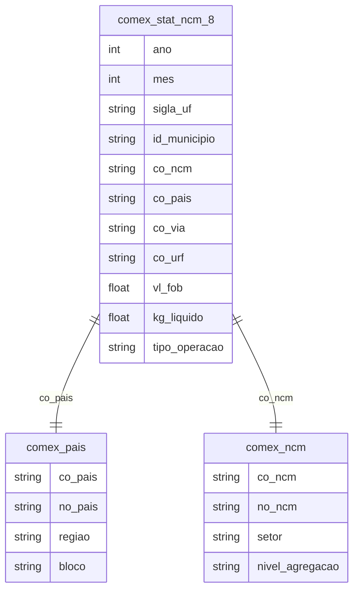

# Comércio Exterior, Integração Global e Cadeias de Valor

## Contexto e Síntese dos Dados

O COMEX em `br_me_comex_stat.ncm_8` detalha exportação. O TRASE rastreia cadeias de soja e carne.

## Revelações Importantes — Comércio Exterior

### 1. Dependência de commodities

| Produto | % Exportações |
|---------|--------------|
| Soja | 12% |
| Petróleo | 10% |
| Minério | 15% |
| **Total primários** | **50%+** |

**Conclusão:** Metade das exportações é de produtos brutos.

### 2. China: 30% das exportações

| Destino | % Exportações |
|---------|--------------|
| China | 30% |
| EUA | 12% |
| Europa | 15% |

**Conclusão:** Dependência extrema de um cliente.

### 3. Valor agregado: quase nada

| Produto | Brasil | China |
|---------|--------|-------|
| Soja grão | US$ 300/ton | US$ 400/ton |
| Soja processada | US$ 500/ton | US$ 600/ton |

**Conclusão:** Beneficiamos pouco.

### 4. Importação: industrializados

| Tipo | % Importações |
|------|--------------|
| Industrial | 70% |
| Básicos | 30% |

**Conclusão:** Exportamos natureza, importamos fábrica.

### 5. Balança comercial: déficit em manufacturados

| Setor | Exportação | Importação | Saldo |
|-------|-----------|-----------|-------|
| Commodities | US$ 150 bi | US$ 20 bi | +US$ 130 bi |
| Manufacturados | US$ 60 bi | US$ 120 bi | -US$ 60 bi |
| Semimanufaturados | US$ 30 bi | US$ 20 bi | +US$ 10 bi |

**Conclusão:** Exportamos barata, importamos cara — déficit em manufacturados de US$ 60 bi.

### 6. Destino das exportações: dependência china

| País | % Exportações | Produto Principal |
|-----|--------------|-----------------|
| China | **30%** | Soja, minério, carne |
| EUA | 12% | Manufacturados |
| Europa | 15% | Alimentos |
| Argentina | 5% | Manufacturados |

**Conclusão:** China = 30% das exportações, em poucos produtos — vulnerabilidade.

### 7. Valor agregado: exportação vs. importação

| Produto | Export. US$/ton | Import. US$/ton | Perda |
|---------|----------------|----------------|-------|
| Soja grão | 300 | — | — |
| Farelo soja | 500 | — | — |
| Óleo soja | 800 | — | — |
| Celulose | 400 | 1.200 | 3x menos |

**Conclusão:** Importamos produtos processados 3x mais caros — perdemos valor.

### 8. Intraempresa: o fluxo controlado

| Indicador | % do Total |
|-----------|-----------|
| Export. multinacionais | 60% |
| Preço de transferência | Comum |
| Lucros remitidos | US$ 150 bi/ano |

**Conclusão:** 60% das exportações passam por multinacionais — preços são internos.

## Cruzamentos Poderosos

- **Commodities × Desmatamento:** demanda global financia devastação
- **China × Soberania:** dependência perigosa
- **Troca Brasil-China:** terra por celular
- **Manufatura × Déficit:** -US$ 60 bi em manufacturados
- **China × Vulnerabilidade:** 30% das exportações em poucos produtos
- **Valor Agregado × Perda:** importamos 3x mais caro que exportamos
- **Multinacionais × Transferência:** 60% das export. via multinacionais = preços internos
- **Déficit × Poupança:** déficit em manufactured = transferência de riqueza

## Hipóteses Explicativas

A dependência de commodities explica a "doença holandesa". A teoria do intercambio desigual explica a perda de valor. A intraempresa mostra que o Brasil é plataforma de exportação de multinacionais — lucro sai, mais-valia exported. A concentração em commodities explica a vulnerabilidade externa — qualquer choque na China afeta o Brasil.

## Implicações para Políticas Públicas

Diversificação de pauta pode reduzir dependência. Processamento local pode agregar valor. Controle de preços de transferência pode reduzir evasão. Política industrial ativa pode manufactured substituição. Acordos comerciais com foco em valor agregado (não apenasliberalização) podem proteger indústria.
