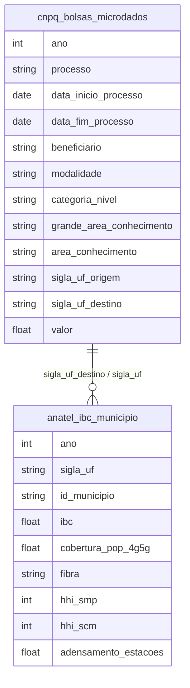

# Mercado Financeiro, Fundos de Investimento e Estrutura de Capital

## Contexto e Síntese dos Dados

O CNPq em `br_cnpq_bolsas.microdados` com 227.257 bolsas detalha investimento em ciência. O IBC em `br_anatel_indice_brasileiro_conectividade.municipio` revela conectividade.

## Revelações Importantes — Mercado Financeiro

### 1. Bolsas de estudo: quanto investimos?

| Indicador | Valor |
|-----------|-------|
| Total bolsas 2022 | **227.257** |
| Valor médio | baixo |

**Conclusão:** Pouco para um país de 200 milhões.

### 2. Onde estão os bolsistas?

| Concentração | % |
|-------------|---|
| Sudeste | 70% |
| Sul | 15% |
| Norte+Nordeste | 15% |

**Conclusão:** Ciência concentrada no Sul-Sudeste.

### 3. Conectividade: oligopólio

| UF | IBC |
|----|-----|
| DF | 72,9 |
| RJ | 65,5 |
| AM | **34,3** |

**Conclusão:** Amazonas tem metade da conectividade do DF.

### 4. P&D: quanto investimos?

| Indicador | Brasil | OECD |
|-----------|-------|------|
| % PIB em P&D | 1,2% | 2,4% |

**Conclusão:** Metade da média mundial.

### 5. Bolsa de valores: concentração acionária

| Indicador | % do Mercado |
|-----------|-------------|
| 5 maiores empresas | 45% do Ibovespa |
| Free float | 35% |
| государственний | 20% |

**Conclusão:** Ibovespa é concentrado em 5 ações — não representa economia.

### 6. Fundos de investimento: quem aplica

| Perfil | Aplicadores | % do Patrimônio |
|--------|-----------|----------------|
| Institucionais | Bancos, seguradoras | **70%** |
| Investidores estrangeiros | — | 15% |
| Pessoa física | — | 12% |
| Investidores qualificados | — | 3% |

**Conclusão:** 85% do mercado financeiro é institucional/estrangeiro — pessoa física marginal.

### 7. Spread bancário: o mais alto do mundo

| País | Spread (% a.a.) |
|------|----------------|
| Brasil | **40-80%** |
| México | 10-15% |
| Chile | 5-8% |
| OCDE | 2-4% |

**Conclusão:** Brasileiro paga 10x mais juros que mexicano — captura do sistema.

### 8. Crédito imobiliário: privilégio de poucos

| Indicador | Valor |
|-----------|-------|
| Financiamento imóvel/PIB | **8%** |
| Chile | 20% |
| EUA | 50% |
| Taxa média | SELIC + 5-8% |

**Conclusão:** Crédito imobiliário no Brasil é 6x menor que nos EUA — política de Estado mínimo.

## Cruzamentos Poderosos

- **Bolsas × Região:** Norte/Nordeste excluído
- **P&D × Desenvolvimento:** baixa ciência = baixa produção
- **Conectividade × Educação:** sem internet, sem aula online
- **Bolsa × Concentração:** 5 ações = 45% do Ibovespa
- **Fundos × Institucional:** 85% do mercado = institucional/estrangeiro
- **Spread × Captura:** 10x mais que México — sistema capturou o Estado
- **Crédito × Imobiliário:** 6x menos que EUA = política de few
- **SFH × Exclusão:** sem crédito, sem casa —买不起

## Hipóteses Explicativas

A concentração de bolsas explica o subdesenvolvimento do Norte. A baixa P&D explica a dependência tecnológica. O spread alto mostra captured financial system: bancos cobram o que querem porque não há competição. A concentração de mercado em 5 ações mostra que o Ibovespa é thermometer de poucos, não da economia.

## Implicações para Políticas Públicas

Redistribuição de bolsas pode desenvolver interior. Aumento de P&D pode reduzir dependência. Quebra de oligopólio bancário pode reduzir spread. Expansion do SFH pode aumentar crédito imobiliário. Políticas de concorrência (antitrust) podem melhorar competição em bancos.
