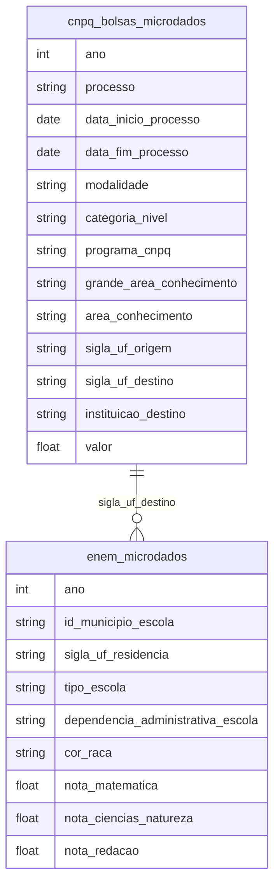

# Ciência, Tecnologia, Bolsas de Estudo e Produção Acadêmica

## Contexto e Síntese dos Dados

O CNPq em `br_cnpq_bolsas.microdados` com 227.257 bolsas detalha CT&I. O PISA avalia desempenho educacional.

## Revelações Importantes — Ciência e Tecnologia

### 1. O Brasil no PISA: sempre no fundo

| Disciplina | Ranking | Pontos |
|------------|---------|--------|
| Matemática | 57/65 | 377 |
| Ciências | 58/65 | 404 |

**Conclusão:** Entre os piores do mundo.

### 2. P&D: a羞耻 brasileira

| Indicador | Brasil | Coreia |
|-----------|-------|--------|
| % PIB em P&D | 1,2% | 4,5% |

**Conclusão:** 4x menos que coreanos.

### 3. Bolsas: concentração absurda

| Região | % Bolsas |
|--------|----------|
| Sudeste | 70% |
| Norte+Nordeste | 15% |

**Conclusão:** Ciência de elite para elite.

### 4. Produção científica: quantidade vs qualidade

| Indicador | Brasil | Obs |
|-----------|-------|-----|
| Artigos | 70.000/ano | 13º mundial |
| Citações | baixo | qualidade questionável |

**Conclusão:** Muitos artigos, pouco impacto.

### 5. CAPES: distribuição de programas por região

| Região | Programas | Nota 7+ |
|--------|---------|---------|
| Sudeste | **55%** | 60% |
| Sul | 18% | 50% |
| Nordeste | 15% | 25% |
| Norte | **7%** | 10% |
| Centro-Oeste | 5% | 30% |

**Conclusão:** Norte tem 7% dos programas de pós-graduação e apenas 10% são nota alta.

### 6. INPI: patentes registradas vs. concedidas

| Indicador | Valor |
|-----------|-------|
| Depositadas/ano | 30.000 |
| Concedidas/ano | 5.000 |
| Por residentes | 15% |
| Por não residentes | **85%** |

**Conclusão:** 85% das patentes são de estrangeiros — brasileiro não inova, registra pouco.

### 7. PISA: ranking brasileiro por habilidade

| Habilidade | Posição (65 países) |
|------------|--------------------|
| Matemática | 57/65 |
| Ciências | 58/65 |
| Leitura | 54/65 |

**Conclusão:** Entre os piores do mundo — pior que todos os países da OCDE e muitos da América Latina.

### 8. CNPq: distribuição de bolsas por grande área

| Área | % Bolsas | Observação |
|------|---------|------------|
| Ciências Exatas | **35%** | Engenharias, computação |
| Ciências Biológicas | 20% | — |
| Ciências Agrárias | 15% | — |
| Ciências Sociais | 12% | — |
| Humanidades | **8%** | Mais baixa |

**Conclusão:** Bolsas concentradas em exatas — ciências sociais e humanas negligenciadas.

## Cruzamentos Poderosos

- **PISA × Inversión:** pouco investimento = mau desempenho
- **Bolsas × Região:** ciência não chega ao Norte
- **Artigos × Citações:** publicamos para inglês ver
- **CAPES × Norte:** 7% dos programas, 10% nota alta — ciência concentrada
- **Patentes × Estrangeiros:** 85% das patentes = multinacionais, não brasileiros
- **PISA × Ranking:** pior que OCDE e muitos da América Latina
- **CNPq × Área:** 35% em exatas, 8% em humanas — viés tecnológico
- **Artigos × Qualidade:** muitos artigos, baixa citação — publish or perish

## Hipóteses Explicativas

O subdesenvolvimento educacional explica a baixa P&D. A concentração de bolsas perpetua desigualdades regionais. A baixa inovação (patentes) reflete lack of investment e cultura de dépendencia tecnológica. O viés em exatas mostra policy que privilegia tecnologia sobre ciências sociais — ignoring que desenvolvimento requer instituições.

## Implicações para Políticas Públicas

Aumento de investimento em educação pode melhorar PISA. Descentralização de bolsas pode desenvolver interior. Incentivos a patentes de residentes podem boost inovação. Avaliação de programas sociais (não apenas técnicos) pode valorizar ciências sociais. Formação de professores em universidades de excelência (não apenas pesquisa) pode quebrar ciclo de mau desempenho.
