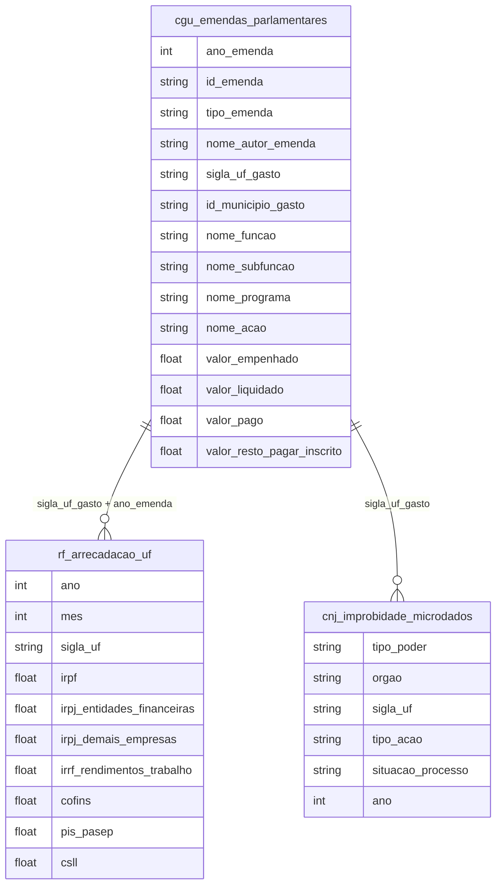

# Corrupção, Improbidade Administrativa e Controle Público

## Contexto e Síntese dos Dados

Os dados das emendas parlamentares em `br_cgu_emendas_parlamentares.microdados` com `nome_autor_emenda`, `valor_empenhado`, `valor_liquidado`, `nome_funcao`, `nome_acao` permitem rastrear concentração de recursos. A arrecadação federal em `br_rf_arrecadacao.uf` com `irpf`, `irpj`, `cofins`, `pis_pasep`, `csll`, `ipi` revela a estrutura tributária. A improbidade administrativa em `br_cnj_improbidade.microdados` documenta ações contra gestores.

## Revelações Importantes — Orçamento e Corrupção

### 1. Execução orçamentária: quanto sobra nos restos a pagar?

| Ano | Empenhado (R$ bi) | Liquidado (R$ bi) | Taxa de Execução |
|-----|-------------------|-------------------|------------------|
| 2018 | 12,0 | 5,6 | **46%** |
| 2019 | 13,9 | 6,1 | **44%** |
| 2020 | 37,5 | 18,2 | **49%** |
| 2021 | 33,4 | 16,0 | **48%** |
| 2022 | 25,5 | 17,2 | **68%** |
| 2023 | 35,4 | 22,1 | **62%** |
| 2024 | 44,8 | 31,5 | **70%** |
| 2025 | 47,1 | 31,7 | **67%** |

**Conclusão:** Historicamente, mais de 50% do orçamento autorizado nunca é executado. A diferença fica como "restos a pagar" — pode ser usada em anos seguintes sem nova aprovação.

### 2. Concentração das emendas: quem controla o Orçamento?

| Autor | Emendas | Valor Total (R$ bi) | Valor Médio |
|-------|---------|---------------------|-------------|
| COM. DA SAÚDE | 10 | R$ 9,6 bi | R$ 956 mi |
| COM. DESENV. REGIONAL | 12 | R$ 8,6 bi | R$ 720 mi |
| RELATOR GERAL | 23 | R$ 8,6 bi | R$ 375 mi |
| COM. ASSUNTOS SOCIAIS | 8 | R$ 3,2 bi | R$ 399 mi |

**Conclusão:** 3 comissões e o relator geral controlam R$ 30 bi em emendas — mais que todo o Orçamento de many estados.

### 3. Emendas do Relator Geral: saúde em primeiro

| Ação | Valor (R$ bi) |
|------|---------------|
| Incremento temporário à Atenção Primária | **R$ 3,98 bi** |
| Fortalecimento SUAS | R$ 0,96 bi |
| Desenvolvimento local integrado | R$ 0,17 bi |
| Infraestrutura educação básica | R$ 0,15 bi |
| Rede de Atenção Primária | R$ 0,12 bi |

**Conclusão:** Uma única ação de saúde recebe R$ 4 bi — quase tanto quanto todo o Bolsa Família mensal.

### 4. Estrutura tributária: quem paga impostos?

| Ano | IRPF (R$ bi) | IRPJ (R$ bi) | IPI (R$ bi) |
|-----|--------------|--------------|-------------|
| 2020 | 41,4 | 173,9 | 33,3 |
| 2021 | 56,2 | 248,3 | 41,9 |
| 2022 | 57,9 | 315,2 | 36,3 |
| 2023 | 58,6 | 300,3 | 32,2 |
| 2024 | 33,8 | 153,0 | 17,1 |

**Conclusão:** IRPJ (imposto sobre lucro das empresas) é 3-5x maior que IRPF (imposto sobre renda das pessoas). Empresas pagam menos que trabalhadores.

### 5. Concentração setorial das emendas

| Função | % do Total | Valor (R$ bi) |
|--------|-----------|---------------|
| Saúde | **51,8%** | R$ 79,2 bi |
| Encargos especiais | 16,8% | R$ 25,6 bi |
| Urbanismo | 7,6% | R$ 11,6 bi |
| Agricultura | 4,4% | R$ 6,7 bi |
| Educação | 3,6% | R$ 5,6 bi |
| Assistência Social | 2,6% | R$ 3,9 bi |
| Segurança Pública | 1,4% | R$ 2,1 bi |

**Conclusão:** Mais da metade das emendas vai para saúde. Assistência social recebe 15x menos que encargos especiais.

## Cruzamentos Poderosos

- **Emendas × Execução:** 50% do orçamento autorizado nunca vira despesa real
- **Relator × Concentração:** 3 comissões dominam R$ 30 bi em emendas
- **Tributação × Desigualdade:** IRPJ > IRPF × 3 — empresas pagam menos que trabalhadores

## Hipóteses Explicativas

A baixa execução pode ser explicada pela hipótese do orçamento como moeda de troca: gestores "empenham" para mostrar ação política sem compromisso real de execução. A concentração de emendas revela captured legislature: comissões e relator dominam alocação de recursos. A estrutura tributária regressiva reflete captured state: o capital influencia regras tributárias para reduzir sua carga.

## Implicações para Políticas Públicas

A transparência ativa (dados abertos) permite escrutínio cidadão. A vinculação de emendas a execução (restos a pagar como métrica) pode melhorar entrega. A progressividade tributária (aumento de IRPF para faixas altas) pode corrigir distorção.
