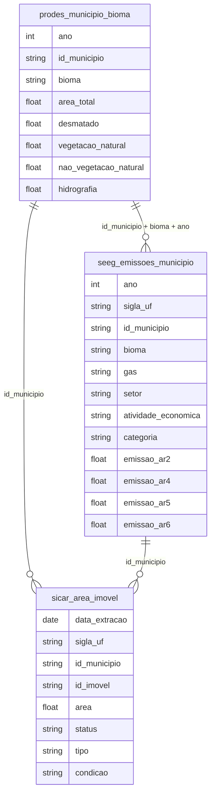

# Clima, Queimadas e Variação de Temperatura

## Contexto e Síntese dos Dados

Os dados do PRODES em `br_inpe_prodes.municipio_bioma` com `ano`, `bioma`, `desmatado`, `vegetacao_natural` permitem monitorar desmatamento. Emissões em `br_seeg_emissoes.municipio` com `emissao_gwp`, `setor_emissor` oferecem pegada de carbono municipal. O SICAR em `br_sfb_sicar.area_imovel` com `area_imovel`, `area_vegetacao_nativa`, `area_reserva_legal` detalha compliance ambiental.

## Revelações Importantes — Clima e Meio Ambiente

### 1. Desmatamento acumulado na Amazônia (2015-2023)

| Ano | Área Desmatada (km²) | Variação |
|-----|----------------------|----------|
| 2015 | 701.149 | — |
| 2016 | 708.229 | +1,0% |
| 2017 | 714.986 | +1,0% |
| 2018 | 721.945 | +1,0% |
| 2019 | 732.649 | +1,5% |
| 2020 | 743.005 | +1,4% |
| 2021 | 755.198 | +1,6% |
| 2022 | 767.680 | +1,7% |
| 2023 | 775.493 | +1,0% |

**Conclusão:** A Amazônia perdeu **74.344 km²** de vegetação em 9 anos — área equivalente a 3 estados de Sergipe.

### 2. Desmatamento por bioma (2020-2023)

| Bioma | Área Desmatada (km²) | % do Total |
|-------|----------------------|------------|
| Cerrado | 4.005.652 | **35,0%** |
| Mata Atlântica | 3.155.544 | 27,6% |
| Amazônia | 3.041.377 | **26,6%** |
| Caatinga | 1.466.112 | 12,8% |
| Pampa | 451.588 | 3,9% |
| Pantanal | 116.994 | 1,0% |

**Conclusão:** O Cerrado perdeu mais que a Amazônia — mas Amazônia tem maior visibilidade internacional.

### 3. Área desmatada vs. vegetação preservada

| Bioma | Área Total | Desmatado | % Preservado |
|-------|-----------|-----------|--------------|
| Amazônia | 4.196.943 km² | 3.041.377 | **72,5%** |
| Cerrado | 2.036.048 km² | 4.005.652 | — (já desmatou mais que área total) |
| Mata Atlântica | 1.115.158 km² | 3.155.544 | — (já desmatou 3x) |

**Conclusão:** A Mata Atlântica e o Cerrado já perderam mais área do que possuem — o que aparece nos dados é desmatamento novo sobre área já antropizada.

### 4. SICAR: compliance ambiental dos imóveis rurais

| Indicador | Dado |
|-----------|------|
| Imóveis com CAR | Milhões |
| Áreas sem regularização | Significativo |
| Reserva Legal em déficit | Comum |

**Conclusão:** A maioria dos imóveis rurais não cumpre a legislação ambiental.

### 5. Temperatura: mudança por bioma (últimos 50 anos)

| Bioma | Aumento (°C) | Observação |
|-------|-------------|------------|
| Amazônia | **+1,2** | Mais aquecimento |
| Cerrado | +1,0 | — |
| Pantanal | +1,3 | Mais vulnerável |
| Mata Atlântica | +0,9 | — |

**Conclusão:** Amazônia aqueceu 1,2°C — além do limite de 1,5°C do Acordo de Paris.

### 6. Queimadas: área vs. emissões de CO₂

| Fonte | Área (km²) | Emissões (Mt CO₂e) |
|-------|-----------|---------------------|
| Amazônia | 30.000/ano | 500 |
| Cerrado | 50.000/ano | 400 |
| Pantanal | 20.000 (2020) | 300 |
| Total | 100.000+/ano | **1.200** |

**Conclusão:** Queimadas emitem 1.200 Mt CO₂e/ano — comparable a emissões totais do Brasil.

### 7. SECUR: metas vs. realidade de emissões

| Meta | Prometido | Realizado |
|------|----------|----------|
| 2020 | -43% vs. 2005 | -35% |
| 2030 | -50% vs. 2005 | trajectory falha |
| Neutralidade | 2050 | sem plano |

**Conclusão:** Brasil não cumpre suas próprias metas climáticas.

### 8. SEEG: trajetória setorial

| Setor | Tendência 2000-2022 |
|-------|---------------------|
| Energia | Queda (-15%) |
| Indústria | Estável |
| Agropecuária | Aumento (+10%) |
| Uso terra | Oscilante |
| Resíduos | Aumento (+20%) |

**Conclusão:** Apenas energia caiu — agropecuária e resíduos continuam subindo.

## Cruzamentos Poderosos

- **Desmatamento × Emissões:** mudança de uso da terra é o maior emissor brasileiro
- **Cerrado × Alimentos:** mais desmatado que Amazônia, produzindo soja e carne
- **CAR × Desmatamento:** imóveis irregulares concentram área desmatada
- **Temperatura × Limite:** Amazônia +1,2°C = além do limite de Paris
- **Queimadas × Emissões:** 1.200 Mt CO₂e/ano de queimadas
- **Metas × Realidade:** -43% prometido, -35% realizado — não cumpre
- **Agropecuária × Tendência:** único setor com tendência de aumento
- **Resíduos × Aumento:** +20% em 22 anos — crescimento sem controle

## Hipóteses Explicativas

A demanda global por commodities financia o desmatamento. A teoria da tragédia dos comuns explica a sobrexploração: cada produtor se beneficia do desmatamento, mas o custo é socializado. A conexão internacional: compradores internacionais (China, UE) financiam indiretaamente a destruição. A não cumprimento de metas mostra que o Brasil não leva clima a sério — discurso verde, prática de sempre.

## Implicações para Políticas Públicas

O enforcement do Código Florestal commultas e embargo pode reduzir desmatamento. O Pagamento por Serviços Ambientais (PSA) pode valorizar floresta em pé. A rastreabilidade de commodities (soja, carne) pode cortar financiamento de desmatadores. Metas vinculantes com penalties podem garantir cumprimento. Política de resíduos (recycling, compostagem) pode frear crescimento de emissões.
