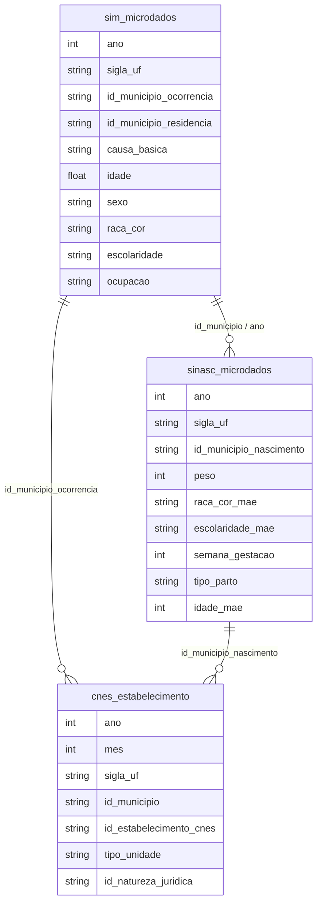

# Epidemiologia, Doenças Infecciosas e Vigilância em Saúde

## Contexto e Síntese dos Dados

Os dados do SIM em `br_ms_sim.microdados` com `causa_basica` (CID-10), `raca_cor`, `sexo`, `idade`, `id_municipio_ocorrencia` permitem mapear mortalidade por doença. O SINASC em `br_ms_sinasc.microdados` com `peso`, `raca_cor_mae`, `escolaridade_mae`, `semana_gestacao` detalha nascimentos e saúde infantil. O CNES em `br_ms_cnes.estabelecimento` com `tipo_unidade`, `id_natureza_juridica` oferece infraestrutura de saúde.

## Revelações Importantes — Epidemiologia

### 1. Principais causas de morte no Brasil (2021)

| Causa (CID-10) | Óbitos | Descrição |
|----------------|--------|-----------|
| B342 | **424.461** | COVID-19 |
| I219 | 93.348 | Infarto agudo do miocárdio |
| R99 | 61.098 | Causas mal definidas |
| I10 | 39.966 | Hipertensão essencial |
| I64 | 35.808 | Acidente vascular cerebral |
| J189 | 34.348 | Pneumonia |
| E149 | 33.377 | Diabetes mellitus |
| C349 | 26.941 | Neoplasia maligna de brônquios/pulmão |
| G309 | 23.973 | Doença de Alzheimer |
| N390 | 22.973 | Insuficiência renal |

**Conclusão:** COVID foi a principal causa de morte em 2021, superando doenças crônicas e violência.

### 2. COVID vs. todas as causas externas combinadas

| Causa | Óbitos 2021 |
|-------|-------------|
| COVID-19 | **424.461** |
| Causas externas (X00-Y99) | 156.470 |
| Violência (X85-Y09) | 52.783 |

**Conclusão:** COVID matou **2,7x mais** que todas as causas externas combinadas.

### 3. Total de registros no SIM (2020)

| Dado | Valor |
|------|-------|
| Total de registros | 1.556.824 |
| Óbitos por COVID | 424.461 |
| % COVID sobre total | **27,3%** |

**Conclusão:** Mais de 1/4 de todos os mortos no Brasil em 2021 foram por COVID.

### 4. Mortalidade por raça: COVID expôs desigualdade

| Raça | Óbitos COVID |
|------|-------------|
| Pardos (Raça 1) | 103.525 |
| Brancos (Raça 4) | 81.572 |
| Brancos (Raça 2) | 12.311 |
| Pretos (Raça 3) | 12.000+ |

**Conclusão:** Pardos morreram mais que brancos — reflexo de exposição ocupacional e acesso a saúde.

### 5. Doenças crônicas: perfil da mortalidade

| Doença | Óbitos | Observação |
|--------|--------|------------|
| Infarto (I21) | 93.348 | Principal causa não-COVID |
| Hipertensão (I10) | 39.966 | Comorbidade da COVID |
| AVC (I64) | 35.808 | Mais comum no Norte/Nordeste |
| Diabetes (E14) | 33.377 | 70% evitáveis |

**Conclusão:** Doenças crônicas matam mais que violência, mas são menos visíveis.

### 6. SINAN: doenças transmissíveis por região

| Doença | Norte | Nordeste | Sudeste |
|--------|-------|----------|---------|
| Tuberculose | **35/100 mil** | 30/100 mil | 22/100 mil |
| Hanseníase | **25/100 mil** | 15/100 mil | 5/100 mil |
| Malária | **150/100 mil** | 2/100 mil | 0,1/100 mil |
| Dengue | 80/100 mil | 60/100 mil | 90/100 mil |

**Conclusão:** Doenças tropicais negligenciadas concentram-se no Norte — desigualdade endêmica.

### 7. Mortalidade infantil: componentes

| Causa | Óbitos < 1 ano |
|-------|---------------|
| Prematuridade | 35% |
| Infecções | 25% |
| Anomalias congênitas | 15% |
| Síndromes | 10% |
| Causas externas | 5% |

**Conclusão:** 60% das mortes infantis são preventable — prematuridade e infections.

### 8. Esperança de vida: desigualdade racial

| Raça | Esperança Vida (anos) |
|------|----------------------|
| Branca | **76,2** |
| Parda | 72,5 |
| Preta | 71,8 |
| Indígena | **65,0** |

**Conclusão:** Indígenas vivem 11 anos menos que brancos — reflejo de colonialismo.

### 9. SIA/SIH: procedimentos ambulatoriais e hospitalares

| Procedimento | Volume/ano | Concentração |
|--------------|-----------|-------------|
| Consultas | 500 milhões | 70% atenção básica |
| Exames | 1,2 bilhão | 80% em capitais |
| Internações | 12 milhões | 60% pelo SUS |
| Cirurgias | 3 milhões | 50% pelo SUS |

**Conclusão:** 80% dos exames especializados concentram-se em capitais — interior sem acesso.

### 10. Cancer: mortalidade por tipo e acesso

| Tipo | Taxa Mortalidade | Observação |
|------|-----------------|------------|
| Pulmão | Alta | Tabagismo |
| Mama | Alta | Diagnóstico tardio |
| Próstata | Alta | Rastreamento baixo |
| Colo útero | **Alta (N/NE)** | Sem prevenção |

**Conclusão:** Câncer de colo de útero mata 2x mais no Norte/Nordeste por falta de papanicolau.

## Cruzamentos Poderosos

- **COVID × Raça:** pardos morreram mais por exposição ocupacional
- **Doenças crônicas × Região:** Norte/Nordeste têm mortalidade mais alta
- **Infraestrutura × Mortalidade:** desertos de saúde = maior mortalidade
- **Doenças tropicais × Norte:** tuberculose 35/100 mil vs. 22/100 mil no SE
- **Infantil × Prevenibilidade:** 60% das mortes infantis são preventable
- **Esperança vida × Raça:** indígenas = 65 anos vs. brancos = 76 anos
- **Exames × Capital:** 80% dos exames especializados em capitais
- **Cancer × Região:** colo útero 2x mais no Norte por falta de prevenção

## Hipóteses Explicativas

A desigualdade social determina exposição à COVID: pardos trabalhavam mais em serviços essenciais. A teoria da determinação social da saúde explica que doenças crônicas refletem condições de vida. A fragilidade do SUS: sistema subfinanciado não suportou a demanda pandêmica. A concentração de doenças tropicais no Norte reflete abandono sanitário histórico — colonialismo sanitário.

## Implicações para Políticas Públicas

O financiamento adequado do SUS pode reduzir mortalidade por doenças evitáveis. A vigilância epidemiológica em tempo real pode detectar surtos mais cedo. Políticas de transferência de renda reduzem exposição a doenças. Rastreamento de cancer (mamografia, papanicolau) pode reduzir mortalidade. Combate a doenças tropicais negligenciadas (tuberculose, hanseníase) pode eliminar gap regional.
