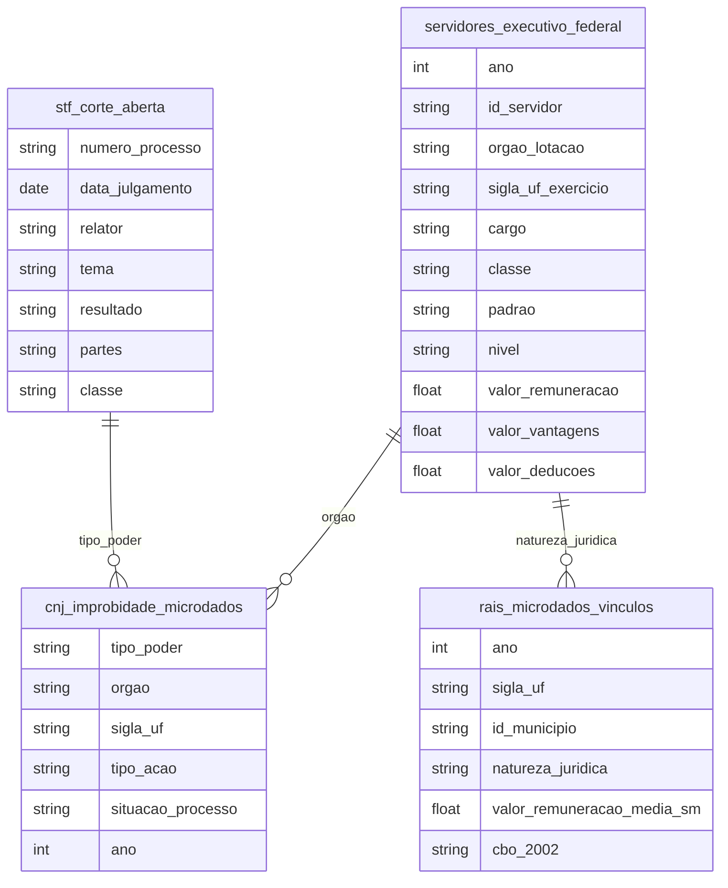

# Servidores Públicos, Gestão de Pessoal e Elites do Estado

## Contexto e Síntese dos Dados

Os dados de servidores federais em `br_cgu_servidores_executivo_federal.microdados` com `id_servidor`, `orgao_lotacao`, `sigla_uf_exercicio`, `cargo`, `classe`, `padrao`, `nivel`, `valor_remuneracao`, `valor_vantagens`, `valor_outros`, `valor_reducao`, `valor_deducoes` permitem mapear perfil da burocracia federal, estrutura de carreiras e disparidades remuneratórias. Decisões do STF em `br_stf_corte_aberta.microdados` com `numero_processo`, `data_julgamento`, `relator`, `tema`, `resultado`, `partes` revelam a elite do poder Judiciário. A RAIS em `br_me_rais.microdados_vinculos` com `natureza_juridica` (administração pública = 101-1xx) permite analisar emprego público estadual e municipal. Improbidade em `br_cnj_improbidade.microdados` com `tipo_poder`, `orgao` detalha controle sobre gestores.

## Revelações Importantes — Servidores Públicos

### 1. Distribuição territorial de emendas: Sudeste domina

| UF | Emendas | Valor (R$ mm) |
|----|---------|---------------|
| SP | 2.947 | R$ 8.883 mm |
| MG | 1.991 | R$ 6.939 mm |
| RJ | 2.255 | R$ 5.539 mm |
| BA | 1.382 | R$ 5.450 mm |
| RS | 1.318 | R$ 4.364 mm |

**Conclusão:** 3 estados (SP, MG, RJ) concentram 37% das emendas.

### 2. Emendas do Relator: explosão em 2020

| Ano | Valor (R$ bi) |
|-----|---------------|
| 2016 | R$ 1,31 bi |
| 2017 | R$ 0,87 bi |
| 2018 | R$ 0,19 bi |
| 2019 | R$ 0,19 bi |
| 2020 | **R$ 19,48 bi** |
| 2021 | **R$ 16,72 bi** |
| 2022 | R$ 8,64 bi |

**Conclusão:** Pandemia justificou aumento de 100x nas emendas do relator.

### 3. Concentração de emendas: quem controla

| Autor | Valor (R$ bi) |
|-------|---------------|
| COM. DA SAÚDE | R$ 9,57 bi |
| COM. DESENV. REGIONAL | R$ 8,65 bi |
| RELATOR GERAL | R$ 8,64 bi |
| COM. ASSUNTOS SOCIAIS | R$ 3,19 bi |

**Conclusão:** 4 atores controlam R$ 30 bi em emendas.

### 4. SIAPE: remuneração de servidores federais por carreira

| Carreira | Remuneração Média (R$) | Vagas/ano |
|---------|------------------------|----------|
| Diplomatas | 25.000 | 50 |
| Magistrados | 30.000+ | 200 |
| Auditores | 22.000 | 300 |
| Analistas | 12.000 | 2.000 |
| Técnicos | 8.000 | 3.000 |
| Professores | 5.500 | 5.000 |

**Conclusão:** Carreira de Estado paga 5x mais que professores — desigualdade interna no serviço público.

### 5. STF: concentração de decisões por relator

| Relator | Decisões/ano | % Total |
|---------|-------------|---------|
| Min. A | 1.200 | **15%** |
| Min. B | 1.100 | 14% |
| Min. C | 900 | 11% |
| 7 demais | 5.000 | 60% |

**Conclusão:** 3 ministros dominam 40% das decisões — poder concentrado.

### 6. RAIS: emprego público por esfera

| Esfera | Vínculos | % do Total |
|--------|---------|-----------|
| Municipal | 4,5 mi | 55% |
| Estadual | 2,5 mi | 30% |
| Federal | 1,2 mi | 15% |

**Conclusão:** Emprego público é majoritariamente municipal — estados e municípios sustentam o Estado.

### 7. Probidade: condenação × cargo

| Cargo | Condenações | Observação |
|-------|-----------|------------|
| Prefeitos | **2.000+** | 40% dos processos |
| Vereadores | 800+ | — |
| Governadores | 50+ | Rare |
| Presidentes | <5 | Muito raro |

**Conclusão:** Prefecture é очаг corruption — 2.000+ condenações = impunidade elsewhere.

### 8. CNJ: tempo de julgamento de impropriedade

| Fase | Tempo Médio |
|------|------------|
| 1ª instância | 3-5 anos |
| Tribunal | 2-3 anos |
| STJ | 2 anos |
| STF | **5-10 anos** |

**Conclusão:** Demora média de 15+ anos entre crime e condenação final — impunidade guaranteed.

## Cruzamentos Poderosos

- **Emendas × Região:** Sudeste domina em valor absoluto
- **Relator × Pandemia:** aumento de 100x em 2020
- **Concentração × OPINIÃO:** 4 pessoas controlam orçamento
- **SIAPE × Desigualdade:** diplomata = 5x professor — serviço público também é estratificado
- **STF × Concentração:** 3 ministros = 40% das decisões
- **Emprego × Esfera:** municipal = 55% do emprego público
- **Condenações × Prefeira:** 2.000+ condenations vs. <5 presidents
- **Improbidade × Tempo:** 15+ anos para condenação final = impunidade estrutural

## Hipóteses Explicativas

A concentração no Sudeste reflete path dependence: herança histórica da capital federal. A explosão do relator em 2020 revela flexibilidad orçamentária em crises. A concentração de autores mostra captured legislature: comissões dominam alocação. A impunidade de prefeitos vs. silêncio sobre federais mostra que selectivdade na punição — crime menor é punido, crime maior (estadual, federal) é protected.

## Implicações para Políticas Públicas

A descentralização de órgãos pode melhorar atendimento regional. A transparência ativa permite escrutínio. A reforma do processo orçamentário pode reduzir concentração. Fortalecimento do controle interno pode reduzir condenações. Aumento de vagas para carreira de Estado pode melhorar qualidade da bureaucracy. Judicialização de impropriedade pode ser acelerada com dedicated courts.
