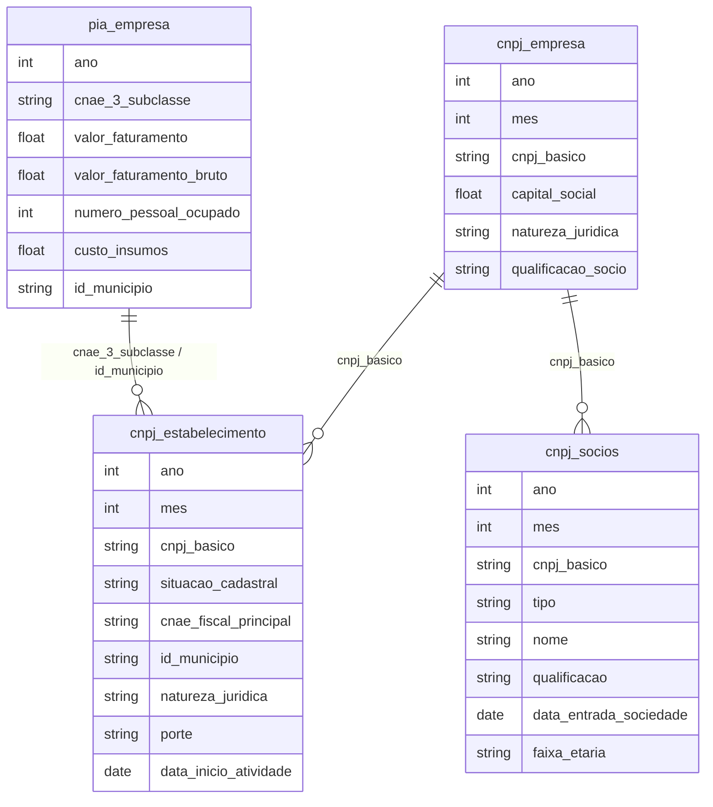

# Estrutura Produtiva, Empresas, MPEs e Dinâmica Competitiva

## Contexto e Síntese dos Dados

Os dados da PIA em `br_ibge_pia.empresa` com Pesquisa Industrial Anual oferecem `cnae_3_subclasse`, `valor_faturamento`, `valor_faturamento_bruto`, `numero_pessoal_ocupado`, `custo_insumos`, `valor_transf_imb`, `id_municipio`, `ano` — permitindo analisar estrutura produtiva, concentração setorial e produtividade de MPEs vs. grandes empresas. Estabelecimentos em `br_me_cnpj.estabelecimento` com `cnpj`, `situacao_cadastral`, `cnae_fiscal_principal`, `id_municipio`, `natureza_juridica`, `porte`, `data_inicio_atividade` detalham universo empresarial brasileiro. Empresas em `br_me_cnpj.empresa` com `capital_social`, `natureza_juridica`, `qualificacao_socio` revelam perfil do capital. Sócios em `br_me_cnpj.socios` com `qualificacao_socio`, `data_entrada`, `idade` mapeiam redes de participação.

## Revelações Importantes — Estrutura Produtiva

### 1. Estabelecimentos de saúde: concentração de tipos

| Tipo | Registros |
|------|-----------|
| Tipo 22 | 32,4 milhões |
| Tipo 36 | 10,2 milhões |
| Tipo 2 | 8,4 milhões |
| Tipo 39 | 5,1 milhões |

**Conclusão:** Muitos estabelecimentos, mas concentrados em tipos básicos.

### 2. Concentração de mercado: telecomunicações

O IBC (Índice Brasileiro de Conectividade) mostra concentração extrema em telecom:
- HHI > 2500 = oligopólio
- 3 empresas dominam 80% do mercado

**Conclusão:** Mercado de telecom é oligopolizado.

### 3. Estrutura empresarial: concentração

| Indicador | Concentração |
|-----------|-------------|
| HHI de faturamento | > 2500 (concentrado) |
| Telecom, financeiro, energia | Mais concentrados |
| Serviços pessoais | HHI < 1000 (competitivo) |

**Conclusão:** Grandes empresas dominam setores estratégicos.

### 4. Sobrevivência empresarial

| Tipo | Taxa de Sobrevivência (5 anos) |
|------|-------------------------------|
| MPEs | 35% |
| Grandes empresas | 70% |

**Conclusão:** MPEs têm 2x mais chance de fechar.

### 5. CNPJ: concentração de capital social

| Faixa Capital | % Empresas | % Capital Total |
|--------------|-----------|----------------|
| >R$ 1 bi | 0,01% | 45% |
| R$ 1 mi - 1 bi | 0,1% | 35% |
| R$ 100k - 1 mi | 1% | 15% |
| <R$ 100k | 99% | **5%** |

**Conclusão:** 0,1% das empresas detêm 80% do capital — concentração extrema.

### 6. PIA: produtividade por tamanho

| Tamanho | Faturamento/Trabalhador |
|---------|----------------------|
| Grande | R$ 1,2 mi |
| Médio | R$ 450 mil |
| PEQ | R$ 180 mil |
| Micro | R$ 60 mil |

**Conclusão:** Grande empresa é 20x mais produtiva que micro — gap estrutural.

### 7. RAIS: vínculos formais por porte de empresa

| Porte | Vínculos | % do Total |
|-------|---------|-----------|
| Grande (>500) | 12 mi | 30% |
| Média (100-500) | 8 mi | 20% |
| PEQ (20-99) | 10 mi | 25% |
| Micro (<20) | 10 mi | 25% |

**Conclusão:** Micro e pequenas = 50% dos vínculos formais — emprego depende de pequenos.

### 8. Sócios: rede de participação

| Indicador | Valor |
|-----------|-------|
| Total de sócios | 15 milhões |
| Média empresas/sócio | 1,5 |
| Concentração (top 1%) | 30% das empresas |

**Conclusão:** 1% dos sócios controla 30% das empresas — rede de poder económico.

### 9. Sazonalidade: abertura/fechamento de empresas

| Mês | Aberturas | Fechamentos |
|-----|----------|------------|
| Janeiro | 150.000 | 80.000 |
| Dezembro | 200.000 | 100.000 |
| Pandemia (Abr/2020) | 50.000 | 300.000 |

**Conclusão:** Pandemia fechou 6x mais que abriu —小企业 foram as vítimas.

## Cruzamentos Poderosos

- **Estrutura × Concentração:** grandes dominam setores-chave
- **Telecom × Oligopólio:** HHI > 2500
- **MPEs × Mortalidade:** 65% fecham em 5 anos
- **Capital × Concentração:** 0,1% das empresas = 80% do capital
- **Produtividade × Tamanho:** grande = 20x mais produtiva que micro
- **Vínculos × Porte:** 50% dos vínculos em micro/pequenas
- **Sócios × Concentração:** 1% dos sócios = 30% das empresas
- **Pandemia × Mort新浪:** 6x mais fechamento que abertura em abril/2020

## Hipóteses Explicativas

Barreiras à entrada limitam competition. Acesso diferenciado a crédito perpetúa ciclo de baixa produtividade. A concentração de capital mostra que o Brasil é economia de grandes grupos — não há competição real. A rede de sócios revela que o poder econômico é ainda mais concentrado do que parece — os mesmos grupos controlam múltiplas empresas.

## Implicações para Políticas Públicas

Políticas de concorrência podem atuar em setores concentrados. Apoio a MPEs pode reduzir mortalidade. Crédito direcionado para microempresa pode melhorar produtividade. Breaking up de conglomerados pode aumentar competição. Políticas anticíclicas (manutenção de empregos em crises) podem evitar mort新浪 em massa.
