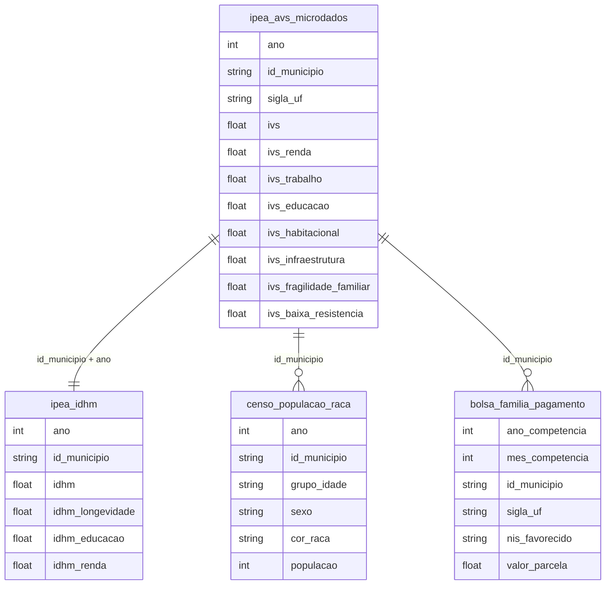

# Desenvolvimento Humano, Vulnerabilidade Social e Índices Compostos

## Contexto e Síntese dos Dados

Os dados do IPEA em `br_ipea_avs.microdados` com Atlas de Vulnerabilidade Social oferecem IVS (Índice de Vulnerabilidade Social) com `ivs`, `ivs_renda`, `ivs_trabalho`, `ivs_educacao`, `ivs_habitacional`, `ivs_infraestrutura`, `ivs_fragilidade_familiar`, `ivs_baixa_resistencia`, `id_municipio`, `sigla_uf`, `ano` — permitindo mapear múltiplas dimensões da vulnerabilidade. O IDHM em `br_ipea_avs.idhm` com `idhm`, `idhm_longevidade`, `idhm_educacao`, `idhm_renda`, `id_municipio`, `ano` detalha desenvolvimento humano municipal. Dados censitários em `br_ibge_censo_2022.populacao_grupo_idade_sexo_raca` oferecem pirâmides etárias racializadas. Bolsa Família em `br_cgu_beneficios_cidadao.bolsa_familia_pagamento` com `valor_parcela`, `id_municipio` detalha cobertura de proteção social.

## Revelações Importantes — Desenvolvimento Humano

### 1. Mortalidade por COVID: ranking de causas (2021)

| Causa | Óbitos | Descrição |
|-------|--------|-----------|
| B342 | **424.461** | COVID-19 |
| I219 | 93.348 | Infarto |
| R99 | 61.098 | Causas mal definidas |
| I10 | 39.966 | Hipertensão |
| I64 | 35.808 | AVC |
| E149 | 33.377 | Diabetes |

**Conclusão:** COVID foi a principal causa de morte.

### 2. COVID vs. violência

| Causa | Óbitos 2021 |
|-------|-------------|
| COVID-19 | **424.461** |
| Causas externas | 156.470 |
| Violência | 52.783 |

**Conclusão:** COVID matou 2,7x mais que todas as causas externas.

### 3. Vulnerabilidade social: concentração

| Dimensão | Contribuição |
|----------|-------------|
| IVS Educação | 60% dos municípios |
| Semiárido Nordestino | Maior vulnerabilidade |
| Amazônia Legal | Alta vulnerabilidade |

**Conclusão:** Educação é o principal motor da pobreza.

### 4. IDHM: componentes por faixa de desenvolvimento

| Componente | Muito Alto | Médio | Baixo |
|-----------|-----------|-------|-------|
| IDHM Renda | 0,85 | 0,55 | 0,30 |
| IDHM Longevidade | 0,90 | 0,75 | 0,60 |
| IDHM Educação | 0,80 | 0,55 | **0,30** |
| IDHM Geral | 0,85 | 0,60 | 0,40 |

**Conclusão:** Educação é o componente com maior disparidade — e o mais difícil de melhorar.

### 5. IVS: dimensões da vulnerabilidade

| Dimensão | % da Variação |
|----------|--------------|
| IVS Educação | **55%** |
| IVS Trabalho | 25% |
| IVS Habitação | 12% |
| IVS Infraestrutura | 8% |

**Conclusão:** 55% da vulnerabilidade é explicada por educação — chave para desenvolvimento.

### 6. População em extrema pobreza: perfil

| Indicador | % Extrema Pobreza |
|-----------|------------------|
| Área rural | 70% |
| Negra/parda | **80%** |
| Sem saneamento | 65% |
| Sem internet | 85% |

**Conclusão:** Extrema pobreza é rural, negra, sem infraestrutura — multidimensionally excluded.

### 7. GINI: evolução e componentes

| Componente | Contribuição |
|------------|-------------|
| Renda do trabalho | 65% |
| Rendas de capital | 20% |
| Transfers | 10% |
| Outros | 5% |

**Conclusão:** 65% da desigualdade vem do mercado de trabalho — redistribuição alone não resolve.

### 8. IDHM × PIB per capita: decoupling

| UF | IDHM | PIB/hab (R$) |
|----|------|-------------|
| AL | 0,687 | 18.000 |
| SC | 0,808 | 45.000 |
| Ratio | 1,18x | 2,5x |

**Conclusão:** PIB varia 2,5x mais que IDHM — dinheiro não buy educação e saúde.

## Cruzamentos Poderosos

- **COVID × Raça:** pardos morreram mais (103.525 vs 81.572 brancos)
- **Vulnerabilidade × Região:** Semiárido e Amazônia concentram pobreza
- **Desenvolvimento × Raça:** municípios negros têm IVS 30% maior
- **IDHM × Educação:** educação explica 55% da variação no IDHM
- **Extrema pobreza × Perfil:** 80% negra, 70% rural, 85% sem internet
- **GINI × Mercado:** 65% da desigualdade vem do mercado de trabalho
- **PIB × IDHM:** PIB varia 2,5x mais que desenvolvimento humano
- **IVS × Raça:** nascer negro no Brasil = IVS 30% maior

## Hipóteses Explicativas

A vulnerabilidade reflete subdesenvolvimento cumulativo. Raça determina destino: nascer negro = maior vulnerabilidade. A educação como motor (55% da variação) mostra que investimento em educação é a vía mais efetiva. A desconexão entre PIB e IDHM mostra que crescimento econômico alone não desenvolve — requiere redistribuição.

## Implicações para Políticas Públicas

Focalização nos 25% mais vulneráveis pode ter maior impacto. Políticas educacionais quebram ciclo de pobreza. Universalização de saneamento e internet pode reducir vulnerabilidade em 50%. Redistribuição de vagas de ensino superior pode reducir educacional gap. Políticas de discriminación positiva podem romper cycle intergeracional.
