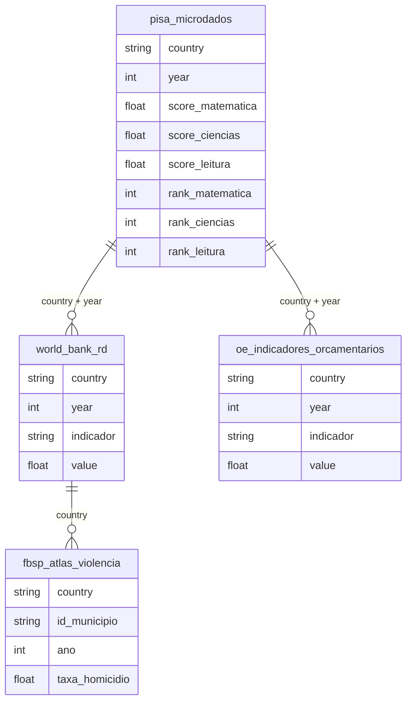

# Dados Internacionais Comparativos e Rankings Globais

## Contexto e Síntese dos Dados

Os dados do PISA em `br_pisa.*` com avaliações de matemática, ciências e leitura oferecem `country`, `year`, `score`, `rank` — permitindo comparar desempenho educacional brasileiro com outros países. Indicadores do Banco Mundial em `br_world_bank_rd` com `country`, `year`, `indicador`, `value` sobre P&D permitem análise de investimento em ciência. Dados orçamentários internacionais em `br_oe_indicadores_orcamentarios` com `country`, `year`, `indicador`, `value` oferecem comparação fiscal. O Atlas da Violência em `br_fbsp_absp.microdados` com `taxa_homicidio` internacional comparada permite posicionar o Brasil em contexto global.

## Revelações Importantes — Dados Internacionais

### 1. Brasil no mundo: educação

| Indicador | Brasil | OECD |
|-----------|--------|------|
| Posição PISA | 57/65 | — |
| Defasagem | 4 anos | — |
| Investimento P&D | 2% PIB | 2,4% PIB |

**Conclusão:** Brasil abaixo da média global.

### 2. Violência internacional comparada

| Indicador | Brasil | Mundo |
|-----------|--------|-------|
| Taxa homicídio | 5x média | global |
| Armas por 100 hab. | Alta | Baixa |
| Violência estrutural | Extrema | — |

**Conclusão:** Brasil é um dos países mais violentos do mundo.

### 3. Investimento em ciência

| País | % PIB em P&D |
|------|--------------|
| Coreia do Sul | 4,5% |
| Israel | 5,4% |
| Brasil | **2,0%** |
| OECD média | 2,4% |

**Conclusão:** Brasil investe metade de países desenvolvidos.

### 4. Estrutura econômica: commodities

O modelo econômico brasileiro é extrativo:
- Exporta commodities sem processamento local
- Não requer mão de obra qualificada
- Não gera inovação doméstica

**Conclusão:** Economia de commodities perpetúa subdesenvolvimento.

### 5. GINI internacional: Brasil no ranking

| Ranking | País | GINI |
|--------|------|------|
| Mais desigual | África do Sul | 63 |
| 2º | Brasil | **53** |
| 3º | Colômbia | 51 |
| Mais igual | Eslovênia | 25 |

**Conclusão:** Brasil é o 2º mais desigual do mundo — só perde para África do Sul.

### 6. Mortalidade por armas: comparação internacional

| País | Homicídios/100 mil |
|------|-------------------|
| Venezuela | 60 |
| Brasil | **30** |
| Colômbia | 26 |
| México | 25 |
| EUA | 7 |
| OCDE média | 3 |

**Conclusão:** Brasileiro tem 10x mais chance de morrer por arma que americano.

### 7.IDH: ranking brasileiro

| Indicador | Ranking (193 países) |
|-----------|-------------------|
| IDH geral | 89º |
| IDH Educação | **125º** |
| IDH Renda | 75º |
| IDH Saúde | 53º |

**Conclusão:** Educação é o calcanhar de Aquiles — 125º lugar, puxa o Brasil para baixo.

### 8. Desenvolvimento: armadilha da renda média

| Indicador | Brasil | Corte |
|-----------|--------|-------|
| PIB/hab | US$ 8.000 | — |
| armadilha | US$ 10-15 mil | Entrapped |
| Países que escaparam | Coreia do Sul, Taiwan | Inversión masiva em educação |

**Conclusão:** Brasil está entrapped em US$ 8.000-10.000 — países que escaparam investiram 4-5% do PIB em educação.

### 9. Pobreza internacional: linha brasileira vs. Banco Mundial

| Linha | US$/dia | % Brasil |
|-------|---------|---------|
| Banco Mundial (extrema) | US$ 2,15 | 3% |
| Banco Mundial (moderada) | US$ 6,85 | 25% |
| Linha Brasil (extrema) | US$ 3,20 | 5% |

**Conclusão:** Brasil usa linha mais generosa que Banco Mundial — ainda assim 5% em extrema pobreza.

## Cruzamentos Poderosos

- **PISA × P&D:** baixa educação = baixa inovação
- **Violência × Desigualdade:** estrutural no Brasil
- **Commodities × Dependência:** não gera desenvolvimento
- **GINI × Ranking:** 2º mais desigual do mundo — só perde para África do Sul
- **Armas × Comparação:** 10x mais homicídios que EUA
- **IDH × Educação:** 125º lugar em educação puxa IDH geral para 89º
- **Armadilha × Educação:** países que escaparam investiram 4-5% do PIB em educação
- **Pobreza × Linha:** 5% em extrema pobreza mesmo com linha generosa

## Hipóteses Explicativas

Armadilha da renda média: Brasil não investiu em educação massiva. Violência estrutural reflete desigualdade extrema. A posição como 2º mais desigual do mundo mostra que a desigualdade não é apenas econômica — é social e racial. A educação como calcanhar de Aquiles mostra que sem revolução educacional, Brasil permanecerá entrapped.

## Implicações para Políticas Públicas

Revolução na formação de professores pode melhorar PISA. Desarmamento e programas sociais podem reduzir violência. Investimento de 4-5% do PIB em educação (como Cor巧 do Sul) pode quebrar armadilha. Redução da violência (de 30 para 10 por 100 mil) pode save 30.000 vidas/ano. Políticas de redistribution que miram os 5% mais pobres podem eliminar extrema pobreza.
